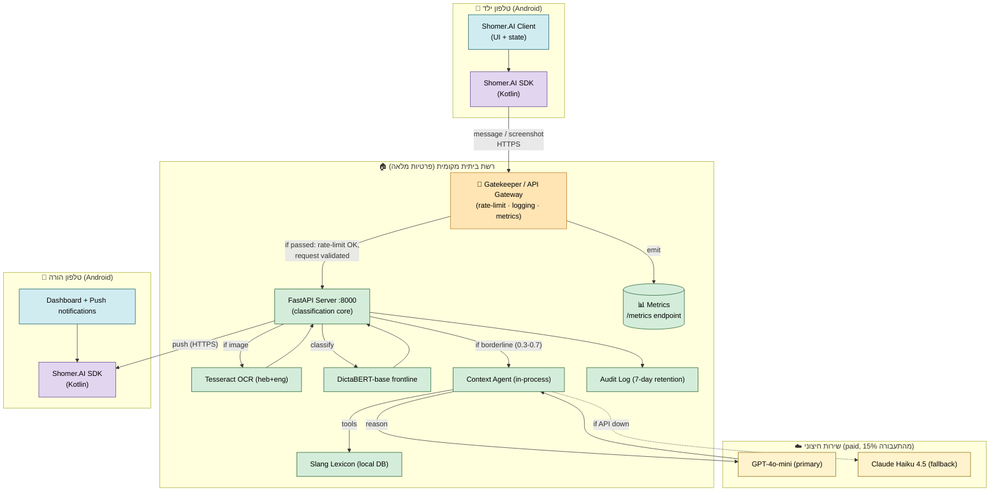
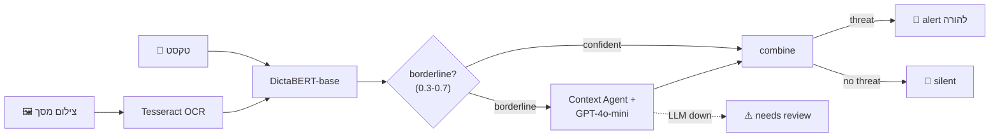
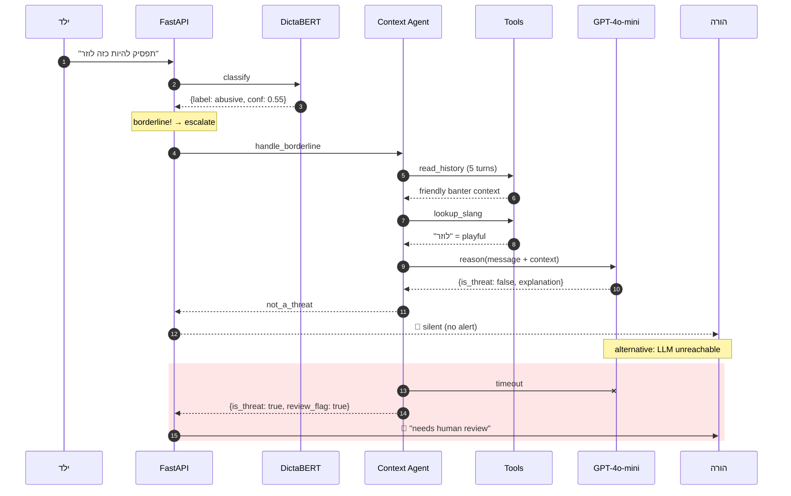

<div dir="rtl">

# Shomer.AI — מסמך דרישות מוצר (PRD)

**מסמך:** מסמך דרישות מוצר מלא להגשה במפגש 4
**גרסה:** 1.0 (טיוטה למפגש 4) · 2026-05-31
**מנחה:** ד"ר יורם סגל · קורס מומחי AI
**סטטוס:** ממתין לאישור מנחה במפגש 4
**מקורות:** [`research_question.md`](research_question/research_question.md) · [`literature_flagship.md`](literature/literature_flagship.md) · [`architecture_diagrams.md`](architecture_diagrams.md) · [`bullying_data_he.md`](../data/bullying_data_he.md) · [`business_plan.md`](business_plan/business_plan.md)
**החלטות מעוגנות:** [`architecture.decision.md`](../plan-docs/decisions/architecture.decision.md) · [`research-framing.decision.md`](../plan-docs/decisions/research-framing.decision.md) · [`open_questions.md`](open_questions.md)

---

## 1 · תקציר מנהלים

**Shomer.AI** הוא **שומר דיגיטלי שקט** להורים: מערכת AI עברית-ראשון לזיהוי בריונות, איומים, תכנים מיניים ושיח מצוקה רגשית בתקשורת הדיגיטלית של ילדם — **המבינה את הקשר השיחה ולא רק את ההודעה הבודדת**.

ההבחנה המרכזית: כלי הקיימים בשוק שופטים כל הודעה במנותק, ולכן מציפים בהתראות שווא (Alert Fatigue) שמובילות לנטישת המוצר. Shomer.AI מבוסס על שכבת **Context Agent** המנמקת על שיחה מלאה לפני שליחת התראה — מנגנון שמטרתו מדידה ישירות בשאלת המחקר.

**מה ייבנה במסגרת התזה (מפגשים 5–8):**
1. מסווג טקסט עברי (DictaBERT-base) מאומן ב-fine-tune על SinaLab Offensive-Hebrew + נתונים סינתטיים של שיחות
2. צינור OCR (Tesseract) לחילוץ טקסט מצילומי מסך
3. סוכן הקשר (Context Agent, GPT-4o-mini) המפעיל reasoning על מקרי גבול
4. שרת FastAPI מקומי + אפליקציית Android להורה
5. **Client SDK משותף** (`server/sdk/`) — חוזה API קלאסי שגם אפליקציית האנדרואיד וגם משלבים עתידיים (web, 3rd-party) ימשכו דרכו. הופך את Shomer.AI ממוצר-קליינט יחיד למוצר עם API ניתן-לאינטגרציה.
6. מערך הערכה על gold set אמיתי עברי (~150 דוגמאות)

**המטרה האקדמית:** להוכיח שהוספת הקשר שיחתי מפחיתה את שיעור ההתרעות-שווא בעברית **מבלי לפגוע ב-recall**.

**המטרה המוצרית:** להציג מוצר מודגם שמבוסס על המנגנון הזה לקהל יעד של הורים ישראליים, עם מבנה עלויות היברידי המשמר רווחיות.

---

## 2 · החזון

> **חזון:** הורה ישראלי לילד בגיל 6–16 מקבל התראה אחת ביום על מקרה ש**באמת** דורש את תשומת לבו — לא 50 התראות שווא שהוא יילמד להתעלם מהן.

עולמנו הדיגיטלי הפך לזירה מסוכנת לילדים: בריונות מקוונת, שיח אובדני, חשיפה לתוכן מיני, סחיטה. הורים רוצים לדעת — אבל הם **לא רוצים לקרוא כל הודעה של ילדם**. הם רוצים מערכת שמבחינה בין משחק לאיום, בין סלנג נוער לשנאה, בין הקנטה ידידותית לבריונות אמיתית — בעברית, מתוך ההקשר, ומסבירה כל החלטה.

זה ה-Shomer.

---

## 3 · קהל יעד / Personas

### Persona 1 — ההורה (המשתמש העיקרי במוצר)

**שם:** עינת, 42, אמא לטל (13) ולירון (10), עובדת hi-tech בתל אביב, מודעת טכנולוגית.

**צרכים:**
- לדעת אם ילדה חשוף לסכנה דיגיטלית **בלי לנטר כל הודעה ידנית**
- לקבל התראות עם **הקשר** (מה קרה, למה זה דורש תשומת לב)
- לסמוך על שהמערכת לא תקרוס בעודף התראות שווא
- שמירת פרטיות הילד — היא לא רוצה לקרוא כל הודעה, רק לקבל אזהרה כשיש בעיה

**נקודות כאב נוכחיות:**
- Bark/Qustodio לא מבינים עברית → אפס תועלת
- Keepers מבינים עברית "אבל סלנג של בני נוער זה אתגר שלא נפתר" (הצהרת ה-CEO)
- חוסר אמון בכלים שמספרים "אולי בעיה?" כל שעתיים

**איך Shomer.AI עוזרת לעינת:**
- מסווג עברי-ראשון, מאומן על דאטה ישראלי אמיתי + סינתטי עכשווי
- כל התראה מלווה בהסבר 1-משפט ("הודעה נראית פוגענית, אבל בהקשר זה הקנטה משחקית — מסומן כירוק")
- מבנה ההתראה מצמצם FP → רק התראה אחת ביום במקום 50

### Persona 2 — הילד (נושא הסיווג, לא משתמש ישיר)

**שם:** טל, 13, בת לעינת, משתמשת בוואטסאפ + אינסטגרם + דיסקורד.

**מאפיינים:**
- שולחת/מקבלת ~200 הודעות ביום
- משתמשת ב-code-switching עברית/אנגלית טבעי
- חברים שלה משתמשים בסלנג שמשתנה כל חודש
- מקבלת תוכן ויזואלי רב (memes, צילומי מסך, סטיקרים)

**נקודות מבט שאינן ב-MVP אבל חשוב לזכור:**
- הילד אינו משתמש ישיר ב-Shomer.AI (פועל ברקע)
- המערכת **לא חוסמת** הודעות (זה לא parental control קלאסי)
- שיקולי פרטיות הילד מובנים בעיצוב (retention 7 ימים, ללא PII בקריאות חיצוניות)

### Persona 3 (עתידי, לא MVP) — היועצת החינוכית

יועצות חינוכיות בבתי ספר ככלי לזיהוי תופעות בריונות בקרב תלמידים. מודגם בהגנה כ-future market expansion, אינו בנייה ב-MVP.

---

## 4 · הבעיה

### 4.1 הפער התחרותי בעברית

| מתחרה | מקור | חולשה ביחס לעברית |
|---|---|---|
| **Bark** (ארה"ב) | מובילת השוק העולמי | אנגלית בלבד — לא מסווג עברית כלל |
| **Qustodio** (ספרד) | parental control קלאסי | NLP מבוסס מילות-מפתח — חמיצת הקשר |
| **Canopy** (ארה"ב) | ראייה ממוחשבת לתוכן מיני | ממוקד עירום בלבד, לא בריונות/שיח |
| **Keepers** (ישראל) | NLP מבוסס IBM Watson | הצהרת ה-CEO: "סלנג ישראלי נשאר אתגר" |
| **Bosco** (ישראל) | ניתוח דפוסי התנהגות | אינדיקציה איטית — *אחרי* הפגיעה, לא לפניה |

**הפער:** אין כלי בשוק שעושה את כל הבאים בו-זמנית — סיווג עברי איכותי, הבנת הקשר שיחתי, on-device, הסבר לכל החלטה.

### 4.2 הפער המחקרי

מחקר על הקשר ב-NLP toxicity מוגבל לאנגלית. הספרות החשובה:

- **Pavlopoulos et al. (2020, ACL):** הראו שהוספת הקשר *תמים* (concatenation נאיבי) לסיווג רעילות נותנת שיפור שולי. הציעו שדרושות שיטות מתוחכמות יותר.
- **Sap et al. (2019, ACL):** הראו ש-classifiers ללא הקשר מתייגים בטעות עד 50% מטקסט תמים בניב מיעוט. **בעיית FP חמורה.**
- **Hamad et al. (2023, AICCSA):** SinaLab Offensive-Hebrew — הקורפוס היחיד היחיד הזמין לעברית. כ-15,000 ציוצים מתויגים. אינו מטפל בהקשר שיחתי.

**הפער שלנו:** **לא נחקרה הוספת הקשר שיחתי לסיווג בריונות בעברית**, ולא קיים קורפוס שיחות עברי לבריונות. אנו מציעים להוכיח את ההשערה הראשונה ולבנות את השני.

### 4.3 הבעיה האמיתית של הורים

בעיית **Alert Fatigue:** הורים שמקבלים יותר מ-3 התראות שווא ביום נוטשים את המערכת תוך 7 ימים (מחקרי UX בתחום parental tech). לכן מערכת עם 90% accuracy אבל 20% false positive rate היא מערכת כושלת מסחרית — גם אם היא מצוינת אקדמית.

הפתרון שלנו: **שתי שכבות סיווג** — אחת מהירה וזולה (frontline), אחת עמוקה ומבוססת-הקשר (Context Agent) רק על מקרי גבול. כך FP יורד דרמטית בלי לפגוע ב-recall או בעלות.

---

## 5 · הפתרון ברמת רעיון

### זרימה ברמת המשתמש

```
1. ילד שולח הודעה (טקסט או צילום מסך)
2. Shomer.AI Client בטלפון הילד שולח לשרת ביתי מקומי
3. השרת מסווג בעברית
4. רק מקרי גבול → Context Agent מנמק על הקשר השיחה
5. אם זוהה איום אמיתי → התראת push להורה עם הסבר וציטוט
6. אם תמים → לא קורה כלום (לא מציפים את ההורה)
```

### העקרונות שהובילו לפתרון

| עקרון | ביטוי מעשי |
|---|---|
| **עברית-ראשון** | מודל בסיס עברי (DictaBERT), דאטה מתויג עברית, עברית-first בכל מקום |
| **מודע-הקשר** | Context Agent שקורא 5 תורים אחרונים לפני החלטה על מקרי גבול |
| **מסביר את עצמו** | כל התראה כוללת ציטוט + הסבר 1-משפט |
| **שומר פרטיות** | קלסיפיקציה מקומית; קריאה חיצונית רק על 15% מהמקרים, ללא PII |
| **חסכוני** | הסיווג בחזית = $0 לטוקן; LLM חיצוני רק על מקרי גבול |
| **מציע ולא חוסם** | ההורה מקבל מידע; אינו חוסם הודעות (לא parental control קלאסי) |

---

## 6 · שאלת המחקר

המסמך המלא: [`research_question.md`](research_question/research_question.md). תמצית להגשה:

### השאלה הראשית

> **עד כמה הוספת ההקשר השיחתי (ההודעות הקודמות בשרשור) לסיווג בריונות בעברית מפחיתה את שיעור ההתרעות-שווא (false positives), לעומת סיווג ההודעה הבודדת במנותק — מבלי לפגוע ב-recall?**

### מדדים, baseline והגדרת הצלחה

- **מדד ראשי:** שיעור התרעות-שווא (**FPR**) וההפרש בינו בין שני התנאים
- **מדד שמירה:** recall (אסור לרדת מהותית)
- **מדדי-על:** precision, macro-F1, latency, cost-per-interaction
- **Baseline:** סיווג **context-blind** (אותו מודל, הודעה בודדת) + zero-shot ל-RQ1 + מספרי SinaLab
- **הצלחה:** ירידה **מובהקת סטטיסטית** ב-FPR במעבר ל-context-aware, עם recall לא-נחות, על gold set אמיתי

הארכיטקטורה (סעיף 7 בהמשך) מממשת את הניסוי **כפיצ'ר מובנה** — ניתן להפעיל/לכבות את ה-Context Agent ולקבל A/B נקי לסיווג context-blind מול context-aware.

---

## 7 · הארכיטקטורה (Architecture B — Locked)

הארכיטקטורה ננעלה ב-2026-05-30 לאחר Phase-0 deliberation. מסמך החלטה מלא: [`architecture.decision.md`](../plan-docs/decisions/architecture.decision.md). דיאגרמות מלאות: [`architecture_diagrams.md`](architecture_diagrams.md).

### 7.1 ההחלטות שננעלו

| החלטה | בחירה | רציונל קצר |
|---|---|---|
| **וריאנט ארכיטקטורה** | **B** — טקסט + Chat-OCR בלבד | Architecture A (multimodal) נדחתה — **אין דרך למדוד את התרומה של סיווג תמונות פוגעניות בעברית**, וה-RQ דורש מדידה. הסבר מלא — ראו §11 (out-of-scope). |
| **מודל בסיס לחזית** | **DictaBERT-base** (Hebrew encoder) | הכי טוב בעברית במחלקת ה-lightweight; רץ על CPU; fine-tune קל |
| **צורת המערכת** | **Context Agent יחיד** | 3 סוכנים = ~1.9–3× עלות עבור רווח דיוק שולי; Triage ו-Alert ניתנים להחלפה בקוד דטרמיניסטי |
| **LLM של ה-Context Agent** | **GPT-4o-mini** (primary), **Haiku 4.5** (fallback) | אסטרטגיית test-cheap-first — נמדוד במפגש 8 ונשדרג אם צריך |
| **OCR engine** | **Tesseract** (`heb+eng`) | חינם, מקומי, מספיק טוב; קל להחליף אם נצטרך |

### 7.2 דיאגרמה 1 — תצוגת מערכת ברמת C4 Container



> **על השכבה הכתומה (Gatekeeper / API Gateway):** רכיב Edge שמטפל בכל בקשה נכנסת **לפני** הסיווג עצמו — rate limiting, request logging, metrics emission, ו-validation. במימוש MVP זה FastAPI middleware (`slowapi` + `structlog` + `prometheus-fastapi-instrumentator`) שרץ in-process עם השרת. ארכיטקטונית מצויר כשכבה נפרדת כי הוא **conceptually distinct** מסיווג: מטרתו לשלוט בעומסים ולספק observability, לא לסווג. ראו רכיב §8.7.

> **על השכבה הסגולה (SDK):** Shomer.AI SDK הוא ספרייה משותפת ב-Kotlin (ובעתיד TypeScript) שיושבת **בתוך** כל קליינט. הוא עוטף את החוזה של ה-FastAPI (`/classify`, `/classify-image`, `/health`) ופותר retries, JSON parsing, וטיפול בשגיאות במקום אחד. שני הקליינטים (ילד והורה) ימשכו אותו במקום לכתוב HTTP ידנית. ראו רכיב §8.6.

### 7.3 דיאגרמה 2 — Data Flow: שני מסלולי הקלט מתאחדים



**המסר:** OCR קורא טקסט מצילומי מסך; הטקסט נכנס לאותו pipeline. **אין שני pipelines נפרדים** — זו ההצדקה ההנדסית לוויתור על Vision LLM.

### 7.4 דיאגרמה 3 — Sequence: מקרה גבול עם ה-Context Agent



**מה זה מראה:** הסיווג הראשוני רץ במאות מיליאניות; רק מקרה גבול עולה ל-Context Agent; ה-Context Agent קורא לכלים מקומיים *לפני* קריאה ל-LLM (חוסך טוקנים); ה-LLM מבסס החלטה על הקשר → במקרה הזה ההתראה נמנעה (FP-rescue). אם ה-LLM נופל → לא חוסמים אלא מסמנים לבדיקה ידנית.

---

## 8 · רכיבי המוצר (Component-level PRDs)

לכל רכיב: תפקיד · קלט · פלט · מדד הצלחה · התנהגות בכשל.

### 8.1 Frontline Classifier (DictaBERT-base)

| מאפיין | ערך |
|---|---|
| **תפקיד** | סיווג מהיר וזול של כל הודעת טקסט לאחת מ-5 קטגוריות |
| **קלט** | מחרוזת טקסט עברית (עד 512 טוקנים) |
| **פלט** | `{label: enum, confidence: float ∈ [0,1]}` |
| **קטגוריות (סכמת SinaLab)** | `abusive / hate / violence / pornographic / non_offensive` |
| **מדד הצלחה** | macro-F1 ≥ 0.78 על SinaLab test split (יעד מפגש 5) |
| **Latency** | p99 < 100ms על CPU |
| **כשל** | אם המודל קורס, מחזירים `{label: none, confidence: 0.5, error: true}` והבקשה מסומנת לבדיקה ידנית |

### 8.2 OCR Pipeline (Tesseract)

| מאפיין | ערך |
|---|---|
| **תפקיד** | חילוץ טקסט עברי+אנגלי מצילומי מסך של צ'אט |
| **קלט** | תמונה (JPEG/PNG, עד 4MB) |
| **פלט** | מחרוזת טקסט (משולב he+en) |
| **מדד הצלחה** | character error rate < 15% על צילומי מסך אמיתיים (יעד מפגש 8) |
| **Latency** | p99 < 2s לתמונה בגודל הצ'אט הממוצע |
| **כשל** | אם OCR נכשל (תמונה לא קריאה), מחזיר מחרוזת ריקה והבקשה מסומנת `image_unreadable: true` |

### 8.3 Context Agent (GPT-4o-mini)

| מאפיין | ערך |
|---|---|
| **תפקיד** | reasoning על הקשר שיחה במקרי גבול (confidence ∈ [0.3, 0.7]) |
| **קלט** | הודעה נוכחית + עד 5 תורים קודמים + מטא של הילד (גיל, רגישות) |
| **פלט** | `{is_real_threat: bool, severity: enum, explanation: string}` |
| **Tools** | `read_conversation_history` · `lookup_slang` · `check_age_appropriateness` |
| **Memory** | אין memory persistent — כל קריאה stateless |
| **Stop conditions** | תשובה תקנית JSON שעוברת validation, או timeout של 5 שניות → fallback |
| **מדד הצלחה** | ΔFPR ≥ 15 נקודות אחוז לעומת context-blind, ללא ירידה ב-recall (יעד מפגש 8) |
| **Latency** | p99 < 3s (כולל קריאה ל-API חיצוני) |
| **כשל / Fallback** | אם GPT-4o-mini לא זמין → ניסיון אחד עם Haiku 4.5. אם גם זה נכשל → מחזירים החלטה מבוססת frontline בלבד עם `review_flag: true` והתראה ל-הורה מסומנת בויזואל |

### 8.4 Notification Service

| מאפיין | ערך |
|---|---|
| **תפקיד** | שליחת push notification להורה כשמזוהה איום |
| **קלט** | `{label, severity, explanation, quote, child_name}` |
| **פלט** | push notification (FCM) + רשומה ב-history של הדשבורד |
| **פורמט** | ראה [`open_questions.md`](open_questions.md) — סעיף 3 (UX נסגר לפני מפגש 7) |
| **מדד הצלחה** | <2s מההחלטה ועד הגעה לטלפון ההורה (p99) |

### 8.5 Audit Log

| מאפיין | ערך |
|---|---|
| **תפקיד** | תיעוד מלא לכל החלטה (לטובת evaluation במפגש 8) |
| **תוכן** | timestamp · message_id · classification · context_used · agent_reasoning_trace · alert_sent? |
| **שמירה** | 7 ימים rolling window, SQLite מקומי |
| **שימוש** | בסיס לניתוח per-slice (Sap 2019), debug, ובהמשך — feedback loop לאיסוף gold set |

### 8.6 Client SDK (Shomer.AI SDK)

| מאפיין | ערך |
|---|---|
| **תפקיד** | ספרייה משותפת שכל קליינט (אנדרואיד-ילד, אנדרואיד-הורה, web עתידי, integrations עתידיים) מייבא כדי לדבר עם FastAPI Server — במקום לכתוב HTTP ידנית בכל מקום |
| **שפות** | **Kotlin** (MVP — Android child + parent clients). **TypeScript** (Phase 9 stretch — web dashboard). |
| **API שהוא עוטף** | `POST /classify` (טקסט→תיוג) · `POST /classify-image` (תמונה→תיוג עם OCR) · `GET /health` · `GET /model/info` |
| **פלט (per call)** | `ClassificationResult(label, confidence, contextUsed, reasoningTrace?, latencyMs)` — Kotlin data class / TS interface |
| **טיפול בכשלים** | retry עם exponential backoff (3 ניסיונות, 1s/2s/4s); timeout 10s; שגיאות API מתורגמות ל-Kotlin sealed class (`Success` / `NetworkError` / `ServerError` / `ValidationError`) |
| **גישת מימוש (MVP)** | **Hand-written** — קוד Kotlin קריא ב-`server/sdk/kotlin/`, סנכרון ידני עם `server/app/schemas.py`. עדיף על generated-from-OpenAPI ב-MVP כי קל יותר להציג ולהסביר אקדמית. החלפה ל-OpenAPI generation שמורה ל-Phase 9 אם יש 3rd-party integrations. |
| **שימוש פנימי במוצר** | Android Child Client קורא `sdk.classify(text)` כשהילד שולח הודעה; Android Parent Client קורא `sdk.healthCheck()` ומקבל push דרך FCM (לא דרך SDK). |
| **שימוש כ-product surface** | בעתיד — בתי-ספר / integrators ישראליים יוכלו לקרוא ל-Shomer.AI כשירות classification דרך אותו SDK. זה ה-API-as-a-product line מה-business plan §5. |
| **מדד הצלחה (תזה)** | האפליקציות עוברות מ-hand-rolled HTTP ל-SDK calls; אפס שכפול קוד HTTP בין child ל-parent clients; חוזה מתועד ב-`server/sdk/README.md` |
| **מדד הצלחה (עתידי)** | < 30 דקות לאינטגרציה חדשה (3rd-party מקליד `import com.shomer.sdk` → קורא `/classify` → מקבל תוצאה) |
| **Versioning** | semver — `1.x.x` ב-MVP; שינוי breaking → bump major + עדכון `CHANGELOG.md` ב-`server/sdk/` |
| **כשל** | אם ה-SDK עצמו לא מצליח לעבוד (compile error, dependency conflict) הקליינט יחזור ל-hand-rolled HTTP כ-fallback זמני. החלטה זו נרשמת ב-`server/sdk/README.md`. |

**הקשר ל-`server/sdk/`:** התיקייה הזו כיום היא placeholder עם README שמתאר את הכוונה (`server/sdk/README.md`). מפגש 5 יממש גרסה ראשונית של ה-Kotlin SDK ויחליף את ה-HTTP של ה-Android Client. הבחירה Hand-written-vs-Generated **ננעלת בזמן המימוש**.

### 8.7 Gatekeeper / API Gateway

| מאפיין | ערך |
|---|---|
| **תפקיד** | שכבת Edge של ה-FastAPI: שליטה בעומסים (rate limiting), observability (לוגינג מובנה), metrics export, ו-request validation. **לא חלק מהסיווג עצמו** — שכבה תפעולית שיושבת לפניו. |
| **מיקום בארכיטקטורה** | בתוך תהליך ה-FastAPI כ-middleware chain (MVP); מבחינה לוגית — שכבה נפרדת בין ה-SDK ל-classification core (ראו §7.2) |
| **קלט** | כל בקשת HTTP נכנסת (`/classify`, `/classify-image`, `/health`, `/model/info`) |
| **פלט (per request)** | אחד מהשניים: (א) הבקשה עוברת הלאה לסיווג + emit log/metric; (ב) `429 Too Many Requests` / `413 Payload Too Large` / `408 Request Timeout` + emit log/metric |
| **יכולות (MVP)** | **Rate limiting** — 100 req/min per IP (configurable ב-`.env`); **Structured logging** — כל בקשה מקבלת trace-id וצמוד אליה (endpoint, status, latency_ms, client_ip); **Metrics** — Prometheus format exposed ב-`/metrics` (requests/sec, p50/p95/p99 latency, error rate by endpoint); **Request size limit** — 10MB (תמונות); **Timeout enforcement** — 60s לסיווג טקסט, 180s לסיווג תמונה (תואם את ה-Phase 2 decision). |
| **יכולות (Phase 9 stretch)** | **API key auth** — per-tenant key לאינטגרציות 3rd-party (לא נדרש ב-MVP כי שרת מקומי); **Per-key rate limits** — שונה מ-per-IP; **Request caching** — אופציונלי לבקשות חוזרות; **Circuit breaker** — כיבוי זמני של endpoints שכושלים מעל סף |
| **מימוש (MVP)** | FastAPI middleware: `slowapi` (rate limit) · `structlog` + `python-json-logger` (logging) · `prometheus-fastapi-instrumentator` (metrics) · FastAPI built-in (size/timeout). הכל ב-`server/app/gateway.py` כ-middleware chain מוגדר ב-`main.py` |
| **שימוש ב-evaluation** | המטריצות מ-`/metrics` הן מקור-נתונים לחלק מה-NFRs במפגש 8: p99 latency, request volume, error rate. בנוסף, הלוגים ה-structured הם בסיס לניתוח per-slice של ביצועי המערכת. |
| **מדד הצלחה** | אפס בקשה עוברת לסיווג בלי לעבור rate-limit-check; 100% מהבקשות מקבלות trace-id ייחודי בלוג; `/metrics` חי וניתן לסקרייפ ע"י Prometheus; rate-limit overage מחזיר 429 (לא 500) |
| **כשל / Fallback** | אם middleware נכשל ב-init → FastAPI עולה בלעדיו עם warning ב-log (graceful degradation); אם rate-limit store (in-memory) נופל → fail-open (לא לחסום לגיטימיות, יעדיף false-allow על false-deny — לא הגנת אבטחה ב-MVP, רק ניטור) |
| **NFR ייעודיים** | Gateway overhead < 5ms p99 (לא מורגש על-ידי הלקוח); זיכרון < 50MB לרצועות זמן של רטרו-לימינג בזיכרון |

**למה לראות את זה כרכיב נפרד (ולא רק 'middleware של FastAPI')?**
- **קונספטואלית** — תפקידו שונה מהסיווג (operational vs functional). הפרדה במסמך מסייעת לקורא להבין אילו NFRs נמדדים איפה.
- **גמישות מימוש** — בעתיד אפשר להחליף מ-FastAPI-middleware ל-reverse proxy חיצוני (nginx + Lua / Traefik / Kong) בלי שינוי ב-classification core.
- **דיון אקדמי** — מאפשר לדבר על "Edge layer" מול "core" בנפרד בהגנת המוצר.

**הקשר היסטורי:** רכיב זה לא היה ב-Architecture B המקורית שננעלה ב-2026-05-30 (`architecture.decision.md`). הוא נוסף ב-2026-05-31 כדי לשלוט בעומסי קריאות ולספק observability — ראו `plan-docs/decisions/prd-enrichment.decision.md` D3.

---

## 9 · דרישות לא-פונקציונליות (NFRs)

| קטגוריה | דרישה | מקור / יעד |
|---|---|---|
| **Latency (frontline)** | p99 < 100ms על CPU | מפגש 5 |
| **Latency (Context Agent)** | p99 < 3s | מפגש 7 |
| **Latency (end-to-end)** | מהשולחן ועד התראה — p99 < 5s | מפגש 8 |
| **Cost/interaction** | < $0.005 (proposal §11.3) | מפגש 8 |
| **Accuracy (frontline)** | macro-F1 ≥ 0.78 על SinaLab | מפגש 5 |
| **Accuracy (end-to-end)** | ΔFPR ≥ 15pp עם recall non-inferior | מפגש 8 |
| **Privacy** | אין PII בקריאה ל-LLM חיצוני; retention 7 ימים בלבד | תכנון מפגש 5 |
| **Availability (frontline)** | ≥ 99% (רץ מקומית, כשל = שרת ביתי נופל) | מפגש 7 |
| **Availability (Context Agent)** | ≥ 95% — אם פחות, ה-fallback ל-Haiku מכסה | מפגש 7 |
| **Hardware** | רץ על RTX 5080 (16GB) + CPU רגיל | אילוץ קיים |
| **Languages** | עברית בלבד ב-MVP (אנגלית רק כ-OCR auxiliary לזיהוי code-switching) | החלטת MVP |

---

## 10 · KPIs

KPIs מסחריים (מתוך [`business_plan.md`](business_plan/business_plan.md)) + KPIs מחקריים:

### KPIs מחקריים (יעד מפגש 8)

| KPI | יעד | מדידה |
|---|---|---|
| ΔFPR (אם הקשר עוזר) | ≥ 15pp ירידה | gold set אמיתי |
| Recall non-inferior | ≤ 3pp ירידה מהבסיס | gold set אמיתי |
| Macro-F1 (frontline) | ≥ 0.78 על SinaLab | held-out test |
| Inter-annotator agreement (gold set) | κ ≥ 0.6 | תיוג כפול |
| Statistical significance | p < 0.05 ב-McNemar | bootstrap CI |

### KPIs מסחריים (יעדי SOM שנה ראשונה)

| KPI | יעד | מקור |
|---|---|---|
| משתמשים משלמים | 5,000 | תכנית עסקית §5 |
| ARPU | ₪40/חודש | תכנית עסקית §5 |
| הכנסה חודשית | ₪200,000 | תכנית עסקית §5 |
| Alert-fatigue churn (התראות שווא לפני נטישה) | < 3 ביום | מחקרי UX בתחום |
| % traffic ל-paid LLM | < 20% | תכנית עסקית §6 |

---

## 11 · Out-of-Scope (מודע ומכוון)

מתועד כ-future work, **לא** כפער/חולשה. ראו [`open_questions.md`](open_questions.md) לפירוט.

| מודר מ-MVP | מתי ייכלל |
|---|---|
| סיווג תמונות פוגעניות (vision LLM) | Phase 9 stretch — אם המוצר יוכיח את עצמו |
| ריבוי ילדים / חשבון משפחה | אחרי תזה — שינוי key אחד ב-DB |
| iOS support | אחרי תזה — אנדרואיד-only ב-MVP |
| ממשק רב-לשוני (UI אנגלי) | אחרי תזה — עברית-first |
| UI לניהול פרטיות (RTBF, ייצוא) | אחרי תזה — retention 7 ימים קשיחה ב-MVP |
| Quiet hours / DND | סשן UX לפני מפגש 7 |
| Statistics & insights dashboard | Could-have ב-MVP, ייכנס אם זמן יאפשר |
| Multi-device sync | אחרי תזה |

### 11.1 · למה במיוחד אין סיווג תמונות פוגעניות (Architecture A) — הסבר מלא

ההחלטה לוותר על Architecture A נשמעת בקלות כ"שיקול עלות", אבל הסיבה האמיתית עמוקה יותר. **שרשרת הסיבות בארבעה שלבים:**

```
1. אין דאטהסט עברי של תמונות פוגעניות מתויגות
                    ↓
2. לא ניתן להעריך את המסווג בעברית באופן הוגן
   (אין benchmark, אין train/test split אקדמי תקני)
                    ↓
3. לא ניתן להוכיח שהפיצ'ר תורם להפחתת FP בעברית
   (אין דרך למדידה אמפירית)
                    ↓
4. ה-RQ דורש הוכחה מדידה — פיצ'ר לא-מדיד לא יכול להיכנס לתזה
   (יציאה מ-MVP)
```

**שלוש שכבות הצדקה (משולבות):**

| שכבה | תפקיד בהחלטה | מה זה אומר בפועל |
|---|---|---|
| 🔴 **הנדסית / דאטה** | **סיבה בסיסית** | אין דאטה לאמן ולמדוד באופן הוגן — לא יודעים אם vision LLM פתוח (LLaVA, qwen2.5vl) עובד בעברית |
| 🔴 **אקדמית / RQ** | **המסנן שעשה את ההחלטה חד-משמעית** | ה-RQ דורש מדידת ΔFPR בגלל הקשר שיחתי. הוספת ציר תמונה תזהם את הסיגנל הניסויי ולא תאפשר ייחוס נכון של ההשפעה. |
| 🟡 **תקציבית** | משני, אבל מצטרף לסיכון | vision API יקר פי 3–10 מטקסט; אם 5%+ מהתעבורה תמונות — מפוצץ את התקציב. **לבדו לא היה מספיק להפיל** — היינו מוצאים מודל זול. |

**ההגיון השלם:** אם הייתה לנו דאטה מצוינת — היינו מתגברים על העלות. אם לא היה לנו RQ שדורש מדידה — היינו שולחים פיצ'ר שאין לנו דרך להעריך. **רק שילוב שלושת המגבלות מוביל באופן ברור ל-Architecture B.**

**בשורה אחת:**
> **ויתרנו על תמונות פוגעניות כי לא ניתן למדוד את התרומה שלהן בעברית — וה-RQ דורש מדידה. הכסף היה כיכר שלישית; הוא לא היה מפיל את הפיצ'ר לבדו.**

**מה ייכנס בעתיד (future work):**
אם יקום דאטהסט עברי של תמונות פוגעניות (אקדמי או מסחרי), **או** אם vision LLM ב-Hebrew context יקבל benchmark פומבי — Architecture A יחזור לדיון ב-Phase 9 כשדרוג מוצרי. עד אז: לא חלק מהתזה, לא חלק מה-MVP.

**הגנה תקצירית למפגש 4** (אם ד"ר סגל ישאל "למה לא תמונות?"):
> *"אין לנו דרך למדוד את ההשפעה של סיווג תמונות פוגעניות על שאלת המחקר. אין דאטהסט עברי, אין benchmark של vision LLM בעברית. הוצאנו זאת מ-MVP כדי לא להציג בתזה משהו שאינו ניתן להגנה אמפירית. ה-OCR לצילומי מסך נשאר — שם הטקסט בתוך התמונה כן ניתן למדידה."*

⚠️ **מה שאני מוותרת עליו:** הבטחה רב-מודאלית מההצעה המקורית. **מה שאני זוכה בו:** תזה ברת-הגנה עם תוצאה מדידה ומובהקת, במקום ניסוי מעורפל שלא ניתן להפריך.

---

## 12 · סיכונים

| סיכון | סבירות | חומרה | מיטיגציה |
|---|---|---|---|
| **DictaBERT-base לא יחצה F1 0.78** | בינונית | בינונית | שדרוג ל-DictaBERT-large; אם גם זה לא — מעבר ל-DictaLM 2.0 |
| **GPT-4o-mini לא מספיק טוב ב-reasoning עברי** | בינונית | בינונית | Fallback מתועד ל-Haiku 4.5 — מודדים במפגש 8 ומחליטים |
| **Tesseract OCR גרוע על צילומי מסך אמיתיים** | גבוהה | בינונית | מדידה נפרדת של OCR error rate; אם בעיה — EasyOCR או MLKit on-device |
| **Gold set קטן מדי** (< 100 דוגמאות אמיתיות) | בינונית | גבוהה | תיוג כפול לכל דוגמה (IAA); השלמה עם דאטה סינתטי validated |
| **תרחיש "image-only harms"** (תוכן פוגעני בתמונה ללא טקסט) | בינונית | נמוכה | מתועד כ-future work; ההורה יידע מה המוצר *לא* עושה |
| **GDPR / רגולציה לפרטיות קטינים** | נמוכה (תזה אקדמית) | גבוהה (מסחר) | retention 7 ימים; ללא PII בקריאות חיצוניות; תיעוד עיצוב הפרטיות |
| **Alert Fatigue למרות ה-Context Agent** | נמוכה | גבוהה | מדידת FP בשלבים מוקדמים; אם גבוה, התאמת סף ה-borderline zone |

---

## 13 · שאלות פתוחות / Next Steps

המסמך המלא: [`open_questions.md`](open_questions.md). תמצית:

| # | שאלה | יעד הכרעה |
|---|---|---|
| 1 | MoSCoW לפיצ'רים — תיוג סופי | סשן ייעודי לפני מפגש 5 |
| 2 | סף ביטחון להפעלת Context Agent | אמפירית במפגש 8 |
| 3 | פורמט ההתראה להורה (UX) | סשן UX לפני מפגש 7 |
| 4 | שמירת היסטוריית שיחות (retention) | לפני מפגש 5 |
| 5 | תרחיש offline | סשן NFR לפני מפגש 7 |
| 6 | Single-child / Family account | לפני מפגש 5 |
| 7 | Quiet hours / DND controls | סשן UX לפני מפגש 7 |

ברירות מחדל זמניות מתועדות ב-[`open_questions.md`](open_questions.md) כדי שהבנייה תוכל להתחיל מיד אחרי מפגש 4.

---

## 14 · תוכנית עבודה תקצירית (Roadmap מפגש 5 → 10)

| מפגש | תוצר ראשי | תלוי ב |
|---|---|---|
| **5** | DictaBERT-base fine-tuned על SinaLab; F1 ≥ 0.78 | אישור Architecture במפגש 4 |
| **6** | סינתזת שיחות עבריות מתויגות (~500–1,000 דוגמאות); פיילוט Context Agent | מפגש 5 + סגירת Open Q 1, 4, 6 |
| **7** | Context Agent מלא + 3 tools + נתיב התראה; integration end-to-end | מפגש 6 + סגירת Open Q 3, 5, 7 |
| **8** | Gold set אמיתי (~150 דוגמאות); הערכה context-blind מול context-aware | מפגש 7 |
| **9** | תיק שיווק (סרטון Nano-Banana, שיר SUNO); דמו מלוטש | מפגש 8 |
| **10** | הגנת תזה + הגשה סופית | מפגש 9 |

---

## 15 · אישור והגשה (Sign-off)

המסמך הזה הוא **"חוזה העבודה"** (per slide 9 של ד"ר סגל): מה ייבנה, איך יימדד, ואיך ייטען.

**מבקש אישור על:**
1. ✅ הארכיטקטורה שננעלה (סעיף 7)
2. ✅ ההחלטות הארכיטקטוניות וההצדקות (סעיף 7.1 + [`architecture.decision.md`](../plan-docs/decisions/architecture.decision.md))
3. ✅ שאלת המחקר ויעדי המדידה (סעיף 6)
4. ✅ הרכיבים והגדרותיהם (סעיף 8)
5. ✅ ה-NFRs וה-KPIs (סעיפים 9, 10)
6. ✅ ה-out-of-scope המכוון (סעיף 11)
7. 🟡 הסיכונים והמיטיגציות (סעיף 12) — לסקירה
8. 🟡 ה-Next Steps (סעיף 13) — אישור עקרוני, פרטים בסשנים ייעודיים

**לאחר אישור:** ה-PRD נחתם, מועלה ל-GitHub עם תג `v0.4 Design Frozen`, והעבודה הטכנית במפגש 5 מתחילה.

---

**ד"ר סגל — בקשה לסקירה:**
- האם הארכיטקטורה (B + Context Agent יחיד) משכנעת מבחינה אקדמית?
- האם הוויתור על Vision LLM (Architecture A) מקובל בהתחשב במיקוד ב-RQ?
- האם יש דרישה ל-3 סוכנים (Triage/Context/Alert) מההצעה המקורית שצריך להחזיר?
- האם יש המלצות לעיגון נוסף ב-literature שלא כיסיתי?

</div>
