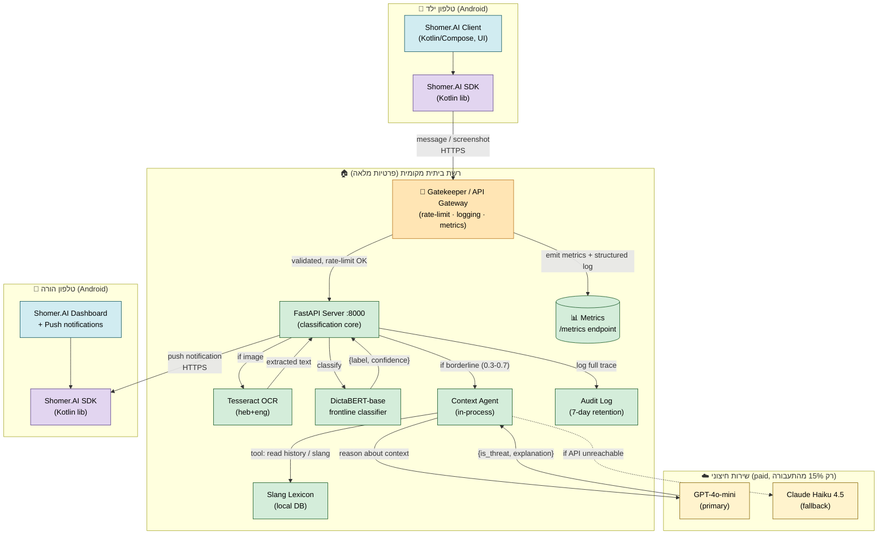
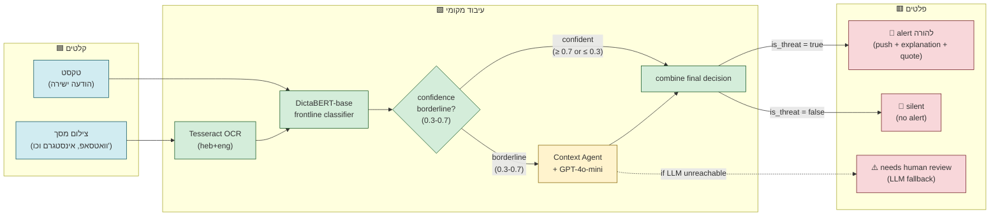
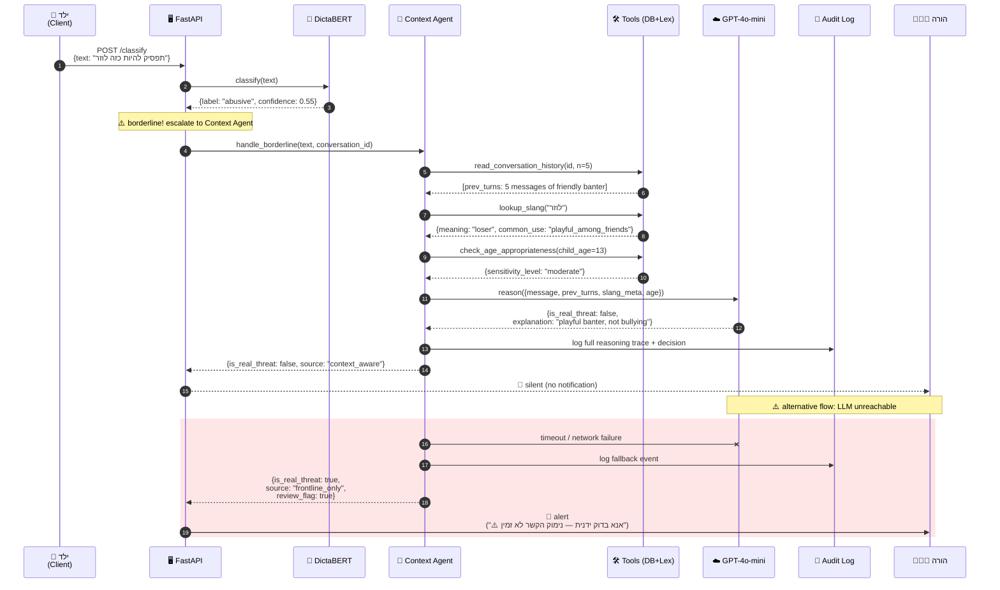

# Shomer.AI — דיאגרמות ארכיטקטורה

**מסמך:** דיאגרמות עבור Architecture B (טקסט + Chat-OCR + Context Agent יחיד)
**מקורות:** [`plan-docs/decisions/architecture.decision.md`](../plan-docs/decisions/architecture.decision.md)
**סטטוס:** טיוטה למפגש 4 · 2026-05-31
**שימוש:** המסמך משובץ ב-[`PRD.md`](PRD.md) בסעיף הארכיטקטורה. ניתן גם לעיון עצמאי לצורך הגנת הארכיטקטורה.

---

## למה שלוש דיאגרמות?

כל דיאגרמה עונה על שאלה אחרת — לא כל מי שיקרא צריך את כולן:

| דיאגרמה | מה היא עונה | קהל מטרה |
|---|---|---|
| 1 — C4 Container | "מה הרכיבים ואיפה הם רצים?" | ארכיטקטים, DevOps, ד"ר סגל במפגש 4 |
| 2 — Data Flow | "מה הזרימה הלוגית של הנתונים?" | מפתחים — וודאות שיש pipeline אחד ולא שניים |
| 3 — Sequence (מקרה גבול) | "איך זה רץ בפועל בזמן אמת?" | מודיע על ה-RQ; מראה איפה ה-FP-reduction קורה |

---

## דיאגרמה 1 — תצוגת מערכת ברמת C4 Container

מציגה את כל המכלים (containers) של המערכת, את גבולות האמון (trust boundaries), ואת תזרים המידע הראשי בין הילד, השרת הביתי, השירות החיצוני (LLM בתשלום), וההורה.

**מקרא:**
- 🟢 ירוק = רץ מקומית (פרטיות מלאה, אפס עלות שולית)
- 🔵 כחול = לקוח (Android, צד הילד וצד ההורה)
- 🟣 סגול = SDK — ספרייה משותפת ב-Kotlin שיושבת **בתוך** כל קליינט; עוטפת את חוזה ה-API
- 🟠 כתום = Gatekeeper / API Gateway — שכבת Edge של ה-FastAPI; שולטת בעומסים ומספקת observability
- 🟡 צהוב = שירות חיצוני בתשלום (פעיל רק על 15% מקרי גבול)

**נקודות מפתח:**
1. כל הנתונים הרגישים (תוכן השיחות, תמונות) **נשארים ברשת הביתית**. לשירות החיצוני נשלח רק קונטקסט מצומצם (הודעה + עד 5 תורים קודמים, ללא PII).
2. ה-LLM החיצוני **לא חסום-פעולה** — אם נופל, חוזרים על סיווג החזית עם דגל "needs human review".
3. כל החלטה של ה-Context Agent מתועדת ב-Audit Log עם reasoning trace מלא (חובה לניתוח per-slice במפגש 8).
4. **SDK** (סגול) הוא חוזה ה-API היחיד שכל קליינט (אנדרואיד-ילד, אנדרואיד-הורה, web עתידי, 3rd-party integrations) ניגש דרכו. מונע שכפול קוד HTTP בין הקליינטים.
5. **Gatekeeper / API Gateway** (כתום) הוא שכבת Edge: כל בקשה עוברת דרכה לרייט-לימיט, validation, ולוגינג מובנה לפני שמגיעה לסיווג. מימוש MVP = FastAPI middleware (`slowapi` + `structlog` + `prometheus-fastapi-instrumentator`). מטרתו תפעולית — שליטה בעומסים + observability — ולא חלק מהסיווג עצמו.

---

## דיאגרמה 2 — Data Flow: שני מסלולי הקלט מתאחדים

מראה איך הודעת טקסט וצילום מסך חולקים את אותו pipeline מהמסווג הקדמי ואילך. **זוהי בדיוק ההצדקה לדחיית Architecture A** — אין צורך ב-Vision LLM כי הטקסט שבתוך התמונות חולץ דרך OCR ונכנס לאותו צינור.

**המסר העיקרי:** OCR קורא טקסט מתוך תמונות → הטקסט נכנס לאותו pipeline. אין שני pipelines נפרדים. החיסכון הזה הוא ההצדקה ההנדסית לוויתור על Vision LLM (Architecture A).

**שלוש האפשרויות הסופיות:**
- **Alert** — התראת push להורה עם הסבר וציטוט (לא קופסה שחורה)
- **Silent** — הסיווג קבע שהמקרה תמים, אין הפרעה להורה (Alert Fatigue מינימלי)
- **Manual review** — מסומן רק כשה-LLM החיצוני אינו זמין (graceful degradation)

---

## דיאגרמה 3 — Sequence: זרימת מקרה גבול עם reasoning של Context Agent

מציגה את הסדר הכרונולוגי המלא — מהילד שולח הודעה ועד להתראה (או לא) אצל ההורה — במקרה גבול שדורש את ה-Context Agent. דיאגרמה זו היא הליבה של ה-RQ: היא מראה **איפה ולמה** ה-FP-reduction קורה.

**מה הדיאגרמה מראה (נקודות לציון בהגנה):**

1. **השלבים 1–3 (סיווג ראשוני):** רץ במאות מיליאניות — DictaBERT מקומי, ללא קריאות חיצוניות.

2. **השלב 4 (החלטת הסלמה):** רק כשה-confidence ב-borderline zone (0.3–0.7). זה ה-15% מהתעבורה שמגיע ל-Context Agent ומגלם את עיקר ה-cost.

3. **השלבים 5–10 (ה-Context Agent):** הסוכן קורא היסטוריה + מילון סלנג + פרופיל גיל **לפני** הקריאה ל-LLM. הכלים חוסכים טוקנים ע"י הזרמת רק המידע הרלוונטי.

4. **השלב 11 (reasoning):** ה-LLM החיצוני (GPT-4o-mini) מקבל קונטקסט תמציתי ומחזיר החלטה + הסבר. **זה המנגנון שעונה על ה-RQ** — סיווג ההודעה ה"גבולית" משתפר ע"י reasoning על ההקשר.

5. **השלב 14 (תוצאה):** במקרה הזה ה-Context Agent קבע שהמסר תמים (סלנג ידידותי בהקשר של שיחה צוחקת) → **אין התראה** → **הפחתת FP**.

6. **המסלול האדום (fallback):** אם ה-LLM אינו זמין, המערכת לא חוסמת את ההתראה — שולחת אותה עם דגל "needs human review". עיקרון: **לעולם לא לאבד התראה בשקט במערכת בטיחות ילדים**.

---

## איך הדיאגרמות מעידות על ה-RQ

שאלת המחקר: *"עד כמה הוספת הקשר שיחתי לסיווג בריונות בעברית מפחיתה את שיעור ה-false positives לעומת סיווג מבודד — מבלי לפגוע ב-recall?"*

הניסוי המוטמע בארכיטקטורה:
- **תנאי control (context-blind):** המסווג בלבד מחליט. בדיאגרמה 3, זה השלבים 1–3 בלבד; ההחלטה תהיה לפי `confidence ≥ 0.5` → "is_threat = true" → **התראת FP**.
- **תנאי treatment (context-aware):** המסווג + Context Agent. בדיאגרמה 3, זה הזרימה המלאה; ההחלטה לאחר reasoning → "is_real_threat = false" → **התראה נמנעה**.
- **המדידה:** הפרש ה-FPR בין שני התנאים על gold set מתויג ידנית (מפגש 8).

הארכיטקטורה לא רק תומכת ב-RQ — היא **מממשת את הניסוי כפיצ'ר מובנה** של המוצר.

