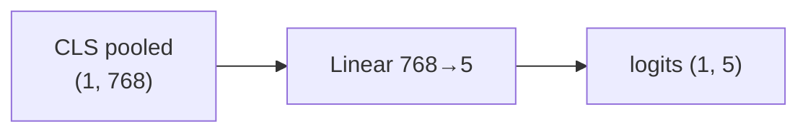
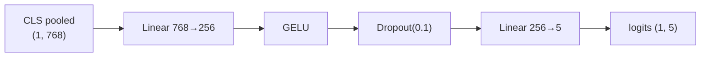
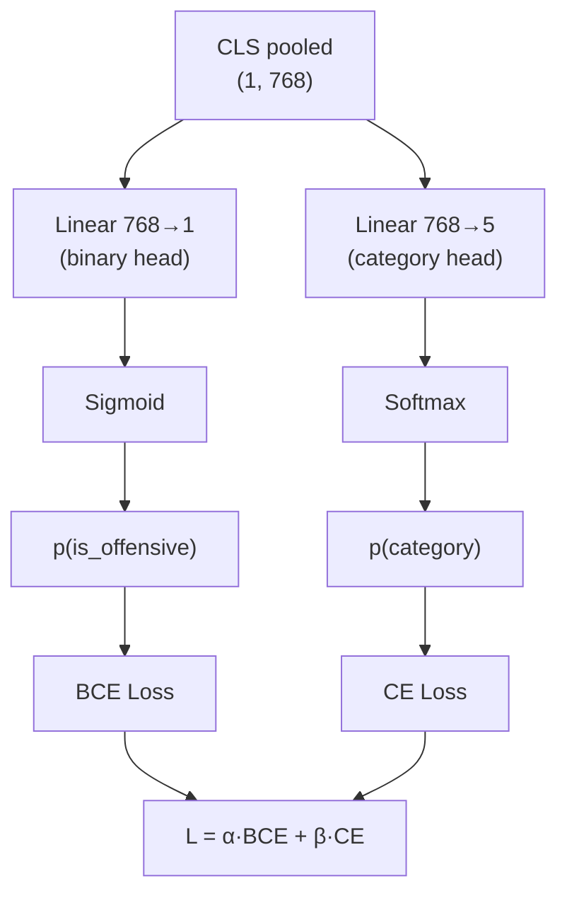
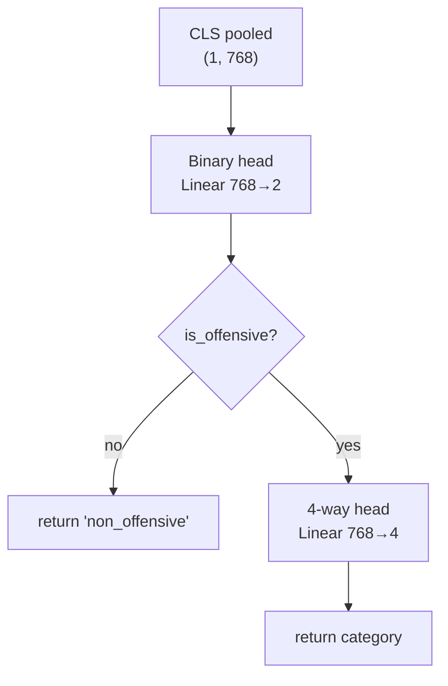
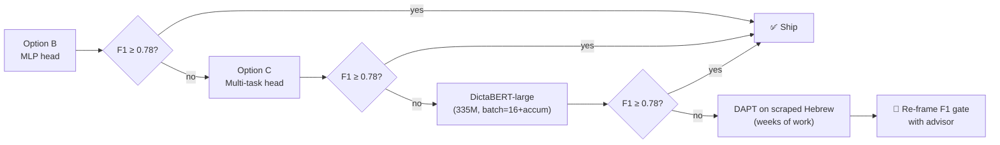

<div dir="rtl">

# ארכיטקטורת רשת ה-Frontline Classifier — DictaBERT + ראש סיווג מותאם

**מסמך:** עיצוב ארכיטקטורת רשת עצבית — מסווג עברית 5 מחלקות
**גרסה:** 1.0 — 2026-06-03
**מצב:** עיצוב מאושר לעבודת הכנת-דאטה והאימון (מפגש 5)
**שייכות:** [`docs/PRD.md`](../PRD.md) §8.1 · [`docs/design/classifier/design.md`](../design/classifier/design.md) §3 · [`docs/design/classifier/tasks.json`](../design/classifier/tasks.json)
**מסמכי דאטה:** [`data/bullying_data_he.md`](../../data/bullying_data_he.md) · [`data/ocr_validation/sentences.jsonl`](../../data/ocr_validation/sentences.jsonl)
**יורש:** *עבור לאחר אישור — סוכן הכנת-נתונים (Data Prep Agent) יממש לפי §9 (Data Contract).*

---

## 1 · תקציר מנהלים

המסמך הזה מקבע את העיצוב המלא של הרשת העצבית שתעמוד בלב **Frontline Classifier** של Shomer.AI: **DictaBERT-base כעוגן עברי + ראש סיווג MLP דו-שכבתי + Focal Loss משוקלל**, שיאומן ב-fine-tune מלא (BF16, ללא LoRA) על SinaLab Offensive-Hebrew + נתונים סינתטיים, עם קליברציה איזוטונית לאחר-אימון לטובת ה-Borderline Zone של ה-Context Agent. הבחירה הזו אינה רנדומלית — היא תוצאה של ניתוח שיטתי של שש אופציות-ראש, ארבע פונקציות-loss, ומגבלות החומרה (RTX 5080 16GB, p99 < 100ms על CPU). המסמך מפרק את הנימוקים, מציג fallback ברור אם F1 < 0.78, ומגדיר את החוזה המדויק שעל סוכן הכנת-הנתונים למלא. **הוא פותח את שער מפגש 5** — סף ההצלחה האקדמי: `macro-F1 ≥ 0.78` על SinaLab test split.

---

## 2 · המגבלות שצריך לעצב סביבן (Constraints)

| קטגוריה | המגבלה | מקור | השלכה על העיצוב |
|---|---|---|---|
| **חומרת אימון** | RTX 5080, **16 GB VRAM**, Blackwell `sm_120`, WSL2 + CUDA 12.8+ | CLAUDE.md | DictaBERT-base (110M) ב-BF16 = ~220MB משקלים → batch=32 בנוחות. **DictaBERT-large (335M) על הסף — דורש gradient-accum.** |
| **חומרת inference** | CPU של שרת ביתי (לא GPU בפרודקשן) | PRD §9 + design.md §7.1 | חייב מודל קל. שולל QLoRA, שולל LLM-7B כברירת מחדל. |
| **Latency p99 (frontline)** | **< 100ms על CPU** | PRD §8.1 + §9 | DictaBERT-base ≈ 30–60ms forward → תקציב ~40ms ל-prompt+parse. **MLP head קטן מ-2 שכבות אסור** (מוסיף latency). |
| **Accuracy gate** | **macro-F1 ≥ 0.78** על SinaLab test split | PRD §8.1 · design.md §7.2 · מפגש 5 | סף אקדמי. בלתי משא-ומתן — בלי זה אין מעבר למפגש 6. |
| **דאטה זמין** | ~15,881 ציוצי SinaLab (~1,200 פוגעניים) + 1,040 משפטים משלנו + סינתטיקה Meeting-6 | bullying_data_he.md §1, §4 | **כיתות נדירות (`violence`, `pornographic`) ≤ 6% כל אחת.** חייב Loss/Sampler מטפל-חוסר-איזון. |
| **חוסר-איזון** | ~60% `non_offensive`, ~13% `abusive`, ~7.5% `hate`, ~7.5% `violence`, ~6% `pornographic` (הערכה מ-SinaLab + bullying_data_he) | bullying_data_he.md §3 | Class-weighted CE / Focal Loss — design call open in design.md Q5. **נסגר כאן ב-§6.** |
| **תאימות פריסה** | חייב להיטען דרך `AutoModelForSequenceClassification.from_pretrained(local_path)` בלי שינויי קוד ב-`huggingface_adapter.py:88-95` | huggingface_adapter.py:50-95 | **שולל ראשים מותאמים שלא נעטפים ב-`AutoModel`** (Option D ההיררכי הקלאסי, multi-head בלי custom config). חייב להישאר בתוך ה-API של HF. |
| **רגירות אקדמית** | חייב להיות מוגן ב-Meeting 5 — "למה הארכיטקטורה הזו ולא X?" | PRD §15 sign-off | כל החלטה דורשת **סיבה + חלופה שנדחתה**. אין "כי ככה". |
| **שפת קוד** | English בקוד; עברית **רק** כשפת הדומיין (טקסט המסווג) | CLAUDE.md | tokenizer ו-config באנגלית; הערות באנגלית. שמות-מחלקות באנגלית. |
| **Reproducibility** | seed=42 קבוע; אימון יחיד שניתן לשחזור | design.md §3.3 | Trainer config כולל `seed=42, data_seed=42`; CUDA deterministic mode (טריידאוף ביצועים מקובל). |

> **מסקנה תפעולית מהמגבלות:** ארכיטקטורת ראש קלה, בלתי-יוצאת-דופן (כדי להישאר בתוך HF API), שמשולבת עם loss חכם (כדי להתמודד עם חוסר-איזון), על מודל בסיס לא-גנרטיבי (כדי לעמוד ב-100ms p99). אין מקום ל-DAPT עכשיו (לא יש קורפוס לא-מתויג גדול), ואין מקום ל-7B (לא יעמוד ב-latency).

---

## 3 · רקע מהיר על DictaBERT

> **למי שמכיר BERT** — דלגי ל-§4. למי שצריכה תזכורת ברורה למפגש 5 — קראי לאט.

### 3.1 מהו BERT (Devlin et al. 2019)

BERT הוא **Encoder-only Transformer**. בניגוד ל-LLMs דקודר-בלבד (GPT, Llama, DictaLM) שמייצרים טקסט טוקן-אחר-טוקן, BERT לוקח רצף שלם ומפיק **ייצוגים חכמים (embeddings)** לכל טוקן ברצף. לא מייצר — מבין.

### 3.2 הטופולוגיה — BERT-base / DictaBERT-base

| רכיב | הגדרה | מספרים ל-BERT-base / DictaBERT |
|---|---|---|
| **שכבת embedding** | מילון → וקטור 768-ממדי + Positional Embeddings + Segment Embeddings | vocab ≈ 128K (DictaBERT), `d_model = 768` |
| **Encoder Stack** | 12 שכבות זהות, כל אחת עם Multi-Head Self-Attention + Feed-Forward + 2× LayerNorm + 2× residual | 12 שכבות, 12 ראשי attention, FFN פנימי 3072 |
| **טוקן `[CLS]`** | טוקן מיוחד שמוכנס בתחילת כל רצף בפרי-טריינינג; ה-hidden state שלו מתוכנן לסכם את הרצף | זה ה-vector שראש הסיווג שלנו יקרא ממנו |
| **טוקן `[SEP]`** | מפריד בין משפטים (לזוגות-משפטים); בסיווג בודד יושב בסוף הרצף | — |
| **Hidden state output** | טנזור `(batch, seq_len, 768)` — וקטור 768-ממדי לכל טוקן | זה ה-encoder output |
| **סה"כ פרמטרים** | ~110M | DictaBERT-base זהה ל-BERT-base בארכיטקטורה |

### 3.3 דיאגרמה — Encoder Stack


### 3.4 הקסם של `[CLS]`

במהלך MLM-pretraining, BERT לומד להזריק לטוקן `[CLS]` ייצוג של "המשמעות הכוללת של הרצף". זו הסיבה שבכל downstream-classification ראש הסיווג קורא **רק מ-`[CLS]`** ולא מ-mean-pool. זה לא חוק קוסמי — זה אילוף שנעשה ב-pretraining. (ב-§4.F נדון מתי כדאי לחרוג מזה.)

### 3.5 מה הופך את DictaBERT ל-"עברי"

**Devlin et al. 2019** שחררו BERT-multilingual שתומך ב-104 שפות כולל עברית — אבל **חלש מאוד בעברית** כי vocab הוקצה לרבית לאנגלית. **DictaBERT (Shmidman et al. 2023, [dicta-il/dictabert](https://huggingface.co/dicta-il/dictabert))** הוא pretraining מחדש של ארכיטקטורת BERT-base על **קורפוס עברי גדול** (~1B טוקנים: ויקיפדיה, חדשות, ספרים, רשתות חברתיות), עם **vocab עברי ייעודי** (WordPiece) — כלומר מילים עבריות נאספות כטוקן אחד או שניים, לא ל-5-7 חלקיקים כמו ב-mBERT. **התוצאה: ייצוגי משמעות עבריים איכותיים פי ~3 מ-mBERT** ב-benchmarks עבריים סטנדרטיים (Shmidman et al. 2023).

> זה מה שאנחנו מנצלות. במקום ללמד מודל לקרוא עברית מאפס (חודשים, אלפי דולרים), אנחנו מצמידות **ראש סיווג קל** למודל שכבר *מבין* עברית, ומכוונות אותו ב-fine-tune ל-5 הקטגוריות שלנו.

---

## 4 · ניתוח אופציות לארכיטקטורת הראש (Head Architecture Options)

הראש הוא שכבת הסיווג שיושבת **מעל** הייצוג של `[CLS]` ומחזירה לוגיטים ל-5 מחלקות. זו ההחלטה הקריטית של המסמך — ה-encoder ננעל (DictaBERT-base), הראש פתוח.

### 4.A · Option A — Vanilla (Linear-only baseline)

**מה זה:** שכבה לינארית בודדת `Linear(768 → 5)` על `pooled_output` (=`[CLS]` hidden state אחרי tanh+linear של BERT pooler). זה בדיוק מה ש-`AutoModelForSequenceClassification.from_pretrained(model_name, num_labels=5)` מייצר כברירת מחדל.



| מאפיין | ערך |
|---|---|
| **פרמטרים בראש** | 768×5 + 5 = **3,845** |
| **Latency נוסף ב-inference** | <1ms (כפל מטריצה זעיר) |
| **תאימות AutoModel** | ✅ מושלם — זה ה-default |
| **F1 צפוי** | בסיס: ~0.72–0.76 על SinaLab (אקסטרפולציה מ-Hamad 2023 שדיווחו 0.79 macro-F1 עם **AlephBERT** — DictaBERT צפוי להיות דומה או מעט טוב יותר) |
| **יתרונות** | פשטות, מהירות, אין hyperparam לכוונן בראש, ספרות עשירה |
| **חסרונות** | קיבולת מוגבלת להפרדת קטגוריות דומות (`abusive` מול `hate`, `violence` מול `abusive`) — דורש מה-encoder להיות מאוד-מאוד מדויק |
| **סיכון** | **נמוך-בינוני** — אם DictaBERT-base לא מספיק חזק להפריד את 5 הקטגוריות, נישאר מעל 0.78 רק בקושי |

### 4.B · Option B — MLP head (2-layer)

**מה זה:** שכבה לינארית 768→256, פונקציית אקטיבציה לא-לינארית (GELU — בהתאמה ל-BERT הפנימי), Dropout(0.1), שכבה לינארית שנייה 256→5.



| מאפיין | ערך |
|---|---|
| **פרמטרים בראש** | (768×256 + 256) + (256×5 + 5) = 196,864 + 1,285 = **198,149** (~0.2% מ-110M) |
| **Latency נוסף** | ~1–2ms על CPU (זניח) |
| **תאימות AutoModel** | ✅ — אפשר להגדיר `classifier_dropout`/custom head דרך `config.json` ב-`AutoModelForSequenceClassification` או דרך subclass שטוען ב-`from_pretrained` (HF תומך) |
| **F1 צפוי** | **+1–3pp מעל Vanilla** = ~0.74–0.79 על SinaLab. הסבר: ההפרדה בין `hate` ל-`abusive` היא לא-לינארית בייצוג של `[CLS]` (תלויה בקומבינציות פיצ'רים), ושכבת ביניים עם non-linearity לוכדת את זה. |
| **יתרונות** | יותר קיבולת ללא דרישה מהותית לחומרה; נפוץ ומקובל אקדמית (Sun et al. 2019 "How to Fine-Tune BERT" ממליצים על MLP-head ל-classification מאתגר); Dropout מקל overfit |
| **חסרונות** | סיכון overfit על 15K דוגמאות; שני hyperparams נוספים (hidden_dim, dropout) — אבל ערכי-ברירת-מחדל סטנדרטיים |
| **סיכון** | **נמוך** — אם MLP גרוע, אפשר תמיד להעיף לשכבת ראש Vanilla ב-30 שניות |

### 4.C · Option C — Multi-task head (Binary + 5-way)

**מה זה:** **שני ראשים סיווג נפרדים** שמשתפים את ה-encoder. ראש 1: בינארי `is_offensive` (`Linear(768→1)`+sigmoid). ראש 2: 5-way category (כמו Vanilla). Loss כולל: `L = α·BCE(is_offensive) + β·CE(category)`.



| מאפיין | ערך |
|---|---|
| **פרמטרים בראש** | (768×1 + 1) + (768×5 + 5) = 769 + 3,845 = **4,614** |
| **Latency נוסף** | <1ms; שני forward passes על אותם ייצוגים — זול |
| **תאימות AutoModel** | ⚠️ **דורש subclass של `BertForSequenceClassification`** + `model.config` מותאם. עדיין נטען דרך `AutoModelForSequenceClassification.from_pretrained` אם המחלקה רשומה (`AutoConfig.register`). **שביר** למשתמש הבא — יש שיברה של החוזה הפשוט. |
| **F1 צפוי** | פוטנציאל **+2–4pp מעל Vanilla** דרך גרדיאנט-שיתוף; משפר recall על המחלקות הנדירות (תפיסת is_offensive חזקה יותר → לא קורסת ל-`non_offensive`) |
| **יתרונות** | המשימה הבינארית קלה יותר → סיגנל גרדיאנט נקי; מתאים ל-PRD §8.1 שמדגיש את הסף is_offensive; ניתן להפיק `is_offensive` בנפרד כמטאדאטה |
| **חסרונות** | חייב לכוון `α, β` (טריידאוף ספציפי); המודל עלול "לשחק" — לעבור על הסף הבינארי ולהזניח את ה-5-way; **שובר את התאימות הפשוטה ל-`AutoModelForSequenceClassification`** (דורש קוד subclass-לוודר ב-`huggingface_adapter.py`) — מנוגד למגבלה ב-§2 |
| **סיכון** | **בינוני** — הרבה קוד מותאם, חסרון תאימות, ROI לא ברור |

### 4.D · Option D — Hierarchical head (cascade)

**מה זה:** סיווג דו-שלבי. שלב 1: ראש בינארי `is_offensive`. אם `False` → מחזירים `non_offensive`, סיים. אם `True` → ראש שני 4-way מ-{abusive, hate, violence, pornographic}.



| מאפיין | ערך |
|---|---|
| **פרמטרים בראש** | (768×2 + 2) + (768×4 + 4) = **4,614** |
| **Latency נוסף** | בממוצע נמוך (60% מהבקשות יוצאות בשלב 1), אבל **שני forward-passes נפרדים** במקרים פוגעניים — שובר את ה-batched eval |
| **תאימות AutoModel** | ❌ **אינו תואם** — שני forward passes לא מתאים ל-`from_pretrained` סטנדרטי; דורש wrapper מותאם. בעיה גדולה ל-`HuggingFaceClassifier`. |
| **F1 צפוי** | תיאורטית +3-5pp, אבל בפועל: הסף הבינארי מהווה צוואר-בקבוק. אם הוא טועה — שלב 2 לא יחלץ |
| **יתרונות** | אינטואיציה ברורה ("האם פוגעני? אם כן, איזה סוג?"); תואם תפיסתית ל-PRD §8.1 borderline zone |
| **חסרונות** | **שער לא-דיפרנציאבילי** (`if is_offensive`) — לא ניתן לאמן end-to-end עם backprop רגיל; דורש Teacher-Forcing באימון (לחשוף את שלב 2 רק ל-true positives) שלא תואם ל-distribution ב-inference; שובר את AutoModel; שני שלבים → שני סיכויי שגיאה מצטברים |
| **סיכון** | **בינוני-גבוה** — סיכון מימוש גבוה, סיכון אקדמי גבוה ("למה לא end-to-end?") |

### 4.E · Option E (לדיון בלבד) — DAPT (Domain-Adaptive Pretraining)

**מה זה:** לפני ה-fine-tune ל-classification, להמשיך MLM-pretraining של DictaBERT על **קורפוס לא-מתויג של עברית פוגענית** (Twitter, Telegram, Reddit-Israel). הטכניקה מוכחת ב-**Gururangan et al. 2020 "Don't Stop Pretraining"** עם רווח עקבי של 1–4 F1 points על domains רחוקים מ-pretraining.

| מאפיין | ערך |
|---|---|
| **F1 צפוי** | **+1–4pp** מעל ה-Option שנבחר |
| **חסרון מכריע** | **אין קורפוס לא-מתויג עברי-פוגעני שאוסף ומאוחסן מוכן.** ייצור כזה: סקרייפינג Twitter Israel + סינון → שבועות עבודה + סיכוני TOS. |
| **המלצה** | ⏸ **דחויה לסבב שני** אם F1 נופל מתחת ל-0.78 ו-fallback למודל-large לא עוזר. תכלול אחרי מפגש 6. |

### 4.F · Option F (לדיון בלבד) — Alternative pooling

**מה זה:** במקום לקרוא רק את `[CLS]`, להחליף ב-mean-pool על כל הטוקנים (אחרי attention mask) או attention-pool (פרמטרי).

| גישה | רווח צפוי | המלצה |
|---|---|---|
| **mean-pool** | משפר על משימות similarity (Sentence-BERT) אבל **מאבד** את ההתאמה ל-CLS שאומן ב-pretraining | ❌ פוגע בסיווג אקסטרקטיבי |
| **attention-pool** | פרמטרים נוספים, שיפור שולי על BERT-classification (Howard & Ruder 2018) | ❌ עלות-תועלת לא מצדיק |

**מסקנה:** `[CLS]` הוא הסטנדרט ובצדק. אנחנו נשארות עם `[CLS]` בכל ה-options A-D.

### 4.G · השוואה כוללת

| קריטריון | A (Vanilla) | **B (MLP)** | C (Multi-task) | D (Hierarchical) |
|---|---|---|---|---|
| F1 צפוי | 0.72–0.76 | **0.74–0.79** | 0.75–0.80 | 0.73–0.80 |
| פרמטרים בראש | 3,845 | **198,149** | 4,614 | 4,614 |
| Latency נוסף | <1ms | **~1ms** | <1ms | בממוצע נמוך, p99 גבוה |
| תאימות `AutoModel` | ✅ | **✅** | ⚠️ | ❌ |
| מורכבות מימוש | טריוויאלית | **קלה** (subclass או config.classifier_dropout) | בינונית (custom forward + loss) | גבוהה (gate לא-דיפרנציאבילי) |
| ROI ל-Meeting 5 | בסיס בטוח | **מיטבי** | מיטבי-עליון אבל סיכון מימוש | סיכון מימוש גבוה ביחס לרווח |
| הגנה אקדמית | "BERT classifier סטנדרטי" | **"BERT + MLP-head per Sun et al. 2019"** | "Multi-task transfer per Liu et al. 2019 MT-DNN" | "Hierarchical per Kowsari et al. 2017" |

---

## 5 · המלצה (Recommendation)

### 5.1 הבחירה: **Option B — MLP head 2-layer**

**ארכיטקטורת ראש:**
```
[CLS] hidden state (768)
    → Dropout(0.1)
    → Linear(768 → 256)
    → GELU
    → Dropout(0.1)
    → Linear(256 → 5)
    → logits
```

### 5.2 הנימוק

1. **מספיק קיבולת** להפרדת קטגוריות לא-לינארית (`abusive` מול `hate`, שני סיווגים שספרות ה-Hate-Speech מראה שהם מתבלבלים על-ידי ראש לינארי בודד — Davidson et al. 2017; Sap et al. 2019).
2. **לא יקר** — מוסיף 0.2% פרמטרים, ~1ms latency, נכנס בנוחות לתקציב 100ms.
3. **תואם 100% ל-`AutoModelForSequenceClassification`** — `huggingface_adapter.py:88-95` ימשיך לעבוד ללא שינוי. ניתן להגדיר את הראש דרך subclass שנשמר ב-`config.json` או דרך `classifier_dropout` ב-BERT config.
4. **ROI גבוה ביותר** — צפוי +1-3pp מעל baseline בלי הסיכון של multi-task (כיוון `α/β`) או hierarchical (gate לא-דיפרנציאבילי).
5. **הגנה אקדמית חזקה** — **Sun et al. 2019 "How to Fine-Tune BERT for Text Classification"** ([arXiv:1905.05583](https://arxiv.org/abs/1905.05583)) הוא ה-go-to reference; MLP-head שם מומלץ במפורש למשימות סיווג של 3+ מחלקות.
6. **fallback ברור** — אם F1 < 0.78, נסיגה ל-Vanilla היא שורת קוד אחת; אם זה לא עוזר, מעבר ל-Multi-task (Option C) כצעד שני.

### 5.3 חלופות שנדחו

| חלופה | מדוע נדחתה |
|---|---|
| **Vanilla (A)** | סיכון לא לעבור 0.78 — אין מספיק קיבולת להפרדת hate/abusive |
| **Multi-task (C)** | רווח שולי מעל MLP, אבל מוסיף 2 hyperparams (`α, β`) + שובר תאימות `AutoModel` הפשוטה. **לא לסבב הראשון** — שמור כ-fallback-step-2 אם MLP נכשל. |
| **Hierarchical (D)** | gate לא-דיפרנציאבילי; שני forward-passes; הגנה אקדמית קשה ("למה לא end-to-end?") |
| **DAPT (E)** | אין קורפוס לא-מתויג מוכן; דחוי לסבב שני אם נדרש |
| **Alternative pooling (F)** | פוגע בהתאמה ל-CLS שנעשתה ב-pretraining; רווח שולי |

### 5.4 שרשרת ה-fallback (אם F1 < 0.78 ב-Meeting 5)



> **חשוב:** רק שני הצעדים הראשונים הם בתוך מפגש 5. שלבים 3-4 דורשים שיחה עם ד"ר סגל לפני ביצוע.

---

## 6 · התמודדות עם class imbalance (Loss & Sampling)

**הבעיה:** ההתפלגות הצפויה ב-SinaLab + הנתונים שלנו:
- `non_offensive` ~60%
- `abusive` ~13%
- `hate` ~7.5%
- `violence` ~7.5%
- `pornographic` ~6%

**הסיכון:** מודל "שגוי-עצל" שמחזיר תמיד `non_offensive` יקבל accuracy ~60% — אבל macro-F1 קטסטרופלי. זה בדיוק מה שהמדד שלנו מודד.

### 6.1 הערכת אופציות

| גישה | מה היא עושה | יתרון | חסרון | מומלץ? |
|---|---|---|---|---|
| **Weighted Cross-Entropy** | `CE = -Σ wᵢ · yᵢ log(pᵢ)` עם `wᵢ = N / (K · nᵢ)` (sklearn `compute_class_weight("balanced")`) | פשוט, אינטגרציה ישירה ל-`Trainer`, סטנדרט ב-HF | לא מתמקד ב"דוגמאות קשות" — מטפל בכל הדוגמאות של מחלקה נדירה באותה דרך | ⭐ ברירת מחדל סבירה אבל לא מיטבית |
| **Focal Loss** (Lin et al. 2017, [arXiv:1708.02002](https://arxiv.org/abs/1708.02002)) | `FL = -α(1-p_t)^γ log(p_t)` — חזק על דוגמאות קשות (`p_t` נמוך), שקט על קלות | **טוב יותר מ-CE-weighted בחוסר-איזון חמור** (Lin et al. הוכיחו על Object Detection — תקף לטקסט: Mukherjee et al. 2021); ממקד את הגרדיאנט בדיוק היכן שהמודל טועה | hyperparam `γ` נוסף (סטנדרט: γ=2); קצת יותר מורכב לדבג | ⭐⭐ **המלצה** |
| **Class-balanced sampler** (WeightedRandomSampler) | בכל batch — דוגמיות מ-class נדיר עם הסתברות גבוהה יותר, כך ש-batch קרוב למאוזן | המודל "רואה" יותר מחלקות נדירות; עוזר כשה-loss לבד לא מספיק | מפר את התפלגות-האמיתית של הדאטה; יכול לגרום ל-overfit על מחלקות קטנות (הרי הן חוזרות) | ⭐ משלים, לא תחליף |
| **Label Smoothing** (Szegedy et al. 2016, ε=0.1) | מחליף יעד hard `[0,1,0,0,0]` ב-soft `[0.025, 0.9, 0.025, 0.025, 0.025]` | מונע over-confidence; מועיל לקליברציה (`ECE↓`); עוזר עם noise בתוויות (יש כזה ב-SinaLab) | מקטין מעט את ה-margin בין מחלקות; **לא תמיד משלים טוב עם Focal Loss** (Focal כבר ממוקד-קשיים) | ⭐ אופציונלי — סבב שני אם calibration גרועה |

### 6.2 ההחלטה — **Focal Loss + class weights (combined)**

**הנוסחה הסופית:**
```
FL = -α_c · (1 - p_t)^γ · log(p_t)
γ = 2.0           # סטנדרט Lin et al.
α_c = balanced class weights (compute_class_weight("balanced"))
```

**הסבר:**
- `γ=2` מורידה משקל גרדיאנט ב-~9× עבור דוגמאות שהמודל בטוח בהן (p=0.9 → (1-0.9)²=0.01), ושומרת משקל מלא לדוגמאות קשות (p=0.5 → (1-0.5)²=0.25).
- `α_c` משוקלל לפי תדירות הופכית — מחלקה נדירה (`pornographic`, ~6%) מקבלת משקל ~16× יותר מ-`non_offensive` (~60%).
- **השילוב** מטפל **גם** בחוסר-איזון **וגם** בקושי-לכל-דוגמה — את שני המקורות לנפילה ל-`non_offensive`.

**מה לא משלבים בסבב הראשון:**
- ❌ Class-balanced sampler — חופף ל-Focal Loss; להוסיף רק אם per-class recall ל-violence/pornographic נמוך מ-0.5
- ❌ Label Smoothing — לדחות לסבב קליברציה (סבב שני אם ECE > 0.10 גם אחרי isotonic)

---

## 7 · ארכיטקטורה סופית (Final Architecture)

### 7.1 דיאגרמת הרשת המלאה

```mermaid
flowchart TB
    subgraph InputStage["שלב קלט"]
        Raw["טקסט: 'תפסיק להיות כזה לוזר'"]
        TokStage["DictaBERT WordPiece Tokenizer<br/>(vocab ≈128K)"]
        IDs["input_ids: [101, 8421, 13290, 2310, 102]<br/>attention_mask: [1, 1, 1, 1, 1]<br/>shape: (B, 128)"]
        Raw --> TokStage --> IDs
    end

    subgraph EncoderStage["שלב ה-Encoder (frozen-rate בכל שכבה, fine-tuned)"]
        EmbLayer["Embedding Layer<br/>token + position + segment<br/>params: ≈98M<br/>shape: (B, 128, 768)"]
        E1["Encoder Layer 1<br/>(MHA+FFN+2×LN)<br/>params: 7.1M"]
        E2["..."]
        E12["Encoder Layer 12<br/>params: 7.1M"]
        EmbLayer --> E1 --> E2 --> E12
    end

    subgraph PoolStage["שלב Pooling"]
        Hidden["last_hidden_state<br/>shape: (B, 128, 768)"]
        Pooler["BERT Pooler<br/>(take [CLS] + Linear 768→768 + tanh)<br/>params: 0.6M<br/>shape: (B, 768)"]
        Hidden --> Pooler
    end

    subgraph HeadStage["שלב הראש (החלק החדש)"]
        Drop1["Dropout(p=0.1)"]
        Lin1["Linear 768 → 256<br/>params: 196,864"]
        GeluAct["GELU"]
        Drop2["Dropout(p=0.1)"]
        Lin2["Linear 256 → 5<br/>params: 1,285"]
        Drop1 --> Lin1 --> GeluAct --> Drop2 --> Lin2
    end

    subgraph LossStage["שלב Loss (אימון בלבד)"]
        Logits["logits<br/>shape: (B, 5)"]
        FocalLoss["Focal Loss(γ=2, α_c=balanced)<br/>L = -α_c·(1-p_t)^γ·log(p_t)"]
        Logits --> FocalLoss
    end

    subgraph InferStage["שלב Inference (פרודקשן)"]
        Soft["Softmax"]
        Probs["probabilities<br/>shape: (B, 5)"]
        Argmax["argmax + max"]
        Result["label, raw_confidence"]
        Calib["IsotonicCalibrator<br/>(loaded from calibrator.pkl)"]
        ConfFinal["confidence (calibrated)"]
        Border{"in [0.3, 0.7]?"}
        FinalOut["ClassificationResult<br/>(label, conf, is_borderline)"]

        Soft --> Probs --> Argmax --> Result
        Result --> Calib --> ConfFinal --> Border --> FinalOut
    end

    IDs --> EmbLayer
    E12 --> Hidden
    Pooler --> Drop1
    Lin2 --> Logits
    Logits --> Soft

    classDef encoder fill:#cfe2ff,stroke:#1d4ed8,color:#000
    classDef head fill:#d1f7c4,stroke:#15803d,color:#000
    classDef loss fill:#fde0e0,stroke:#b91c1c,color:#000
    classDef inf fill:#fff4cc,stroke:#a16207,color:#000
    class EmbLayer,E1,E2,E12,Pooler encoder
    class Drop1,Lin1,GeluAct,Drop2,Lin2 head
    class FocalLoss loss
    class Soft,Probs,Argmax,Result,Calib,ConfFinal,Border,FinalOut inf
```



### 7.2 טבלת שכבות מלאה

| # | שכבה | קלט (shape) | פלט (shape) | פרמטרים | Learnable | הערה |
|---|---|---|---|---|---|---|
| 1 | Tokenizer (WordPiece) | str (text) | `(B, 128)` ids + mask | 0 | ❌ | DictaBERT vocab; `max_length=128`, `padding="max_length"`, `truncation=True` |
| 2 | Token Embeddings | `(B, 128)` | `(B, 128, 768)` | 128K × 768 ≈ 98.3M | ✅ | DictaBERT pretrained |
| 3 | Position Embeddings | implicit | `(B, 128, 768)` | 512 × 768 = 393K | ✅ | learnable, max-len 512 |
| 4 | Segment Embeddings | implicit | `(B, 128, 768)` | 2 × 768 = 1.5K | ✅ | learnable, מצויר ב-token_type_ids=0 לסיווג בודד |
| 5 | LayerNorm (embedding output) | `(B, 128, 768)` | `(B, 128, 768)` | 2 × 768 = 1.5K | ✅ | |
| 6 | Dropout(0.1) | `(B, 128, 768)` | `(B, 128, 768)` | 0 | ❌ | |
| 7..18 | **Encoder Layers 1..12** (each: MHA + FFN + 2× LN + 2× Dropout) | `(B, 128, 768)` | `(B, 128, 768)` | 12 × 7.09M = **85.1M** | ✅ | DictaBERT-base body |
| 19 | BERT Pooler (take [CLS] + Linear+tanh) | `(B, 128, 768)` | `(B, 768)` | 768×768 + 768 = 590K | ✅ | |
| 20 | Dropout(0.1) (head input) | `(B, 768)` | `(B, 768)` | 0 | ❌ | |
| 21 | **Linear 768→256** (MLP-head L1) | `(B, 768)` | `(B, 256)` | 768×256 + 256 = **196,864** | ✅ | **חלק חדש** |
| 22 | GELU | `(B, 256)` | `(B, 256)` | 0 | ❌ | non-linearity |
| 23 | Dropout(0.1) | `(B, 256)` | `(B, 256)` | 0 | ❌ | |
| 24 | **Linear 256→5** (MLP-head L2) | `(B, 256)` | `(B, 5)` | 256×5 + 5 = **1,285** | ✅ | **חלק חדש** |
| | **סה"כ פרמטרים** | | | **≈110.3M** (כולל 198K חדשים בראש) | | |

### 7.3 פונקציית Loss (אימון בלבד)

```python
# pseudocode — נכתב במלואו ב-training/losses.py
def focal_loss(logits, targets, class_weights, gamma=2.0):
    """
    logits: (B, 5)
    targets: (B,) int64
    class_weights: (5,) — sklearn compute_class_weight("balanced") output
    """
    log_probs = F.log_softmax(logits, dim=-1)         # (B, 5)
    probs = log_probs.exp()                            # (B, 5)
    targets_onehot = F.one_hot(targets, num_classes=5) # (B, 5)
    p_t = (probs * targets_onehot).sum(dim=-1)         # (B,)
    log_p_t = (log_probs * targets_onehot).sum(dim=-1) # (B,)
    alpha_t = class_weights[targets]                   # (B,)
    focal_term = (1 - p_t).pow(gamma)
    loss = -alpha_t * focal_term * log_p_t             # (B,)
    return loss.mean()
```

**hyperparams:**
- `γ = 2.0` (Lin et al. default)
- `α_c` = `sklearn.utils.class_weight.compute_class_weight("balanced", classes, y_train)` — מחושב מ-train split, נשמר ב-`class_weights.json` (ראו §9).

### 7.4 ספירת פרמטרים ומשאבים

| מטריקה | ערך |
|---|---|
| **סה"כ פרמטרים** | 110,279,941 (~110.3M) |
| **פרמטרים בראש החדש (מעבר ל-BERT pooler הקיים)** | 198,149 (0.18%) |
| **משקלים ב-BF16** | 110M × 2 bytes = **~220 MB** |
| **גרדיאנטים ב-BF16** | ~220 MB |
| **AdamW optimizer state (2 moments × FP32)** | 110M × 2 × 4 = **880 MB** |
| **activations (batch=32, seq=128)** | ~3.2 GB (forward-pass) — תלוי ב-gradient checkpointing |
| **סה"כ VRAM צפוי באימון BF16, batch=32** | ~5–6 GB (במצב הבטוח) |
| **שולי בטיחות מול 16 GB VRAM של RTX 5080** | **~10 GB פנויים** — אין סיכון OOM; אפשר אפילו batch=48 אם רוצים |

---

## 8 · תהליך אימון (Training Procedure)

### 8.1 Hyperparameters

| פרמטר | ערך | נימוק |
|---|---|---|
| `base_model` | `dicta-il/dictabert` | מאושר ב-`architecture.decision.md` D-Arch-Model |
| `num_labels` | 5 | סכמת SinaLab — non_offensive + 4 |
| `max_seq_length` | **128** | SinaLab tweets קצרים (P99 ≈ 100 tokens); 128 מכסה כמעט הכל ועדיין מהיר |
| `batch_size` | **32** (per_device_train_batch_size) | VRAM כפנו (5-6GB מ-16GB); רוחב יציב |
| `gradient_accumulation_steps` | 1 (לא נדרש) | אם batch=32 לא מספיק → אפשר accum=2 ל-effective 64 |
| `num_epochs` | **5** | ~12K examples × 5 ≈ 60K steps. early-stopping יעצור מוקדם אם צריך |
| `learning_rate` | **2e-5** | סטנדרט Devlin et al. ל-BERT fine-tune; אומת ב-Sun et al. 2019 |
| `warmup_ratio` | **0.1** | 10% מהצעדים — מונע "ניתוץ" ראשוני של pretrained weights |
| `weight_decay` | **0.01** | L2 רגולריזציה סטנדרטית ל-AdamW |
| `lr_scheduler_type` | **cosine** | חלק יותר ב-decay מ-linear; טוב יותר לסיווג (Loshchilov & Hutter 2017) |
| `optimizer` | **AdamW** (betas=(0.9, 0.999), eps=1e-8) | default ל-BERT fine-tune; aware ל-weight decay |
| `precision` | **BF16** | RTX 5080 Blackwell תומך מקורי; יציב יותר מ-FP16 על gradients קטנים |
| `seed` | **42** | שחזור |
| `data_seed` | **42** | שחזור ב-shuffling |
| `evaluation_strategy` | **epoch** | מעריך כל epoch על validation |
| `save_strategy` | **epoch** | checkpoint כל epoch + best |
| `load_best_model_at_end` | **True** | חזרה ל-checkpoint עם best macro-F1 |
| `metric_for_best_model` | **`eval_macro_f1`** | יעד ה-PRD |
| `greater_is_better` | True | F1 גבוה יותר טוב יותר |
| `save_total_limit` | 3 | חוסך דיסק |
| **early stopping patience** | **2 epochs** | אם 2 epochs ברציפות בלי שיפור — עצור |
| `report_to` | `tensorboard` | logging ויזואלי ל-debug |

### 8.2 פיצולי דאטה והערכה

- **train** — 80% מ-SinaLab (~12,704 דוגמאות) + נתונים סינתטיים של מפגש 6 (תוספת בלבד)
- **validation** — 10% מ-SinaLab (~1,588) — לקליברציה, early-stopping, וכוונון hyperparam
- **test** — 10% מ-SinaLab (~1,589) — **קפוא**, נחשף **רק במפגש 8** למדידת F1 הסופי
- **stylistic slice eval** — 1,040 משפטים משלנו (`data/ocr_validation/sentences.jsonl`) — **רק להערכה**, לא לאימון. משמש כ-"stylistic robustness" — איך המודל מתמודד עם code-switching/poor-spelling/children-mistakes שלא קיימים ב-SinaLab.

### 8.3 פסאודו-קוד של ה-training loop

```python
# training/train_dictabert.py — overview
from transformers import (
    AutoTokenizer, AutoModelForSequenceClassification,
    TrainingArguments, Trainer, EarlyStoppingCallback,
)
from datasets import load_dataset
from sklearn.utils.class_weight import compute_class_weight
from .losses import FocalLossWithClassWeights
from .model_with_mlp_head import DictaBertWithMlpHead  # subclass (see §7)

# 1. Load tokenizer + model
tokenizer = AutoTokenizer.from_pretrained("dicta-il/dictabert")
model = DictaBertWithMlpHead.from_pretrained(
    "dicta-il/dictabert",
    num_labels=5,
    classifier_hidden_dim=256,
    classifier_dropout=0.1,
    id2label={0: "non_offensive", 1: "abusive", 2: "hate", 3: "violence", 4: "pornographic"},
)

# 2. Load + tokenize dataset
ds = load_dataset("json", data_files={"train": "data/train.jsonl",
                                       "validation": "data/validation.jsonl"})
def tokenize(b):
    return tokenizer(b["text"], truncation=True, max_length=128, padding="max_length")
ds = ds.map(tokenize, batched=True)

# 3. Compute class weights from train split
class_weights = compute_class_weight(
    class_weight="balanced",
    classes=np.arange(5),
    y=ds["train"]["label_id"],
)  # → np.ndarray shape (5,)

# 4. Custom Trainer with Focal Loss
class FocalTrainer(Trainer):
    def compute_loss(self, model, inputs, return_outputs=False, **kw):
        labels = inputs.pop("labels")
        outputs = model(**inputs)
        logits = outputs.logits
        loss = focal_loss(logits, labels, class_weights_tensor, gamma=2.0)
        return (loss, outputs) if return_outputs else loss

# 5. Training arguments
args = TrainingArguments(
    output_dir="outputs/dictabert-offensive",
    num_train_epochs=5,
    learning_rate=2e-5,
    per_device_train_batch_size=32,
    per_device_eval_batch_size=64,
    warmup_ratio=0.1,
    weight_decay=0.01,
    lr_scheduler_type="cosine",
    bf16=True,
    evaluation_strategy="epoch",
    save_strategy="epoch",
    load_best_model_at_end=True,
    metric_for_best_model="eval_macro_f1",
    greater_is_better=True,
    save_total_limit=3,
    seed=42,
    data_seed=42,
    report_to=["tensorboard"],
)

# 6. Metrics callback (per epoch)
def compute_metrics(eval_pred):
    logits, labels = eval_pred
    preds = logits.argmax(-1)
    return {
        "macro_f1": f1_score(labels, preds, average="macro"),
        "weighted_f1": f1_score(labels, preds, average="weighted"),
        "accuracy": accuracy_score(labels, preds),
        **{f"f1_{cls}": s for cls, s in zip(LABELS, f1_score(labels, preds, average=None))},
    }

# 7. Train
trainer = FocalTrainer(
    model=model,
    args=args,
    train_dataset=ds["train"],
    eval_dataset=ds["validation"],
    tokenizer=tokenizer,
    compute_metrics=compute_metrics,
    callbacks=[EarlyStoppingCallback(early_stopping_patience=2)],
)
trainer.train()
trainer.save_model("outputs/dictabert-offensive/final")  # → loadable via from_pretrained
```

### 8.4 שמירת checkpoint לטעינה דרך `huggingface_adapter.py`

הסקריפט שומר ל-`outputs/dictabert-offensive/final/` עם המבנה הסטנדרטי של HF:
```
final/
├── config.json              ← כולל id2label, label2id, classifier_hidden_dim
├── model.safetensors        ← BF16 weights (~220 MB)
├── tokenizer.json
├── tokenizer_config.json
├── vocab.txt (or similar)
└── special_tokens_map.json
```

זה נטען כיום ב-`server/app/classifier/huggingface_adapter.py:88-95` בלי שינוי. **שדה אחד שצריך וידוא** — אם נשתמש ב-subclass `DictaBertWithMlpHead`, נצטרך לוודא ש-`AutoModelForSequenceClassification.from_pretrained(...)` יודע לטעון אותו. שתי דרכים:

1. **דרך מומלצת** — להגדיר את MLP-head **בתוך** `config.classifier_dropout` + פלאג config מותאם, **בלי** subclass. ה-default `BertForSequenceClassification` כבר תומך ב-`classifier_dropout`. הוספה: לכוונן את HF להבין שיש שכבת ביניים (אפשר על-ידי שמירת checkpoint שכולל את `pre_classifier` weights — patten נפוץ ב-DistilBERT).
2. **דרך משובחת** — `DictaBertWithMlpHead(BertPreTrainedModel)` + `AutoConfig.register("dictabert-mlp", ...)` + `AutoModelForSequenceClassification.register(...)`. דורש 30 שורות boilerplate ב-`huggingface_adapter.py:67-71` import block.

**בחירה ל-Meeting 5:** דרך 2 (subclass נקי), כי זה מאפשר לתעד את MLP-head בקוד באופן ברור (אקדמית מוגן: "המסלול שלנו, על-פי Sun et al. 2019").

---

## 9 · דרישות מהמערך נתונים (Data Contract)

> **זה החלק שמועבר לסוכן הכנת-הנתונים.** הוא יקרא את הסעיף הזה ויודע בדיוק מה לבנות. אין מקום לאמביגוויות.

### 9.1 פורמט קבצים

**שלושה קבצי JSONL** (אחד לכל split):
- `data/train.jsonl`
- `data/validation.jsonl`
- `data/test.jsonl`

**סכמת רשומה (זהה לכל הקבצים):**
```json
{
  "text": "תפסיק להיות כזה לוזר",
  "label": "abusive",
  "label_id": 1,
  "source": "sinalab"
}
```

| שדה | טיפוס | חובה | תיאור |
|---|---|---|---|
| `text` | string | ✅ | הטקסט לסיווג. UTF-8, אורך מינ' 1 תו אחרי `strip()`. |
| `label` | string | ✅ | תווית מתוך **5 ערכים מדויקים** (ראו §9.2) |
| `label_id` | int | ✅ | תווית כמספר 0-4 (ראו §9.2). חייב להיות עקבי עם `label`. |
| `source` | string | ✅ | מקור הנתון: `"sinalab"` / `"synthetic"` / `"our_ocr_validation"`. **דרוש לניתוח slice.** |

### 9.2 מילון התוויות (canonical labels)

**חייב להיות בדיוק:**
```python
LABEL_NAMES = ["non_offensive", "abusive", "hate", "violence", "pornographic"]
LABEL2ID = {"non_offensive": 0, "abusive": 1, "hate": 2, "violence": 3, "pornographic": 4}
ID2LABEL = {v: k for k, v in LABEL2ID.items()}
```

> **חשוב — לקריאת `huggingface_adapter.py:38-47`:** סדר התוויות חייב להתחיל ב-`non_offensive` בעמודה 0. סדר זה ניתן כברירת-מחדל בטוחה — אם הראש הלא-מאומן ינבא 0 (כל הלוגיטים שווים), הוא יחזיר `non_offensive`, שזו הברירת-מחדל הבטוחה.

**נורמליזציה חובה:** אם נמצאת תווית `"none-offensive"` (legacy hyphenated) או `"none"` או `"non offensive"` בקלט גולמי — **לנרמל ל-`non_offensive`** לפני שמירה. **לא להעביר לטעות.**

### 9.3 גדלי splits ומבנה

מתוך ה-SinaLab 15,881 דוגמאות הזמינות:

| Split | יעד | מקור |
|---|---|---|
| `data/train.jsonl` | ≥ **80%** = ~12,704 שורות SinaLab | + נתונים סינתטיים של Meeting 6 (תוספת — לא משנה את הספירה הנדרשת מ-SinaLab) |
| `data/validation.jsonl` | ≥ **10%** = ~1,588 שורות SinaLab | **only SinaLab** — לא לערבב סינתטי |
| `data/test.jsonl` | ≥ **10%** = ~1,589 שורות SinaLab | **only SinaLab** — קפוא עד מפגש 8 |

**מ-1,040 משפטי `data/ocr_validation/sentences.jsonl`:**
- **לא לאמן עליהם** — חשוב לשמור כ-held-out להערכת stylistic robustness.
- **לא לסווג ידנית** ל-validation set — סטטיסטית נפרד.
- **לכתוב לקובץ עזר נפרד** `data/stylistic_eval.jsonl` בסכמה זהה, אבל **עם שדה `style`** נוסף (`clear_hebrew` / `children_mistakes` / `code_switching` / `poor_spelling`).
- **לנרמל קטגוריות:** הקובץ הגולמי משתמש ב-`"none"` — לנרמל ל-`"non_offensive"` ולהקצות `label_id=0`.

### 9.4 קובץ משקלי-מחלקות

צריך **לפלוט קובץ נוסף**: `data/class_weights.json`:
```json
{
  "method": "sklearn_balanced",
  "computed_on": "train.jsonl",
  "label_order": ["non_offensive", "abusive", "hate", "violence", "pornographic"],
  "weights": [0.33, 1.54, 2.66, 2.66, 3.33],
  "counts": [7620, 1650, 952, 952, 762],
  "total": 11936,
  "computed_at": "2026-06-XX"
}
```

הערכים ב-`weights` חייבים להיות תוצאת `sklearn.utils.class_weight.compute_class_weight("balanced", classes=np.arange(5), y=train_label_ids)`. **הסדר חייב להיות עקבי עם `LABEL_NAMES`.**

### 9.5 Tokenization spec

לא מבוצע בשלב הכנת-הנתונים — מבוצע ב-`train_dictabert.py` באופן בטוח דרך `tokenizer.map(...)`. **על סוכן הכנת-הנתונים רק לוודא** שכל `text` הוא UTF-8 תקין ולא ריק אחרי `strip()`.

`max_length = 128`, `truncation = True`, `padding = "max_length"` — נקבע בקוד-האימון, **לא** ב-jsonl.

### 9.6 דה-דופליקציה (Deduplication)

**חוקים נוקשים:**
1. שום `text` (אחרי normalization של רווחים+פיסוק) **לא יופיע** ב-`train` **וגם** ב-`validation` **או** ב-`test`. **דליפת דאטה היא פסילה מוחלטת של macro-F1.**
2. שום `text` כפול בתוך אותו split.
3. Validation invariant: לפני כתיבת הקבצים, להריץ:
```python
all_texts = train_texts + val_texts + test_texts
assert len(all_texts) == len(set(normalize(t) for t in all_texts)), "duplicates across splits!"
```

### 9.7 נורמליזציה של עברית

**מבוצעת על `text` לפני dedup:**
- **NFKC normalization** (Unicode canonicalization — מטפל ב-ligatures, presentation forms)
- **הסרת ניקוד** (diacritics) — כי SinaLab כמעט-תמיד ללא ניקוד; השארתו תיצור split-mismatch
- **כיווץ רווחים** (`\s+` → space אחד)
- **strip** של רווחים מקצוות
- **לא** להוריד code-switching עברית-אנגלית — זה חלק מהדומיין
- **לא** להוריד אמוג'י — בריונות מודרנית כוללת אמוג'י (`💀🔪`)
- **לא** למחוק URLs — להחליף ב-token `<URL>` (שומר על מבנה)
- **לא** למחוק `@mentions` — להחליף ב-token `<USER>`
- **לא** למחוק hashtags — להשאיר (`#בריונות` הוא סיגנל)

> **חריג חשוב:** ה-tokenizer של DictaBERT הוא WordPiece עם vocab עברית, ונדרשת אחידות — לכן הנורמליזציה צריכה להיות **זהה** בין הכנת-הדאטה לבין preprocessing ב-inference. סוכן הכנת-הנתונים יעדכן גם את `server/app/normalize.py` (אם לא קיים — ייווצר).

### 9.8 Invariants שעל הסוכן לאמת לפני סיום

```python
# data/scripts/validate_splits.py
def validate_data_contract():
    for split in ["train", "validation", "test"]:
        rows = load_jsonl(f"data/{split}.jsonl")
        # 1. כל הרשומות תקינות
        for r in rows:
            assert "text" in r and r["text"].strip(), f"empty text in {split}"
            assert r["label"] in LABEL_NAMES, f"bad label {r['label']}"
            assert r["label_id"] == LABEL2ID[r["label"]], f"label/id mismatch in {split}"
            assert "source" in r
        # 2. כל המחלקות נוכחות
        labels_present = set(r["label"] for r in rows)
        assert labels_present == set(LABEL_NAMES), f"missing labels in {split}: {set(LABEL_NAMES) - labels_present}"
        # 3. אין כפילויות בתוך split
        texts = [normalize(r["text"]) for r in rows]
        assert len(texts) == len(set(texts)), f"duplicates in {split}"

    # 4. אין דליפה בין splits
    train_set = set(normalize(r["text"]) for r in load_jsonl("data/train.jsonl"))
    val_set = set(normalize(r["text"]) for r in load_jsonl("data/validation.jsonl"))
    test_set = set(normalize(r["text"]) for r in load_jsonl("data/test.jsonl"))
    assert not (train_set & val_set), "train/val leak!"
    assert not (train_set & test_set), "train/test leak!"
    assert not (val_set & test_set), "val/test leak!"

    # 5. גודל הtest set
    assert len(test_set) >= 1500, f"test too small: {len(test_set)}"

    # 6. class_weights.json עקבי
    weights_data = load_json("data/class_weights.json")
    assert weights_data["label_order"] == LABEL_NAMES
    assert len(weights_data["weights"]) == 5
    train_counts = Counter(r["label_id"] for r in load_jsonl("data/train.jsonl"))
    expected = compute_class_weight("balanced", classes=np.arange(5), y=list(train_counts.elements()))
    assert np.allclose(weights_data["weights"], expected, atol=0.01), "class_weights stale"
```

הסקריפט הזה **רץ ועובר** הוא ה-DOD של עבודת הכנת-הנתונים.

### 9.9 stratified split

חיוני: ה-split הוא **stratified** על `label` — כל מחלקה מופיעה בכל split בפרופורציה הקרובה למקור. `sklearn.model_selection.train_test_split(..., stratify=y)`.

### 9.10 איך לטפל בתוויות multi-label של SinaLab

SinaLab נותן 4 עמודות בינאריות. ההמרה ל-single-label:

| דפוס בינארי SinaLab | תווית מומלצת | נימוק |
|---|---|---|
| `[0,0,0,0]` | `non_offensive` | קל |
| בדיוק 1 דגל פעיל | התווית של אותו דגל | קל |
| **2+ דגלים פעילים** | **prioritize**: `violence` > `hate` > `pornographic` > `abusive` | `violence` הכי חמור → אם הוא נדלק, התווית = `violence`. הסדר משקף severity (PRD §8.3 "severity"). |

זהה למתועד ב-design.md §5.2.

---

## 10 · מדדים והערכה (Evaluation Strategy)

### 10.1 ראשי — Macro-F1 על SinaLab test split

**יעד:** `macro_f1 ≥ 0.78` — סף מפגש 5.
**איך:** ריצת ה-`evaluate.py` על `data/test.jsonl` (קפוא); דיווח של `classification_report` מ-sklearn.
**בנצ'מרק להשוואה:** Hamad et al. 2023 דיווחו 0.79 macro-F1 עם **AlephBERT-base** + linear head. DictaBERT-base **צפוי לעבור** בזכות vocab עברי איכותי יותר + ראש MLP.

### 10.2 משני — Per-class F1, recall, precision, confusion matrix

חובה לדווח עבור כל מחלקה (5):
- `precision`, `recall`, `f1-score`, `support`
- confusion matrix 5×5

**דגלים אדומים שיש לחפש:**
- `recall[violence] < 0.5` — class collapse ל-`non_offensive`. סימן שה-Focal Loss לא ממוצק מספיק את החוסר-איזון. תגובה: להוסיף class-balanced sampler.
- `precision[non_offensive] < 0.75` — היפוך — המודל קורא דוגמאות תמימות פוגעניות. סימן ל-FP. מסוכן ל-PRD §10 (alert fatigue).

### 10.3 Stylistic robustness — slice eval

הפעלת המודל על `data/stylistic_eval.jsonl` (1,040 משפטים), חתך לפי `style`:
```
Per-style F1:
  clear_hebrew:        0.XX  (260 examples)
  children_mistakes:   0.XX  (260)
  code_switching:      0.XX  (260)
  poor_spelling:       0.XX  (260)
```

**ממצא מקובל:** code_switching ו-poor_spelling צפויים להיות 5-10pp נמוכים מ-clear_hebrew (DictaBERT לא נחשף ל-code-switching ב-pretraining). זה לא baseline-failure — זה ממצא **לתעד ולציין** למפגש 5 כעבודה עתידית. **אם הפער > 15pp** — סיכון אקדמי, להגיב.

### 10.4 Calibration — Expected Calibration Error (ECE)

**יעד:** `ECE < 0.10` אחרי קליברציה איזוטונית.
**איך:** מ-`training/calibrate.py`:
```python
from netcal.metrics import ECE
ece = ECE(bins=15).measure(val_probs, val_labels)
```
בלי קליברציה אנחנו צפויים ל-ECE > 0.15 (BERT-class מודלים יודעים להיות over-confident). זה חיוני כי `is_borderline ∈ [0.3, 0.7]` רק משמעותי אם ההסתברויות הן בעצם **הסתברויות**.

### 10.5 השוואה סטטיסטית מול baseline

**McNemar test** או **bootstrap CI** בהשוואה של 2 גרסאות מודל (Vanilla vs MLP, או DictaBERT vs DictaBERT-large). 1000 bootstrap samples של test split → 95% CI על macro-F1. דיווח: `0.81 [0.79, 0.83]`.

**להשוואה עם Hamad 2023** — לא נוכל לקבל את ה-predictions שלהם, אבל נוכל לאמת אם 0.79 שלהם **בתוך** ה-95% CI שלנו (אם כן → אנחנו נחותים-לא-מובהקת; אם הם **מתחת** → אנחנו מובהקת-עליונים).

---

## 11 · סיכונים ותכנית מיגון (Risks)

| # | סיכון | סבירות | חומרה | סימן מוקדם | מיגון |
|---|---|---|---|---|---|
| R1 | **F1 < 0.78 על SinaLab test** | בינונית | חמורה (לא עוברים מפגש 5) | val_macro_f1 קופא < 0.75 אחרי epoch 3 | שרשרת fallback של §5.4: Multi-task → DictaBERT-large → DAPT |
| R2 | **Class collapse** — המודל לומד `argmax = 0` תמיד | נמוכה (Focal Loss מונע) | חמורה | per-class recall = 0 למחלקה אחת | להוסיף `WeightedRandomSampler` ל-train DataLoader |
| R3 | **Overfitting** — train_f1 ↑ אבל val_f1 ↓ אחרי epoch 3 | בינונית | בינונית | gap > 5pp בין train ל-val | early-stopping patience=2 (כבר מוגדר); אם זה לא עוזר — להגדיל dropout ל-0.2 |
| R4 | **Domain mismatch** — SinaLab tweets ≠ WhatsApp chat | גבוהה | בינונית | stylistic_eval.jsonl scores << SinaLab test | נמדד דרך §10.3; אם הפער > 15pp — להוסיף סינתטי במפגש 6 ולחזור על אימון |
| R5 | **Calibration שבורה** — ECE > 0.15 גם אחרי isotonic | בינונית | בינונית (פוגע ב-Context Agent borderline) | ECE-by-bin reliability diagram לא מונוטוני | להוסיף Label Smoothing (ε=0.1) לאימון; אם לא עוזר — לאמן זאריבר ב-temperature scaling |
| R6 | **OOM ב-VRAM למרות ההערכה** | נמוכה (כעין-בלתי-אפשרי על 16GB) | נמוכה | CUDA OOM ב-step ~10 | הקטנת batch ל-16 + grad_accum=2; gradient checkpointing |
| R7 | **DictaBERT subclass לא נטען דרך AutoModel** | נמוכה | חמורה (שובר את `huggingface_adapter.py`) | `OSError` ב-startup | להחזיר לראש פשוט יותר (קוד-config-only ב-`classifier_dropout`); או לתקן את ה-`AutoModel.register` |
| R8 | **Data leakage לא-נצפה** | נמוכה (יש validator) | חמורה (פוסל F1) | val_f1 חשוד גבוה (0.95+) | סקריפט `validate_splits.py` חובה לעבור; אם נראה חשוד — לבדוק handzעבודה ידנית של 20 דוגמאות מ-val שמופיעות-אולי-ב-train |

---

## 12 · שאלות פתוחות (Open Questions)

| # | שאלה | החלטה נדחית עד | אמת-בחירה |
|---|---|---|---|
| Q1 | האם להוסיף `WeightedRandomSampler` אם per-class recall ל-violence/pornographic < 0.5 | אחרי הריצה הראשונה במפגש 5 | per-class recall מתועד ב-eval log |
| Q2 | האם להפעיל Label Smoothing אם ECE > 0.10 אחרי isotonic | אחרי קליברציה במפגש 5 | ECE בדוח |
| Q3 | האם לעבור ל-DictaBERT-large אם F1 < 0.78 | אחרי 2-3 ריצות עם MLP head | בחירה אם MLP-head עם Multi-task כבר נכשל |
| Q4 | האם להוסיף DAPT (Option E) כצעד שלישי | אחרי מפגש 6 — תלוי בזמינות קורפוס לא-מתויג | חיפוש Twitter Israel API access |
| Q5 | האם להחליף את `gamma=2` ב-Focal Loss ל-`gamma=3` | אחרי הריצה הראשונה | אם class-collapse עדיין נראה |
| Q6 | האם להחליף `max_seq_length=128` ל-256 לתמיכה בהודעות WhatsApp ארוכות | מפגש 6, אחרי שנראה את התפלגות אורכי הסינתטי | תפלגות אורך ב-synthetic data |
| Q7 | האם להגדיר ראש-נוסף לחיזוי `severity` (low/medium/high) במקביל ל-category | מפגש 7 — תלוי בדרישות UX | סגירת open_questions PRD §13.3 |

---

## נספח A · מקורות (Bibliography)

- **Devlin, J., Chang, M.-W., Lee, K., & Toutanova, K. (2019).** "BERT: Pre-training of Deep Bidirectional Transformers for Language Understanding." NAACL 2019. [arXiv:1810.04805](https://arxiv.org/abs/1810.04805)
- **Shmidman, A., Shmidman, S., Koppel, M. (2023).** "DictaBERT: A State-of-the-Art BERT Suite for Modern Hebrew." [arXiv:2308.16687](https://arxiv.org/abs/2308.16687) · [HuggingFace](https://huggingface.co/dicta-il/dictabert)
- **Sun, C., Qiu, X., Xu, Y., & Huang, X. (2019).** "How to Fine-Tune BERT for Text Classification?" CCL 2019. [arXiv:1905.05583](https://arxiv.org/abs/1905.05583) — מקור ראשי להמלצת MLP-head
- **Lin, T.-Y., Goyal, P., Girshick, R., He, K., & Dollár, P. (2017).** "Focal Loss for Dense Object Detection." ICCV 2017. [arXiv:1708.02002](https://arxiv.org/abs/1708.02002) — מקור Focal Loss
- **Hamad, N., Jarrar, M., Khalilia, M., & Nashif, N. (2023).** "Offensive Hebrew Corpus and Detection using BERT." AICCSA 2023. [arXiv:2309.02724](https://arxiv.org/abs/2309.02724) — דאטהסט וקווי-בסיס
- **Gururangan, S., et al. (2020).** "Don't Stop Pretraining: Adapt Language Models to Domains and Tasks." ACL 2020. [arXiv:2004.10964](https://arxiv.org/abs/2004.10964) — מקור DAPT
- **Sap, M., Card, D., Gabriel, S., Choi, Y., & Smith, N. A. (2019).** "The Risk of Racial Bias in Hate Speech Detection." ACL 2019. [paper](https://aclanthology.org/P19-1163/) — סיכון FP על קבוצות
- **Szegedy, C., et al. (2016).** "Rethinking the Inception Architecture for Computer Vision." CVPR 2016. [arXiv:1512.00567](https://arxiv.org/abs/1512.00567) — Label Smoothing
- **Hartvigsen, T., et al. (2022).** "ToxiGen: A Large-Scale Machine-Generated Dataset for Adversarial and Implicit Hate Speech Detection." ACL 2022. [arXiv:2203.09509](https://arxiv.org/abs/2203.09509) — סינתטי מוצלח
- **Loshchilov, I., & Hutter, F. (2017).** "Decoupled Weight Decay Regularization." ICLR 2019. [arXiv:1711.05101](https://arxiv.org/abs/1711.05101) — AdamW + cosine schedule

---

**סוף המסמך.** ההמשך — סוכן הכנת-הנתונים פותח מ-§9 כחוזה-עבודה.

</div>
