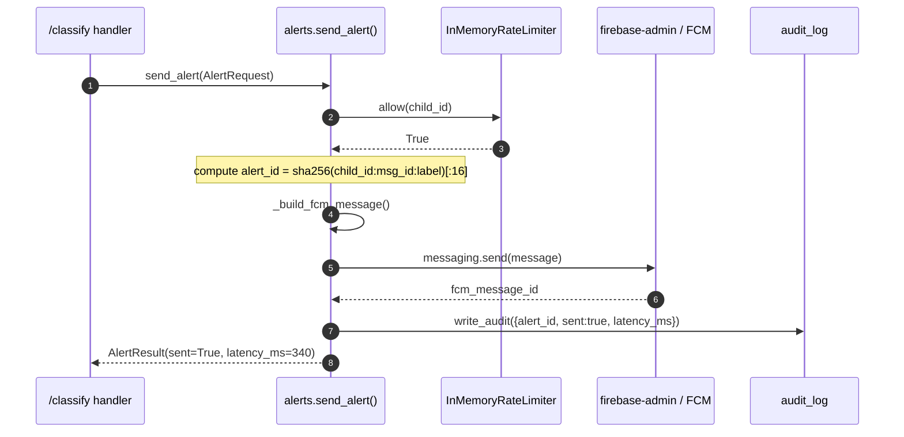
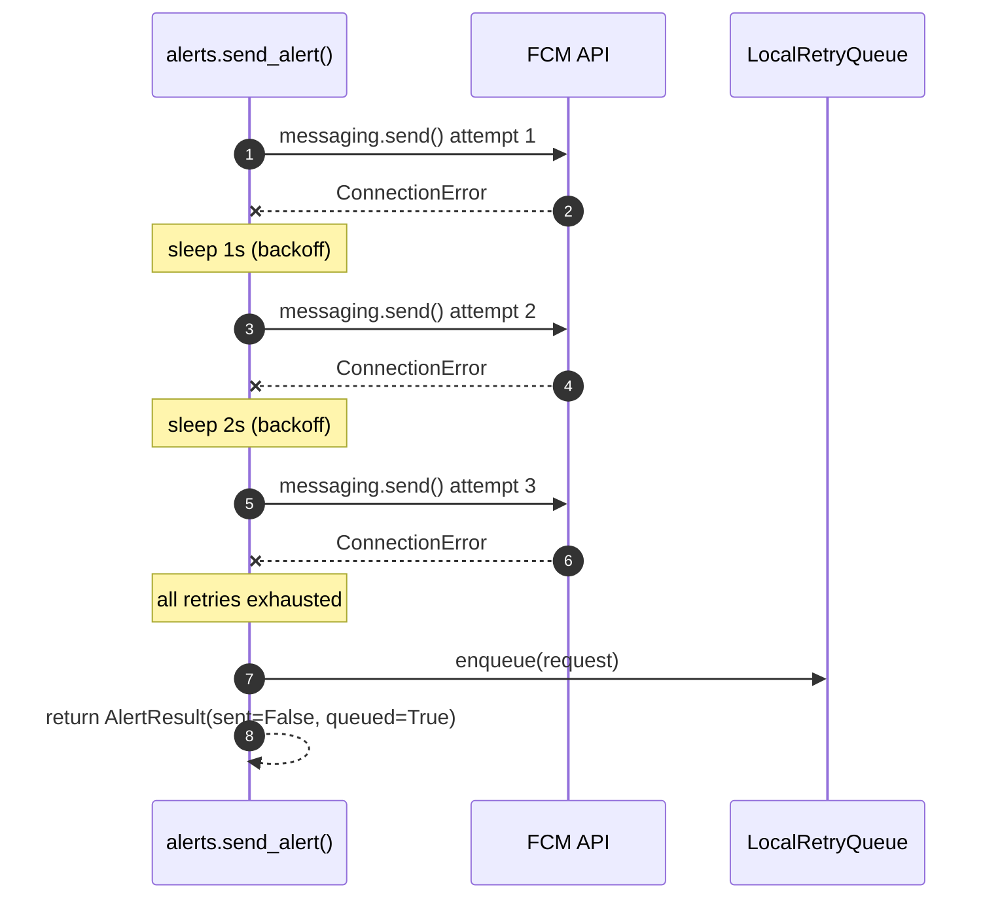
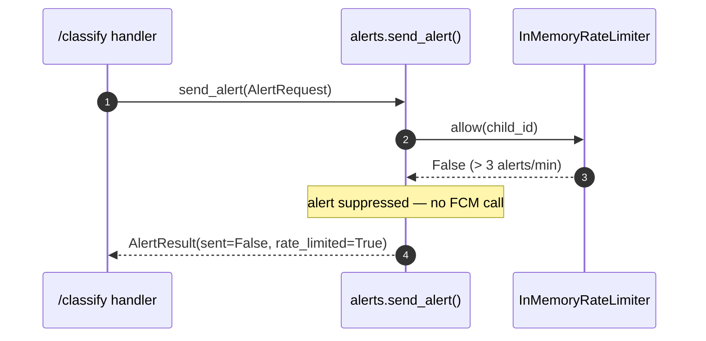

# Alerts / Notification Service — Low-Level Design

**Module ID:** `alerts`
**Owner:** TBD
**Status:** Draft for Meeting 4
**PRD reference:** PRD §8.4, §9 (Latency p99 < 2s for end-to-end notification), §10 (KPIs: Alert Fatigue churn < 3/day)
**Last updated:** 2026-05-31

---

## 1. Purpose & Scope

The Alerts module is the **last step** in the request lifecycle: after the Triage Router or Context Agent decides that a message is a real threat, this module sends a push notification to the parent and records the event in the Audit Log.

Like the Triage Router, this is a **deterministic in-process Python module** — not an LLM agent. PRD §7.1 states explicitly: "Alert can be replaced by deterministic code." This module IS that deterministic code.

Its responsibilities:
1. Build the FCM push payload from an `AlertRequest`
2. Apply rate limiting per parent (anti-storm guard)
3. Compute an idempotency key to prevent duplicate alerts
4. Send via `firebase-admin` SDK (async wrapper)
5. Record the send result to the Audit Log
6. Expose the alert to the dashboard history endpoint
7. Degrade gracefully when FCM is unreachable (local queue + retry)

**Out of scope for this module:**
- Deciding whether to send an alert (Triage/CA decides this)
- Composing the human-readable explanation (Context Agent produces it; Triage produces a template explanation for direct alerts)
- Rendering the dashboard UI (Android client's job)

---

## 2. Public Interface (API Contract / Protocol)

```python
# server/app/alerts/protocol.py
from __future__ import annotations
from typing import Protocol, runtime_checkable
from ..schemas import AlertRequest, AlertResult


@runtime_checkable
class NotificationService(Protocol):
    """Send an alert push notification to a parent device.

    Implementations must be safe to call from an async context.
    Never raises — failures are captured in AlertResult.
    """

    async def send_alert(self, request: AlertRequest) -> AlertResult:
        ...

    async def get_alert_history(
        self,
        child_id: str,
        limit: int = 50,
    ) -> list[AlertResult]:
        ...
```

**`AlertRequest`** (new Pydantic model, added to `server/app/schemas.py`):

```python
class AlertRequest(BaseModel):
    child_id: str = Field(..., description="Opaque child identifier (no PII)")
    parent_fcm_token: str = Field(..., description="FCM registration token for parent device")
    message_id: str = Field(..., description="Unique ID of the classified message")
    label: Category
    severity: Literal["low", "medium", "high", "critical"]
    explanation: str = Field(..., max_length=280, description="1-sentence explanation for parent")
    quote: str = Field(..., max_length=200, description="Truncated message excerpt (no full text)")
    child_name: str = Field(..., max_length=50, description="Display name only — no other PII")
    source: Literal["frontline_direct", "context_agent", "fallback_review"]
    trace_id: str = Field(..., description="Propagated from Gatekeeper for end-to-end correlation")
```

**`AlertResult`** (new Pydantic model):

```python
class AlertResult(BaseModel):
    alert_id: str                          # idempotency key (see §3)
    sent: bool
    queued: bool = False                   # True when FCM was down; queued for retry
    rate_limited: bool = False             # True when suppressed by rate limiter
    fcm_message_id: str | None = None      # FCM-assigned message ID on success
    latency_ms: int
    error: str | None = None
    timestamp: datetime
```

---

## 2.5 Interface boundary & isolation guarantees

The Alerts module exposes **two Protocols** — separating delivery (how the push is sent) from anti-storm protection (when a push is allowed). This split lets you swap FCM for SMS without rewriting the rate limiter, and swap the in-memory limiter for Redis without touching FCM logic.

### Port 1 — `NotificationChannel` (delivery port)

```python
# server/app/alerts/protocol.py
from typing import Protocol, runtime_checkable

@runtime_checkable
class NotificationChannel(Protocol):
    async def send_alert(self, request: "AlertRequest") -> "AlertResult":
        """Send an alert. Never raises — failures captured in AlertResult.
        Must be idempotent on alert_id: same request → same alert_id → at-most-once delivery."""
        ...

    async def get_alert_history(
        self, child_id: str, limit: int = 50
    ) -> list["AlertResult"]: ...

    def health_status(self) -> dict:
        """For /health endpoint: {'status': 'ok'|'degraded', 'queued_alerts': N}."""
        ...
```

| Adapter | When to use | Lines to change to enable |
|---|---|---|
| `FcmNotifier` | Default — Firebase Cloud Messaging via `firebase-admin` (the `FCMNotificationService` in §3) | (default — already wired) |
| `SmsNotifier` | Carrier fallback (Twilio / AWS SNS) when parents disable FCM or for non-FCM regions | one line in `main.py` `lifespan()`; add Twilio creds to `.env` |
| `EmailNotifier` | Low-urgency digest mode (daily roll-up) or as a tertiary fallback when FCM + SMS both fail | one line + SMTP settings |
| `WebhookNotifier` | 3rd-party integrations (school counselor dashboard per business plan §5) — HTTP POST to a configured URL with `AlertRequest` JSON | one line + `WEBHOOK_URL` env var |
| `StubNotifier` | Tests; records calls in-memory; no FCM connection needed | injected by test fixture |

### Port 2 — `AlertRateLimiter` (anti-storm guard port)

```python
# server/app/alerts/rate_limiter.py
from typing import Protocol

class AlertRateLimiter(Protocol):
    def allow(self, key: str) -> bool:
        """True if a new alert for `key` (e.g. child_id) is permitted under
        the per-key sliding window; False if suppressed."""
        ...
```

| Adapter | When to use | Lines to change to enable |
|---|---|---|
| `InMemoryAlertRateLimiter` | Default — the deque-based sliding window in §3 (`InMemoryRateLimiter`); single-process | (default) |
| `RedisAlertRateLimiter` | Multi-replica / horizontally scaled deployment — shared rate-limit state across server instances | one line + Redis URL |
| `NoOpAlertRateLimiter` | Diagnostic / load-test mode where you intentionally want all alerts through | one line |
| `StubAlertRateLimiter` | Tests — `allow()` is patched per case | injected by test fixture |

The `FcmNotifier` is **composed** with an `AlertRateLimiter` (constructor-injected), not coupled to a concrete implementation. The rate limiter swaps independently of the channel.

**Isolation rules (what this module MAY and MUST NOT touch):**
- May import: stdlib (`hashlib`, `asyncio`, `time`, `collections.deque`), `firebase-admin`, `structlog`, `prometheus_client`, `pydantic`, this module's settings, and the `AlertRequest` / `AlertResult` / `Category` shared schema.
- MUST NOT import: any concrete adapter from another module — no classifier, OCR, triage, or context_agent class.
- MUST NOT import: `server.app.main` or anything in the composition root.
- May import the shared audit-write function (`server/app/audit.py` `write_audit()`) — audit is a cross-cutting concern, not a business module.

**Contract tests (two suites — one per Protocol):**
- `tests/contracts/test_notification_channel_contract.py` — parametrized over `FcmNotifier`, `SmsNotifier`, `EmailNotifier`, `WebhookNotifier`, `StubNotifier`. Asserts: (a) `send_alert` never raises; failures appear as `AlertResult(sent=False, error=...)`, (b) idempotency: same `AlertRequest` → same `alert_id` → second `send_alert` does not produce a duplicate delivery, (c) `health_status()` returns the documented schema, (d) p99 latency budget per adapter.
- `tests/contracts/test_alert_rate_limiter_contract.py` — parametrized over `InMemoryAlertRateLimiter`, `RedisAlertRateLimiter`, `NoOpAlertRateLimiter`. Asserts: (a) `allow(key)` returns `True` for the first `max_alerts` within `window_seconds`, `False` thereafter, (b) per-key isolation (one child's limit does not affect another's), (c) thread-safety (concurrent `allow()` calls do not over-count).

**Swap demo 1 — FCM → SMS:**

```python
# Before — server/app/main.py lifespan()
rate_limiter: AlertRateLimiter = InMemoryAlertRateLimiter(settings.alerts)
notifier: NotificationChannel = FcmNotifier(settings.alerts, rate_limiter)

# After
notifier: NotificationChannel = SmsNotifier(settings.alerts, rate_limiter)
```

The `/classify` handler, the triage decision logic, and the audit log all keep working unchanged.

**Swap demo 2 — In-memory rate limiter → Redis (the rate limiter swap is independent of the channel):**

```python
# Before
rate_limiter: AlertRateLimiter = InMemoryAlertRateLimiter(settings.alerts)
notifier: NotificationChannel = FcmNotifier(settings.alerts, rate_limiter)

# After
rate_limiter: AlertRateLimiter = RedisAlertRateLimiter(settings.alerts.redis_url)
notifier: NotificationChannel = FcmNotifier(settings.alerts, rate_limiter)  # unchanged
```

---

## 3. Internal Design

### Package Layout

```
server/app/alerts/
├── __init__.py          # exports: FCMNotificationService, AlertRequest, AlertResult
├── protocol.py          # NotificationService Protocol (see §2)
├── service.py           # FCMNotificationService — concrete implementation
├── rate_limiter.py      # InMemoryRateLimiter (per-parent sliding window)
├── retry_queue.py       # LocalRetryQueue (in-process deque + background task)
└── settings.py          # AlertSettings (pydantic-settings)
```

### Key Class: `FCMNotificationService`

```python
# server/app/alerts/service.py
from __future__ import annotations
import asyncio
import hashlib
import structlog
from datetime import datetime, timezone
from firebase_admin import messaging
from prometheus_client import Counter, Histogram
from ..schemas import AlertRequest, AlertResult
from ..audit import write_audit
from .rate_limiter import InMemoryRateLimiter
from .retry_queue import LocalRetryQueue
from .settings import AlertSettings

log = structlog.get_logger("shomer.alerts")

_SEND_LATENCY = Histogram(
    "alert_send_latency_seconds",
    "FCM send latency in seconds",
    buckets=[0.05, 0.1, 0.25, 0.5, 1.0, 2.0, 5.0],
)
_SEND_FAILURES = Counter(
    "alert_send_failures_total",
    "FCM send failures by reason",
    ["reason"],
)
_SEND_SUCCESS = Counter(
    "alert_send_success_total",
    "Successful FCM sends",
)
_RATE_LIMITED = Counter(
    "alert_rate_limited_total",
    "Alerts suppressed by per-parent rate limiter",
)


class FCMNotificationService:
    def __init__(
        self,
        settings: AlertSettings,
        rate_limiter: InMemoryRateLimiter,
        retry_queue: LocalRetryQueue,
    ) -> None:
        self._s = settings
        self._rl = rate_limiter
        self._rq = retry_queue

    # ------------------------------------------------------------------
    # Public API
    # ------------------------------------------------------------------

    async def send_alert(self, request: AlertRequest) -> AlertResult:
        started = asyncio.get_event_loop().time()
        alert_id = _compute_alert_id(request)

        bound_log = log.bind(
            trace_id=request.trace_id,
            alert_id=alert_id,
            child_id=request.child_id,
            label=request.label,
            severity=request.severity,
        )

        # 1. Rate limit check
        if not self._rl.allow(request.child_id):
            _RATE_LIMITED.inc()
            bound_log.warning("alerts.rate_limited")
            return AlertResult(
                alert_id=alert_id,
                sent=False,
                rate_limited=True,
                latency_ms=_elapsed_ms(started),
                timestamp=datetime.now(timezone.utc),
            )

        # 2. Build FCM payload
        fcm_message = _build_fcm_message(request, alert_id, self._s)

        # 3. Attempt send with retry
        result = await self._send_with_retry(fcm_message, request, alert_id, started)

        # 4. Write audit record
        _write_alert_audit(request, result)

        return result

    async def get_alert_history(
        self,
        child_id: str,
        limit: int = 50,
    ) -> list[AlertResult]:
        """Return recent alerts for a child from the audit log.

        Implementation reads from SQLite audit.db (see server design.md §6b).
        Placeholder for Meeting 7 — returns empty list until DB query is wired.
        """
        return []

    # ------------------------------------------------------------------
    # Internal helpers
    # ------------------------------------------------------------------

    async def _send_with_retry(
        self,
        message: messaging.Message,
        request: AlertRequest,
        alert_id: str,
        started: float,
    ) -> AlertResult:
        """Send with exponential backoff: 1s / 2s / 4s, 3 attempts."""
        last_error: str | None = None
        for attempt in range(self._s.max_retry_attempts):
            try:
                fcm_id = await asyncio.get_event_loop().run_in_executor(
                    None, messaging.send, message
                )
                latency = _elapsed_ms(started)
                _SEND_LATENCY.observe(latency / 1000)
                _SEND_SUCCESS.inc()
                log.info(
                    "alerts.sent",
                    trace_id=request.trace_id,
                    alert_id=alert_id,
                    attempt=attempt + 1,
                    latency_ms=latency,
                )
                return AlertResult(
                    alert_id=alert_id,
                    sent=True,
                    fcm_message_id=fcm_id,
                    latency_ms=latency,
                    timestamp=datetime.now(timezone.utc),
                )
            except Exception as exc:  # noqa: BLE001
                last_error = str(exc)
                _SEND_FAILURES.labels(reason=type(exc).__name__).inc()
                log.warning(
                    "alerts.send_attempt_failed",
                    trace_id=request.trace_id,
                    alert_id=alert_id,
                    attempt=attempt + 1,
                    error=last_error,
                )
                if attempt < self._s.max_retry_attempts - 1:
                    delay = self._s.retry_base_seconds * (2 ** attempt)
                    await asyncio.sleep(delay)

        # All retries exhausted → enqueue for next /classify trigger
        self._rq.enqueue(request)
        log.error(
            "alerts.send_failed_queued",
            trace_id=request.trace_id,
            alert_id=alert_id,
            error=last_error,
        )
        return AlertResult(
            alert_id=alert_id,
            sent=False,
            queued=True,
            latency_ms=_elapsed_ms(started),
            error=last_error,
            timestamp=datetime.now(timezone.utc),
        )
```

### FCM Payload Schema

```python
def _build_fcm_message(
    request: AlertRequest,
    alert_id: str,
    settings: AlertSettings,
) -> messaging.Message:
    """Construct the FCM message to be delivered to the parent's device.

    Title / body use Hebrew strings — Android renders them in the system notification shade.
    Data payload carries machine-readable fields for the deep-link handler.
    """
    severity_icon = {
        "low": "🟡",
        "medium": "🟠",
        "high": "🔴",
        "critical": "🚨",
    }.get(request.severity, "🔔")

    title = f"{severity_icon} Shomer.AI — {request.child_name}"
    body = request.explanation  # 1-sentence explanation from CA or template

    return messaging.Message(
        notification=messaging.Notification(title=title, body=body),
        data={
            "alert_id": alert_id,
            "child_id": request.child_id,
            "message_id": request.message_id,
            "label": request.label,
            "severity": request.severity,
            "quote": request.quote,
            "source": request.source,
            "trace_id": request.trace_id,
            # Deep-link: opens AlertDetailScreen in the parent Android app
            "deep_link": f"shomer://alert/{alert_id}",
        },
        token=request.parent_fcm_token,
        android=messaging.AndroidConfig(
            priority="high",
            notification=messaging.AndroidNotification(
                channel_id=settings.fcm_channel_id,
                priority="high",
            ),
        ),
    )
```

### Idempotency Key

```python
def _compute_alert_id(request: AlertRequest) -> str:
    """Deterministic hash: child_id + message_id + label.

    Same inputs → same alert_id regardless of retry attempt.
    Allows the Android parent app to deduplicate duplicate pushes.
    """
    raw = f"{request.child_id}:{request.message_id}:{request.label}"
    return hashlib.sha256(raw.encode()).hexdigest()[:16]
```

This key is stored in `data.alert_id` in the FCM payload so the parent Android app's notification receiver can call `NotificationManager.cancel(alertId)` on duplicates.

### Rate Limiter

```python
# server/app/alerts/rate_limiter.py
from __future__ import annotations
import time
from collections import deque
from threading import Lock


class InMemoryRateLimiter:
    """Sliding-window rate limiter: max N alerts per T seconds per child_id.

    Thread-safe. Stores deques of timestamps per parent/child key.
    Memory bound: O(N * number_of_active_children) — trivial at MVP scale.
    """

    def __init__(self, max_alerts: int, window_seconds: int) -> None:
        self._max = max_alerts
        self._window = window_seconds
        self._windows: dict[str, deque[float]] = {}
        self._lock = Lock()

    def allow(self, key: str) -> bool:
        now = time.monotonic()
        with self._lock:
            dq = self._windows.setdefault(key, deque())
            # Evict old timestamps
            while dq and now - dq[0] > self._window:
                dq.popleft()
            if len(dq) >= self._max:
                return False
            dq.append(now)
            return True
```

Default: `max_alerts=3`, `window_seconds=60` — no more than 3 alerts per minute per child. Configurable via `AlertSettings`.

### Retry Queue (Degraded Mode)

```python
# server/app/alerts/retry_queue.py
from __future__ import annotations
from collections import deque
from ..schemas import AlertRequest


class LocalRetryQueue:
    """In-process deque of failed AlertRequests.

    When FCM is down, failed sends are enqueued here.
    The /classify handler drains this queue before processing a new request.
    Max capacity = MAX_QUEUE_SIZE (default 100). Oldest items dropped when full.
    """

    def __init__(self, max_size: int = 100) -> None:
        self._q: deque[AlertRequest] = deque(maxlen=max_size)

    def enqueue(self, request: AlertRequest) -> None:
        self._q.append(request)

    def drain(self) -> list[AlertRequest]:
        items = list(self._q)
        self._q.clear()
        return items

    def size(self) -> int:
        return len(self._q)
```

The `/classify` handler calls `retry_queue.drain()` at the start of each request and re-enqueues any that fail again. This "piggyback retry" avoids a background thread at MVP cost — acceptable because alert delivery is best-effort during outages.

---

## 4. Sequence Diagrams

### Happy Path — Alert Sent



### FCM Down — Retry and Queue



### Rate Limited Path



---

## 5. Data Model

### Firebase Admin Initialization

```python
# server/app/alerts/service.py — called once in lifespan()
import firebase_admin
from firebase_admin import credentials

def init_firebase(service_account_path: str | None) -> None:
    if not firebase_admin._apps:
        if service_account_path:
            cred = credentials.Certificate(service_account_path)
        else:
            # Application Default Credentials (for CI/cloud environments)
            cred = credentials.ApplicationDefault()
        firebase_admin.initialize_app(cred)
```

### Audit Record Written Per Alert

Each successful or failed alert attempt appends an entry to `audit-YYYY-MM-DD.jsonl` via `write_audit()`:

```json
{
  "ts": "2026-05-31T10:14:22.500Z",
  "request_id": "b3d2f1a0-...",
  "module": "alerts",
  "event": "alert_sent",
  "alert_id": "3f7a9c12e4b80d21",
  "child_id": "child_abc",
  "label": "violence",
  "severity": "high",
  "source": "context_agent",
  "fcm_message_id": "projects/shomer/messages/0:168...",
  "sent": true,
  "queued": false,
  "rate_limited": false,
  "latency_ms": 340
}
```

### Dashboard History Table (SQLite `audit.db`)

For the `/alerts/history` endpoint (Meeting 7):

```sql
CREATE TABLE IF NOT EXISTS alert_history (
    alert_id        TEXT PRIMARY KEY,
    child_id        TEXT NOT NULL,
    message_id      TEXT NOT NULL,
    label           TEXT NOT NULL,
    severity        TEXT NOT NULL,
    explanation     TEXT NOT NULL,
    quote           TEXT NOT NULL,
    source          TEXT NOT NULL,
    sent            INTEGER NOT NULL,   -- BOOLEAN (0/1)
    queued          INTEGER NOT NULL,
    rate_limited    INTEGER NOT NULL,
    fcm_message_id  TEXT,
    latency_ms      INTEGER,
    timestamp       TEXT NOT NULL,      -- ISO 8601 UTC
    trace_id        TEXT NOT NULL
);
CREATE INDEX IF NOT EXISTS idx_alert_child_ts ON alert_history(child_id, timestamp DESC);
```

Retention: 7 days rolling window (same as `audit.db` — see server `design.md` §6b).

---

## 6. Observability (Logger / Config / Metrics)

### Logger

Module logger: `structlog.get_logger("shomer.alerts")`

**Three example log lines:**

```json
{"trace_id": "b3d2f1a0", "module": "alerts", "event": "alerts.sent", "alert_id": "3f7a9c12", "child_id": "child_abc", "label": "violence", "severity": "high", "attempt": 1, "latency_ms": 340, "timestamp": "2026-05-31T10:14:22.500Z"}
```

```json
{"trace_id": "c9e4a7f2", "module": "alerts", "event": "alerts.rate_limited", "alert_id": "a1b2c3d4", "child_id": "child_xyz", "timestamp": "2026-05-31T10:14:23.100Z"}
```

```json
{"trace_id": "d1b5e309", "module": "alerts", "event": "alerts.send_failed_queued", "alert_id": "ff001122", "child_id": "child_pqr", "error": "ConnectionError: [Errno 111]", "timestamp": "2026-05-31T10:14:28.880Z"}
```

### Config

**`AlertSettings`** (pydantic-settings):

| Name | Type | Default | Env Var | Description | Secret? |
|---|---|---|---|---|---|
| `fcm_service_account_path` | `str \| None` | `None` | `FCM_SERVICE_ACCOUNT_PATH` | Path to Firebase service account JSON | **Yes** |
| `fcm_channel_id` | `str` | `"shomer_alerts"` | `FCM_CHANNEL_ID` | Android notification channel ID | No |
| `max_retry_attempts` | `int` | `3` | `ALERTS_MAX_RETRY_ATTEMPTS` | FCM retry attempts before queuing | No |
| `retry_base_seconds` | `float` | `1.0` | `ALERTS_RETRY_BASE_SECONDS` | Exponential backoff base (1s/2s/4s) | No |
| `rate_limit_max_alerts` | `int` | `3` | `ALERTS_RATE_LIMIT_MAX` | Max alerts per window per child | No |
| `rate_limit_window_seconds` | `int` | `60` | `ALERTS_RATE_LIMIT_WINDOW_S` | Sliding window size in seconds | No |
| `queue_max_size` | `int` | `100` | `ALERTS_QUEUE_MAX_SIZE` | Max queued failed alerts (oldest dropped) | No |

```python
# server/app/alerts/settings.py
from pydantic_settings import BaseSettings

class AlertSettings(BaseSettings):
    fcm_service_account_path: str | None = None
    fcm_channel_id: str = "shomer_alerts"
    max_retry_attempts: int = 3
    retry_base_seconds: float = 1.0
    rate_limit_max_alerts: int = 3
    rate_limit_window_seconds: int = 60
    queue_max_size: int = 100

    model_config = {"env_prefix": "ALERTS_", "env_file": ".env"}
```

Note: `FCM_SERVICE_ACCOUNT_PATH` uses `FCM_` prefix (not `ALERTS_`) because it is a Firebase-level credential, not an alerts-behavior setting. It is listed here as the owner of this credential at the module level.

### Metrics

| Metric name | Type | Labels | NFR it covers |
|---|---|---|---|
| `alert_send_latency_seconds` | Histogram | — | PRD §9: p99 < 2s notification delivery |
| `alert_send_failures_total` | Counter | `reason` (exception class name) | Operational — FCM reliability monitoring |
| `alert_send_success_total` | Counter | — | Operational — throughput |
| `alert_rate_limited_total` | Counter | — | Product KPI: Alert Fatigue churn |
| `alert_queue_depth` | Gauge | — | Degraded-mode monitoring |

---

## 7. NFR Targets & Test Plan

| NFR (PRD §9) | Alerts target | How verified |
|---|---|---|
| Notification latency p99 < 2s | FCM SDK call < 1.5s p99 in normal conditions; total pipeline (classify → alert) < 2s | Load test: 100 concurrent `/classify` with alert trigger; measure `alert_send_latency_seconds` p99 |
| Availability (Context Agent) ≥ 95% | FCM outage: alerts queue locally, deliver on next request | Integration test: mock FCM to fail; assert queue fills + drains on subsequent request |
| Privacy: no PII to external | `quote` field max 200 chars, no full message text; `child_id` opaque | Code review; no email/phone/name in FCM data payload |

**Test plan:**

```
tests/unit/alerts/
├── test_idempotency.py         # same inputs → same alert_id
├── test_rate_limiter.py        # allow() true for first N, false after
├── test_retry_queue.py         # enqueue + drain semantics; maxlen behavior
├── test_payload_schema.py      # FCM message fields; deep-link format
├── test_send_success.py        # mock firebase_admin.messaging.send → success
└── test_send_failure.py        # mock all retries fail → queued=True

tests/integration/alerts/
├── test_alert_pipeline.py      # full /classify → triage → alert with FCM mock
└── test_degraded_mode.py       # FCM down → /health shows degraded; queue drains on next call
```

**p99 < 2s test procedure:**
1. Start server with real FCM credentials (or emulator)
2. Send 1,000 POST `/classify` requests that are tuned to produce `ALERT_DIRECT`
3. Query `alert_send_latency_seconds` histogram: assert p99 ≤ 1.5s
4. Add network route to FastAPI `/classify` p99 overhead (expected < 300ms) → total ≤ 2s

---

## 8. Failure Modes & Fallbacks

| Failure | Behavior | Log event | `/health` effect |
|---|---|---|---|
| FCM returns error on send | Retry (1s/2s/4s backoff); after 3 failures → queue + `AlertResult(queued=True)` | `alerts.send_attempt_failed` / `alerts.send_failed_queued` | `alerts_degraded: true` |
| Firebase not initialized (missing creds) | `send_alert` returns `AlertResult(sent=False, error="firebase not initialized")` | `alerts.firebase_not_initialized` | `alerts_degraded: true` |
| Rate limit triggered | Suppressed silently; `AlertResult(rate_limited=True)` | `alerts.rate_limited` | No effect |
| Queue full (> 100 items) | Oldest item dropped (deque maxlen behavior) | `alerts.queue_overflow` | No effect on `/health` |
| `AlertRequest` validation fails (bad FCM token) | FastAPI 422 before `send_alert` is called | — | No effect |

**`/health` degraded mode:** When `retry_queue.size() > 0`, the server's `/health` response includes:

```json
{
  "status": "degraded",
  "alerts": {
    "status": "degraded",
    "queued_alerts": 12,
    "reason": "FCM unreachable — alerts queued for retry"
  }
}
```

This surfaces to the parent's Dashboard "connection status" indicator (Meeting 7 UX).

---

## 9. Deployment & Config

`AlertSettings` is constructed in `lifespan()` and stored on `app.state.alert_settings`. `FCMNotificationService` is constructed and stored on `app.state.notification_service`.

Firebase service account JSON must **never** be committed to git. It is supplied at runtime:

```dotenv
# .env (gitignored)
FCM_SERVICE_ACCOUNT_PATH=/run/secrets/firebase_service_account.json
ALERTS_RATE_LIMIT_MAX=3
ALERTS_RATE_LIMIT_WINDOW_S=60
ALERTS_MAX_RETRY_ATTEMPTS=3
ALERTS_RETRY_BASE_SECONDS=1.0
```

For local development without Firebase:

```dotenv
FCM_SERVICE_ACCOUNT_PATH=       # empty → alerts log "firebase not configured" + skip FCM
```

The service gracefully degrades to no-op when `FCM_SERVICE_ACCOUNT_PATH` is unset, so the classification pipeline works without Firebase setup during early development.

---

## 10. Future Extraction Seam

The `NotificationService` Protocol is the extraction point.

**SMS / email fallback channel:** Implement `SMSNotificationService(NotificationService)` using Twilio or AWS SNS. The lifespan wiring swaps the concrete class — zero caller changes.

**Webhook delivery for schools:** Future third-party (school counselor dashboard) integration — implement `WebhookNotificationService` that HTTP POSTs to a configured URL instead of FCM. Same Protocol, same caller.

**Dedicated alert microservice:** Create `RemoteNotificationService` that wraps an HTTP call. In `lifespan()`, replace `FCMNotificationService(...)` with `RemoteNotificationService(url, timeout)`. No other changes.

---

## 11. Open Questions

| # | Question | Target meeting |
|---|---|---|
| OQ-A1 | Push notification format (title, body Hebrew text, truncation rules) — PRD open_questions.md Q3 | UX session before Meeting 7 |
| OQ-A2 | What does the parent's Dashboard history screen show per alert? (timestamp, label, severity, quote, explanation, child_name) | UX session before Meeting 7 |
| OQ-A3 | Should rate-limited alerts be surfaced to the parent later (batch summary)? Or simply dropped? | UX session before Meeting 7 |
| OQ-A4 | Quiet hours / DND controls — PRD open_questions.md Q7. Does DND suppress FCM entirely or batch into a morning digest? | UX session before Meeting 7 |
| OQ-A5 | Multi-child support: rate limiter currently keys on `child_id`. Family account (PRD open_questions.md Q6) needs per-parent-across-children logic | Before Meeting 5 |
