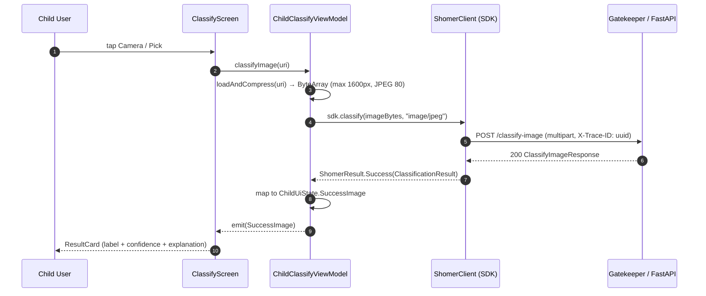
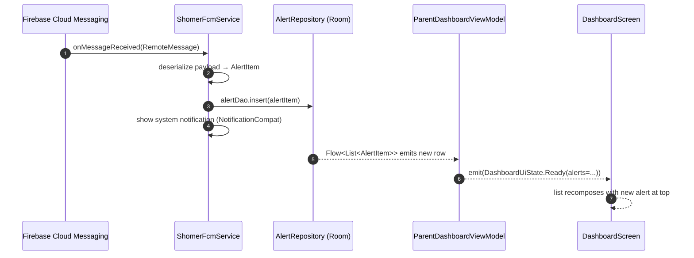

# Android Client — Low-Level Design

**Module ID:** android-client
**Owner:** TBD
**Status:** Draft for Meeting 4
**PRD reference:** PRD §8.6 (Client SDK), §8.4 (Notification Service), §3 (Personas)
**Last updated:** 2026-05-31

---

## 1. Purpose & scope

The Android Client module is the single on-device application that ships as two distinct product flavors sharing one codebase: **Child Client** (runs silently on the child's phone, captures and classifies messages and screenshots, displays only a minimal status UI) and **Parent Client** (runs on the parent's phone, shows the dashboard, alert history, and receives FCM push notifications when a threat is detected). Both flavors call the FastAPI server exclusively through the **Shomer.AI SDK** (`server/sdk/kotlin/`).

This module owns all UI screens, ViewModel state machines, permission flows (CAMERA, POST_NOTIFICATIONS, READ_MEDIA_IMAGES), the DataStore-backed settings layer, the image compress-and-upload pipeline, the FCM token registration for the parent flavor, and the offline UX (graceful degradation when the server is unreachable). It does **not** own the HTTP wire format, retry logic, or error-code translation — those belong to the SDK (see `docs/design/sdk/design.md`). It does **not** own the server-side classification logic.

---

## 2. Public interface (API contract)

### 2.1 ViewModel → Screen contracts

Each screen is a stateless `@Composable` that takes a sealed `UiState` flow from its ViewModel and dispatches intent functions back to it. No screen holds business logic.

#### ChildClassifyViewModel

```kotlin
// File: viewmodel/ChildClassifyViewModel.kt
sealed interface ChildUiState {
    data object Idle : ChildUiState
    data object Loading : ChildUiState
    data class SuccessText(val result: ClassificationResult) : ChildUiState
    data class SuccessImage(val result: ClassificationResult) : ChildUiState
    data class Error(val message: String) : ChildUiState
}

class ChildClassifyViewModel : ViewModel() {
    val state: StateFlow<ChildUiState>
    fun classifyText(text: String)
    fun classifyImage(uri: Uri)
    fun reset()
}
```

#### ParentDashboardViewModel

```kotlin
// File: viewmodel/ParentDashboardViewModel.kt
data class AlertItem(
    val id: String,
    val timestamp: Instant,
    val label: String,          // "abusive" | "hate" | etc.
    val severity: String,       // "low" | "medium" | "high"
    val explanation: String,
    val quote: String,
    val contextUsed: Boolean,
    val reviewFlag: Boolean
)

sealed interface DashboardUiState {
    data object Loading : DashboardUiState
    data class Ready(val alerts: List<AlertItem>, val serverHealthy: Boolean) : DashboardUiState
    data class Error(val message: String) : DashboardUiState
}

class ParentDashboardViewModel : ViewModel() {
    val state: StateFlow<DashboardUiState>
    fun refresh()
    fun dismissAlert(id: String)
}
```

#### SettingsViewModel

```kotlin
// File: viewmodel/SettingsViewModel.kt  (replaces current SettingsRepository direct usage in SettingsScreen)
data class SettingsUiState(
    val serverUrl: String,
    val connectionStatus: ConnectionStatus
)
enum class ConnectionStatus { Untested, Testing, Ok, Failed }

class SettingsViewModel : ViewModel() {
    val state: StateFlow<SettingsUiState>
    fun updateServerUrl(url: String)
    fun save()
    fun testConnection()
}
```

### 2.2 Product flavor entry points

```
android_client/
  app/src/
    main/     — shared code (SDK wiring, settings, image pipeline)
    child/    — flavor: ChildActivity, ChildClassifyScreen (minimal "sending..." UI)
    parent/   — flavor: ParentActivity, DashboardScreen, HistoryScreen, AlertDetailScreen
```

---

## 2.5 Interface boundary & isolation guarantees

**The Port (Protocol):** `ClassificationSource` — the ONLY symbol ViewModels import to call the backend. ViewModels never reference `ShomerClient` directly; they depend on this Kotlin `interface` and Hilt binds the production adapter at `AppModule` time.

```kotlin
// data/ClassificationSource.kt — the port
interface ClassificationSource {
    suspend fun classifyText(text: String): ClassificationResult
    suspend fun classifyImage(bytes: ByteArray, mimeType: String): ClassificationResult
    suspend fun health(): HealthResult
}
```

This is the Android-side mirror of the server-side hexagonal pattern: ViewModels (the "application core" of the client) depend on a domain-language interface, and the transport (HTTP via SDK, WebSocket, on-device ML Kit, gRPC) is an adapter selected at composition time in `AppModule`.

**Concrete adapters that satisfy this interface:**

| Adapter | When to use | Lines to change to enable |
|---|---|---|
| `SdkClassificationSource` | Default — wraps `ShomerClient` from the Kotlin SDK; HTTP to FastAPI server | (default — bound in `AppModule`) |
| `MockClassificationSource` | Unit / Robolectric tests; ViewModel tests under JVM; fixture-driven responses | injected via `@TestInstallIn(SingletonComponent::class)` test module |
| `FutureWebsocketSource` | Phase 9+ — push-based classification (server emits via WS instead of poll/request) | one line in `AppModule`; new SDK class implementing `ClassificationSource` |
| `OnDeviceMlKitSource` | Stretch — fully on-device classification using ML Kit / TFLite (PRD §11 — privacy upgrade) | one line + model asset bundling |

**Isolation rules (what this module MAY and MUST NOT touch):**
- ViewModels MAY import: `ClassificationSource` interface (the port), the SDK's data classes (`ClassificationResult`, `HealthResult`), Kotlin coroutines, AndroidX ViewModel/StateFlow, Hilt scopes.
- ViewModels MUST NOT import: `com.shomer.sdk.ShomerClient` directly, `OkHttpClient`, `Retrofit`, `Moshi`, or any transport detail. The whole point is that ViewModels are transport-blind.
- Composables (Screens) MUST NOT import: anything from `data/` except the port; UI never reaches into HTTP, SDK, or Room directly.
- `AppModule` (the composition root) is the ONLY file allowed to instantiate `SdkClassificationSource` and bind it to `ClassificationSource`.
- The `parent` flavor MAY import FCM-related classes; the `child` flavor MUST NOT — enforced by product-flavor source-set boundaries (see §3.3).

**Contract test:** `androidTest/ClassificationSourceContractTest.kt` (instrumented) and `test/ClassificationSourceContractTest.kt` (Robolectric). Every adapter is parametrized through this suite. Fixtures provide: a benign text, an offensive text, a clean image, an unreadable image. The suite asserts: (a) `classifyText` returns a non-null `ClassificationResult` for valid input, (b) the `ShomerError`-mapped failure path is exposed as a typed exception (`ShomerError.NetworkError` etc.) so the ViewModel can pattern-match, (c) `health()` returns within 2 s, (d) no PII (full message text) is logged at INFO level by any adapter.

**Swap demo — SDK HTTP → Mock for ViewModel tests:**

```kotlin
// Production — di/AppModule.kt
@Module
@InstallIn(SingletonComponent::class)
object AppModule {
    @Provides @Singleton
    fun provideClassificationSource(shomer: ShomerClient): ClassificationSource =
        SdkClassificationSource(shomer)
}

// Test — di/TestAppModule.kt
@Module
@TestInstallIn(components = [SingletonComponent::class], replaces = [AppModule::class])
object TestAppModule {
    @Provides @Singleton
    fun provideClassificationSource(): ClassificationSource =
        MockClassificationSource(fixturePath = "fixtures/classification.json")
}
```

ChildClassifyViewModel, ParentDashboardViewModel, every Composable Screen, and the FCM service all keep working unchanged.

---

## 3. Internal design

### 3.1 Package/file layout (target state — current files noted)

```
android_client/app/src/main/java/com/shomer/client/
├── MainActivity.kt                  EXISTING (com.dima.offensivehebrew) — rename + refactor
├── data/
│   ├── Models.kt                    EXISTING — replaced by SDK data classes in target state
│   ├── ApiService.kt                EXISTING — replaced by ShomerClient (SDK) in target state
│   ├── SettingsRepository.kt        EXISTING — keep, add FCM token storage
│   └── AlertRepository.kt           NEW — local SQLite cache of received alerts (Room)
├── viewmodel/
│   ├── ClassifyViewModel.kt         EXISTING — refactor to ChildClassifyViewModel + use SDK
│   ├── ParentDashboardViewModel.kt  NEW
│   └── SettingsViewModel.kt         NEW (wraps SettingsRepository)
├── ui/
│   ├── ClassifyScreen.kt            EXISTING — keep for child flavor; add alert-explanation card
│   ├── SettingsScreen.kt            EXISTING — keep, wire to SettingsViewModel
│   ├── DashboardScreen.kt           NEW (parent flavor)
│   ├── HistoryScreen.kt             NEW (parent flavor — paginated list of AlertItem)
│   └── AlertDetailScreen.kt         NEW (parent flavor — full explanation + quote)
├── service/
│   └── ShomerFcmService.kt          NEW — FirebaseMessagingService; receives push, writes Room
└── di/
    └── AppModule.kt                 NEW — Hilt module; provides ShomerClient, SettingsRepository
```

**Note on package rename:** current package is `com.dima.offensivehebrew`. Target package for the product build is `com.shomer.client`. The rename can be done in one Gradle step; existing file paths in this document use the current names where files already exist.

### 3.2 Key classes and responsibilities

| Class | Responsibility |
|---|---|
| `MainActivity.kt` | Single Activity; hosts NavHost; registers Timber on startup |
| `ChildClassifyViewModel` | Calls `ShomerClient.classify(text)` / `classify(imageBytes)` via SDK; maps `ShomerResult` → `ChildUiState` |
| `ParentDashboardViewModel` | Reads `AlertRepository` (Room); calls `ShomerClient.health()`; listens for FCM-inserted rows |
| `SettingsRepository` | DataStore wrapper; stores `server_url` (String) and `fcm_token` (String); EXISTING |
| `AlertRepository` | Room DAO over local `alerts` table; insert from FCM service; query from parent dashboard |
| `ShomerFcmService` | Extends `FirebaseMessagingService`; deserializes push payload; writes `AlertItem` to Room; shows system notification |
| `AppModule` | Hilt `@Module`; provides `ShomerClient` built from `SettingsRepository.serverUrl`; binds singletons |

### 3.3 Product flavors vs feature flags

**Recommendation: Product Flavors** (not feature flags) for Child vs Parent.

Rationale: the two clients will eventually be separate APKs submitted to Google Play under different app IDs (`com.shomer.child`, `com.shomer.parent`). Product flavors in Gradle cleanly support this with separate `applicationId`, separate manifests (only the parent requests `POST_NOTIFICATIONS` and FCM; only the child requests `CAMERA`), and separate `res/` (icons, strings). Feature flags within a single APK would ship parent-dashboard code onto the child's phone, which is a privacy risk.

```groovy
// app/build.gradle (excerpt)
android {
    flavorDimensions += "clientType"
    productFlavors {
        child {
            dimension "clientType"
            applicationId "com.shomer.child"
            versionNameSuffix "-child"
        }
        parent {
            dimension "clientType"
            applicationId "com.shomer.parent"
            versionNameSuffix "-parent"
        }
    }
}
```

### 3.4 Internal Protocol seam for future extraction

```kotlin
// data/ClassificationSource.kt — in-process seam
interface ClassificationSource {
    suspend fun classifyText(text: String): ClassificationResult
    suspend fun classifyImage(bytes: ByteArray, mimeType: String): ClassificationResult
    suspend fun health(): HealthResult
}
```

`ChildClassifyViewModel` depends only on `ClassificationSource`, never directly on `ShomerClient`. In production Hilt binds `ShomerClientAdapter : ClassificationSource`. In tests, a `FakeClassificationSource` is injected.

---

## 4. Sequence diagrams (Mermaid)

### 4.1 Child sends image for classification



### 4.2 Parent receives push alert



---

## 5. Data model

### 5.1 DataStore settings keys (SettingsRepository)

| Key | Type | Default | Description |
|---|---|---|---|
| `server_url` | String | `http://10.0.2.2:8000/` | FastAPI server base URL |
| `fcm_token` | String | `""` | FCM registration token (parent flavor only); refreshed on `onNewToken` |

### 5.2 Room — alerts table (parent flavor only)

```kotlin
@Entity(tableName = "alerts")
data class AlertEntity(
    @PrimaryKey val id: String,            // UUID from server push payload
    val timestamp: Long,                   // epoch-millis
    val label: String,                     // classification label
    val severity: String,                  // "low" | "medium" | "high"
    val explanation: String,               // 1-sentence explanation from Context Agent
    val quote: String,                     // triggering message excerpt (PII-stripped server-side)
    val contextUsed: Boolean,              // was Context Agent invoked?
    val reviewFlag: Boolean,               // needs human review (LLM fallback path)
    val dismissedAt: Long? = null          // null = active; non-null = dismissed
)
```

**Retention policy:** `dismissedAt` rows older than 7 days are purged on app start by `AlertRepository.purgeOldDismissed()`. Active alerts (dismissedAt = null) are never auto-purged.

### 5.3 FCM push payload shape (contract with server Notification Service)

```json
{
  "data": {
    "alert_id": "uuid",
    "label": "abusive",
    "severity": "high",
    "explanation": "Hostile language with no playful context.",
    "quote": "תפסיק להיות...",
    "context_used": "true",
    "review_flag": "false"
  }
}
```

Data-only message (not notification message) so the app handles display via `ShomerFcmService` even when in background.

---

## 6. Observability — Logger, Config, Metrics

### 6.1 Logger

**Library:** Timber (Android) with a structured JSON tree in release builds; `DebugTree` in debug.

**Logger name / tag pattern:** `shomer.<module>` — e.g., `shomer.child.classify`, `shomer.parent.dashboard`, `shomer.fcm`.

**Fields on every log line (release JSON tree):**
- `trace_id` — propagated from `ShomerClient` (the `X-Trace-ID` header sent to the server)
- `module` — tag string (e.g., `shomer.child.classify`)
- `event` — semantic event name
- `flavor` — `child` or `parent` (from `BuildConfig.FLAVOR`)

**3 example log lines:**

```json
// Happy path — text classified successfully
{"ts":"2026-06-01T10:22:33Z","trace_id":"a1b2-c3d4","module":"shomer.child.classify","event":"classify_success","label":"non_offensive","confidence":0.93,"latency_ms":245,"flavor":"child"}

// Borderline — context agent was used
{"ts":"2026-06-01T10:23:01Z","trace_id":"e5f6-a7b8","module":"shomer.child.classify","event":"classify_success","label":"abusive","confidence":0.55,"context_used":true,"latency_ms":1820,"flavor":"child"}

// Network failure — offline / server down
{"ts":"2026-06-01T10:24:15Z","trace_id":"c9d0-e1f2","module":"shomer.child.classify","event":"classify_error","error_type":"NetworkError","message":"Cannot reach server","flavor":"child"}
```

### 6.2 Config

| Name | Type | Default | Env var / BuildConfig key | Description | Secret? |
|---|---|---|---|---|---|
| `serverUrl` | String | `http://10.0.2.2:8000/` | DataStore `server_url` | FastAPI base URL; persisted by user | No |
| `connectTimeoutMs` | Long | `10000` | `BuildConfig.CONNECT_TIMEOUT_MS` | OkHttp connect timeout | No |
| `readTimeoutMs` | Long | `60000` | `BuildConfig.READ_TIMEOUT_MS` | OkHttp read timeout (text classify) | No |
| `imageReadTimeoutMs` | Long | `180000` | `BuildConfig.IMAGE_READ_TIMEOUT_MS` | OkHttp read timeout for image classify | No |
| `imageMaxEdgePx` | Int | `1600` | `BuildConfig.IMAGE_MAX_EDGE_PX` | Compress-before-upload max dimension | No |
| `imageJpegQuality` | Int | `80` | `BuildConfig.IMAGE_JPEG_QUALITY` | JPEG quality for upload compression | No |
| `fcmSenderId` | String | — | `google-services.json` / BuildConfig | Firebase project sender ID (parent flavor) | No |
| `alertRetentionDays` | Int | `7` | `BuildConfig.ALERT_RETENTION_DAYS` | Days before dismissed alerts are purged | No |

### 6.3 Metrics

Android Vitals counters are implemented via `android.os.StrictMode` tracking in debug and Firebase Performance Monitoring traces in release. Manual counters use `AtomicLong` in ViewModel with periodic flush to Firebase Custom Events.

| Metric name | Type | Labels | What it answers | NFR served |
|---|---|---|---|---|
| `shomer_android_classify_total` | Counter | `flavor`, `input_type` (text/image), `result` (success/error) | How often classify is called and succeeds | Availability ≥ 99% |
| `shomer_android_classify_latency_ms` | Histogram | `flavor`, `input_type` | p50/p95/p99 round-trip latency seen by the app | e2e latency p99 < 5s |
| `shomer_android_network_error_total` | Counter | `flavor`, `error_type` | Frequency of connectivity failures; Alert Fatigue churn signal | Availability |
| `shomer_android_fcm_received_total` | Counter | — (parent flavor only) | Push delivery rate to parent device | Alert delivery < 2s |
| `shomer_android_image_compress_ms` | Histogram | — | On-device compress time; ensures < 500ms before network | e2e latency |

---

## 7. NFR targets & test plan

| NFR (PRD §9) | Module contribution | Test approach | Test file |
|---|---|---|---|
| e2e latency p99 < 5s | UI → SDK → network round-trip; image compress must be < 500ms | Integration test with MockWebServer + 3 image sizes | `test/ClassifyViewModelIntegrationTest.kt` |
| Availability ≥ 99% (frontline) | Offline fallback shows error, does not crash | Robolectric: disconnect MockWebServer → verify Error state | `test/ChildClassifyViewModelOfflineTest.kt` |
| Alert delivery < 2s | FCM → Room → Dashboard recompose | Instrumented test: inject FCM message, measure Room insert → Flow emit → UI | `androidTest/ParentFcmToUiLatencyTest.kt` |
| Privacy: no PII to LLM | No PII fields in request body | Unit test: verify `ShomerClient.classify` payload contains only `text` / `imageBytes` | `test/SdkPayloadTest.kt` |
| Permission denial UX | No crash on CAMERA denial; rationale shown on second denial | Espresso: deny camera, verify no crash; second tap shows rationale dialog | `androidTest/CameraPermissionFlowTest.kt` |
| Offline mode | ClassifyScreen shows "Server unreachable" card | Robolectric + MockWebServer (close server): verify ChildUiState.Error | `test/OfflineBehaviorTest.kt` |

---

## 8. Failure modes & fallbacks

| Failure | Detection | Fallback | User-visible effect |
|---|---|---|---|
| Server unreachable (no Wi-Fi / server down) | `ShomerError.NetworkError` from SDK | Show `ChildUiState.Error` with "Cannot reach server" message | Child: "Server unreachable" card. Parent: dashboard shows "Server offline" banner. |
| CAMERA permission denied | `PackageManager.PERMISSION_DENIED` | Show permission rationale dialog; offer open-settings link (Phase 2+) | Camera button is disabled; gallery picker remains available |
| Image decode failure (corrupt JPEG, HEIC on old API) | `BitmapFactory.decodeStream` returns null | Catch error, emit `ChildUiState.Error("Could not decode image")` | Error card with retry suggestion |
| FCM token refresh | `onNewToken` callback | Write new token to DataStore; server must be notified (Phase 7 server-side) | Transparent; no user action needed |
| FCM message received with malformed payload | JSON parse exception in `ShomerFcmService` | Log warning, skip insert — do not crash | Parent sees no alert for that event; audited server-side |
| Context Agent LLM fallback (server-side) | `ClassificationResult.reviewFlag == true` | Display alert with yellow "Needs human review" badge in parent dashboard | Parent sees special badge indicating manual review recommended |
| Alert retention purge race condition | Room transaction | All purge operations wrapped in Room transaction; no partial deletes | Transparent |

---

## 9. Deployment & config

**Ships as:** Two APKs from one Gradle build:
- `app-child-release.apk` (applicationId `com.shomer.child`) — installed on child's Android phone
- `app-parent-release.apk` (applicationId `com.shomer.parent`) — installed on parent's phone

**Minimum SDK:** 24 (Android 7.0); target SDK: 35 (Android 15).

**Required env vars / build inputs:**
- `google-services.json` in `app/src/parent/` (parent flavor only) — Firebase config for FCM
- `BuildConfig.SERVER_URL_DEFAULT` overridable at Gradle build time for CI

**Network access:**
- Child: cleartext HTTP to LAN (`http://10.0.2.2:8000/` emulator, `http://<LAN-IP>:8000/` physical phone). `res/xml/network_security_config.xml` must permit cleartext to `10.0.2.2` and `192.168.*.*`.
- Parent: cleartext HTTP to LAN (same). FCM uses Firebase TLS (no config needed).

**Startup order dependency:**
- Child: no server required at cold start; server URL is read from DataStore on first classify action.
- Parent: registers FCM token on startup; FCM delivery works without server being reachable.
- Server must be running before classify actions are attempted.

**Cleartext HTTP config (existing, must be preserved):**

```xml
<!-- res/xml/network_security_config.xml -->
<network-security-config>
    <domain-config cleartextTrafficPermitted="true">
        <domain includeSubdomains="false">10.0.2.2</domain>   <!-- emulator -->
        <domain includeSubdomains="true">192.168.0.0/16</domain> <!-- LAN -->
    </domain-config>
</network-security-config>
```

---

## 10. Future extraction seam

The Android Client is inherently on-device and will not be extracted to a service. However, the `ClassificationSource` interface (§3.4) is the seam that allows swapping the backend: if the SDK is replaced by a gRPC stub, a WebSocket client, or an on-device ML Kit inference engine, only `AppModule.kt` changes — no ViewModel or Screen code changes. The `AlertRepository` (Room) and `ShomerFcmService` similarly depend on `AlertDao` and `FirebaseMessagingService` ABCs, allowing test doubles without touching the feature code.

---

## 11. Open questions

1. **FCM topic vs direct token**: the current design assumes the server sends push to the parent's FCM token directly. Should the parent register a topic (`/topics/shomer-<family-id>`) instead to support multi-device parent setups? — Link: `docs/open_questions.md` Q6 (single-child vs family account).
2. **Quiet hours / DND on the parent device**: should the Android client suppress system notifications during configured quiet hours, or is this handled server-side by the Notification Service? — Link: `docs/open_questions.md` Q7.
3. **MoSCoW tags for new parent screens** (Dashboard, History, AlertDetail): these are designed here but not yet MoSCoW-tagged. — Link: `docs/open_questions.md` Q1.
4. **Offline mode for parent dashboard**: when server is unreachable, the parent can still browse cached alerts from Room. Should a "server offline" banner be shown, or silently fall back? — Link: `docs/open_questions.md` Q5.
5. **Hilt vs manual DI**: the design assumes Hilt. If the scope is kept small (2 ViewModels, 2 Repositories) manual DI with a custom `AppContainer` may be simpler for the thesis demo. Decide before Meeting 5 implementation starts.
6. **Package rename** (`com.dima.offensivehebrew` → `com.shomer.client`): breaking change for any installed APKs (requires uninstall/reinstall). Confirm timing before Meeting 5.
