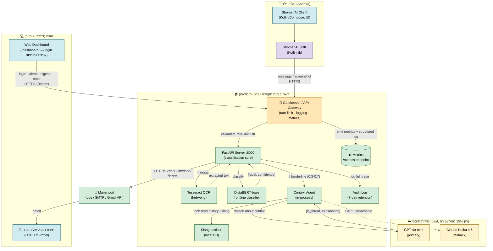
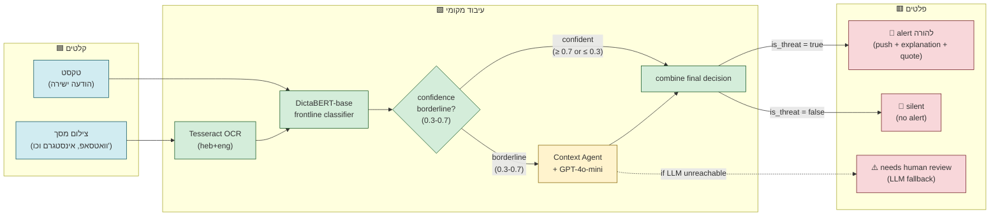
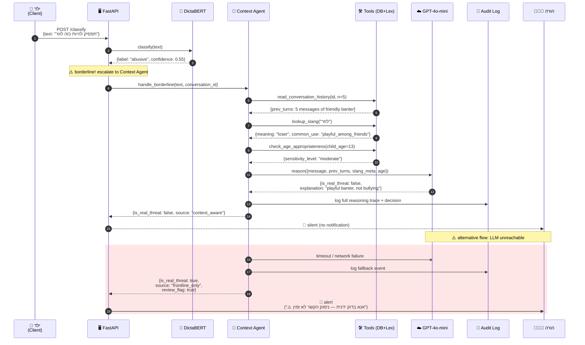
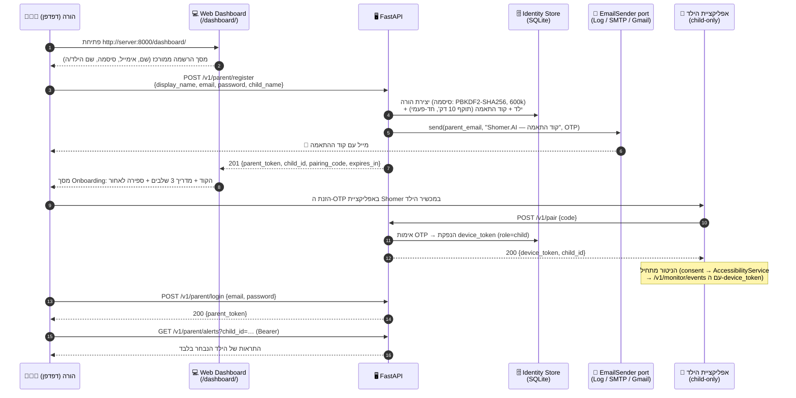
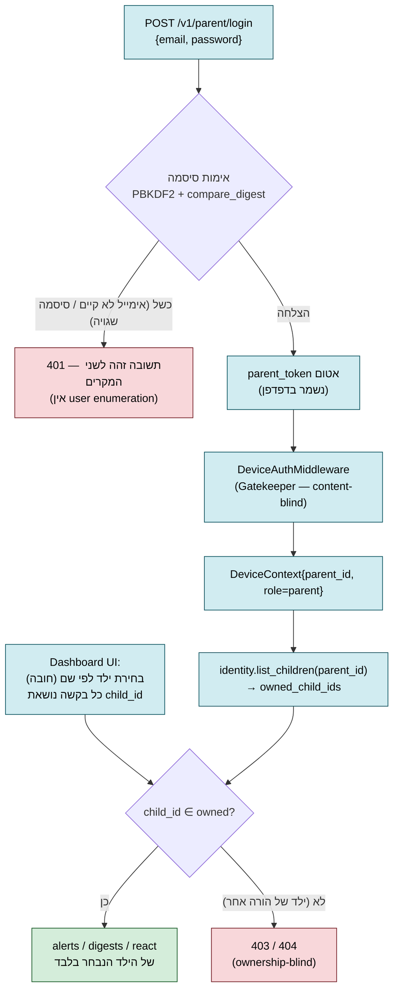

# Shomer.AI — דיאגרמות ארכיטקטורה

**מסמך:** דיאגרמות עבור Architecture B (טקסט + Chat-OCR + Context Agent יחיד)
**מקורות:** [`plan-docs/decisions/architecture.decision.md`](../plan-docs/decisions/architecture.decision.md)
**סטטוס:** טיוטה למפגש 4 · 2026-05-31
**שימוש:** המסמך משובץ ב-[`PRD.md`](PRD.md) בסעיף הארכיטקטורה. ניתן גם לעיון עצמאי לצורך הגנת הארכיטקטורה.

---

## למה חמש דיאגרמות?

כל דיאגרמה עונה על שאלה אחרת — לא כל מי שיקרא צריך את כולן:

| דיאגרמה | מה היא עונה | קהל מטרה |
|---|---|---|
| 1 — C4 Container | "מה הרכיבים ואיפה הם רצים?" | ארכיטקטים, DevOps, ד"ר סגל במפגש 4 |
| 2 — Data Flow | "מה הזרימה הלוגית של הנתונים?" | מפתחים — וודאות שיש pipeline אחד ולא שניים |
| 3 — Sequence (מקרה גבול) | "איך זה רץ בפועל בזמן אמת?" | מודיע על ה-RQ; מראה איפה ה-FP-reduction קורה |
| 4 — Onboarding (הרשמה → OTP במייל → צימוד) | "איך הורה וילד מתחברים למערכת בפעם הראשונה?" | מפתחים, מציגי הדמו |
| 5 — אימות והפרדת נתונים לפי ילד | "איך נאכפת ההפרדה בין הורים ובין ילדים?" | אבטחה/פרטיות, הגנת הפרויקט |

---

## דיאגרמה 1 — תצוגת מערכת ברמת C4 Container

מציגה את כל המכלים (containers) של המערכת, את גבולות האמון (trust boundaries), ואת תזרים המידע הראשי בין הילד, השרת הביתי, השירות החיצוני (LLM בתשלום), וההורה.

> **עדכון 2026-06-12 (D-CO-1/D-CO-2 + dashboard login):** צד ההורה עבר מאפליקציית אנדרואיד ל-**Web Dashboard**
> הנגיש בכתובת `http://<server>:8000/dashboard/` (מוגש ע"י FastAPI עצמו), עם התחברות **אימייל+סיסמה**.
> אפליקציית האנדרואיד היא **child-only**. ערוץ ההתראות להורה הוא **אימייל** (Gmail API / SMTP / Log),
> דרך אותו port של שליחת מייל שמשמש גם את ה-OTP בתהליך ה-Onboarding (דיאגרמה 4).

**מקרא:**
- 🟢 ירוק = רץ מקומית (פרטיות מלאה, אפס עלות שולית)
- 🔵 כחול = לקוח (אפליקציית Android בצד הילד; דפדפן + תיבת מייל בצד ההורה)
- 🟣 סגול = SDK — ספרייה משותפת ב-Kotlin שיושבת **בתוך** קליינט האנדרואיד; עוטפת את חוזה ה-API (ה-Web Dashboard ניגש ל-API ישירות, ללא build)
- 🟠 כתום = Gatekeeper / API Gateway — שכבת Edge של ה-FastAPI; שולטת בעומסים ומספקת observability
- 🟡 צהוב = שירות חיצוני בתשלום (פעיל רק על 15% מקרי גבול)

**נקודות מפתח:**
1. כל הנתונים הרגישים (תוכן השיחות, תמונות) **נשארים ברשת הביתית**. לשירות החיצוני נשלח רק קונטקסט מצומצם (הודעה + עד 5 תורים קודמים, ללא PII).
2. ה-LLM החיצוני **לא חסום-פעולה** — אם נופל, חוזרים על סיווג החזית עם דגל "needs human review".
3. כל החלטה של ה-Context Agent מתועדת ב-Audit Log עם reasoning trace מלא (חובה לניתוח per-slice במפגש 8).
4. **SDK** (סגול) הוא חוזה ה-API שקליינט האנדרואיד (child-only) ניגש דרכו; ה-Web Dashboard של ההורה צורך את אותו חוזה REST ישירות מהדפדפן. מונע שכפול קוד HTTP בין הקליינטים.
5. **Gatekeeper / API Gateway** (כתום) הוא שכבת Edge: כל בקשה עוברת דרכה לרייט-לימיט, validation, ולוגינג מובנה לפני שמגיעה לסיווג. מימוש MVP = FastAPI middleware (`slowapi` + `structlog` + `prometheus-fastapi-instrumentator`). מטרתו תפעולית — שליטה בעומסים + observability — ולא חלק מהסיווג עצמו.

---

## דיאגרמה 2 — Data Flow: שני מסלולי הקלט מתאחדים

מראה איך הודעת טקסט וצילום מסך חולקים את אותו pipeline מהמסווג הקדמי ואילך. **זוהי בדיוק ההצדקה לדחיית Architecture A** — אין צורך ב-Vision LLM כי הטקסט שבתוך התמונות חולץ דרך OCR ונכנס לאותו צינור.

**המסר העיקרי:** OCR קורא טקסט מתוך תמונות → הטקסט נכנס לאותו pipeline. אין שני pipelines נפרדים. החיסכון הזה הוא ההצדקה ההנדסית לוויתור על Vision LLM (Architecture A).

**שלוש האפשרויות הסופיות:**
- **Alert** — התראת push להורה עם הסבר וציטוט (לא קופסה שחורה)
- **Silent** — הסיווג קבע שהמקרה תמים, אין הפרעה להורה (Alert Fatigue מינימלי)
- **Manual review** — מסומן רק כשה-LLM החיצוני אינו זמין (graceful degradation)

---

## דיאגרמה 3 — Sequence: זרימת מקרה גבול עם reasoning של Context Agent

מציגה את הסדר הכרונולוגי המלא — מהילד שולח הודעה ועד להתראה (או לא) אצל ההורה — במקרה גבול שדורש את ה-Context Agent. דיאגרמה זו היא הליבה של ה-RQ: היא מראה **איפה ולמה** ה-FP-reduction קורה.

**מה הדיאגרמה מראה (נקודות לציון בהגנה):**

1. **השלבים 1–3 (סיווג ראשוני):** רץ במאות מיליאניות — DictaBERT מקומי, ללא קריאות חיצוניות.

2. **השלב 4 (החלטת הסלמה):** רק כשה-confidence ב-borderline zone (0.3–0.7). זה ה-15% מהתעבורה שמגיע ל-Context Agent ומגלם את עיקר ה-cost.

3. **השלבים 5–10 (ה-Context Agent):** הסוכן קורא היסטוריה + מילון סלנג + פרופיל גיל **לפני** הקריאה ל-LLM. הכלים חוסכים טוקנים ע"י הזרמת רק המידע הרלוונטי.

4. **השלב 11 (reasoning):** ה-LLM החיצוני (GPT-4o-mini) מקבל קונטקסט תמציתי ומחזיר החלטה + הסבר. **זה המנגנון שעונה על ה-RQ** — סיווג ההודעה ה"גבולית" משתפר ע"י reasoning על ההקשר.

5. **השלב 14 (תוצאה):** במקרה הזה ה-Context Agent קבע שהמסר תמים (סלנג ידידותי בהקשר של שיחה צוחקת) → **אין התראה** → **הפחתת FP**.

6. **המסלול האדום (fallback):** אם ה-LLM אינו זמין, המערכת לא חוסמת את ההתראה — שולחת אותה עם דגל "needs human review". עיקרון: **לעולם לא לאבד התראה בשקט במערכת בטיחות ילדים**.

---

## דיאגרמה 4 — Onboarding: הרשמת הורה → OTP במייל → צימוד מכשיר הילד

**נוסף 2026-06-12.** מציגה את חיבור המערכת בפעם הראשונה: ההורה נרשם ב-Web Dashboard עם
**אימייל + סיסמה + שם הילד/ה**, מקבל **קוד התאמה (OTP) למייל**, מזין אותו באפליקציית הילד —
והמכשיר מצומד. מאותו רגע ההורה מתחבר לדשבורד עם אימייל+סיסמה ורואה רק את הילדים שלו.

**נקודות מפתח:**

1. **ערוץ ה-OTP הוא אימייל** (שלבים 5–6): הקוד נשלח לכתובת שההורה נרשם איתה, דרך port אחיד
   `EmailSender` (`server/app/mailer/`). באותו port: `LogEmailSender` (ברירת-מחדל לפיתוח — הקוד מודפס
   ללוג), `SmtpEmailSender` (‏`MAILER_BACKEND=smtp`, למשל Gmail app-password), ומקביל לו בערוץ ההתראות —
   `GmailApiNotifier` ‏(OAuth2, ‏`ALERTS_CHANNEL=email`; ראו `child-only-and-email-alerts.decision.md`).
   ב-MVP הקוד גם מוצג על המסך בדשבורד (פרגמטיות לדמו) — האימייל הוא הערוץ הראשי.
2. **ה-OTP קושר את מכשיר הילד להורה הנכון**: הקוד מונפק עבור `child_id` ספציפי תחת `parent_id`
   ספציפי; פדיון הקוד (`/v1/pair`) מנפיק `device_token` שכל העלאות הניטור שלו משויכות לאותו ילד.
3. **שני סוגי credentials, תפקידים שונים:** להורה — אימייל+סיסמה שממירים ל-`parent_token` אטום;
   לילד — `device_token` אטום שנולד מה-OTP. אין סיסמה במכשיר הילד.
4. **צימוד ילדים נוספים** נעשה מתוך הדשבורד ("הוסף ילד/ה" / "קוד התאמה") — אותו מנגנון OTP+מייל,
   ללא הרשמה חוזרת.

---

## דיאגרמה 5 — אימות והפרדת נתונים מלאה לפי ילד

**נוסף 2026-06-12.** מראה איך כל בקשת נתונים של הורה נחתכת לילדים שבבעלותו בלבד, ואיך ה-UI
כופה בחירת ילד לפי **שם** — כך שהדשבורד מציג בכל רגע נתונים של ילד אחד בלבד.

**איפה ההפרדה נאכפת (שכבתיים — גם שרת וגם UI):**

| שכבה | מנגנון | קובץ |
|---|---|---|
| שרת — זהות | כל endpoint הורי טוען `list_children(parent_id)` ומסנן אליהם בלבד; `child_id` זר ⇒ 403/404 | `server/app/flagged/router.py`, `server/app/digest/router.py` |
| שרת — אימות | טוקנים אטומים; סיסמאות PBKDF2-SHA256 עם salt פר-משתמש; 401 אחיד | `server/app/identity/` |
| UI — הפרדה לפי שם | אין מצב "כל הילדים" ואין קלט חופשי של מזהה ילד: ההורה בוחר ילד **לפי שם** (צ'יפים), וכל בקשה נשלחת עם ה-`child_id` הנבחר; אינדיקציה "מציג נתונים עבור: ⟨שם⟩" | `dashboard/index.html` |

ההפרדה בין **הורים** מאומתת בבדיקות (`server/tests/parent/test_cross_parent_isolation.py`,
`server/tests/identity/test_parent_login.py`); ההפרדה בין **ילדים** של אותו הורה נאכפת ב-UI (בחירה
מפורשת) וב-API (פרמטר `child_id` מסונן מול הבעלות).

---

## איך הדיאגרמות מעידות על ה-RQ

שאלת המחקר: *"עד כמה הוספת הקשר שיחתי לסיווג בריונות בעברית מפחיתה את שיעור ה-false positives לעומת סיווג מבודד — מבלי לפגוע ב-recall?"*

הניסוי המוטמע בארכיטקטורה:
- **תנאי control (context-blind):** המסווג בלבד מחליט. בדיאגרמה 3, זה השלבים 1–3 בלבד; ההחלטה תהיה לפי `confidence ≥ 0.5` → "is_threat = true" → **התראת FP**.
- **תנאי treatment (context-aware):** המסווג + Context Agent. בדיאגרמה 3, זה הזרימה המלאה; ההחלטה לאחר reasoning → "is_real_threat = false" → **התראה נמנעה**.
- **המדידה:** הפרש ה-FPR בין שני התנאים על gold set מתויג ידנית (מפגש 8).

הארכיטקטורה לא רק תומכת ב-RQ — היא **מממשת את הניסוי כפיצ'ר מובנה** של המוצר.

