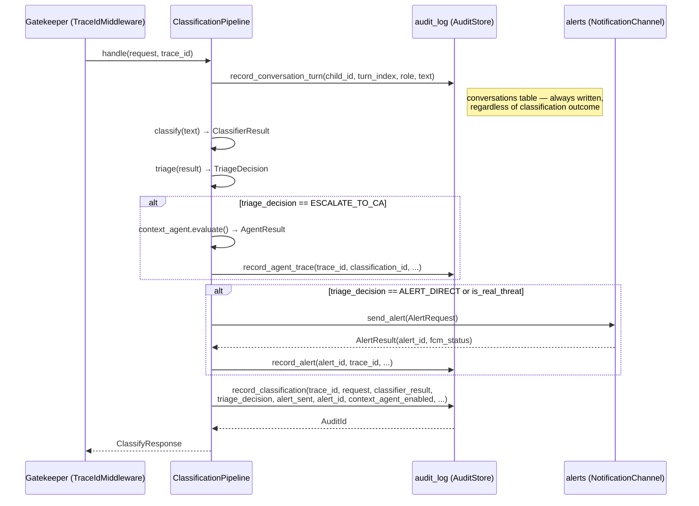
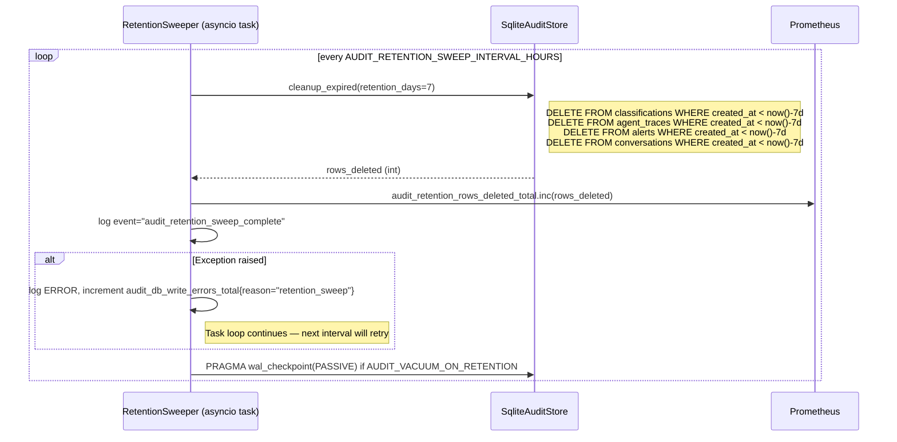
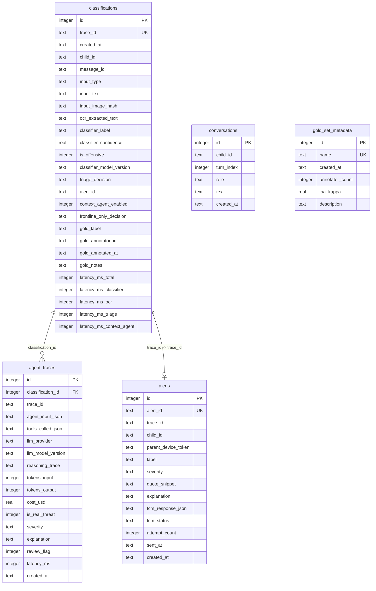

# Audit Log — Low-Level Design

**Module ID:** `audit_log`
**Owner:** TBD
**Status:** Draft for Meeting 4 (closes review.md G-01)
**PRD reference:** PRD §8.5, §9 (privacy), §10 (Meeting 8 ΔFPR)
**Last updated:** 2026-05-31

---

## 1. Purpose & Scope

The `audit_log` module is the **single source of truth for every persisted decision record** in Shomer.AI. It owns:

- **Persistent recording** of every `/classify` and `/classify-image` request outcome, including the full classifier result, triage decision, Context Agent reasoning trace, and FCM alert disposition.
- **7-day rolling retention** — a background sweep runs hourly and deletes rows older than 7 days from all tables, satisfying PRD §9 privacy NFR.
- **Conversation history** — the `conversations` table stores all child messages (not just borderline ones), giving the Context Agent's `read_history` tool a complete sliding window of context.
- **Gold-label annotation surface** — `set_gold_label()` + `query_for_evaluation()` are the two methods that power the Meeting 8 ΔFPR experiment: annotators write gold labels into `classifications`, and evaluation scripts stream rows via an `AsyncIterator`.

This module does NOT own:
- Real-time request metrics (owned by `gatekeeper` Prometheus counters).
- Prometheus metric export (owned by `gatekeeper` `/metrics` endpoint).
- Classification logic itself (owned by `classifier` and `triage`).
- Token budget enforcement (owned by `context_agent` `TokenBudgetGuard`).

**Replaces:** `server/app/audit.py` (append-only JSONL placeholder). The legacy file remains importable during the transition period (see `server/design.md` §3.1 Migration note) and is removed once `audit_log` ships at Meeting 5.

---

## 2. Public Interface (Protocol)

```python
# server/app/audit_log/protocol.py

from __future__ import annotations

import datetime
from dataclasses import dataclass
from typing import AsyncIterator, Optional
from typing import Protocol, runtime_checkable

AuditId = str          # UUID4 string
AgentTraceId = str     # UUID4 string


@dataclass(frozen=True)
class ConversationTurn:
    child_id: str
    turn_index: int
    role: str                   # 'child_outbound' | 'child_inbound'
    text: str
    created_at: datetime.datetime


@dataclass(frozen=True)
class AuditRow:
    """Projected row for Meeting 8 evaluation queries."""
    audit_id: str
    trace_id: str
    created_at: datetime.datetime
    classifier_label: str
    classifier_confidence: float
    is_offensive: bool
    triage_decision: str
    context_agent_enabled: bool
    frontline_only_decision: Optional[str]
    is_real_threat: Optional[bool]       # from agent_traces if present
    gold_label: Optional[str]
    gold_annotator_id: Optional[str]


@dataclass(frozen=True)
class HealthStatus:
    writable: bool
    db_size_bytes: int
    oldest_row_age_hours: float
    detail: str


@runtime_checkable
class AuditStore(Protocol):
    """Port: all callers depend only on this Protocol, never on SqliteAuditStore directly."""

    async def record_classification(
        self,
        *,
        trace_id: str,
        request: dict,                   # serialisable Pydantic model or dict
        classifier_result: dict,
        triage_decision: str,
        alert_sent: bool,
        alert_id: Optional[str] = None,
        context_agent_enabled: bool = False,
        frontline_only_decision: Optional[str] = None,
        latency_ms: dict,                # {"total": int, "classifier": int, "ocr": int|None, ...}
    ) -> AuditId: ...

    async def record_agent_trace(
        self,
        *,
        trace_id: str,
        classification_id: int,
        agent_input_json: str,
        tools_called: list[str],
        llm_provider: str,
        llm_model_version: str,
        reasoning_trace: str,
        tokens_input: int,
        tokens_output: int,
        cost_usd: float,
        is_real_threat: bool,
        severity: Optional[str],
        explanation: str,
        review_flag: bool,
        latency_ms: int,
    ) -> AgentTraceId: ...

    async def record_alert(
        self,
        *,
        alert_id: str,
        trace_id: str,
        child_id: str,
        parent_device_token: str,
        label: str,
        severity: str,
        quote_snippet: str,
        explanation: str,
        fcm_response_json: Optional[str],
        fcm_status: str,
    ) -> None: ...

    async def record_conversation_turn(
        self,
        *,
        child_id: str,
        turn_index: int,
        role: str,
        text: str,
        timestamp: datetime.datetime,
    ) -> None: ...

    async def read_conversation_history(
        self,
        child_id: str,
        last_n_turns: int = 5,
    ) -> list[ConversationTurn]: ...

    def query_for_evaluation(
        self,
        *,
        date_from: datetime.datetime,
        date_to: datetime.datetime,
        context_agent_enabled: Optional[bool] = None,
        gold_labeled_only: bool = False,
    ) -> AsyncIterator[AuditRow]: ...

    async def set_gold_label(
        self,
        audit_id: str,
        label: str,
        annotator_id: str,
        notes: Optional[str] = None,
    ) -> None: ...

    async def cleanup_expired(self, retention_days: int = 7) -> int: ...

    async def health(self) -> HealthStatus: ...
```

---

## 2.5 Interface Boundary & Isolation Guarantees

**Port:** `AuditStore` (re-exported from `server/app/audit_log/__init__.py`).

**Adapters:**

| Adapter class | File | Use |
|---|---|---|
| `SqliteAuditStore` | `sqlite_store.py` | Default — MVP, single-process, local disk |
| `PostgresAuditStore` | `postgres_store.py` | Future scale-up (not implemented in MVP) |
| `InMemoryAuditStore` | `memory_store.py` | Unit tests and contract tests — zero disk I/O |
| `NullAuditStore` | `null_store.py` | Degraded-mode fallback when disk is full; all writes are no-ops; `health()` returns `writable=False` |

Per the swap rule in `docs/design/README.md` §2.3, swapping from `SqliteAuditStore` to `PostgresAuditStore` is **one line** in `server/app/main.py` `lifespan()`:

```python
# Before:
audit: AuditStore = SqliteAuditStore(settings.audit_log)
# After:
audit: AuditStore = PostgresAuditStore(settings.audit_log)
```

No route handler, pipeline, Context Agent tool, or test changes when the adapter is swapped — they all type their dependency as `AuditStore`.

**Import rule:** The composition root (`server/app/main.py`) is the **only** file allowed to import `SqliteAuditStore` or any other concrete adapter. All other code imports only `AuditStore` from `server/app/audit_log/__init__.py`.

---

## 3. Internal Design

### Package Layout

```
server/app/audit_log/
├── __init__.py          # re-exports: AuditStore, AuditRow, ConversationTurn, HealthStatus
├── protocol.py          # AuditStore Protocol + all dataclasses (AuditId, AgentTraceId, ...)
├── schemas.py           # Pydantic v2 models for inbound record payloads (for validation)
├── sqlite_store.py      # SqliteAuditStore — the default MVP adapter
├── memory_store.py      # InMemoryAuditStore — for tests
├── null_store.py        # NullAuditStore — degraded-mode fallback
├── retention.py         # RetentionSweeper — background asyncio task
├── config.py            # AuditLogSettings (pydantic-settings)
├── migrations/
│   ├── 001_init.sql         # All 5 tables + indexes
│   └── 002_add_gold_label.sql   # gold_label columns (if added post-MVP)
└── tests/
    ├── test_contract.py     # Parametrized contract suite over all adapters
    ├── test_sqlite_store.py # SqliteAuditStore unit tests
    ├── test_retention.py    # RetentionSweeper unit tests (exact 7-day boundary)
    └── test_integration.py  # End-to-end: trace_id from gatekeeper lands in row
```

### Class Responsibilities

**`SqliteAuditStore`** — implements `AuditStore` against SQLite via `aiosqlite`. Holds a `WAL-mode` connection opened in `__init__`. Runs `PRAGMA journal_mode=WAL; PRAGMA synchronous=NORMAL;` on first connection for safe concurrent reads. Exposes `async def init()` (run migrations) and `async def close()` (checkpoint + close). Write methods serialise to JSON where needed (`tools_called_json`, `agent_input_json`).

**`RetentionSweeper`** — instantiated by the `lifespan()` composition root. Runs as an `asyncio` background task looping every `AUDIT_RETENTION_SWEEP_INTERVAL_HOURS` hours. Calls `audit_store.cleanup_expired(retention_days)` which issues `DELETE FROM <table> WHERE created_at < datetime('now', '-? days')` on each of the four time-stamped tables. Emits the `audit_retention_sweep_complete` log event and increments `audit_retention_rows_deleted_total` metric. If the sweep raises an exception, it logs at ERROR level, emits the metric, and **does not crash the task loop** — the next interval will retry.

**`InMemoryAuditStore`** — maintains Python lists keyed by table name. `cleanup_expired()` filters lists in-place. Used exclusively by tests; never registered in `lifespan()` in production.

**`NullAuditStore`** — all `record_*` and `set_gold_label` calls return immediately with a no-op. `health()` returns `HealthStatus(writable=False, ...)`. Registered by `lifespan()` only after a disk-full error is detected on the primary `SqliteAuditStore` — see §8.

---

## 4. Sequence Diagrams

### 4.1 Recording a Classification (Happy Path)



### 4.2 Retention Sweep (Background Task)



---

## 5. Data Model

### 5.1 SQLite Schema (`migrations/001_init.sql`)

```sql
-- =============================================================
-- Table 1: classifications
-- One row per /classify or /classify-image request.
-- This is the primary table for Meeting 8 A/B evaluation.
-- =============================================================
CREATE TABLE IF NOT EXISTS classifications (
    id                          INTEGER PRIMARY KEY AUTOINCREMENT,
    -- Linkage
    trace_id                    TEXT    NOT NULL UNIQUE,   -- UUID4 from gatekeeper TraceIdMiddleware; FK from gatekeeper
    created_at                  TEXT    NOT NULL,          -- ISO 8601 UTC; indexed for retention sweep

    -- Child context (single-child MVP; nullable until multi-child)
    child_id                    TEXT,
    message_id                  TEXT,

    -- Input
    input_type                  TEXT    NOT NULL CHECK (input_type IN ('text', 'image')),
    input_text                  TEXT,                      -- full message text; null for pure-image path
    input_image_hash            TEXT,                      -- SHA256 hex of uploaded image bytes; never the image itself
    ocr_extracted_text          TEXT,                      -- text extracted by Tesseract; null if input_type='text'

    -- Classifier output (frontline)
    classifier_label            TEXT    NOT NULL CHECK (classifier_label IN ('abusive','hate','violence','pornographic','non_offensive')),
    classifier_confidence       REAL    NOT NULL,          -- [0.0, 1.0]
    is_offensive                INTEGER NOT NULL,          -- 1 if classifier_label != 'non_offensive'; computed on insert
    classifier_model_version    TEXT    NOT NULL,          -- e.g. 'dictabert-base-v1'

    -- Triage
    triage_decision             TEXT    NOT NULL CHECK (triage_decision IN ('silent','alert_direct','escalate_to_ca','review_needed')),
    alert_id                    TEXT,                      -- FK to alerts.alert_id; null if no alert sent

    -- A/B switch fields — required for Meeting 8 ΔFPR query
    context_agent_enabled       INTEGER NOT NULL DEFAULT 0,    -- 0/1 snapshot of CONTEXT_AGENT_ENABLED at request time
    frontline_only_decision     TEXT CHECK (frontline_only_decision IN ('silent','alert_direct','review_needed') OR frontline_only_decision IS NULL),
                                                           -- what triage would have decided WITHOUT Context Agent;
                                                           -- populated even when context_agent_enabled=1 so A/B query can compare

    -- Gold-set annotation (populated by annotators before Meeting 8)
    gold_label                  TEXT    CHECK (gold_label IN ('abusive','hate','violence','pornographic','non_offensive','ambiguous') OR gold_label IS NULL),
    gold_annotator_id           TEXT,
    gold_annotated_at           TEXT,                      -- ISO 8601 UTC
    gold_notes                  TEXT,

    -- Per-request latency breakdown (milliseconds)
    latency_ms_total            INTEGER,
    latency_ms_classifier       INTEGER,
    latency_ms_ocr              INTEGER,                   -- null if input_type='text'
    latency_ms_triage           INTEGER,
    latency_ms_context_agent    INTEGER                    -- null if context_agent not invoked
);

-- Indexes for classifications
CREATE INDEX IF NOT EXISTS idx_cls_created_at   ON classifications(created_at DESC);         -- retention sweep DELETE
CREATE UNIQUE INDEX IF NOT EXISTS idx_cls_trace ON classifications(trace_id);                 -- FK lookup from agent_traces / alerts
CREATE INDEX IF NOT EXISTS idx_cls_child_ts     ON classifications(child_id, created_at DESC);-- parent dashboard history query
CREATE INDEX IF NOT EXISTS idx_cls_gold         ON classifications(gold_label) WHERE gold_label IS NOT NULL; -- Meeting 8 eval filter
CREATE INDEX IF NOT EXISTS idx_cls_ab_filter    ON classifications(context_agent_enabled, created_at DESC);  -- A/B comparison slice


-- =============================================================
-- Table 2: agent_traces
-- One row per Context Agent invocation (only borderline cases).
-- Wide table kept separate so classifications table stays lean.
-- =============================================================
CREATE TABLE IF NOT EXISTS agent_traces (
    id                      INTEGER PRIMARY KEY AUTOINCREMENT,
    classification_id       INTEGER NOT NULL REFERENCES classifications(id) ON DELETE CASCADE,
    trace_id                TEXT    NOT NULL,               -- redundant with classifications.trace_id for fast standalone lookup

    -- Input fed to the agent
    agent_input_json        TEXT    NOT NULL,               -- JSON: {current_message, conversation_history[], child_age?}

    -- Tools the agent called
    tools_called_json       TEXT    NOT NULL DEFAULT '[]',  -- JSON array: ["read_history","lookup_slang"]

    -- LLM
    llm_provider            TEXT    NOT NULL CHECK (llm_provider IN ('gpt-4o-mini','haiku-4.5','fallback')),
    llm_model_version       TEXT    NOT NULL,               -- e.g. 'gpt-4o-mini-2024-07-18'

    -- Reasoning (kept for per-slice academic analysis)
    reasoning_trace         TEXT    NOT NULL,               -- LLM chain-of-thought text (Hebrew or English)

    -- Token accounting
    tokens_input            INTEGER NOT NULL,
    tokens_output           INTEGER NOT NULL,
    cost_usd                REAL    NOT NULL,               -- computed from token_prices.yaml

    -- Agent decision
    is_real_threat          INTEGER NOT NULL,               -- 0/1; the context-aware verdict
    severity                TEXT,                           -- 'low'|'medium'|'high'|null
    explanation             TEXT    NOT NULL,               -- human-readable text sent in push alert
    review_flag             INTEGER NOT NULL DEFAULT 0,     -- 1 = agent requested human review

    latency_ms              INTEGER NOT NULL,
    created_at              TEXT    NOT NULL                -- ISO 8601 UTC
);

CREATE INDEX IF NOT EXISTS idx_at_classification ON agent_traces(classification_id);   -- JOIN to classifications
CREATE INDEX IF NOT EXISTS idx_at_trace          ON agent_traces(trace_id);            -- standalone lookup
CREATE INDEX IF NOT EXISTS idx_at_created_at     ON agent_traces(created_at DESC);     -- retention sweep


-- =============================================================
-- Table 3: alerts
-- One row per push notification sent (or attempted) to a parent.
-- alert_id is the idempotency key — hash(child_id+message_id+label)[:16].
-- =============================================================
CREATE TABLE IF NOT EXISTS alerts (
    id                      INTEGER PRIMARY KEY AUTOINCREMENT,
    alert_id                TEXT    NOT NULL UNIQUE,        -- idempotency key; prevents duplicate FCM sends
    trace_id                TEXT    NOT NULL,               -- links back to classifications.trace_id
    child_id                TEXT    NOT NULL,
    parent_device_token     TEXT    NOT NULL,               -- FCM registration token; never logged externally

    -- Alert content (mirrors FCM payload)
    label                   TEXT    NOT NULL,               -- canonical label (non_offensive never reaches here)
    severity                TEXT    NOT NULL,
    quote_snippet           TEXT    NOT NULL,               -- max 200 chars of message; no PII beyond what's already in classifications
    explanation             TEXT    NOT NULL,

    -- FCM delivery state
    fcm_response_json       TEXT,                           -- raw FCM HTTP response body; null until first attempt
    fcm_status              TEXT    NOT NULL CHECK (fcm_status IN ('queued','sent','failed','retrying')),
    attempt_count           INTEGER NOT NULL DEFAULT 0,
    sent_at                 TEXT,                           -- ISO 8601 UTC; null until fcm_status='sent'
    created_at              TEXT    NOT NULL                -- ISO 8601 UTC
);

CREATE UNIQUE INDEX IF NOT EXISTS idx_alerts_id         ON alerts(alert_id);               -- idempotency check on send
CREATE INDEX IF NOT EXISTS idx_alerts_child_ts          ON alerts(child_id, created_at DESC); -- parent dashboard
CREATE INDEX IF NOT EXISTS idx_alerts_fcm_status        ON alerts(fcm_status, created_at);    -- retry queue scan


-- =============================================================
-- Table 4: conversations
-- All child messages (both inbound and outbound), not just borderline.
-- Powers the Context Agent's read_history tool.
-- Resolves review.md G-01 open question Q4.
-- =============================================================
CREATE TABLE IF NOT EXISTS conversations (
    id          INTEGER PRIMARY KEY AUTOINCREMENT,
    child_id    TEXT    NOT NULL,
    turn_index  INTEGER NOT NULL,                           -- monotonically increasing per child_id
    role        TEXT    NOT NULL CHECK (role IN ('child_outbound', 'child_inbound')),
    text        TEXT    NOT NULL,                           -- full message text; subject to 7-day retention
    created_at  TEXT    NOT NULL                            -- ISO 8601 UTC
);

CREATE INDEX IF NOT EXISTS idx_conv_child_turn   ON conversations(child_id, turn_index DESC);  -- read_history query (child_id + LIMIT N)
CREATE INDEX IF NOT EXISTS idx_conv_created_at   ON conversations(created_at DESC);             -- retention sweep


-- =============================================================
-- Table 5: gold_set_metadata
-- One row per named gold set (used for Meeting 8 evaluation).
-- =============================================================
CREATE TABLE IF NOT EXISTS gold_set_metadata (
    id              INTEGER PRIMARY KEY AUTOINCREMENT,
    name            TEXT    NOT NULL UNIQUE,               -- e.g. 'meeting8-v1'
    created_at      TEXT    NOT NULL,
    annotator_count INTEGER NOT NULL DEFAULT 0,
    iaa_kappa       REAL,                                  -- inter-annotator agreement (Cohen's κ); null until computed
    description     TEXT
);
```

### 5.2 Entity-Relationship Diagram



### 5.3 Key Queries

**Meeting 8 A/B ΔFPR query** (streamed via `query_for_evaluation()`):

```sql
-- Context-blind FPR: frontline_only_decision vs gold_label
-- Context-aware FPR: triage_decision (when context_agent_enabled=1) vs gold_label
SELECT
    c.trace_id,
    c.classifier_label,
    c.classifier_confidence,
    c.triage_decision,
    c.context_agent_enabled,
    c.frontline_only_decision,
    at.is_real_threat,
    c.gold_label,
    c.gold_annotator_id
FROM classifications c
LEFT JOIN agent_traces at ON at.classification_id = c.id
WHERE c.gold_label IS NOT NULL
  AND c.created_at BETWEEN :date_from AND :date_to
ORDER BY c.created_at ASC;
```

**Context Agent `read_history` tool query** (served via `read_conversation_history()`):

```sql
SELECT child_id, turn_index, role, text, created_at
FROM conversations
WHERE child_id = :child_id
ORDER BY turn_index DESC
LIMIT :last_n_turns;
```

---

## 6. Observability

### 6.1 Logger

Module logger: `shomer.audit_log` via `structlog`.

```python
import structlog
logger = structlog.get_logger("shomer.audit_log")
```

Every write emits a structured log event bound with at minimum: `trace_id`, `event`, `audit_id` (or `None` on failure), `write_latency_ms`.

**Canonical log events:**

```json
{"event": "record_classification", "trace_id": "abc123", "audit_id": "...", "write_latency_ms": 2, "classifier_label": "non_offensive", "triage_decision": "silent"}
{"event": "record_agent_trace",    "trace_id": "abc123", "audit_id": "...", "write_latency_ms": 3, "llm_provider": "gpt-4o-mini", "tokens_total": 412}
{"event": "record_alert",          "trace_id": "abc123", "alert_id": "...", "write_latency_ms": 1, "fcm_status": "sent"}
{"event": "record_conversation_turn", "child_id": "child-001", "turn_index": 42, "write_latency_ms": 1}
{"event": "audit_retention_sweep_complete", "rows_deleted": 1287, "sweep_duration_ms": 340, "tables_swept": 4}
{"event": "gold_label_set",        "audit_id": "...", "label": "abusive", "annotator_id": "alona-1"}
{"event": "audit_disk_warning",    "db_size_bytes": 498000000, "threshold_mb": 500}
{"event": "audit_write_error",     "trace_id": "abc123", "reason": "sqlite_locked", "attempt": 2}
```

### 6.2 Config (`AuditLogSettings`)

```python
# server/app/audit_log/config.py

from pydantic_settings import BaseSettings, SettingsConfigDict

class AuditLogSettings(BaseSettings):
    model_config = SettingsConfigDict(env_prefix="AUDIT_", case_sensitive=False)

    db_path: str = "./audit.db"                    # AUDIT_DB_PATH
    retention_days: int = 7                         # AUDIT_RETENTION_DAYS
    retention_sweep_interval_hours: float = 1.0     # AUDIT_RETENTION_SWEEP_INTERVAL_HOURS
    max_db_size_mb: int = 500                       # AUDIT_MAX_DB_SIZE_MB — emits warning metric if exceeded
    vacuum_on_retention: bool = True                # AUDIT_VACUUM_ON_RETENTION — runs WAL checkpoint after sweep
    write_timeout_ms: int = 5000                    # AUDIT_WRITE_TIMEOUT_MS — aiosqlite connection timeout
```

### 6.3 Prometheus Metrics

All metrics registered against the shared `REGISTRY` from `server/app/metrics.py`.

| Metric | Type | Labels | Description |
|---|---|---|---|
| `audit_writes_total` | Counter | `record_type` (classification, agent_trace, alert, conversation_turn) | Total successful writes per record type |
| `audit_write_latency_seconds` | Histogram | `record_type` | Write latency; buckets 1ms–100ms; p99 must stay < 10ms |
| `audit_retention_rows_deleted_total` | Counter | — | Cumulative rows deleted across all sweeps |
| `audit_db_size_bytes` | Gauge | — | Current SQLite file size; triggers log warning above `max_db_size_mb` |
| `audit_gold_labeled_total` | Counter | — | Rows annotated with a gold label (for Meeting 8 progress tracking) |
| `audit_db_write_errors_total` | Counter | `reason` (sqlite_locked, disk_full, schema_mismatch, retention_sweep) | Write errors by failure type |

---

## 7. NFR Targets & Test Plan

### NFR Targets

| NFR | Target | Measurement |
|---|---|---|
| Write latency p99 | < 10 ms | `audit_write_latency_seconds` histogram — must never slow the synchronous request path |
| Retention sweep duration | < 5 s | Logged in `audit_retention_sweep_complete` event `sweep_duration_ms` |
| DB size at MVP scale | < 500 MB | `audit_db_size_bytes` gauge |
| Privacy: no row sent externally | 100% | Architectural: `AuditStore` has no outbound network calls |
| Retention accuracy | Exactly 7 days ± sweep interval | Property test (see below) |

**If p99 write latency approaches 10 ms:** the `record_classification` call is moved off the synchronous request path into an `asyncio.Queue` drained by a background writer. The Protocol signature does not change — callers `await record_classification(...)` as before; internally the adapter enqueues and returns immediately. The queue depth and drain lag are added to the Prometheus metric set.

### Test Plan

| Test | File | What it verifies |
|---|---|---|
| **Contract test** (parametrized over all adapters) | `tests/test_contract.py` | Every adapter satisfies `AuditStore` Protocol: `record_classification` → `AuditId` string, `read_conversation_history` → list, `cleanup_expired` → int, `health()` → `HealthStatus`. |
| **Unit: `SqliteAuditStore`** | `tests/test_sqlite_store.py` | Single write, read-back; `unique constraint violation` on duplicate `trace_id`; `read_conversation_history` returns last-N in turn_index-desc order. |
| **Unit: retention math** | `tests/test_retention.py` | Insert rows at T-6d, T-7d, T-8d; call `cleanup_expired(7)`; assert T-6d survives, T-8d is deleted, T-7d boundary is correct ± 1 row. |
| **Integration: trace_id propagation** | `tests/test_integration.py` | POST to `/classify` with a known `X-Trace-ID` header; query `audit.db`; assert `classifications.trace_id` matches. |
| **Property test: retention boundary** | `tests/test_retention.py` | Hypothesis: for any row age R ∈ [0, 14] days and any `retention_days` D ∈ [1, 14], `cleanup_expired(D)` deletes iff R > D. |
| **Integration: `read_history` roundtrip** | `tests/test_integration.py` | Write 10 turns for a `child_id`; call `read_conversation_history(child_id, last_n_turns=5)`; assert exactly 5 most-recent turns returned. |
| **Gold label annotation** | `tests/test_sqlite_store.py` | `set_gold_label()` + `query_for_evaluation(gold_labeled_only=True)` returns only annotated rows. |

---

## 8. Failure Modes & Fallbacks

| Failure | Detection | Fallback | User-visible | Metric |
|---|---|---|---|---|
| SQLite locked (writer contention) | `sqlite3.OperationalError: database is locked` | Exponential backoff: retry after 50ms, 150ms, 450ms (3 attempts); on 3rd failure: log ERROR + drop write with metric | Classification decision still returned normally; audit row missing | `audit_db_write_errors_total{reason="sqlite_locked"}` |
| Disk full | `sqlite3.OperationalError: database or disk is full` | `lifespan()` catches `OperationalError` on next write; switches `app.state.audit` from `SqliteAuditStore` → `NullAuditStore`; `/health` returns `{"status": "degraded", "audit_log_writable": false}` | `/health` degraded banner shown in parent app | `audit_db_write_errors_total{reason="disk_full"}` |
| Schema migration failure on startup | `sqlite3.OperationalError` or `IntegrityError` during `migration_001_init.sql` execution | **Fail fast** — `SqliteAuditStore.init()` raises; `lifespan()` propagates; server does not start. This is intentional: a corrupt schema produces silent data loss, which is worse than a failed startup. | Server restart required; logged at CRITICAL level | — |
| Retention sweep error | `Exception` in `RetentionSweeper._run_loop()` | Log ERROR; increment `audit_db_write_errors_total{reason="retention_sweep"}`; sweep resumes at next interval | None (silent unless DB grows past `max_db_size_mb`) | `audit_db_write_errors_total{reason="retention_sweep"}` |
| DB size exceeds `max_db_size_mb` | `audit_db_size_bytes` gauge checked after each sweep | Log WARNING event `audit_disk_warning`; emit metric; no automatic action | `/health` degraded if size > 2× threshold | `audit_db_size_bytes` gauge crossing threshold |

---

## 9. Deployment & Config

### SQLite File Placement

- Development: `./server/audit.db` (relative to repo root; gitignored via `.gitignore`).
- Docker: mounted as a named volume so the DB survives container restarts.

```yaml
# docker-compose.yml (excerpt)
services:
  server:
    volumes:
      - ./server/audit.db:/app/audit.db     # SQLite DB
      - ./server/logs:/app/logs              # JSONL legacy files (kept during transition)
```

### SQLite WAL Mode

`SqliteAuditStore.init()` runs the following immediately after opening the connection:

```sql
PRAGMA journal_mode=WAL;
PRAGMA synchronous=NORMAL;
```

WAL mode enables concurrent reads while a write is in progress — important because `/health` reads DB size while classification writes are occurring. DELETE journal mode would block reads during writes. This resolves the open question from the brief: **WAL mode is the default** for the MVP.

### Backup

A daily `cp audit.db audit.db.bak` is sufficient for MVP — SQLite supports file copy with a running WAL database as long as a brief `PRAGMA wal_checkpoint(FULL)` is run first. For the thesis demo, no automated backup is required.

### `.env` Reference

```ini
AUDIT_DB_PATH=./server/audit.db
AUDIT_RETENTION_DAYS=7
AUDIT_RETENTION_SWEEP_INTERVAL_HOURS=1
AUDIT_MAX_DB_SIZE_MB=500
AUDIT_VACUUM_ON_RETENTION=true
AUDIT_WRITE_TIMEOUT_MS=5000
```

---

## 10. Future Extraction Seam

When Shomer.AI moves from a single-household deployment to a multi-tenant service, swap the adapter in `lifespan()`:

```python
# Before (single household, local SQLite):
audit: AuditStore = SqliteAuditStore(settings.audit_log)

# After (multi-tenant, centralized Postgres):
audit: AuditStore = PostgresAuditStore(settings.audit_log)
```

`PostgresAuditStore` implements the same `AuditStore` Protocol against a `POSTGRES_URL` connection string. Zero changes to route handlers, `ClassificationPipeline`, Context Agent `ToolRunner`, or any test that types its dependency as `AuditStore`.

This is swap scenario **(f)** added to `docs/design/README.md` §2.3: **Swap SQLite → Postgres for scale-up**.

---

## 11. Open Questions

| # | Question | Decision needed by |
|---|---|---|
| Q1 | Gold-set annotation UI — built-in admin page (FastAPI HTML endpoint) or Jupyter notebook calling `query_for_evaluation()` directly? The notebook approach is simpler and more defensible academically. | Before Meeting 7 (annotation begins in parallel with CA integration) |
| Q2 | Should `child_id` be stored as a hash (e.g. HMAC-SHA256 of the real device ID with a server-side secret) rather than a raw identifier? This adds an extra privacy layer at the cost of making the dashboard query slightly more complex. | Confirm with Dr. Segal at Meeting 4 (touches PRD §9 privacy NFR) |
| Q3 | The legacy `server/app/audit.py` JSONL sink: should it be kept as a parallel write-path alongside `SqliteAuditStore` (for live-tailing during development), or removed entirely at Meeting 5? | Meeting 5 |
| Q4 | `conversations` table stores plain-text message content subject to 7-day retention. If child age is available, should messages from under-13 users have a shorter retention window (e.g. 48 hours)? | Defer to Meeting 7 unless Dr. Segal raises it at Meeting 4 |
