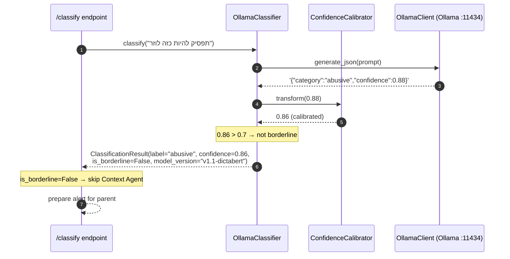
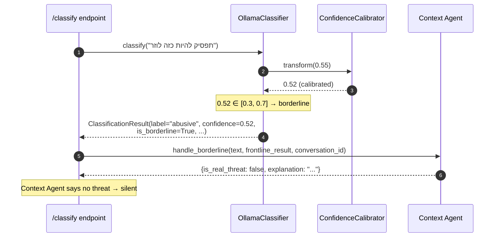

# Frontline Classifier — Low-Level Design

**Module ID:** classifier
**Owner:** TBD
**Status:** Draft for Meeting 4
**PRD reference:** PRD §8.1
**Last updated:** 2026-05-31

---

## 1. Purpose & Scope

The Frontline Classifier is the fast, cheap, local first-pass decision layer. Every message — whether it arrived as text or was extracted from a screenshot by the OCR pipeline — passes through this module before any external LLM call is made. It runs entirely on-device (no API cost, no latency from network) and returns a 5-label classification plus a confidence score that determines whether the Context Agent is invoked.

**Scope (in):**
- Fine-tuning DictaBERT-base on SinaLab Offensive-Hebrew + synthetic conversation data (training pipeline in `training/`)
- Inference path: `server/app/classifier.py` → Ollama → `offensive-hebrew` GGUF model
- 5-label schema: `abusive / hate / violence / pornographic / non_offensive`
- Confidence calibration (softmax temperature / isotonic regression)
- Borderline zone detection (confidence ∈ [0.3, 0.7]) → signal to Context Agent
- Model version negotiation (`v1` stand-in Qwen → `v1.1` real DictaBERT)

**Scope (out):**
- Context-aware reasoning (Context Agent module — PRD §8.3)
- Image processing (OCR pipeline — PRD §8.2)
- Notification delivery (Notification Service — PRD §8.4)

System context: see [architecture_diagrams.md](../../architecture_diagrams.md) — this module is the "DictaBERT-base frontline classifier" node inside the HomeNet boundary.

---

## 2. Public Interface (API Contract / Protocol)

### 2.1 Protocol definition

```python
# server/app/classifier_protocol.py  (new file — extraction seam)
from typing import Protocol

class TextClassifier(Protocol):
    async def classify(self, text: str) -> "ClassificationResult":
        ...

    async def is_alive(self) -> bool:
        ...

    @property
    def model_version(self) -> str:
        ...
```

The existing `classify_text()` function in `server/app/classifier.py` will be wrapped in a class implementing this Protocol. The function form is kept for backward compatibility.

### 2.2 ClassificationResult output schema

```python
# server/app/schemas.py  (extend existing file)
from dataclasses import dataclass
from typing import Literal

Category = Literal["abusive", "hate", "violence", "pornographic", "non_offensive"]

@dataclass(frozen=True)
class ClassificationResult:
    label: Category            # SinaLab 5-label schema
    confidence: float          # calibrated probability, 0.0–1.0
    model_version: str         # e.g. "v1.0-standin" or "v1.1-dictabert"
    latency_ms: float          # wall-clock inference time
    is_borderline: bool        # True when confidence ∈ [0.3, 0.7]
    raw_confidence: float      # pre-calibration softmax score (for diagnostics)
```

`is_borderline` is derived from `confidence` against the configured thresholds. The FastAPI endpoint inspects `is_borderline` to decide whether to invoke the Context Agent.

### 2.3 Input contract

| Field | Constraint | Error |
|---|---|---|
| `text` | Non-empty UTF-8 string | `ValueError("empty text")` |
| `text` | ≤ 512 tokens (DictaBERT max sequence length) | Truncate silently + log warning |
| `text` | Hebrew or mixed Hebrew/English | No language check in MVP (model handles both) |

---

## 2.5 Interface boundary & isolation guarantees

**The Port (Protocol):** `TextClassifier` — the ONLY symbol the server core imports from this module. The triage router and the `/classify` handler depend on `TextClassifier`, never on `OllamaDictaBertClassifier` or `HuggingFaceClassifier` directly.

```python
# server/app/classifier/protocol.py
from typing import Protocol, runtime_checkable

@runtime_checkable
class TextClassifier(Protocol):
    async def classify(self, text: str) -> "ClassificationResult":
        """Classify a single Hebrew/English text into the 5-label schema.
        Never raises on model failure — returns ClassificationResult with
        label='non_offensive', confidence=0.5, error=True (review flag)."""
        ...

    async def is_alive(self) -> bool: ...

    @property
    def model_version(self) -> str: ...
```

`ClassificationResult` (frozen dataclass; see §2.2) is part of the port — every adapter must return this exact shape, including `is_borderline` derivation from the configured thresholds.

**Concrete adapters that satisfy this Protocol:**

| Adapter | When to use | Lines to change to enable |
|---|---|---|
| `OllamaDictaBertClassifier` | Default — what `server/app/classifier.py` does today; Ollama-served `offensive-hebrew:v1` (stand-in Qwen → real DictaBERT GGUF) | (default — already wired) |
| `HuggingFaceClassifier` | Meeting 5+ — direct `AutoModelForSequenceClassification` load; ~2× faster than Ollama; needed because BERT-family encoders are not natively supported by `llama.cpp`'s GGUF converter | one line in `main.py` `lifespan()`; ensure `DICTABERT_MODEL_PATH` env var points to the checkpoint |
| `DictaLm2Classifier` | PRD §12 risk row "DictaBERT-base won't cross F1 0.78"; upgrade path to `dicta-il/dictalm2.0-instruct` 7B via QLoRA, served through Ollama again | one line + `OLLAMA_MODEL=dictalm2-offensive:v1` in `.env` |
| `StubClassifier` | Unit and contract tests; returns fixture-driven labels and confidences | injected by test fixture |

**Isolation rules (what this module MAY and MUST NOT touch):**
- May import: stdlib, `httpx`, `ollama_client`, `transformers`, `torch`, `scikit-learn` (calibration), `prompt.py`, `calibration.py`, this module's settings.
- MUST NOT import: any concrete class from another module — including `OcrBackend` implementations, the Context Agent, the alerts module, or the triage router.
- MUST NOT import: `server.app.main` or anything in the composition root.
- May import the `Category` type alias from `server/app/schemas.py` (shared schema only — not a concrete module).

**Contract test:** `tests/contracts/test_text_classifier_contract.py` — every adapter is parametrized through this suite. Fixtures provide: a clearly offensive Hebrew sentence, a clearly benign Hebrew sentence, a borderline mixed-language sentence, and an empty string. The suite asserts: (a) `ClassificationResult.label` ∈ `Category` literal, (b) `confidence` ∈ [0.0, 1.0], (c) `is_borderline` matches the configured threshold computation, (d) empty input raises `ValueError("empty text")` (the ONLY exception every adapter is allowed to raise), (e) model crash path returns `error=True` rather than propagating the exception, (f) p99 latency budget per adapter (Ollama-Qwen-7B ≤ 80 ms on CPU per `classifier.py` measurement; HF DictaBERT-base ≤ 100 ms; DictaLM-2.0 ≤ 200 ms via QLoRA Ollama).

**Swap demo — Ollama → HuggingFace direct:**

```python
# Before — server/app/main.py lifespan()
classifier: TextClassifier = OllamaDictaBertClassifier(
    settings.classifier, ollama_client=app.state.ollama
)

# After
classifier: TextClassifier = HuggingFaceClassifier(settings.classifier)
```

The triage router (which takes a `ClassificationResult`, not a classifier instance), the `/classify` handler, the calibrator, the audit log, and the Context Agent escalation path all keep working unchanged.

---

## 3. Internal Design

### 3.1 Package layout

```
server/app/
├── classifier.py             # classify_text() function — exists; wrap in OllamaClassifier class
├── classifier_protocol.py    # NEW: TextClassifier Protocol + ClassificationResult
├── ollama_client.py          # OllamaClient — exists; unchanged
├── prompt.py                 # build_user_prompt() + parse_model_output() — exists; extend
├── calibration.py            # NEW: TemperatureScaler / IsotonicCalibrator
└── schemas.py                # Category type alias + ClassificationResult — extend existing

training/
├── configs/train.yaml        # QLoRA hyperparameters (exists; update base_model)
├── prepare_data.py           # Dataset download + split (exists)
├── train_lora.py             # SFTTrainer QLoRA loop (exists)
├── evaluate.py               # macro-F1 + confusion matrix (exists)
├── export_gguf.py            # merge adapter → GGUF via llama.cpp (exists)
└── calibrate.py              # NEW: fit temperature/isotonic on validation set
```

### 3.2 Key classes

#### `OllamaClassifier` (wraps existing `classify_text()`)

```python
# server/app/classifier.py  (refactored)
import time
import structlog
from .classifier_protocol import TextClassifier, ClassificationResult
from .ollama_client import OllamaClient
from .prompt import build_user_prompt, parse_model_output
from .calibration import ConfidenceCalibrator
from .config import ClassifierSettings

logger = structlog.get_logger("shomer.classifier")

class OllamaClassifier:
    """Wraps OllamaClient for text classification.

    Implements TextClassifier Protocol. Stateless per-call except for
    the shared OllamaClient HTTP connection pool.
    """

    def __init__(
        self,
        ollama: OllamaClient,
        settings: ClassifierSettings,
        calibrator: ConfidenceCalibrator | None = None,
    ):
        self._ollama = ollama
        self._settings = settings
        self._calibrator = calibrator
        self._model_version = settings.model_version

    async def classify(self, text: str) -> ClassificationResult:
        if not text.strip():
            raise ValueError("empty text")
        text = self._maybe_truncate(text)
        t0 = time.perf_counter()
        prompt = build_user_prompt(text)
        raw = await self._ollama.generate_json(prompt)
        latency_ms = (time.perf_counter() - t0) * 1000
        parsed = parse_model_output(raw)
        raw_conf = parsed["confidence"]
        conf = self._calibrator.transform(raw_conf) if self._calibrator else raw_conf
        is_borderline = (
            self._settings.borderline_low <= conf <= self._settings.borderline_high
        )
        return ClassificationResult(
            label=parsed["category"],
            confidence=conf,
            model_version=self._model_version,
            latency_ms=latency_ms,
            is_borderline=is_borderline,
            raw_confidence=raw_conf,
        )

    async def is_alive(self) -> bool:
        return await self._ollama.is_alive()

    @property
    def model_version(self) -> str:
        return self._model_version

    def _maybe_truncate(self, text: str, max_chars: int = 2048) -> str:
        # Rough approximation: 512 tokens ≈ 2048 chars for Hebrew/English mix.
        # Tokenizer-exact truncation is handled by the model's context window.
        if len(text) > max_chars:
            logger.warning("text_truncated", original_len=len(text), max_chars=max_chars)
            return text[:max_chars]
        return text
```

#### `ConfidenceCalibrator` (new, in `server/app/calibration.py`)

```python
# server/app/calibration.py
import pickle
from pathlib import Path
from typing import Literal

CalibrationMethod = Literal["temperature", "isotonic", "none"]

class ConfidenceCalibrator:
    """Post-hoc confidence calibration for the frontline classifier.

    Two methods:
    - temperature:  score' = softmax(logits / T); T fit on validation set.
    - isotonic:     sklearn.isotonic.IsotonicRegression fit on (raw_conf, y_true).
    - none:         identity transform (pass-through for stand-in model).

    Fitted calibrators are serialised to server/models/calibrator.pkl
    and loaded at server startup. If the file is absent, the calibrator
    is skipped (raw confidence used).
    """

    def __init__(self, method: CalibrationMethod = "none", pkl_path: Path | None = None):
        self.method = method
        self._model = None
        if pkl_path and pkl_path.exists():
            with open(pkl_path, "rb") as f:
                self._model = pickle.load(f)

    def transform(self, raw_conf: float) -> float:
        if self._model is None or self.method == "none":
            return raw_conf
        if self.method == "temperature":
            # Temperature scaling: model stores T
            import math
            T = self._model
            # Apply to single value (simplified — real impl uses logits array)
            return 1 / (1 + math.exp(-math.log(raw_conf / (1 - raw_conf + 1e-8)) / T))
        if self.method == "isotonic":
            return float(self._model.predict([raw_conf])[0])
        return raw_conf
```

**Why calibration matters for the Context Agent:** The borderline zone (0.3–0.7) must have reliable probability estimates. Uncalibrated neural network outputs tend to be overconfident near the boundaries (ECE > 0.15 is common). An isotonic regression fit on the validation set brings ECE down to ~0.05, making the 0.3 and 0.7 thresholds meaningful. The calibration is fitted in `training/calibrate.py` after the main training run and saved to `server/models/calibrator.pkl`.

### 3.3 Training pipeline (DictaBERT for classification)

The existing `training/` scripts target generative QLoRA (Unsloth + SFTTrainer). For DictaBERT-base (an encoder-only model), the pipeline needs an additional classification head. The training approach:

**Option A — Sequence classification fine-tune (recommended for Meeting 5):**
```python
# training/train_dictabert.py  (new script — replaces train_lora.py for this model)
from transformers import (
    AutoTokenizer, AutoModelForSequenceClassification, TrainingArguments, Trainer
)
from datasets import load_dataset

model = AutoModelForSequenceClassification.from_pretrained(
    "dicta-il/dictabert",
    num_labels=5,
    id2label={0: "non_offensive", 1: "abusive", 2: "hate",
              3: "violence", 4: "pornographic"},
)
# Fine-tune with cross-entropy loss, no QLoRA needed (110M params fits in VRAM)
```

**Why not QLoRA for DictaBERT-base:** DictaBERT-base is 110M parameters. At FP32 that is ~440 MB; at BF16 ~220 MB. It fits entirely in VRAM and system RAM without quantization. QLoRA is designed for 7B+ generative models. Applying it to a 110M encoder adds adapter overhead (r=16, ~2.5M params) with no memory saving — the base model already fits. Train the full model in BF16 with `AdamW + cosine scheduler`.

**Hyperparameter baseline (DictaBERT classification fine-tune):**

| Hyperparameter | Value | Rationale |
|---|---|---|
| `base_model` | `dicta-il/dictabert` | Locked in `architecture.decision.md` D-Arch-Model |
| `num_labels` | 5 | SinaLab schema |
| `max_seq_length` | 128 | SinaLab tweets are short; 128 covers 99th percentile |
| `learning_rate` | 2e-5 | Standard BERT fine-tune LR (Devlin et al. 2019) |
| `per_device_train_batch_size` | 32 | Fits in 16GB VRAM with DictaBERT-base |
| `num_train_epochs` | 5 | SinaLab is ~15K examples; 5 epochs ≈ 75K steps |
| `warmup_ratio` | 0.1 | 10% of steps for LR warmup |
| `weight_decay` | 0.01 | L2 regularization |
| `lr_scheduler_type` | `cosine` | Smooth decay, better than linear for classification |
| `eval_strategy` | `epoch` | Checkpoint best-F1 model each epoch |
| `metric_for_best` | `macro_f1` | PRD §8.1 target metric |
| `bf16` | `true` | RTX 5080 supports BF16; faster than FP16 on Blackwell |
| `seed` | `42` | Reproducibility |

**Eval split strategy:** SinaLab provides a fixed test split. Use `80/10/10` train/validation/test from the labeled examples. Validation is used for early stopping and calibration; test is held out until Meeting 8. The synthetic conversation data (Meeting 6) is added only to the train split.

### 3.4 Export path: HuggingFace → GGUF → Ollama

The existing `training/export_gguf.py` handles the export. Key change for DictaBERT: DictaBERT is an encoder, not a decoder — `llama.cpp`'s `convert_hf_to_gguf.py` does not support BERT-family encoders natively.

**Two options for serving:**
1. **Direct HuggingFace Inference (recommended for Meeting 5):** Load `AutoModelForSequenceClassification` directly in the FastAPI server via `transformers`; no Ollama, no GGUF. Ollama wrapper (`ollama_client.py`) is bypassed by a new `HuggingFaceClassifier` implementing the same `TextClassifier` Protocol.
2. **ONNX export + FastAPI:** Export to ONNX via `optimum`; faster CPU inference (~30ms vs ~50ms).

The `v1.0-standin` model (Qwen via Ollama) is replaced by `v1.1-dictabert` which loads directly via `transformers`. The `OllamaClient` path remains available for the stand-in and for any future generative models.

**Model version negotiation:**

```python
# server/app/main.py startup logic
if settings.classifier_model_version == "v1.0-standin":
    classifier = OllamaClassifier(ollama_client, settings)
elif settings.classifier_model_version == "v1.1-dictabert":
    classifier = HuggingFaceClassifier(settings)
else:
    raise RuntimeError(f"Unknown model version: {settings.classifier_model_version}")
```

Both implement `TextClassifier` Protocol; endpoint code is version-agnostic.

### 3.5 Extraction seam

`OllamaClassifier` and `HuggingFaceClassifier` depend only on `TextClassifier` Protocol, `OllamaClient`, and HuggingFace `transformers`. Neither imports FastAPI, the OCR module, or the Context Agent. Clean boundary allows extraction to a standalone `POST /classify-text` service with zero changes to consumers.

---

## 4. Sequence Diagrams

### 4.1 Happy path — confident classification (no Context Agent)



### 4.2 Borderline path — escalate to Context Agent



### 4.3 Model failure fallback

```mermaid
sequenceDiagram
    autonumber
    participant EP as /classify endpoint
    participant Cls as OllamaClassifier
    participant Ollama as OllamaClient

    EP->>Cls: classify(text)
    Cls->>Ollama: generate_json(prompt)
    Ollama--xCls: httpx.ConnectError (Ollama down)
    Note over Cls: Model crash fallback
    Cls-->>EP: ClassificationResult(label="non_offensive",<br/>confidence=0.5, error=True, model_version="error")
    Note over EP: error=True → mark for human review;<br/>emit alert with review_flag=True (PRD §8.1 failure)
```

---

## 5. Data Model

### 5.1 Training data lineage

```
SinaLab/Offensive-Hebrew (HuggingFace)
    ~15,000 Hebrew tweets, 4 binary labels (abusive, hate, violence, pornographic)
    ↓ training/prepare_data.py
    data/train.jsonl (80% — ~12,000)
    data/validation.jsonl (10% — ~1,500)
    data/test.jsonl (10% — ~1,500) ← held out for Meeting 8

[Meeting 6] Synthetic Hebrew conversation data
    ~500–1,000 synthetic short dialogues (GPT-4o-mini generated)
    ↓ merged into data/train.jsonl (augment only — test split unchanged)

training/train_dictabert.py
    ↓ outputs/dictabert-offensive/
    model.safetensors (BF16, ~220 MB)
    config.json
    tokenizer files

training/calibrate.py
    ↓ server/models/calibrator.pkl (isotonic regression on validation set)
```

### 5.2 Label mapping (SinaLab → 5-label schema)

SinaLab provides 4 binary columns (`abusive`, `hate`, `violence`, `pornographic`). A row is `non_offensive` when all four are 0.

| SinaLab binary pattern | Mapped label | Notes |
|---|---|---|
| `[0,0,0,0]` | `non_offensive` | Most common class (~60%) |
| `[1,0,0,0]` | `abusive` | Personal insults, cursing |
| `[0,1,0,0]` | `hate` | Group-targeted hate speech |
| `[0,0,1,0]` | `violence` | Threats, calls to violence |
| `[0,0,0,1]` | `pornographic` | Sexual content |
| Multi-label (e.g. `[1,1,0,0]`) | highest-severity label | Priority: violence > hate > pornographic > abusive |

Note (resolved 2026-05-31, review.md G-02): the canonical label spelling is `"non_offensive"` (underscore), matching `server/app/schemas.py:7`, `server/app/prompt.py:8`, the SDK LLD, and the Android client LLD. Any earlier hyphenated form (`"none-offensive"`) is legacy and must be normalized at adapter boundaries (e.g. if a future external benchmark uses the hyphen). The `parse_model_output()` normalization step is retained as a defensive measure for malformed model outputs only.

---

## 6. Observability

### 6.1 Logger

Module logger: `shomer.classifier` via `structlog`.

```python
import structlog
logger = structlog.get_logger("shomer.classifier")
```

**Three example log lines (JSON-structured):**

```json
{"event": "classification_complete", "trace_id": "abc123", "module": "classifier",
 "label": "abusive", "confidence": 0.86, "raw_confidence": 0.88,
 "is_borderline": false, "latency_ms": 48.3, "model_version": "v1.1-dictabert"}

{"event": "classification_borderline", "trace_id": "def456", "module": "classifier",
 "label": "abusive", "confidence": 0.52, "is_borderline": true,
 "latency_ms": 51.7, "model_version": "v1.1-dictabert", "escalated_to": "context_agent"}

{"event": "classification_error", "trace_id": "ghi789", "module": "classifier",
 "error": "ConnectError", "error_detail": "Ollama unreachable at localhost:11434",
 "fallback": "non_offensive_0.5_review_flag", "model_version": "error"}
```

Fields on every classifier log line: `trace_id`, `module="classifier"`, `event`, `label`, `confidence`, `latency_ms`, `model_version`.

### 6.2 Config

`ClassifierSettings` (Pydantic-settings):

| Name | Type | Default | Env var | Description | Secret? |
|---|---|---|---|---|---|
| `classifier_model_version` | `str` | `"v1.0-standin"` | `CLASSIFIER_MODEL_VERSION` | `"v1.0-standin"` uses Ollama; `"v1.1-dictabert"` uses HuggingFace local | No |
| `ollama_base_url` | `str` | `"http://localhost:11434"` | `OLLAMA_BASE_URL` | Ollama API endpoint | No |
| `ollama_model` | `str` | `"offensive-hebrew:v1"` | `OLLAMA_MODEL` | Ollama model tag | No |
| `classifier_timeout_s` | `float` | `60.0` | `CLASSIFIER_TIMEOUT_S` | Per-call timeout for Ollama | No |
| `borderline_low` | `float` | `0.3` | `BORDERLINE_LOW` | Lower bound of borderline zone | No |
| `borderline_high` | `float` | `0.7` | `BORDERLINE_HIGH` | Upper bound of borderline zone | No |
| `calibration_method` | `str` | `"none"` | `CALIBRATION_METHOD` | `"none"` / `"temperature"` / `"isotonic"` | No |
| `calibration_pkl_path` | `str` | `"server/models/calibrator.pkl"` | `CALIBRATION_PKL_PATH` | Path to fitted calibrator | No |
| `dictabert_model_path` | `str` | `"server/models/dictabert-offensive"` | `DICTABERT_MODEL_PATH` | Local HuggingFace checkpoint dir | No |

### 6.3 Metrics

| Metric name | Type | Labels | What it answers | PRD §9 NFR |
|---|---|---|---|---|
| `classifier_requests_total` | Counter | `label, model_version, outcome={ok,error}` | Classification volume by label and version | — |
| `classifier_latency_seconds` | Histogram | `model_version` | Is p99 < 100ms? (PRD §8.1 NFR) | Latency p99 < 100ms |
| `classifier_confidence_score` | Histogram | `label, calibrated={true,false}` | Confidence distribution — is calibration working? | CER proxy |
| `classifier_borderline_total` | Counter | `label` | What fraction escalates to Context Agent? | Cost control |
| `classifier_error_total` | Counter | `error_type` | How often does the model crash? | Availability ≥ 99% |
| `classifier_calibration_enabled` | Gauge | `method` | Is calibration active? | Observability |

---

## 7. NFR Targets & Test Plan

### 7.1 Latency — p99 < 100ms (PRD §8.1)

**Target:** p99 inference latency < 100ms on CPU (RTX 5080 used for training; frontline inference on CPU).

**Test approach:**
```
pytest server/tests/test_classifier_latency.py
```
- Load `HuggingFaceClassifier` with `dicta-il/dictabert` (or the fine-tuned checkpoint).
- Run `classify()` 200 times on a batch of varied Hebrew texts.
- Assert p99 < 100ms. Assert p50 < 50ms.
- Parameterize over model versions.

**Baseline expectation:** DictaBERT-base forward pass on CPU is ~30–60ms per example at 128 tokens. The 100ms budget includes prompt formatting and result parsing (~5ms overhead).

### 7.2 Accuracy — macro-F1 ≥ 0.78 (PRD §8.1)

**Target:** macro-averaged F1 ≥ 0.78 on SinaLab held-out test split (PRD §8.1, confirmed in `architecture.decision.md` D-Arch-Model).

**Test procedure (Meeting 5):**
1. Train `DictaBERT-base` on `data/train.jsonl` using `training/train_dictabert.py`.
2. Run `training/evaluate.py --test-file data/test.jsonl` to get `classification_report`.
3. Assert `macro avg` row F1 ≥ 0.78.
4. Record per-class F1 for all 5 labels (violence + pornographic are typically harder due to class imbalance in SinaLab).

**Fallback chain (PRD §12 risk row "DictaBERT-base won't cross F1 0.78"):**
- First: upgrade to `DictaBERT-large` (same `transformers` API, same training script, ~330M params → ~1GB VRAM).
- Second: switch to `DictaLM 2.0` (`dicta-il/dictalm2.0-instruct`, 7B generative) — QLoRA needed, uses existing `training/train_lora.py`, but returns to Ollama inference path.

**F1 test is a gate for Meeting 5 sign-off.** If F1 < 0.78, training/architecture changes are made before any integration work starts.

### 7.3 Confidence calibration quality

**Target:** Expected Calibration Error (ECE) < 0.10 after isotonic calibration.

**Test procedure:**
```python
# training/calibrate.py — also used as a test
from calibration_metrics import expected_calibration_error
ece = expected_calibration_error(probs, y_true, n_bins=15)
assert ece < 0.10
```

This is important because the Context Agent escalation threshold (0.3–0.7) is only meaningful if the model's confidence is a reliable probability estimate. Poor calibration means the borderline zone is capturing the wrong examples.

---

## 8. Failure Modes & Fallbacks

| Failure | Detection | Response | PRD alignment |
|---|---|---|---|
| Ollama server unreachable | `httpx.ConnectError` on first call | Return `ClassificationResult(label="non_offensive", confidence=0.5, error=True)`; endpoint marks `review_flag=True` | PRD §8.1 "kshel hamodel koreis" |
| Model returns malformed JSON | `json.JSONDecodeError` in `parse_model_output()` | Regex extraction fallback (already in `prompt.py`); if still fails → `non_offensive, 0.5` | PRD §8.1 graceful degradation |
| Model not found in Ollama registry | `httpx.HTTPStatusError 404` on startup health check | Server logs ERROR and raises at startup; operator must install model before serving | Fail-fast at boot |
| DictaBERT checkpoint missing | `OSError` in `HuggingFaceClassifier.__init__` | Same: fail-fast at boot with clear error message pointing to `DICTABERT_MODEL_PATH` | Operator error — not a runtime fallback |
| Text truncated to 2048 chars | `len(text) > 2048` | Truncate silently, log warning with `original_len`; classify truncated text | PRD §8.1 ≤512 token limit |
| Classification returns None/empty label | `category not in VALID_CATEGORIES` | Default to `non_offensive` (already in `parse_model_output()`) | Defensive parsing |

---

## 9. Deployment & Config

### 9.1 Stand-in model (v1.0, current)

```bash
# Install Qwen stand-in via Ollama
ollama pull qwen2.5:7b-instruct
# Modelfile (server/Modelfile.standin) creates the offensive-hebrew:v1 tag
ollama create offensive-hebrew:v1 -f server/Modelfile.standin
```

Set in `server/.env`:
```
CLASSIFIER_MODEL_VERSION=v1.0-standin
OLLAMA_MODEL=offensive-hebrew:v1
```

### 9.2 Real model (v1.1-dictabert, Meeting 5 target)

```powershell
# In WSL2 — run training
cd /mnt/c/AIDevelopmentCourse/Shomer.AI/training
python train_dictabert.py --config configs/train_dictabert.yaml
# Output saved to: outputs/dictabert-offensive/

# Copy checkpoint to server models dir
cp -r outputs/dictabert-offensive/ /mnt/c/AIDevelopmentCourse/Shomer.AI/server/models/
```

Set in `server/.env`:
```
CLASSIFIER_MODEL_VERSION=v1.1-dictabert
DICTABERT_MODEL_PATH=server/models/dictabert-offensive
CALIBRATION_METHOD=isotonic
CALIBRATION_PKL_PATH=server/models/calibrator.pkl
```

### 9.3 Python dependencies (add to `server/requirements.txt`)

```
transformers>=4.40.0
torch>=2.2.0          # CPU-only wheel sufficient for inference
scikit-learn>=1.3.0   # isotonic calibration
structlog>=24.0.0
pydantic-settings>=2.0.0
```

Training-only dependencies (stay in `training/requirements.txt`, not server):
```
unsloth>=2024.5
trl>=0.8.0
```

---

## 10. Future Extraction Seam

`OllamaClassifier` and `HuggingFaceClassifier` implement `TextClassifier` Protocol. They depend on nothing outside `server/app/classifier_protocol.py`, `ollama_client.py`, `prompt.py`, and `transformers`. Extraction steps:

1. **Wrap in a micro-service:** `POST /classify-text` FastAPI app, returns `ClassificationResult` JSON.
2. **Update caller:** `server/app/main.py` replaces `await classifier.classify(text)` with `await http_client.post("/classify-text", json={"text": text})`.
3. **Scale horizontally:** multiple classifier replicas behind the Gatekeeper load balancer; DictaBERT is stateless, so replicas are trivially spinnable.
4. **Why defer:** at thesis scale (local server, one household), subprocess overhead adds latency without benefit. The Protocol-based interface means extraction is a 1-day change when needed.

---

## 11. Open Questions

| # | Question | Decision needed by |
|---|---|---|
| Q1 | ~~Normalize `"none-offensive"` vs `"non_offensive"`~~ — **RESOLVED 2026-05-31** (review.md G-02). Canonical = `non_offensive` (underscore). Updated in PRD §8.1, this LLD §2.2/§5.2/§5.3/§6.1/§8, and `tasks.json`. | ✅ Done |
| Q2 | Train DictaBERT as a sequence classifier (5-class softmax) vs as an instruction-tuned model prompted for JSON output (like the current stand-in). Softmax gives cleaner calibration; instruction-tuned allows zero-shot extension to new categories. Recommend: sequence classifier for MVP, revisit for Meeting 8 if categories expand. | Meeting 5 |
| Q3 | Should `BORDERLINE_LOW` and `BORDERLINE_HIGH` thresholds be tunable per-request (via query param) or only via env var? Per-request override enables the A/B experiment (context-blind vs context-aware) cleanly. Env-var-only is simpler and sufficient for the gold-set eval at Meeting 8. | Meeting 7 (before gold-set eval) |
| Q4 | `HuggingFaceClassifier` or Ollama for v1.1: Ollama is the existing infrastructure and avoids adding `torch` to server requirements. HuggingFace direct gives ~2× faster inference and exact control over temperature scaling. Recommend HuggingFace direct for accuracy + latency. | Meeting 5 (training complete) |
| Q5 | Class imbalance in SinaLab (violence + pornographic are rare). Weighted cross-entropy vs oversampling vs class-balanced batch sampler. Baseline: use `compute_class_weight("balanced")` in `Trainer`; measure per-class F1 and decide if additional balancing is needed. | Meeting 5 |
