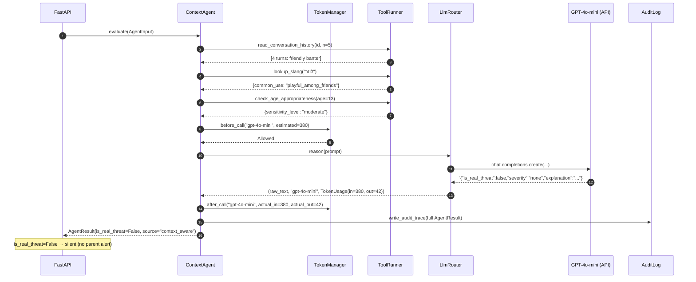
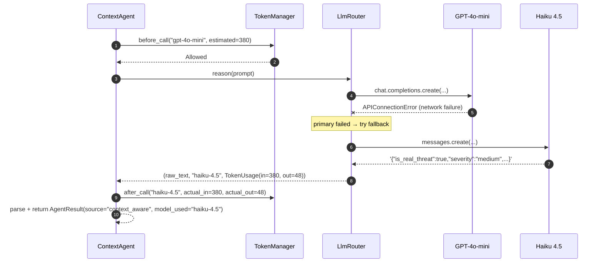
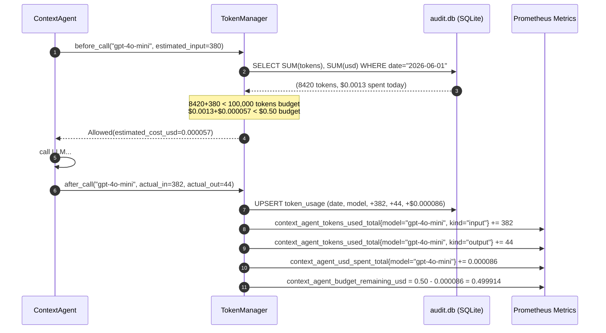

# Context Agent — Low-Level Design

**Module ID:** context_agent
**Owner:** TBD
**Status:** Draft for Meeting 4
**PRD reference:** PRD §8.3
**Last updated:** 2026-05-31

---

## 1. Purpose & Scope

The Context Agent is the academic contribution of this thesis. It takes borderline classification results (confidence ∈ [0.3, 0.7] from the frontline classifier) and applies LLM-based reasoning over the full conversation context — the current message plus up to 5 prior turns — to decide whether the flagged message is a real threat or a false positive.

This is the mechanism that the Research Question measures directly:

> "Does adding conversational context to Hebrew bullying classification reduce the false-positive rate, without degrading recall?"

The Context Agent makes the A/B experiment possible: toggling `CONTEXT_AGENT_ENABLED=false` gives the context-blind (frontline-only) baseline; `true` gives the context-aware treatment. Every invocation records both the frontline-only prediction and the final decision so the Δ-FPR can be computed at Meeting 8.

**Scope (in):**
- Tool definitions for `read_conversation_history`, `lookup_slang`, `check_age_appropriateness`
- Prompt template (system + user, Hebrew-first)
- LLM router: GPT-4o-mini primary → Haiku 4.5 fallback → frontline-only with `review_flag`
- 5-second timeout enforcement per PRD §8.3
- JSON output validation via Pydantic
- Audit-trace recording (all fields required for Meeting 8 gold-set evaluation)
- Stateless design (no persistent memory between calls)
- TokenManager subsection (budget enforcement, cost tracking, Prometheus metrics)

**Scope (out):**
- Persistent conversation memory (not in MVP per PRD §8.3)
- Multi-turn agent loop (single-call reasoning, not an agentic loop)
- Image analysis (Architecture A — out of scope per PRD §11)
- Alert delivery (Notification Service — PRD §8.4)

System context: see [architecture_diagrams.md](../../architecture_diagrams.md) — this module is the "Context Agent (in-process)" node inside the HomeNet boundary, with edges to `SlangDB` (tool calls) and to `GPT-4o-mini` / `Haiku 4.5` (external LLM).

---

## 2. Public Interface (API Contract / Protocol)

### 2.1 Protocol definition

```python
# server/app/context_agent/protocol.py  (new file)
from typing import Protocol
from .schemas import AgentInput, AgentResult

class ContextAgentProtocol(Protocol):
    async def evaluate(self, input: "AgentInput") -> "AgentResult":
        """Evaluate a borderline classification with conversation context.

        Must return within 5 seconds (PRD §8.3 stop condition).
        Never raises on LLM failure — returns review_flag=True instead.
        """
        ...
```

### 2.2 Input schema

```python
# server/app/context_agent/schemas.py  (new file)
from dataclasses import dataclass, field
from typing import Literal

@dataclass(frozen=True)
class ConversationTurn:
    role: Literal["child", "peer"]  # who sent this turn
    text: str                        # raw message text (Hebrew / mixed)
    timestamp_offset_s: int          # seconds before current message (0 = current)

@dataclass(frozen=True)
class AgentInput:
    current_message: str                  # the borderline message to evaluate
    conversation_history: list[ConversationTurn]  # up to 5 prior turns
    child_age: int                        # years; used by check_age_appropriateness
    frontline_label: str                  # label from frontline classifier
    frontline_confidence: float           # raw confidence from frontline
    conversation_id: str                  # for audit log linkage
    trace_id: str                         # request-level trace ID
```

### 2.3 Output schema

```python
@dataclass(frozen=True)
class AgentResult:
    is_real_threat: bool           # final decision (True = send alert to parent)
    severity: Literal["low", "medium", "high", "none"]
    explanation: str               # 1-sentence Hebrew explanation for parent UI
    review_flag: bool              # True when LLM unavailable or result uncertain
    source: Literal[
        "context_aware",           # full context agent reasoning completed
        "frontline_only",          # both LLMs failed; using frontline alone
    ]
    # Audit trace fields (required for Meeting 8 A/B evaluation)
    reasoning: str                 # LLM's raw reasoning chain (or "" if unavailable)
    tools_called: list[str]        # e.g. ["read_conversation_history", "lookup_slang"]
    tokens_used: "TokenUsage"      # see §6.4 TokenManager
    model_used: str                # "gpt-4o-mini" | "haiku-4.5" | "none"
    latency_ms: float
    context_used: bool             # True when history was non-empty AND used in reasoning
    # A/B experiment field
    frontline_prediction: str      # always the frontline-only label (for A/B comparison)
```

```python
@dataclass(frozen=True)
class TokenUsage:
    input_tokens: int
    output_tokens: int
    estimated_usd: float
    model: str
```

---

## 2.5 Interface boundary & isolation guarantees

The Context Agent is the most important swap surface in the system because the research question itself (RQ3) depends on being able to A/B the context-aware reasoner against alternatives. This module therefore exposes **three Protocols** at three different granularities:

1. **`ContextReasoner`** — the whole-module port. Lets the server swap the entire LLM-driven agent for a deterministic rule engine without touching anything outside `lifespan()`.
2. **`LlmClient`** — an internal port used by `LlmContextAgent`. Lets you swap the underlying LLM (GPT-4o-mini ↔ Haiku 4.5 ↔ local Qwen) without touching the agent's prompt assembly, tool orchestration, or output parsing.
3. **`TokenBudgetGuard`** — an independent port for the budget enforcement concern. Lets the budget-tracking and cost-accounting layer be swapped independently of the agent and LLM.

This three-Protocol decomposition is what makes the academic A/B story clean: the agent can be replaced wholesale (RQ3 baseline), the LLM swapped for cost/quality comparison, and the budget guard mocked in tests — all independently.

### Port 1 — `ContextReasoner` (whole-module port)

```python
# server/app/context_agent/protocol.py
from typing import Protocol, runtime_checkable

@runtime_checkable
class ContextReasoner(Protocol):
    async def evaluate(self, input: "AgentInput") -> "AgentResult":
        """Evaluate a borderline classification with conversation context.
        Must return within 5 seconds (PRD §8.3 stop condition).
        Never raises — returns AgentResult(review_flag=True) on any failure."""
        ...
```

| Adapter | When to use | Lines to change to enable |
|---|---|---|
| `LlmContextAgent` | Default — full LLM-driven reasoner with tools + budget guard (the design in §3) | (default — already wired) |
| `RuleBasedReasoner` | Cheap-mode fallback / A/B baseline for RQ3; deterministic decision based on slang-lexicon hits + conversation history valence — zero LLM cost | one line in `main.py` `lifespan()`; no API keys needed |
| `StubReasoner` | Unit and contract tests; returns fixture-driven `AgentResult` | injected by test fixture |

### Port 2 — `LlmClient` (LLM provider port, used inside `LlmContextAgent`)

```python
# server/app/context_agent/llm/protocol.py
from typing import Protocol

class LlmClient(Protocol):
    async def reason(self, prompt: str, max_tokens: int) -> "LlmResponse":
        """Generic JSON-mode reasoning call. Returns raw text + usage.
        Must implement provider-specific timeout and JSON-mode enforcement."""
        ...

    @property
    def model_name(self) -> str: ...
```

| Adapter | When to use | Lines to change to enable |
|---|---|---|
| `GptMiniClient` | Default — OpenAI `gpt-4o-mini` per PRD §8.3 | (default) |
| `HaikuClient` | Anthropic `claude-haiku-4-5` — PRD §8.3 fallback path; or as primary if GPT pricing changes | one line in `main.py` `lifespan()`; rotate API keys |
| `LocalQwenClient` | Future on-prem option — Ollama-served Qwen for privacy / cost reasons | one line + Ollama model pull |
| `StubLlmClient` | Tests | fixture only |

Note that the existing `LlmRouter` class in §3.2 (GPT-primary → Haiku-fallback chain) is itself an implementation of `LlmClient` — it *composes* `GptMiniClient` and `HaikuClient` to produce a single port. Composition over inheritance.

### Port 3 — `TokenBudgetGuard` (independent budget enforcement port)

```python
# server/app/context_agent/token_manager.py
from typing import Protocol

class TokenBudgetGuard(Protocol):
    async def before_call(
        self, model: str, estimated_input_tokens: int
    ) -> "BudgetDecision": ...
    async def after_call(
        self, model: str, actual_input: int, actual_output: int
    ) -> None: ...
```

| Adapter | When to use | Lines to change to enable |
|---|---|---|
| `SqliteTokenManager` | Default — SQLite-backed daily budgets survive server restart (current `TokenManager` in §6.4) | (default) |
| `InMemoryTokenManager` | Tests; no persistence; resets every test case | injected by fixture |
| `RedisTokenManager` | Future multi-replica deployment; shared budget across server instances | one line + Redis URL setting |

**Isolation rules (what this module MAY and MUST NOT touch):**
- May import: stdlib, `openai`, `anthropic`, `pydantic`, `pydantic-settings`, `structlog`, `PyYAML`, `sqlite3` (or `aiosqlite`), this module's settings, and the `ClassificationResult`/`Category` shared schema.
- MUST NOT import: any concrete adapter from another module — no `OllamaDictaBertClassifier`, no `TesseractOcrBackend`, no `FcmNotifier`.
- MUST NOT import: `server.app.main` or anything in the composition root.
- The `LlmContextAgent` MAY import the `LlmClient` and `TokenBudgetGuard` Protocols from this module's own sub-packages — internal-to-module Protocol use is fine.

**Contract tests (three suites — one per Protocol):**
- `tests/contracts/test_context_reasoner_contract.py` — parametrized over `LlmContextAgent`, `RuleBasedReasoner`, `StubReasoner`. Asserts: (a) `evaluate()` returns within 5 s wall-clock, (b) `review_flag=True` on any failure (never raises), (c) `frontline_prediction` is always populated for the A/B trail, (d) `source` ∈ `{"context_aware", "frontline_only"}`.
- `tests/contracts/test_llm_client_contract.py` — parametrized over `GptMiniClient`, `HaikuClient`, `LocalQwenClient`, `StubLlmClient`. Asserts: (a) returns valid JSON-mode response or raises a documented exception, (b) populates `LlmResponse.usage` correctly, (c) honours `max_tokens`.
- `tests/contracts/test_token_budget_guard_contract.py` — parametrized over `SqliteTokenManager`, `InMemoryTokenManager`. Asserts: (a) `before_call` denies when over budget, (b) `after_call` updates totals atomically, (c) midnight UTC reset.

**Swap demo 1 — Swap the LLM provider (GPT-4o-mini → Haiku 4.5):**

```python
# Before — server/app/main.py lifespan()
llm: LlmClient = GptMiniClient(settings.context_agent.openai)
# After
llm: LlmClient = HaikuClient(settings.context_agent.anthropic)

# The agent itself is unchanged:
context_agent: ContextReasoner = LlmContextAgent(
    llm=llm, budget=budget, tools=tool_runner, settings=settings.context_agent
)
```

**Swap demo 2 — Replace the whole reasoner with a rule engine (RQ3 cheap baseline):**

```python
# Before
context_agent: ContextReasoner = LlmContextAgent(llm, budget, tool_runner, settings)
# After
context_agent: ContextReasoner = RuleBasedReasoner(
    slang_lexicon=app.state.slang_db, settings=settings.context_agent
)
```

The triage router (which calls `context_agent.evaluate(input)` typed by the `ContextReasoner` Protocol), the `/classify` handler, the audit log, and the A/B switch all keep working unchanged. Zero LLM cost in this mode.

---

## 3. Internal Design

### 3.1 Package layout

```
server/app/context_agent/
├── __init__.py
├── protocol.py         # ContextAgentProtocol + re-exports
├── schemas.py          # AgentInput, AgentResult, ConversationTurn, TokenUsage
├── agent.py            # ContextAgent class — main implementation
├── tools.py            # tool functions: read_history, lookup_slang, check_age
├── prompt.py           # system + user prompt template builder
├── llm_router.py       # GPT-4o-mini → Haiku fallback logic
├── output_parser.py    # Pydantic model + JSON validation
├── token_manager.py    # TokenManager class (see §6.4)
├── token_prices.yaml   # price table per model per token kind
└── config.py           # ContextAgentSettings (Pydantic-settings)

server/
└── audit.db            # SQLite backing store for TokenManager (runtime-created)
```

### 3.2 Key classes

#### `ContextAgent` (main class, `agent.py`)

```python
import asyncio
import time
import structlog
from .protocol import ContextAgentProtocol
from .schemas import AgentInput, AgentResult, TokenUsage
from .tools import ToolRunner
from .llm_router import LlmRouter
from .output_parser import parse_agent_response
from .token_manager import TokenManager, Allowed, DeniedBudgetExhausted
from .config import ContextAgentSettings

logger = structlog.get_logger("shomer.context_agent")

class ContextAgent:
    """Single-call, stateless context reasoning over borderline classifications."""

    TIMEOUT_S = 5.0  # hard stop per PRD §8.3

    def __init__(
        self,
        settings: ContextAgentSettings,
        tool_runner: ToolRunner,
        llm_router: LlmRouter,
        token_manager: TokenManager,
    ): ...

    async def evaluate(self, input: AgentInput) -> AgentResult:
        t0 = time.perf_counter()
        # 1. Gather tool context (local — no LLM cost)
        history = await self._tool_runner.read_conversation_history(
            input.conversation_id, n=5
        )
        slang_meta = await self._tool_runner.lookup_slang(input.current_message)
        age_meta = await self._tool_runner.check_age_appropriateness(input.child_age)

        # 2. Build prompt
        prompt_text = build_prompt(input, history, slang_meta, age_meta)
        estimated_tokens = estimate_tokens(prompt_text)

        # 3. Token budget check
        budget_check = await self._token_manager.before_call(
            model=self._settings.primary_llm, estimated_input_tokens=estimated_tokens
        )
        if isinstance(budget_check, DeniedBudgetExhausted):
            return self._budget_exhausted_result(input, t0)

        # 4. LLM reasoning (with timeout)
        try:
            raw_response, model_used, usage = await asyncio.wait_for(
                self._llm_router.reason(prompt_text),
                timeout=self.TIMEOUT_S,
            )
        except asyncio.TimeoutError:
            logger.warning("context_agent_timeout", trace_id=input.trace_id,
                           timeout_s=self.TIMEOUT_S)
            return self._fallback_result(input, t0, reason="timeout")
        except Exception as exc:
            logger.error("context_agent_llm_error", trace_id=input.trace_id, error=str(exc))
            return self._fallback_result(input, t0, reason="llm_error")

        # 5. Record actual usage
        await self._token_manager.after_call(
            model=model_used,
            actual_input=usage.input_tokens,
            actual_output=usage.output_tokens,
        )

        # 6. Parse + validate JSON output
        parsed = parse_agent_response(raw_response, input)

        latency_ms = (time.perf_counter() - t0) * 1000
        logger.info("context_agent_complete",
                    trace_id=input.trace_id, model_used=model_used,
                    is_real_threat=parsed.is_real_threat, latency_ms=latency_ms,
                    context_used=bool(history), tokens=usage.input_tokens + usage.output_tokens)

        return AgentResult(
            **parsed.__dict__,
            model_used=model_used,
            tokens_used=usage,
            latency_ms=latency_ms,
            context_used=bool(history),
            frontline_prediction=input.frontline_label,
            source="context_aware",
        )
```

#### `LlmRouter` (`llm_router.py`)

```python
class LlmRouter:
    """Try GPT-4o-mini first; on any failure, try Haiku 4.5; both fail → raise."""

    def __init__(self, primary_client, fallback_client, settings: ContextAgentSettings):
        self._primary = primary_client   # OpenAI async client
        self._fallback = fallback_client # Anthropic async client
        self._settings = settings

    async def reason(
        self, prompt: str
    ) -> tuple[str, str, TokenUsage]:
        """Returns (raw_response_text, model_used, token_usage)."""
        try:
            response = await self._primary.chat.completions.create(
                model="gpt-4o-mini",
                messages=[{"role": "user", "content": prompt}],
                response_format={"type": "json_object"},
                temperature=0.1,
                max_tokens=512,
            )
            usage = TokenUsage(
                input_tokens=response.usage.prompt_tokens,
                output_tokens=response.usage.completion_tokens,
                estimated_usd=self._settings.token_manager.estimate_cost(
                    "gpt-4o-mini", response.usage.prompt_tokens,
                    response.usage.completion_tokens
                ),
                model="gpt-4o-mini",
            )
            return response.choices[0].message.content, "gpt-4o-mini", usage
        except Exception as primary_exc:
            logger.warning("primary_llm_failed", error=str(primary_exc),
                           fallback="haiku-4.5")
            # Fallback to Haiku
            response = await self._fallback.messages.create(
                model="claude-haiku-4-5",
                messages=[{"role": "user", "content": prompt}],
                max_tokens=512,
            )
            usage = TokenUsage(
                input_tokens=response.usage.input_tokens,
                output_tokens=response.usage.output_tokens,
                estimated_usd=self._settings.token_manager.estimate_cost(
                    "haiku-4.5", response.usage.input_tokens,
                    response.usage.output_tokens
                ),
                model="haiku-4.5",
            )
            return response.content[0].text, "haiku-4.5", usage
            # If Haiku also fails, the exception propagates to ContextAgent.evaluate()
            # which catches it and returns _fallback_result()
```

#### `ToolRunner` (`tools.py`)

```python
class ToolRunner:
    """Executes the 3 Context Agent tools. All are local — no LLM cost."""

    def __init__(self, db_path: str, slang_lexicon_path: str):
        self._db_path = db_path
        self._slang_path = slang_lexicon_path

    async def read_conversation_history(
        self, conversation_id: str, n: int = 5
    ) -> list[ConversationTurn]:
        """Read the last n turns for this conversation from audit.db."""
        # asyncio.to_thread wraps the sqlite3 blocking call
        ...

    async def lookup_slang(self, text: str) -> dict:
        """Check words in text against the local slang lexicon.
        Returns {word: {meaning, common_use, valence}} for matched words."""
        ...

    async def check_age_appropriateness(self, child_age: int) -> dict:
        """Return sensitivity profile for this age group.
        Returns {sensitivity_level, thresholds_override} from a static config table."""
        ...
```

### 3.3 Tool JSON schemas (for LLM function-calling reference)

These schemas document the contract between the prompt and the tool results injected into the LLM context. They are not OpenAI function-calling schemas (we use prompt-based tool injection, not the function-calling API, to avoid vendor lock-in and to keep the prompt fully inspectable).

**`read_conversation_history` result:**
```json
{
  "tool": "read_conversation_history",
  "result": {
    "turns": [
      {"role": "child", "text": "מה אתה עושה היום", "seconds_ago": 120},
      {"role": "peer", "text": "כלום, רק משחק",   "seconds_ago": 90},
      {"role": "child", "text": "אז תבוא",          "seconds_ago": 60},
      {"role": "peer", "text": "אני לוזר סתם",      "seconds_ago": 30}
    ],
    "turn_count": 4
  }
}
```

**`lookup_slang` result:**
```json
{
  "tool": "lookup_slang",
  "result": {
    "matches": [
      {
        "word": "לוזר",
        "meaning": "loser",
        "common_use": "playful_insult_among_friends",
        "valence": "neutral_to_negative",
        "age_group": "13-18"
      }
    ]
  }
}
```

**`check_age_appropriateness` result:**
```json
{
  "tool": "check_age_appropriateness",
  "result": {
    "child_age": 13,
    "sensitivity_level": "moderate",
    "notes": "Age 13: typical peer banter normalized; sustained insults still flagged"
  }
}
```

### 3.4 Prompt template

The prompt is assembled in Hebrew. The system prompt establishes role and output schema; the user prompt injects the tool results and current message.

```python
SYSTEM_PROMPT = """אתה עוזר לזיהוי בריונות דיגיטלית בעברית.
תפקידך לנתח הודעה אחת בתוך הקשר שיחה ולהחליט: האם זהו איום אמיתי — או שיחה תמימה שנראית פוגענית מחוץ להקשר?

כללים:
- בדוק את כל ההיסטוריה לפני שאתה מחליט.
- סלנג נוער (לוזר, מטומטם, מפגר בהקשר ידידותי) הוא לרוב לא בריונות.
- איום חוזר, שנאה ממוקדת, או תוכן מיני — הם סיבה לסמן.
- ציין ONLY valid JSON, בלי טקסט נוסף.

סכמת הפלט הנדרשת:
{
  "is_real_threat": true | false,
  "severity": "none" | "low" | "medium" | "high",
  "explanation": "משפט הסבר אחד בעברית לטיפוס ההורה",
  "reasoning": "שרשרת הנמקה (לצורך audit) — אפשר באנגלית"
}"""

def build_user_prompt(
    input: AgentInput,
    history: list[ConversationTurn],
    slang_meta: dict,
    age_meta: dict,
) -> str:
    history_block = _format_history(history)
    slang_block = _format_slang(slang_meta)
    return f"""## הודעה לניתוח
"{input.current_message}"

## תוצאת המסווג הראשוני
קטגוריה: {input.frontline_label} | ביטחון: {input.frontline_confidence:.2f}

## היסטוריית השיחה (עד 5 תורים אחרונים)
{history_block}

## מידע על מילות סלנג שזוהו
{slang_block}

## פרופיל גיל
גיל הילד: {input.child_age} שנים | רמת רגישות: {age_meta.get('sensitivity_level', 'moderate')}

הנח את ה-JSON בלבד בפלט:"""
```

---

## 4. Sequence Diagrams

### 4.1 Happy path — GPT-4o-mini resolves borderline as not-a-threat



### 4.2 GPT-4o-mini fails — Haiku 4.5 fallback



### 4.3 Both LLMs fail — frontline-only fallback

```mermaid
sequenceDiagram
    autonumber
    participant Agent as ContextAgent
    participant Router as LlmRouter
    participant GPT as GPT-4o-mini
    participant Haiku as Haiku 4.5
    participant API as FastAPI

    Agent->>Router: reason(prompt)
    Router->>GPT: chat.completions.create(...)
    GPT--xRouter: Timeout
    Router->>Haiku: messages.create(...)
    Haiku--xRouter: Timeout
    Router--xAgent: Exception("all LLMs failed")
    Note over Agent: catch Exception → _fallback_result()
    Agent-->>API: AgentResult(
      is_real_threat=True,
      source="frontline_only",
      review_flag=True,
      model_used="none"
    )
    Note over API: review_flag=True → alert parent with "needs human review" tag
```

### 4.4 Budget exhausted — TokenManager blocks call

```mermaid
sequenceDiagram
    autonumber
    participant Agent as ContextAgent
    participant TM as TokenManager

    Agent->>TM: before_call("gpt-4o-mini", estimated=380)
    TM-->>Agent: DeniedBudgetExhausted(reason="daily_usd_budget_exceeded")
    Note over Agent: _budget_exhausted_result()
    Agent-->>Agent: AgentResult(
      source="frontline_only",
      review_flag=True,
      budget_exhausted=True,
      model_used="none"
    )
```

---

## 5. Data Model

### 5.1 Audit trace stored per invocation

Every `AgentResult` is persisted to `audit.db` table `agent_traces` for Meeting 8 evaluation:

```sql
CREATE TABLE agent_traces (
    id           INTEGER PRIMARY KEY AUTOINCREMENT,
    trace_id     TEXT NOT NULL,         -- request-level trace ID
    conversation_id TEXT NOT NULL,
    timestamp    TEXT NOT NULL,         -- ISO 8601
    current_message TEXT,              -- stored for gold-set annotation
    frontline_label TEXT,              -- A/B: context-blind prediction
    frontline_confidence REAL,
    is_real_threat INTEGER,            -- 0/1; NULL if review_flag
    severity     TEXT,
    explanation  TEXT,
    reasoning    TEXT,                 -- LLM reasoning chain (for per-slice analysis)
    tools_called TEXT,                 -- JSON array: ["read_history","lookup_slang"]
    context_used INTEGER,              -- 0/1
    model_used   TEXT,
    input_tokens INTEGER,
    output_tokens INTEGER,
    estimated_usd REAL,
    latency_ms   REAL,
    review_flag  INTEGER,              -- 0/1
    source       TEXT                  -- "context_aware" | "frontline_only"
);
```

This table is the primary data source for Meeting 8 evaluation:
- **A/B comparison:** `SELECT frontline_label, is_real_threat FROM agent_traces` → compute FPR for each condition.
- **Per-slice analysis** (per Sap et al. 2019): filter by `frontline_label`, `child_age` range, or `context_used`.
- **Cost accounting:** `SUM(estimated_usd)` per day for business-plan validation.

### 5.2 Stateless design

The Context Agent holds no in-memory state between calls. The `conversation_history` is read from `audit.db` on each invocation (the `read_conversation_history` tool reads from the same table). This ensures:
- No memory leaks on long-running server
- Correct isolation between concurrent requests
- Clean restart semantics — the audit DB is the only state

---

## 6. Observability

### 6.1 Logger

Module logger: `shomer.context_agent` via `structlog`.

```python
import structlog
logger = structlog.get_logger("shomer.context_agent")
```

**Three example log lines (JSON-structured):**

```json
{"event": "context_agent_complete", "trace_id": "abc123",
 "module": "context_agent", "model_used": "gpt-4o-mini",
 "is_real_threat": false, "latency_ms": 1840.2,
 "tokens_in": 382, "tokens_out": 44, "cost_usd": 0.000084,
 "context_used": true, "tools_called": ["read_conversation_history", "lookup_slang"]}

{"event": "context_agent_fallback", "trace_id": "def456",
 "module": "context_agent", "reason": "timeout",
 "timeout_s": 5.0, "model_attempted": "gpt-4o-mini",
 "fallback_applied": "frontline_only", "review_flag": true}

{"event": "context_agent_budget_exhausted", "trace_id": "ghi789",
 "module": "context_agent", "daily_usd_spent": 0.50,
 "daily_usd_budget": 0.50, "budget_reset_at": "2026-06-01T00:00:00Z",
 "fallback": "frontline_only_budget_exhausted"}
```

Fields on every context_agent log line: `trace_id`, `module="context_agent"`, `event`, `latency_ms`. Model-specific context per event type as shown.

### 6.2 Config

`ContextAgentSettings` (Pydantic-settings):

| Name | Type | Default | Env var | Description | Secret? |
|---|---|---|---|---|---|
| `context_agent_enabled` | `bool` | `True` | `CONTEXT_AGENT_ENABLED` | Toggle for A/B experiment (False = context-blind baseline) | No |
| `openai_api_key` | `str` | — | `OPENAI_API_KEY` | OpenAI API key for GPT-4o-mini | **YES** |
| `anthropic_api_key` | `str` | — | `ANTHROPIC_API_KEY` | Anthropic API key for Haiku 4.5 | **YES** |
| `primary_llm` | `str` | `"gpt-4o-mini"` | `CONTEXT_AGENT_PRIMARY_LLM` | Primary LLM model string | No |
| `fallback_llm` | `str` | `"claude-haiku-4-5"` | `CONTEXT_AGENT_FALLBACK_LLM` | Fallback LLM model string | No |
| `timeout_s` | `float` | `5.0` | `CONTEXT_AGENT_TIMEOUT_S` | Hard timeout per PRD §8.3 | No |
| `max_history_turns` | `int` | `5` | `CONTEXT_AGENT_MAX_HISTORY_TURNS` | Max prior turns passed to LLM | No |
| `audit_db_path` | `str` | `"server/audit.db"` | `CONTEXT_AGENT_AUDIT_DB` | SQLite path for audit traces + token tracking | No |
| `slang_lexicon_path` | `str` | `"server/data/slang_lexicon.json"` | `SLANG_LEXICON_PATH` | Path to Hebrew slang lexicon JSON | No |
| `daily_token_budget` | `int` | `100_000` | `CONTEXT_AGENT_DAILY_TOKEN_BUDGET` | Max total input+output tokens/day | No |
| `daily_usd_budget` | `float` | `0.50` | `CONTEXT_AGENT_DAILY_USD_BUDGET` | Max USD spend/day across all LLM calls | No |
| `token_prices_path` | `str` | `"server/app/context_agent/token_prices.yaml"` | `TOKEN_PRICES_PATH` | YAML file with per-model per-kind prices | No |

### 6.3 Metrics

All metrics exposed on `/metrics` (Prometheus format).

| Metric name | Type | Labels | What it answers | PRD §9 NFR |
|---|---|---|---|---|
| `context_agent_requests_total` | Counter | `outcome={resolved,fallback,budget_exhausted}` | How often does the agent run vs fall back? | — |
| `context_agent_latency_seconds` | Histogram | `model_used` | Is p99 < 3s? (PRD §8.3 NFR) | Latency p99 < 3s |
| `context_agent_threat_decision_total` | Counter | `decision={threat,not_threat}` | How often does the agent reverse frontline? | ΔFPR measurement |
| `context_agent_tokens_used_total` | Counter | `model, kind={input,output}` | Cumulative token consumption by model | Cost monitoring |
| `context_agent_usd_spent_total` | Counter | `model` | Running USD cost by model | PRD NFR cost/interaction < $0.005 |
| `context_agent_budget_remaining_usd` | Gauge | — | Real-time budget headroom | Budget enforcement |
| `context_agent_tools_called_total` | Counter | `tool` | Which tools are most used? | Research insight |
| `context_agent_error_total` | Counter | `error_type={timeout,api_error,parse_error}` | Failure modes distribution | Availability ≥ 95% |

### 6.4 TokenManager

The TokenManager enforces daily token and USD budgets, tracks actual usage per call, and backs everything to SQLite so budgets survive server restarts.

#### Package layout

```
server/app/context_agent/
├── token_manager.py       # TokenManager class + Allowed/DeniedBudgetExhausted
└── token_prices.yaml      # price table
```

#### Protocol

```python
# server/app/context_agent/token_manager.py

from dataclasses import dataclass
from typing import Protocol, Union

@dataclass(frozen=True)
class Allowed:
    estimated_cost_usd: float

@dataclass(frozen=True)
class DeniedBudgetExhausted:
    reason: str            # "daily_token_budget_exceeded" | "daily_usd_budget_exceeded"
    current_usd: float
    budget_usd: float
    reset_at_utc: str      # ISO 8601 midnight UTC

BudgetDecision = Union[Allowed, DeniedBudgetExhausted]

class TokenManagerProtocol(Protocol):
    async def before_call(
        self, model: str, estimated_input_tokens: int
    ) -> BudgetDecision:
        """Check budget before making an LLM call.
        Returns Allowed if within budget, DeniedBudgetExhausted otherwise.
        Fails closed — when in doubt, deny (budget_exhausted=True path).
        """
        ...

    async def after_call(
        self, model: str, actual_input: int, actual_output: int
    ) -> None:
        """Record actual token usage after a completed LLM call."""
        ...
```

#### `TokenManager` implementation

```python
import sqlite3
import asyncio
import yaml
from datetime import datetime, timezone, timedelta
from pathlib import Path
from .config import ContextAgentSettings
import structlog

logger = structlog.get_logger("shomer.context_agent.token_manager")

class TokenManager:
    """Tracks tokens and USD per model per day; backs to SQLite for restart safety."""

    def __init__(self, settings: ContextAgentSettings):
        self._settings = settings
        self._db_path = settings.audit_db_path
        prices_path = Path(settings.token_prices_path)
        self._prices = yaml.safe_load(prices_path.read_text())  # loaded once
        self._lock = asyncio.Lock()
        self._ensure_schema()

    def _ensure_schema(self) -> None:
        with sqlite3.connect(self._db_path) as conn:
            conn.execute("""
                CREATE TABLE IF NOT EXISTS token_usage (
                    id           INTEGER PRIMARY KEY AUTOINCREMENT,
                    date_utc     TEXT NOT NULL,    -- YYYY-MM-DD
                    model        TEXT NOT NULL,
                    input_tokens INTEGER NOT NULL DEFAULT 0,
                    output_tokens INTEGER NOT NULL DEFAULT 0,
                    usd          REAL NOT NULL DEFAULT 0.0,
                    UNIQUE(date_utc, model)
                )
            """)
            conn.commit()

    def _today_utc(self) -> str:
        return datetime.now(timezone.utc).strftime("%Y-%m-%d")

    def _estimate_cost(self, model: str, input_t: int, output_t: int) -> float:
        p = self._prices.get(model, {})
        input_rate = p.get("input_per_1m", 0.0) / 1_000_000
        output_rate = p.get("output_per_1m", 0.0) / 1_000_000
        return input_t * input_rate + output_t * output_rate

    def _daily_totals(self, date: str) -> tuple[int, float]:
        """Returns (total_tokens_today, total_usd_today) from SQLite."""
        with sqlite3.connect(self._db_path) as conn:
            row = conn.execute(
                "SELECT SUM(input_tokens + output_tokens), SUM(usd) "
                "FROM token_usage WHERE date_utc = ?", (date,)
            ).fetchone()
        return (row[0] or 0, row[1] or 0.0)

    async def before_call(
        self, model: str, estimated_input_tokens: int
    ) -> BudgetDecision:
        async with self._lock:
            today = self._today_utc()
            total_tokens, total_usd = self._daily_totals(today)
            estimated_cost = self._estimate_cost(model, estimated_input_tokens, 0)

            if total_tokens + estimated_input_tokens > self._settings.daily_token_budget:
                return DeniedBudgetExhausted(
                    reason="daily_token_budget_exceeded",
                    current_usd=total_usd,
                    budget_usd=self._settings.daily_usd_budget,
                    reset_at_utc=_next_midnight_utc(),
                )
            if total_usd + estimated_cost > self._settings.daily_usd_budget:
                return DeniedBudgetExhausted(
                    reason="daily_usd_budget_exceeded",
                    current_usd=total_usd,
                    budget_usd=self._settings.daily_usd_budget,
                    reset_at_utc=_next_midnight_utc(),
                )
            return Allowed(estimated_cost_usd=estimated_cost)

    async def after_call(
        self, model: str, actual_input: int, actual_output: int
    ) -> None:
        async with self._lock:
            today = self._today_utc()
            cost = self._estimate_cost(model, actual_input, actual_output)
            with sqlite3.connect(self._db_path) as conn:
                conn.execute("""
                    INSERT INTO token_usage (date_utc, model, input_tokens, output_tokens, usd)
                    VALUES (?, ?, ?, ?, ?)
                    ON CONFLICT(date_utc, model) DO UPDATE SET
                        input_tokens  = input_tokens  + excluded.input_tokens,
                        output_tokens = output_tokens + excluded.output_tokens,
                        usd           = usd           + excluded.usd
                """, (today, model, actual_input, actual_output, cost))
                conn.commit()
            # Update Prometheus gauge
            _update_budget_gauge(self._settings.daily_usd_budget - cost)
            logger.info("token_usage_recorded", model=model,
                        input_tokens=actual_input, output_tokens=actual_output,
                        cost_usd=cost, date=today)
```

#### `token_prices.yaml`

```yaml
# server/app/context_agent/token_prices.yaml
# Prices in USD per 1M tokens (source: provider pricing pages, 2026-05-31)
# [למקור] — verify before Meeting 8 against latest API pricing

gpt-4o-mini:
  input_per_1m: 0.15   # $0.15 / 1M input tokens
  output_per_1m: 0.60  # $0.60 / 1M output tokens

claude-haiku-4-5:
  input_per_1m: 1.00   # $1.00 / 1M input tokens
  output_per_1m: 5.00  # $5.00 / 1M output tokens
```

#### TokenManager sequence diagram



#### Prometheus metrics emitted by TokenManager

| Metric name | Type | Labels | What it answers |
|---|---|---|---|
| `context_agent_tokens_used_total` | Counter | `model, kind={input,output}` | How many tokens consumed per model per direction? |
| `context_agent_usd_spent_total` | Counter | `model` | Running USD cost by model |
| `context_agent_budget_remaining_usd` | Gauge | — | Real-time headroom before daily cap |

---

## 7. NFR Targets & Test Plan

### 7.1 Latency — p99 < 3s (PRD §8.3)

**Target:** end-to-end `ContextAgent.evaluate()` latency < 3 000 ms at p99.

**Test approach:**
```
pytest server/tests/test_context_agent_latency.py
```
- Mock `LlmRouter.reason()` to return in 800ms (simulated GPT-4o-mini API latency).
- Assert `evaluate()` completes in < 3 000 ms.
- Test timeout path: mock returns after 6s → assert `asyncio.TimeoutError` is caught and fallback returned in < 5 100 ms.

**Real-world measurement:** log `latency_ms` in `agent_traces`; compute p99 from the audit DB at Meeting 8.

### 7.2 ΔFPR ≥ 15pp (PRD §8.3, PRD §6)

**Target:** False Positive Rate of context-aware classifier is ≥ 15 percentage points lower than context-blind classifier, on the Meeting 8 gold set.

**How the measurement works:**

Both conditions are embedded in the same production run:
- `frontline_prediction` in `AgentResult` always stores the frontline-only label (context-blind prediction).
- `is_real_threat` stores the final context-aware decision.
- Every `AgentResult` is persisted to `agent_traces`.

At Meeting 8:
```python
# tools/compute_ab_metrics.py
import sqlite3
from sklearn.metrics import confusion_matrix

conn = sqlite3.connect("server/audit.db")
rows = conn.execute("""
    SELECT frontline_label, is_real_threat, gold_label
    FROM agent_traces
    WHERE gold_label IS NOT NULL   -- gold-set annotated rows only
""").fetchall()

# Context-blind FPR: use frontline_label vs gold_label
# Context-aware FPR: use is_real_threat vs gold_label
# ΔFPR = context_blind_FPR - context_aware_FPR
# Significance test: McNemar's test on paired predictions
```

**Statistical test:** McNemar's test (paired predictions on the same gold set). Target: p < 0.05. Bootstrap 95% CI on ΔFPR to confirm the interval is above 0.15.

### 7.3 JSON output validation

Every LLM response is validated through `output_parser.py`:

```python
# server/app/context_agent/output_parser.py
from pydantic import BaseModel, validator
from typing import Literal

class AgentLlmResponse(BaseModel):
    is_real_threat: bool
    severity: Literal["none", "low", "medium", "high"]
    explanation: str
    reasoning: str = ""

    @validator("explanation")
    def explanation_not_empty(cls, v):
        if not v.strip():
            raise ValueError("explanation must not be empty")
        return v

def parse_agent_response(raw: str, input: AgentInput) -> AgentLlmResponse:
    """Parse and validate LLM JSON output. On failure, return safe default."""
    try:
        data = json.loads(raw)
        return AgentLlmResponse(**data)
    except (json.JSONDecodeError, ValidationError) as exc:
        logger.warning("agent_output_parse_failed", error=str(exc), raw_truncated=raw[:200])
        # Safe default: treat as review_flag rather than silently deciding
        return AgentLlmResponse(
            is_real_threat=True,   # fail-safe: escalate, not suppress
            severity="low",
            explanation="לא ניתן לנתח — נדרשת בדיקה ידנית",
            reasoning=f"parse_error: {exc}",
        )
```

---

## 8. Failure Modes & Fallbacks

| Failure | Detection | Response | PRD alignment |
|---|---|---|---|
| GPT-4o-mini API error (any HTTP 4xx/5xx) | `openai.APIError` in `LlmRouter` | Try Haiku 4.5 | PRD §8.3 "if GPT-4o-mini not available → try Haiku" |
| Haiku 4.5 also fails | `anthropic.APIError` raised after primary failure | `ContextAgent._fallback_result()` → `review_flag=True, source="frontline_only"` | PRD §8.3 "both fail → frontline + review_flag" |
| 5s timeout reached | `asyncio.TimeoutError` from `asyncio.wait_for` | Same as above: `review_flag=True` | PRD §8.3 stop condition |
| LLM returns malformed JSON | `json.JSONDecodeError` / Pydantic `ValidationError` | `parse_agent_response()` safe default: `is_real_threat=True, review_flag=True` | Fail-safe (never suppress alert on parse error) |
| Budget exhausted | `DeniedBudgetExhausted` from `TokenManager.before_call()` | Return `AgentResult(source="frontline_only", budget_exhausted=True)` | PRD §8.3 cost constraint; business plan §6 |
| `audit.db` locked (concurrent writes) | `sqlite3.OperationalError` from `asyncio.Lock` miss | Retry once after 50ms; on second failure, log ERROR + skip write | Audit completeness |
| `slang_lexicon.json` missing | `FileNotFoundError` at `ToolRunner` init | Startup fails with clear error message; operator must provide the file | Fail-fast at boot |

**Invariant:** The Context Agent NEVER silently suppresses an alert. Every failure mode either:
1. Returns the frontline decision with `review_flag=True` (human review queued), or
2. Lets the alert pass through as a potential threat.

This is the core safety principle for a child-safety system.

---

## 9. Deployment & Config

### 9.1 Environment variables (`server/.env`)

```
# Context Agent
CONTEXT_AGENT_ENABLED=true
OPENAI_API_KEY=sk-...              # secret — never commit
ANTHROPIC_API_KEY=sk-ant-...       # secret — never commit
CONTEXT_AGENT_PRIMARY_LLM=gpt-4o-mini
CONTEXT_AGENT_FALLBACK_LLM=claude-haiku-4-5
CONTEXT_AGENT_TIMEOUT_S=5.0
CONTEXT_AGENT_MAX_HISTORY_TURNS=5
CONTEXT_AGENT_DAILY_TOKEN_BUDGET=100000
CONTEXT_AGENT_DAILY_USD_BUDGET=0.50
CONTEXT_AGENT_AUDIT_DB=server/audit.db
TOKEN_PRICES_PATH=server/app/context_agent/token_prices.yaml
SLANG_LEXICON_PATH=server/data/slang_lexicon.json
```

Secrets (`OPENAI_API_KEY`, `ANTHROPIC_API_KEY`) must be in `.env` which is gitignored. Never commit to repo.

### 9.2 Python dependencies (add to `server/requirements.txt`)

```
openai>=1.30.0           # GPT-4o-mini async client
anthropic>=0.25.0        # Haiku 4.5 async client
pydantic>=2.5.0          # output validation
pydantic-settings>=2.0.0
structlog>=24.0.0
PyYAML>=6.0
```

### 9.3 SQLite `audit.db` initialization

The `TokenManager._ensure_schema()` creates the `token_usage` table on first run. The `agent_traces` table is created similarly. No manual DB initialization required — both run at FastAPI startup via the `@app.on_event("startup")` hook.

### 9.4 Slang lexicon

`server/data/slang_lexicon.json` must be populated before deployment. Initial version: manually curated ~200 entries of common Israeli teen slang (Meeting 6 deliverable). Format:

```json
{
  "לוזר":     {"meaning": "loser", "common_use": "playful_among_friends", "valence": "neutral"},
  "מטומטם":   {"meaning": "stupid", "common_use": "playful_insult", "valence": "negative"},
  "מפגר":     {"meaning": "retarded (slur)", "common_use": "serious_insult", "valence": "highly_negative"}
}
```

---

## 10. Future Extraction Seam

`ContextAgent` depends on `ContextAgentProtocol`, `LlmRouter`, `ToolRunner`, `TokenManager`, and Pydantic schemas. It imports nothing from FastAPI, OCR, or the classifier module (except `ClassificationResult` from `schemas.py`).

**Extraction path:**
1. Wrap `ContextAgent.evaluate()` in a standalone `POST /context-agent/evaluate` FastAPI app.
2. Caller (`server/app/main.py`) switches from in-process call to HTTP call.
3. `TokenManager` continues to back to the same `audit.db` path, or to a shared Redis store for horizontal scaling.
4. **Why defer:** at thesis scale, an in-process call to GPT-4o-mini is simpler to debug and keeps the full reasoning trace in a single process. Extraction becomes valuable if the Context Agent needs horizontal scaling (e.g., production SOM with 5K concurrent households).

---

## 11. Open Questions

| # | Question | Decision needed by |
|---|---|---|
| Q1 | How to store conversation history for the `read_conversation_history` tool? The current design reads from `audit.db` (which stores `AgentResult` traces). However, the trace table only contains borderline cases (not all messages). A separate `conversations` table is needed to store all messages for context retrieval. Design the schema before Meeting 5. | Meeting 5 |
| Q2 | Privacy boundary: the current prompt sends "current message + 5 prior turns" to GPT-4o-mini. Per PRD §5 and §9, "no PII in external calls". Are message texts PII? The design assumes text without user IDs is acceptable (per `architecture.decision.md` privacy-boundary note). Confirm with Dr. Segal at Meeting 4. | Meeting 4 |
| Q3 | The `explanation` field in `AgentResult` is a 1-sentence Hebrew explanation for the parent. Should this be the LLM's direct output, or should it be templated (to avoid LLM hallucinating alarming language for a non-threat)? Templating is safer for UX; LLM-generated is more expressive. Decide at the UX session before Meeting 7. | Meeting 7 |
| Q4 | The `daily_usd_budget` default of `$0.50/day` is a thesis-scale budget (10K total calls across the thesis period ≈ ~$6 total, per `architecture.decision.md` D-Arch-LLM). At SOM scale (5K users), a per-household budget is needed. Design `TokenManager` to support per-`account_id` budgets for Phase 9. For MVP: global daily budget is sufficient. | Phase 9 |
| Q5 | The `token_prices.yaml` has `[למקור]` note — prices were taken from provider pages on 2026-05-31. These must be reverified before Meeting 8 evaluation as the cost-per-interaction NFR (< $0.005) is measured against actual API invoices. | Meeting 8 |
| Q6 | Should `CONTEXT_AGENT_ENABLED=false` (context-blind baseline) be exposed as a per-request query param (`?context=false`) for the A/B experiment, or only as a server-wide env var? Per-request toggle enables a cleaner A/B on the same gold set without restarting the server. Env-var-only is simpler. Recommend: add per-request `?mode=context_blind` parameter for Meeting 8 evaluation. | Meeting 7 |
| Q7 | Haiku 4.5 is listed as `claude-haiku-4-5` in the config. Verify the exact Anthropic API model ID before first integration test. The Ollama model name convention (no hyphen) does not apply here — this is the Anthropic API. | Meeting 6 (first integration) |
