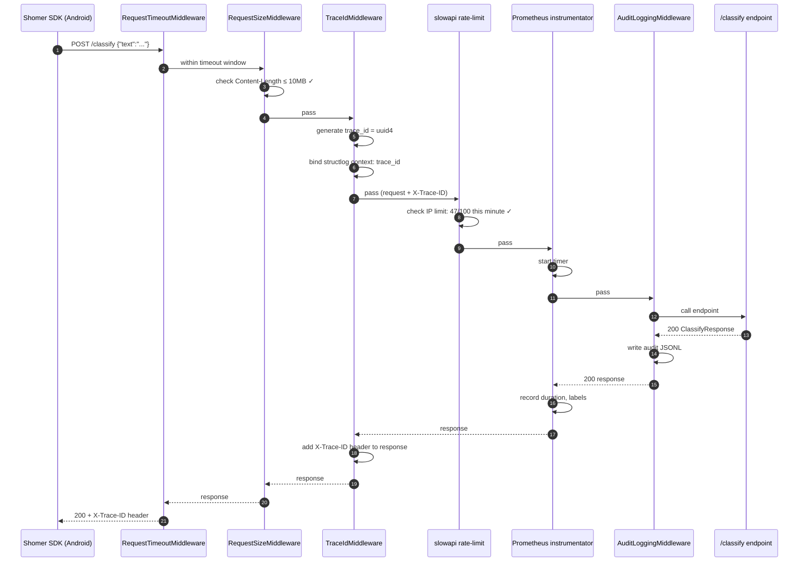
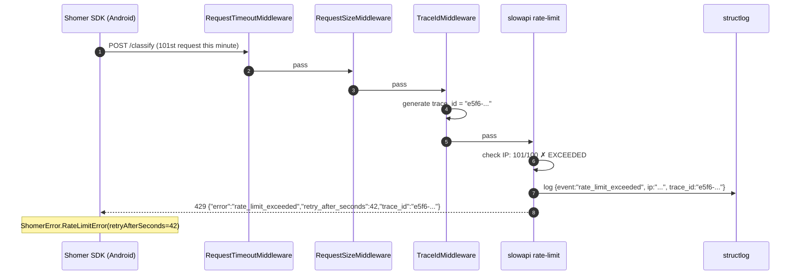

# Gatekeeper / API Gateway — Low-Level Design

**Module ID:** gatekeeper
**Owner:** TBD
**Status:** Draft for Meeting 4
**PRD reference:** PRD §8.7 (Gatekeeper / API Gateway), §9 (NFRs)
**Last updated:** 2026-05-31

---

## 1. Purpose & scope

The Gatekeeper is the Edge layer of the FastAPI server. It sits between every inbound HTTP request and the classification core (DictaBERT + Context Agent + OCR), and its sole responsibility is **operational**: rate limiting, trace-id injection, structured logging, Prometheus metrics emission, request size validation, and timeout enforcement. It is conceptually distinct from classification — it does not interpret message content, does not call Ollama, and does not write to the Audit Log (that is the Audit Logging Middleware's job).

In the MVP the Gatekeeper is implemented as a FastAPI middleware chain running in the same process as the classification server (`server/app/`). Architecturally it is drawn as a distinct orange layer in the C4 Container diagram (`docs/architecture_diagrams.md`) because it can be replaced by a standalone reverse proxy (nginx + Lua, Traefik, Kong) later with zero changes to the classification core.

This module owns: the `slowapi` rate-limit middleware, the `structlog`-based request logger, the `prometheus-fastapi-instrumentator` metrics endpoint, the request size + timeout enforcement middleware, and the trace-id generation + propagation contract. It does **not** own: audit JSONL writing (that is `server/app/middleware.py` AuditLoggingMiddleware), classification logic, OCR, or the Context Agent.

---

## 2. Public interface (API contract)

The Gatekeeper is transparent to callers on the happy path — it adds a response header and passes the request through. Its interface is the set of error responses it can emit before the request reaches the classification core.

### 2.1 Passthrough (happy path)

Every request that passes rate-limit, size, and timeout checks gets:
- `X-Trace-ID: <uuid4>` response header (matches the trace-id logged server-side)
- Request forwarded to the next middleware / endpoint handler

### 2.2 Error responses emitted by the Gatekeeper

All error responses follow a structured JSON body so clients can parse them programmatically.

#### 429 Too Many Requests (rate limit exceeded)

```json
{
  "error": "rate_limit_exceeded",
  "detail": "100 per 1 minute",
  "retry_after_seconds": 42,
  "trace_id": "a1b2c3d4-..."
}
```

HTTP headers: `Retry-After: 42`, `X-Trace-ID: a1b2c3d4-...`

#### 413 Request Entity Too Large (image > 10MB)

```json
{
  "error": "payload_too_large",
  "detail": "Request body exceeds 10485760 bytes",
  "max_bytes": 10485760,
  "trace_id": "a1b2c3d4-..."
}
```

#### 408 Request Timeout (client connection stalled mid-upload)

```json
{
  "error": "request_timeout",
  "detail": "Client did not complete the request within 30s",
  "trace_id": "a1b2c3d4-..."
}
```

### 2.3 /metrics endpoint

```
GET /metrics
```

Returns Prometheus text-format metrics. No authentication in MVP (LAN-only server). Example excerpt:

```
# HELP shomer_http_requests_total Total HTTP requests
# TYPE shomer_http_requests_total counter
shomer_http_requests_total{method="POST",handler="/classify",status="200"} 1234.0
shomer_http_requests_total{method="POST",handler="/classify",status="429"} 7.0

# HELP shomer_http_request_duration_seconds HTTP request duration
# TYPE shomer_http_request_duration_seconds histogram
shomer_http_request_duration_seconds_bucket{handler="/classify",le="0.05"} 890.0
shomer_http_request_duration_seconds_bucket{handler="/classify",le="0.1"} 1200.0
shomer_http_request_duration_seconds_bucket{handler="/classify",le="+Inf"} 1234.0
shomer_http_request_duration_seconds_p99{handler="/classify"} 0.087
```

---

## 2.5 Interface boundary & isolation guarantees

The Gatekeeper exposes **three small Protocols**, one per cross-cutting concern it owns. This decomposition is what lets the in-memory rate-limit store be swapped for Redis without touching the trace-id generator, and lets the Prometheus emitter be swapped for OTLP without touching either.

### Port 1 — `RateLimitStore` (rate-limit backing store)

```python
# server/app/gatekeeper/protocol.py
from typing import Protocol

class RateLimitStore(Protocol):
    async def is_allowed(self, key: str, max_per_window: int, window_s: int) -> bool: ...
    async def increment(self, key: str, window_s: int) -> int: ...
```

| Adapter | When to use | Lines to change to enable |
|---|---|---|
| `InMemoryRateLimitStore` | Default — `slowapi` default dict-of-deques; single-process MVP | (default) |
| `RedisRateLimitStore` | Phase 9 — multi-worker or multi-replica deployment; shared rate-limit state | one line in `main.py` `lifespan()`; add `RATE_LIMIT_STORE_URL=redis://...` |
| `StubRateLimitStore` | Tests — always-allow or always-deny | fixture |

### Port 2 — `TraceIdGenerator` (request trace-id producer)

```python
class TraceIdGenerator(Protocol):
    def new_id(self) -> str:
        """Produce a globally-unique-enough trace id for one request."""
        ...
```

| Adapter | When to use | Lines to change to enable |
|---|---|---|
| `Uuid4TraceIdGenerator` | Default — `str(uuid.uuid4())`; 128-bit random | (default) |
| `W3CTraceContextGenerator` | Future — adopt W3C `traceparent` header for OTLP / distributed tracing across SDK ↔ server | one line; SDK starts sending `traceparent` header |
| `StubTraceIdGenerator` | Tests — fixed id for deterministic logs | fixture |

### Port 3 — `MetricsEmitter` (Prometheus / OTLP / other)

```python
class MetricsEmitter(Protocol):
    def request_started(self, method: str, path: str) -> None: ...
    def request_completed(self, method: str, path: str, status: int, duration_s: float) -> None: ...
    def rate_limit_hit(self, client_ip_hash: str, path: str) -> None: ...
    def payload_rejected(self, path: str) -> None: ...
```

| Adapter | When to use | Lines to change to enable |
|---|---|---|
| `PrometheusMetricsEmitter` | Default — `prometheus-fastapi-instrumentator` + custom `Counter`/`Histogram` | (default) |
| `OtlpMetricsEmitter` | Future cloud deployment — OpenTelemetry OTLP exporter | one line + OTLP endpoint setting |
| `NoOpMetricsEmitter` | Tests / dev mode where metrics overhead is noise | fixture |

**Isolation rules (what this module MAY and MUST NOT touch):**
- May import: stdlib (`uuid`, `asyncio`), `fastapi`, `starlette`, `slowapi`, `structlog`, `python-json-logger`, `prometheus_client`, `prometheus-fastapi-instrumentator`, this module's settings.
- MUST NOT import: any business module (`classifier`, `ocr`, `triage`, `context_agent`, `alerts`). The Gatekeeper is content-blind by design.
- MUST NOT import: `server.app.main` or anything in the composition root.
- May expose `register_gateway(app, settings)` as the single-call entry point used by `main.py` to install middleware in the correct order.

**Contract tests (three suites):**
- `tests/contracts/test_rate_limit_store_contract.py` — parametrized over `InMemoryRateLimitStore`, `RedisRateLimitStore` (when added), `StubRateLimitStore`. Asserts: (a) `is_allowed` returns `True` for first N requests within the window, `False` for the (N+1)th, (b) per-key isolation, (c) window reset after `window_s` seconds, (d) fail-open semantics on store exception (per PRD §8.7 — return `True` rather than block traffic).
- `tests/contracts/test_trace_id_generator_contract.py` — parametrized over `Uuid4TraceIdGenerator`, `W3CTraceContextGenerator`, `StubTraceIdGenerator`. Asserts: (a) `new_id()` returns a non-empty string, (b) uniqueness across 100k calls (collision probability < 10⁻⁹), (c) string is safe for use as an HTTP header value.
- `tests/contracts/test_metrics_emitter_contract.py` — parametrized over all emitter adapters. Asserts: (a) `request_started`/`request_completed` never raise even when the underlying backend is down, (b) the no-op variant truly does nothing (no module-level side effects).

**Swap demo — In-memory → Redis rate-limit store:**

```python
# Before — server/app/main.py lifespan()
rate_store: RateLimitStore = InMemoryRateLimitStore()

# After
rate_store: RateLimitStore = RedisRateLimitStore(settings.gatekeeper.redis_url)
```

The trace-id middleware, the request-size middleware, the route handlers, and Prometheus all keep working unchanged.

---

## 3. Internal design

### 3.1 Package/file layout

```
server/app/
├── main.py                      EXISTING — middleware registration order is CRITICAL (see §3.2)
├── middleware.py                 EXISTING — AuditLoggingMiddleware (audit JSONL; keep as-is)
└── gateway.py                   NEW — all Gatekeeper components
    ├── class TraceIdMiddleware   — generates X-Trace-ID; injects into structlog context
    ├── class RequestSizeMiddleware — rejects bodies > MAX_BODY_BYTES with 413
    ├── class RequestTimeoutMiddleware — kills stalled client connections with 408
    ├── def build_limiter()       — returns slowapi Limiter with in-memory store
    ├── def build_metrics_instrumentator() — returns prometheus_fastapi_instrumentator instance
    └── def register_gateway(app: FastAPI, settings: GatekeeperSettings) → None
```

`register_gateway()` is the single call in `main.py` that installs all Gatekeeper middleware. This makes it easy to disable the entire Gatekeeper in tests by not calling `register_gateway`.

### 3.2 Middleware order — CRITICAL

FastAPI/Starlette's `app.add_middleware()` applies middleware in **reverse registration order**: the last-added middleware is outermost (executed first on request, last on response). The correct execution order on the **request path** is:

```
[inbound request]
        ↓
1. RequestTimeoutMiddleware   — kill stalled connections early (outermost)
2. RequestSizeMiddleware      — reject oversized bodies before doing anything expensive
3. TraceIdMiddleware          — inject trace-id so all subsequent log lines are correlated
4. SlowAPI rate-limit check   — reject over-limit after trace-id exists (429 carries trace-id)
5. prometheus instrumentation — measure everything that gets past the gate
6. CORSMiddleware             — existing (registered in main.py)
7. AuditLoggingMiddleware     — existing; wraps the endpoint call; records final outcome
        ↓
[endpoint handler: /classify, /classify-image, /health, /model/info]
```

In `main.py` this means `add_middleware` calls are made in **reverse** of the above list:

```python
# main.py — middleware registration (last added = outermost = first to run)
app.add_middleware(AuditLoggingMiddleware)                    # step 7 — innermost
register_gateway(app, GatekeeperSettings.from_env())         # steps 1–5 (inside register_gateway)
app.add_middleware(CORSMiddleware, ...)                       # step 6 — between gateway and audit
```

Inside `register_gateway()`:

```python
def register_gateway(app: FastAPI, settings: GatekeeperSettings) -> None:
    # Prometheus — added first inside register_gateway → innermost of gateway group
    instrumentator = build_metrics_instrumentator()
    instrumentator.instrument(app).expose(app, endpoint="/metrics")

    # slowapi rate limiter
    limiter = build_limiter(settings)
    app.state.limiter = limiter
    app.add_exception_handler(RateLimitExceeded, _rate_limit_handler)

    # TraceId — added after slowapi → runs before slowapi on request path
    app.add_middleware(TraceIdMiddleware)

    # RequestSize — runs before TraceId
    app.add_middleware(RequestSizeMiddleware, max_bytes=settings.max_body_bytes)

    # RequestTimeout — outermost of gateway group, runs first
    app.add_middleware(RequestTimeoutMiddleware, timeout_s=settings.client_recv_timeout_s)
```

### 3.3 Key classes and responsibilities

| Class / function | File | Responsibility |
|---|---|---|
| `TraceIdMiddleware` | `gateway.py` | Generates `uuid4` trace-id; sets `request.state.trace_id`; adds `X-Trace-ID` to response; binds trace-id to `structlog` context |
| `RequestSizeMiddleware` | `gateway.py` | Reads `Content-Length` header; if > `max_body_bytes` returns 413 JSON response immediately without reading body |
| `RequestTimeoutMiddleware` | `gateway.py` | `asyncio.wait_for` around `call_next(request)`; raises `asyncio.TimeoutError` → returns 408 |
| `build_limiter()` | `gateway.py` | Creates `slowapi.Limiter` with in-memory store; default limit `100/minute` per client IP |
| `_rate_limit_handler` | `gateway.py` | `RateLimitExceeded` exception handler; returns structured 429 JSON with `trace_id` |
| `build_metrics_instrumentator()` | `gateway.py` | Creates `prometheus_fastapi_instrumentator.Instrumentator` with custom `shomer_` prefix; latency buckets: 0.01, 0.05, 0.1, 0.25, 0.5, 1.0, 2.0, 5.0 seconds |
| `register_gateway()` | `gateway.py` | Single entry point; installs all components in correct order |
| `GatekeeperSettings` | `gateway.py` | `pydantic-settings` model; loads all Gatekeeper config from env |
| `AuditLoggingMiddleware` | `middleware.py` | EXISTING — audit JSONL writer; unchanged by Gatekeeper design |

### 3.4 Internal Protocol seam

```python
# gateway.py — abstract seam for future extraction
class RateLimitStore(Protocol):
    """In-memory MVP backed by slowapi's default dict; Redis in Phase 9."""
    async def is_allowed(self, key: str) -> bool: ...
    async def increment(self, key: str, window_s: int) -> int: ...
```

`build_limiter()` returns a `slowapi.Limiter` that satisfies this protocol in-process. In Phase 9, swap in a Redis-backed implementation by providing a `redis://` URL in `RATE_LIMIT_STORE_URL` env var — no change to `TraceIdMiddleware` or the endpoint handlers.

---

## 4. Sequence diagrams (Mermaid)

### 4.1 Happy path — text classify request



### 4.2 Rate limit exceeded



---

## 5. Data model

### 5.1 In-memory rate-limit store

```python
# slowapi default: dict[str, deque[float]] — key=client_ip, value=timestamps
# Structure: {"192.168.1.10": deque([1717234512.3, 1717234513.1, ...], maxlen=100)}
```

Window: 1 minute (60s). The store is reset on server restart (no persistence in MVP).

**Memory footprint estimate:** 100 requests/min × 8 bytes/timestamp × N concurrent IPs. For 10 concurrent child/parent clients: ~8 KB. For SOM (5K users): ~400 KB. Well within the 50MB NFR from PRD §8.7.

### 5.2 Trace-id in structlog context

```python
# structlog bound logger context per request (cleared after response):
{
    "trace_id": "a1b2c3d4-e5f6-...",
    "client_ip": "192.168.1.10",
    "method": "POST",
    "path": "/classify"
}
```

This context is set in `TraceIdMiddleware` via `structlog.contextvars.bind_contextvars(trace_id=...)` and cleared in `structlog.contextvars.clear_contextvars()` after the response. All downstream code (classifier, Context Agent, AuditLoggingMiddleware) that calls `structlog.get_logger()` automatically inherits the bound context.

### 5.3 No persistence

The Gatekeeper persists nothing. The in-memory rate-limit store resets on restart. Prometheus counters/histograms are in-memory; a Prometheus scraper is expected to pull and persist them externally.

---

## 6. Observability — Logger, Config, Metrics

### 6.1 Logger

**Library:** `structlog` with `python-json-logger` renderer for production; `ConsoleRenderer` for development.

**Logger name:** `shomer.gateway`

**Fields on every gateway log line:**
- `trace_id` — bound by `TraceIdMiddleware` for the current request
- `module` — `"shomer.gateway"`
- `event` — semantic event name
- `client_ip` — request client IP
- `method`, `path` — HTTP verb and path

**3 example log lines:**

```json
// Happy path — request passed through
{"ts":"2026-06-01T10:22:33Z","trace_id":"a1b2-c3d4","module":"shomer.gateway","event":"request_allowed","client_ip":"192.168.1.10","method":"POST","path":"/classify","size_bytes":42}

// Rate limit hit
{"ts":"2026-06-01T10:22:59Z","trace_id":"e5f6-a7b8","module":"shomer.gateway","event":"rate_limit_exceeded","client_ip":"192.168.1.10","method":"POST","path":"/classify","limit":"100/minute","retry_after_s":42}

// Request rejected for payload too large
{"ts":"2026-06-01T10:23:01Z","trace_id":"c9d0-e1f2","module":"shomer.gateway","event":"payload_rejected","client_ip":"192.168.1.10","method":"POST","path":"/classify-image","size_bytes":12582912,"max_bytes":10485760}
```

### 6.2 Config

| Name | Type | Default | Env var | Description | Secret? |
|---|---|---|---|---|---|
| `RATE_LIMIT_PER_MINUTE` | int | `100` | `RATE_LIMIT_PER_MINUTE` | Max requests per IP per minute | No |
| `RATE_LIMIT_STORE_URL` | str | `""` (in-memory) | `RATE_LIMIT_STORE_URL` | Empty = in-memory; `redis://...` = Redis (Phase 9) | No |
| `MAX_BODY_BYTES` | int | `10485760` (10MB) | `MAX_BODY_BYTES` | Request body size limit (applies to /classify-image) | No |
| `CLIENT_RECV_TIMEOUT_S` | float | `30.0` | `CLIENT_RECV_TIMEOUT_S` | Max seconds to receive complete request from client | No |
| `METRICS_ENDPOINT` | str | `"/metrics"` | `METRICS_ENDPOINT` | Path for Prometheus scrape endpoint | No |
| `METRICS_LATENCY_BUCKETS` | str | `"0.01,0.05,0.1,0.25,0.5,1.0,2.0,5.0"` | `METRICS_LATENCY_BUCKETS` | Comma-separated histogram bucket boundaries (seconds) | No |
| `LOG_LEVEL` | str | `"INFO"` | `LOG_LEVEL` | structlog minimum log level | No |
| `LOG_FORMAT` | str | `"json"` | `LOG_FORMAT` | `"json"` (production) or `"console"` (development) | No |

All loaded via `GatekeeperSettings(BaseSettings)` (pydantic-settings).

### 6.3 Metrics

All metrics use the `shomer_` prefix. The `prometheus-fastapi-instrumentator` provides the HTTP-level metrics; custom metrics for Gatekeeper-specific events are added via `prometheus_client` directly.

| Metric name | Type | Labels | What it answers | NFR served |
|---|---|---|---|---|
| `shomer_http_requests_total` | Counter | `method`, `handler`, `status` | Total requests by endpoint and status code | Error rate monitoring |
| `shomer_http_request_duration_seconds` | Histogram | `handler` | p50/p95/p99 latency per endpoint | Frontline latency p99 < 100ms; Context Agent p99 < 3s |
| `shomer_gateway_rate_limit_total` | Counter | `client_ip` (hashed), `handler` | Rate limit hits by endpoint | Rate limit effectiveness |
| `shomer_gateway_payload_rejected_total` | Counter | `handler` | Payloads rejected for size | Request size enforcement |
| `shomer_gateway_overhead_seconds` | Histogram | — | Gateway processing time excluding endpoint | Gateway overhead < 5ms p99 (PRD §8.7 NFR) |
| `shomer_gateway_active_requests` | Gauge | `handler` | In-flight requests (for queue depth monitoring) | Concurrent request tracking |

**Tying to PRD §9 NFRs:**

| PRD §9 NFR | Metric that proves it |
|---|---|
| Frontline latency p99 < 100ms | `shomer_http_request_duration_seconds{handler="/classify"}` p99 |
| Context Agent latency p99 < 3s | `shomer_http_request_duration_seconds{handler="/classify"}` p99 for borderline cases (server logs `context_used=true`) |
| e2e latency p99 < 5s | Sum of classify + gateway overhead histogram |
| Error rate (gateway contribution) | `shomer_http_requests_total{status=~"4..|5.."}` / `shomer_http_requests_total` |
| Gateway overhead < 5ms p99 | `shomer_gateway_overhead_seconds` p99 |
| Memory < 50MB (rate-limit store) | Process RSS via Prometheus `process_resident_memory_bytes` |

---

## 7. NFR targets & test plan

| NFR (PRD §9) | Gateway contribution | Test approach | Test file |
|---|---|---|---|
| Gateway overhead < 5ms p99 | All middleware adds < 5ms total | Load test: 1000 requests with `httpx` async; measure overhead vs direct endpoint | `tests/load/test_gateway_overhead.py` |
| Rate limit: 429 on violation | slowapi rejects correctly at 101st req/min | Unit test: 101 requests in a 1-minute window → 101st returns 429 | `tests/test_gatekeeper_rate_limit.py` |
| Fail-open: no false-deny on store failure | In-memory store drop → pass all | Monkey-patch store to raise; verify requests pass through | `tests/test_gatekeeper_failopen.py` |
| 413 on oversized payload | RequestSizeMiddleware rejects correctly | Unit test: Content-Length > 10MB header → 413 before body is read | `tests/test_gatekeeper_size_limit.py` |
| 408 on stalled client | RequestTimeoutMiddleware fires | Unit test: inject a slow mock handler (sleep > timeout_s) → verify 408 | `tests/test_gatekeeper_timeout.py` |
| Trace-id on every response | TraceIdMiddleware adds header | Unit: every response includes X-Trace-ID matching the logged trace_id | `tests/test_gatekeeper_traceid.py` |
| /metrics endpoint live | instrumentator registers endpoint | Integration: GET /metrics → 200 + Prometheus text format | `tests/test_gatekeeper_metrics.py` |
| Structured log on every request | structlog emits JSON with required fields | Unit: inject log capture; verify trace_id, client_ip, method, path present | `tests/test_gatekeeper_logging.py` |

---

## 8. Failure modes & fallbacks

| Failure | Detection | Fallback | User-visible effect |
|---|---|---|---|
| slowapi in-memory store raises exception | Unhandled exception in rate-limit check | **Fail-open**: catch exception, log warning, pass request through | No rate limiting until store recovers; server continues serving |
| TraceIdMiddleware fails to bind structlog context | structlog `bind_contextvars` raises | Catch, log error with a random trace-id as fallback; continue | Downstream logs may lack trace-id for that request; not user-visible |
| RequestTimeoutMiddleware timeout fires during classify | `asyncio.TimeoutError` | Return 408 with structured body and trace-id | Client sees 408; SDK maps to `ShomerError.TimeoutError` |
| prometheus_fastapi_instrumentator fails at startup | Exception during `instrumentator.instrument(app)` | Log error; skip metrics registration; app starts without `/metrics` | `/metrics` endpoint is absent; Prometheus scrape fails silently |
| `gateway.py` module import error | ImportError at startup | Log critical + re-raise; FastAPI does NOT start | Server fails to start; developer must fix before deployment |
| CORSMiddleware absent (already in main.py) | — | Existing CORS registration in main.py is not touched by Gatekeeper | LAN-only server; CORS not security-critical here |

**Fail-open philosophy (PRD §8.7):** The rate-limit store is operational infrastructure, not a security boundary (server is on a local home network, not internet-facing). Failing closed (blocking all requests when the store breaks) would cause false-denial worse than the alternative. A deliberate DoS attacker on the home LAN is out of scope for the thesis MVP.

---

## 9. Deployment & config

**Ships as:** In-process FastAPI middleware (same Python process as the classification server). No separate container, no separate port.

**File added:** `server/app/gateway.py`

**Change to existing file:** `server/app/main.py` — add `register_gateway(app, GatekeeperSettings.from_env())` call in the middleware registration block, and add `from .gateway import register_gateway, GatekeeperSettings`.

**Required Python dependencies (add to `server/requirements.txt`):**

```
slowapi==0.1.9
structlog==24.4.0
python-json-logger==2.0.7
prometheus-fastapi-instrumentator==7.0.0
prometheus-client==0.20.0
```

**Existing dependencies already present:** `fastapi`, `uvicorn`, `starlette` — no changes needed.

**Environment variables:** All in `.env` (gitignored); defaults in `GatekeeperSettings` handle dev with no `.env` file.

**Ports:** `/metrics` is served on the same port 8000 as the classification API. No additional port is needed.

**Startup order:** The Gatekeeper is initialized as part of FastAPI app creation — before the `lifespan` async context manager runs (which initializes Ollama + DictaBERT). This is correct: rate-limiting should be active before any resource-intensive backends are reachable.

---

## 10. Future extraction seam

The `register_gateway()` function signature is the extraction seam:

```python
# gateway.py
def register_gateway(app: FastAPI, settings: GatekeeperSettings) -> None: ...
```

When traffic volume justifies a dedicated reverse proxy:

1. **Remove** `register_gateway(app, ...)` call from `main.py`. The classification server becomes dumb HTTP — no rate limiting, no metrics.
2. **Deploy** nginx + `limit_req_zone` (rate limit) + `ngx_http_stub_status_module` or Prometheus nginx-exporter (metrics) in front of the FastAPI process on a separate port (e.g., :8080 public, :8000 internal).
3. **Propagate** trace-id via `add_header X-Trace-ID $request_id` in nginx; structlog processors read it from the `X-Trace-ID` request header instead of generating it.
4. The `RateLimitStore` protocol (§3.4) is the seam for the in-process rate-limit store. Redis-backed `slowapi` storage is the first step before a full nginx migration and does not require extracting to a separate process.

The classification core code (`classifier.py`, `context_agent.py`, `image_backends/`) never references `gateway.py` — the boundary is clean.

---

## 11. Open questions

1. **Rate-limit key strategy**: current design keys on client IP (`request.client.host`). Behind NAT (emulator uses `10.0.2.2`; physical LAN phones share the router's IP as seen by the server), all clients may share the same IP → same rate-limit bucket. For MVP (1 child + 1 parent device) this is fine. For Phase 9 multi-family: key on API token instead. — Link: PRD §8.7 Phase 9 stretch.
2. **Redis for rate-limit store**: in-memory store resets on server restart (e.g., power outage resets the window). For the thesis this is acceptable. Phase 9 should add `RATE_LIMIT_STORE_URL=redis://localhost:6379` before any public deployment. — Link: `plan-docs/decisions/prd-enrichment.decision.md` D3 Revisit.
3. **`/metrics` access control**: currently unauthenticated (LAN-only). If the server is ever exposed to the internet (cloud demo for the defense), `/metrics` should be restricted to a known scraper IP or behind HTTP Basic Auth. — Link: PRD §11 Out-of-Scope.
4. **Prometheus scraper setup**: the design assumes a Prometheus instance scrapes `/metrics`. For the thesis demo a local Prometheus + Grafana (or just `curl http://localhost:8000/metrics`) is sufficient. Document the minimal scrape config in `server/README.md`. TBD before Meeting 8.
5. **`Content-Length` absent (chunked upload)**: `RequestSizeMiddleware` checks the `Content-Length` header. Chunked transfer encoding (`Transfer-Encoding: chunked`) does not send this header. The current design skips size enforcement for chunked uploads (logs a warning). Phase 2+: buffer and check actual bytes received. — Link: `docs/open_questions.md`.
6. **Timeout for text vs image**: `CLIENT_RECV_TIMEOUT_S` is a single value, but the classification timeout is 60s for text and 180s for image. The `RequestTimeoutMiddleware` governs only client-to-server upload time (typically < 1s for text, < 5s for a 500KB JPEG). The classification timeout is enforced by `httpx` inside the endpoint handlers (existing behavior). Confirm the two timeouts are not conflated before implementation.
