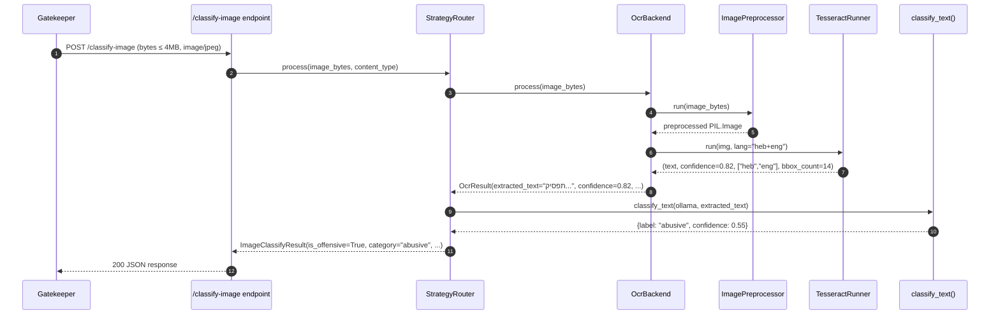
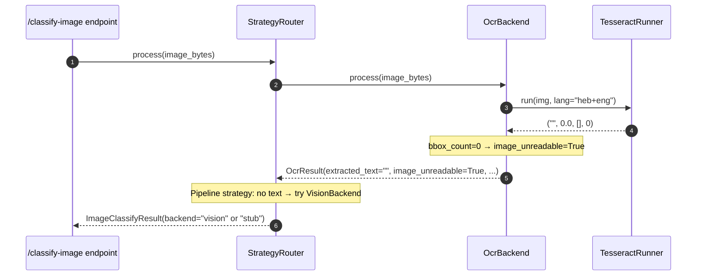

# OCR Pipeline — Low-Level Design

**Module ID:** ocr
**Owner:** TBD
**Status:** Draft for Meeting 4
**PRD reference:** PRD §8.2
**Last updated:** 2026-05-31

---

## 1. Purpose & Scope

The OCR Pipeline extracts Hebrew and English text from chat screenshot images so that the same frontline classifier (`server/app/classifier.py`) can classify image content without a separate vision model. It is the first stage of the `POST /classify-image` endpoint and the reason Architecture A (Vision LLM) was not needed — text extracted from screenshots flows through the identical DictaBERT path.

**Scope (in):**
- Input validation (size, MIME type)
- PIL-based image preprocessing (resize, grayscale, adaptive threshold)
- Tesseract OCR via `pytesseract` with `heb+eng` language packs
- Structured output schema consumed by the classifier
- Signal propagation for `image_unreadable` cases
- Integration with `server/app/image_backends/strategies.py` strategy router

**Scope (out):**
- Vision LLM classification of image content (Architecture A — out of scope per PRD §11)
- On-device OCR (MLKit future work)
- Cloud OCR services (breaks local-first privacy guarantee)

System context: see [architecture_diagrams.md](../../architecture_diagrams.md) — this module is the "Tesseract OCR (heb+eng)" node inside the HomeNet boundary.

---

## 2. Public Interface (API Contract / Protocol)

### 2.1 Protocol definition

```python
# server/app/image_backends/base.py  (already exists — design enforces this shape)
from typing import Protocol, runtime_checkable

@runtime_checkable
class ImageProcessor(Protocol):
    async def process(
        self,
        image_bytes: bytes,
        content_type: str | None = None,
    ) -> "OcrResult":
        ...
```

### 2.2 OcrResult output schema

```python
# server/app/image_backends/schemas.py  (new file)
from dataclasses import dataclass

@dataclass(frozen=True)
class OcrResult:
    extracted_text: str        # UTF-8, stripped; empty string when no text detected
    confidence: float          # Mean Tesseract word confidence, 0.0–1.0
    lang_detected: list[str]   # subset of ["heb", "eng"] — scripts actually found
    bbox_count: int            # number of detected text bounding boxes
    image_unreadable: bool     # True when OCR engine returned nothing meaningful
    backend: str               # always "ocr" for this module
    strategy: str              # propagated from the strategy router
```

`OcrResult` is consumed by `OcrBackend.process()` internally. The strategy router (`strategies.py`) wraps it in `ImageClassifyResult` (existing frozen dataclass in `base.py`) before returning to the FastAPI endpoint. The endpoint never sees `OcrResult` directly — it sees `ImageClassifyResult`.

### 2.3 Input contract

| Field | Type | Constraint | Error response |
|---|---|---|---|
| `image_bytes` | `bytes` | ≤ 4 MB | HTTP 413 from Gatekeeper middleware |
| `content_type` | `str \| None` | `image/jpeg` or `image/png` | HTTP 415 if present and wrong; missing = tolerated |

Gatekeeper enforces the 4 MB ceiling (PRD §8.7); `OcrBackend` itself trusts the bytes are already validated and opens them with `PIL.Image.open()`.

---

## 2.5 Interface boundary & isolation guarantees

**The Port (Protocol):** `OcrBackend` — the ONLY symbol the server core imports from this module. The strategy router and the `/classify-image` handler depend on `OcrBackend`, never on `TesseractOcrBackend` or `EasyOcrBackend` directly.

```python
# server/app/ocr/protocol.py
from typing import Protocol, runtime_checkable

@runtime_checkable
class OcrBackend(Protocol):
    async def process(
        self,
        image_bytes: bytes,
        content_type: str | None = None,
    ) -> "OcrResult":
        """Extract text from an image. Never raises on unreadable input —
        returns OcrResult(image_unreadable=True) instead.
        Must return within the configured OCR_TIMEOUT_S budget."""
        ...
```

`OcrResult` (see §2.2) is part of the port. Both the schema AND the contract that `process()` never raises on unreadable input are invariants every adapter must honour.

**Concrete adapters that satisfy this Protocol:**

| Adapter | When to use | Lines to change to enable |
|---|---|---|
| `TesseractOcrBackend` | Default — MVP / Meeting 5+; local CPU, Hebrew + English language packs | (default — already wired in `lifespan()`) |
| `EasyOcrBackend` | Risk-mitigation per PRD §12: if Tesseract CER > 15% on real chat screenshots | one line in `main.py` `lifespan()`; add `easyocr` to `requirements.txt` |
| `MlkitOcrBackend` | Future on-device OCR (Android side) — moves OCR off the server entirely | one line + new SDK contract; deferred to Phase 9 |
| `StubOcrBackend` | Unit and contract tests; returns a fixed `OcrResult` from a fixture file | injected by the test fixture, not by `main.py` |

**Isolation rules (what this module MAY and MUST NOT touch):**
- May import: stdlib, `pytesseract`, `PIL` / `Pillow`, `numpy`, `cv2` (`opencv-python-headless`), `structlog`, `prometheus_client`, this module's own settings.
- MUST NOT import: any concrete class from another module (only Protocols — and the OCR module is a leaf, so it imports no other Protocols at all).
- MUST NOT import: `server.app.classifier.*` (the OCR module is text-extraction-only; the *strategy router* calls the classifier, not the backend).
- MUST NOT import: `server.app.main` or anything in the composition root.

**Contract test:** `tests/contracts/test_ocr_backend_contract.py` — every adapter is parametrized through this suite. Fixtures provide: a Hebrew chat screenshot, a mixed-language screenshot, a blank image, and a corrupt JPEG. The suite asserts: (a) result schema matches `OcrResult` exactly, (b) `image_unreadable=True` is set on blank input (not an exception), (c) p99 latency over 50 runs is within the adapter's documented budget (Tesseract ≤ 2 s; EasyOCR ≤ 3 s), (d) `confidence` ∈ [0.0, 1.0], (e) `lang_detected` is a subset of `["heb", "eng"]`.

**Swap demo — Tesseract → EasyOCR (PRD §12 risk row):**

```python
# Before — server/app/main.py lifespan()
ocr: OcrBackend = TesseractOcrBackend(settings.ocr)

# After
ocr: OcrBackend = EasyOcrBackend(settings.ocr)
```

The strategy router (`OcrOnly` / `Pipeline` / `Parallel`), the `/classify-image` route handler, the audit log, and the metrics emitter all keep working unchanged — they only know the `OcrBackend` Protocol.

---

## 3. Internal Design

### 3.1 Package layout

```
server/app/image_backends/
├── base.py           # ImageProcessor ABC + ImageClassifyResult (exists)
├── stub.py           # Phase 1 no-op backend (exists)
├── vision.py         # Vision LLM backend (exists, out of scope here)
├── strategies.py     # Strategy router — OcrOnly / Pipeline / Parallel (exists)
├── ocr.py            # OcrBackend — THE subject of this LLD (exists, will be refactored)
└── schemas.py        # NEW: OcrResult dataclass + preprocessing params
```

### 3.2 Key classes

#### `OcrBackend` (refactored from `server/app/image_backends/ocr.py`)

```python
class OcrBackend(ImageProcessor):
    """
    Full pipeline: validate → preprocess → OCR → emit OcrResult.
    The strategy router decides whether to pass the extracted text
    to the classifier; OcrBackend only extracts.
    """
    def __init__(
        self,
        tesseract_cmd: str | None = None,
        lang: str = "heb+eng",
        dpi: int = 300,
        threshold_block_size: int = 31,
        threshold_c: int = 10,
    ): ...

    async def process(
        self, image_bytes: bytes, content_type: str | None = None
    ) -> OcrResult: ...

    def _preprocess(self, image_bytes: bytes) -> "PIL.Image": ...
    def _run_tesseract(self, img: "PIL.Image") -> tuple[str, float, list[str], int]: ...
```

Current `ocr.py` calls `classify_text()` directly — this will be decoupled. The `OcrBackend` becomes extraction-only; the strategy router (or the caller) is responsible for passing extracted text to `classify_text()`. This separation makes the module testable in isolation.

#### `ImagePreprocessor` (extracted helper, lives in `ocr.py`)

```python
class ImagePreprocessor:
    """Stateless preprocessing: resize → grayscale → adaptive threshold."""

    TARGET_HEIGHT = 1200      # pixels; maintains aspect ratio
    MIN_HEIGHT = 400          # skip resize if already small enough

    @staticmethod
    def run(img: PIL.Image, block_size: int, c_value: int) -> PIL.Image:
        img = ImagePreprocessor._resize(img)
        img = img.convert("L")                            # grayscale
        arr = np.array(img)
        thresh = cv2.adaptiveThreshold(
            arr, 255,
            cv2.ADAPTIVE_THRESH_GAUSSIAN_C,
            cv2.THRESH_BINARY,
            block_size,    # default 31 — must be odd
            c_value,       # default 10
        )
        return PIL.Image.fromarray(thresh)
```

**Why these preprocessing params:**
- `TARGET_HEIGHT = 1200 px` — Tesseract accuracy degrades sharply below 150 DPI effective; most chat screenshots at phone resolution (1080p) need no upscaling. This cap prevents oversized inputs from slowing OCR.
- `ADAPTIVE_THRESH_GAUSSIAN_C, block_size=31, c=10` — handles the mixed-background chat bubbles (light + dark themes) common in WhatsApp/Instagram screenshots. Global threshold fails on gradient backgrounds; adaptive per-region threshold handles both.
- Grayscale before threshold — reduces color noise without affecting character shape.

#### `TesseractRunner` (thin wrapper, lives in `ocr.py`)

```python
class TesseractRunner:
    TESSERACT_CONFIG = "--psm 6 -c preserve_interword_spaces=1"
    # psm 6: assume uniform block of text — optimal for chat screenshot regions
    # preserve_interword_spaces: critical for Hebrew RTL word segmentation

    def run(self, img: PIL.Image, lang: str) -> tuple[str, float, list[str], int]:
        """Returns (text, mean_confidence, lang_list, bbox_count)."""
        data = pytesseract.image_to_data(
            img, lang=lang, config=self.TESSERACT_CONFIG,
            output_type=pytesseract.Output.DICT,
        )
        # Filter low-confidence words (conf < 0)
        words = [w for w, c in zip(data["text"], data["conf"]) if c >= 0 and w.strip()]
        confs = [c for c in data["conf"] if c >= 0]
        text = " ".join(words).strip()
        mean_conf = sum(confs) / len(confs) / 100.0 if confs else 0.0
        langs = _detect_scripts(text)
        return text, mean_conf, langs, len(words)
```

**Tesseract config rationale:**
- `--psm 6` (Assume a single uniform block of text): better than `--psm 3` (auto) for cropped chat screenshot regions; auto-OSD adds latency and misdetects RTL chat bubbles as tables.
- `preserve_interword_spaces=1`: Hebrew tokenization is space-separated — losing spaces conflates tokens and destroys word meaning.
- `heb+eng` language pack combination: Israeli teen chat uses frequent code-switching (Hebrew/English in the same message); running both simultaneously outperforms single-lang Tesseract on mixed text.

### 3.3 Extraction seam (modular monolith → standalone service)

`OcrBackend` depends only on `base.py` (the `ImageProcessor` ABC) and standard libraries (`pytesseract`, `PIL`, `numpy`, `cv2`). It has zero imports from `classifier.py`, `ollama_client.py`, or any other server module after the planned refactor. This clean boundary means:

- **Test in isolation**: `pytest server/tests/test_ocr.py` with mock bytes, no Ollama.
- **Extract to microservice**: wrap `OcrBackend.process()` in a FastAPI endpoint (`POST /ocr`), deploy behind the Gatekeeper. The strategy router's `OcrOnly` strategy just changes its HTTP call target. Zero changes to `classifier.py`.

---

## 4. Sequence Diagrams

### 4.1 Happy path — OCR extracts text



### 4.2 Failure path — image unreadable



---

## 5. Data Model

### 5.1 Input → Output flow

```
image_bytes (raw JPEG/PNG)
    → ImagePreprocessor.run()     →  PIL.Image (grayscale, thresholded)
    → TesseractRunner.run()       →  (text: str, confidence: float,
                                      lang_detected: list[str], bbox_count: int)
    → OcrResult                   →  (all fields above + image_unreadable: bool)
    → classify_text()             →  {label, confidence, model_version, latency_ms}
    → ImageClassifyResult         →  (is_offensive, category, confidence,
                                      extracted_text, backend, strategy)
```

### 5.2 `image_unreadable` signal semantics

| Condition | `extracted_text` | `image_unreadable` | Router action |
|---|---|---|---|
| Text found, confidence ≥ 0.3 | non-empty | `False` | Classify text |
| No bboxes returned | `""` | `True` | Pipeline: try VisionBackend; OcrOnly: return `{category: "no_text"}` |
| Tesseract binary not found | n/a | raises `TesseractNotFoundError` | Caught by `_try_ocr()` in `strategies.py` → degrade to vision |
| PIL cannot decode image | n/a | raises `UnidentifiedImageError` | Propagated as HTTP 422 |

---

## 6. Observability

### 6.1 Logger

Module logger: `shomer.ocr` via `structlog`.

```python
import structlog
logger = structlog.get_logger("shomer.ocr")
```

**Three example log lines (JSON-structured):**

```json
{"event": "ocr_success", "trace_id": "abc123", "module": "ocr",
 "latency_ms": 312, "bbox_count": 14, "confidence": 0.82,
 "lang_detected": ["heb", "eng"], "text_length": 87}

{"event": "ocr_no_text", "trace_id": "def456", "module": "ocr",
 "latency_ms": 198, "bbox_count": 0, "confidence": 0.0,
 "image_unreadable": true, "content_type": "image/jpeg"}

{"event": "ocr_tesseract_unavailable", "trace_id": "ghi789", "module": "ocr",
 "error": "TesseractNotFoundError", "fallback": "vision",
 "tesseract_cmd": "C:\\Program Files\\Tesseract-OCR\\tesseract.exe"}
```

Fields on every OCR log line: `trace_id`, `module="ocr"`, `event`, `latency_ms`. Additional context per event type as shown above.

### 6.2 Config

`OcrSettings` (Pydantic-settings, loaded from environment):

| Name | Type | Default | Env var | Description | Secret? |
|---|---|---|---|---|---|
| `tesseract_cmd` | `str \| None` | `None` | `TESSERACT_CMD` | Absolute path to `tesseract.exe`; `None` = use PATH | No |
| `tesseract_lang` | `str` | `"heb+eng"` | `TESSERACT_LANG` | Language pack(s) passed to Tesseract `-l` flag | No |
| `ocr_dpi` | `int` | `300` | `OCR_DPI` | Target DPI for resize before OCR | No |
| `ocr_threshold_block_size` | `int` | `31` | `OCR_THRESHOLD_BLOCK_SIZE` | Adaptive threshold block size (must be odd) | No |
| `ocr_threshold_c` | `int` | `10` | `OCR_THRESHOLD_C` | Adaptive threshold constant C | No |
| `ocr_min_confidence` | `float` | `0.30` | `OCR_MIN_CONFIDENCE` | Below this mean word confidence, treat as no_text | No |
| `ocr_max_image_bytes` | `int` | `4_194_304` | `OCR_MAX_IMAGE_BYTES` | 4 MB hard limit (backup to Gatekeeper) | No |

```python
# server/app/config.py (add to existing config module)
from pydantic_settings import BaseSettings

class OcrSettings(BaseSettings):
    tesseract_cmd: str | None = None
    tesseract_lang: str = "heb+eng"
    ocr_dpi: int = 300
    ocr_threshold_block_size: int = 31
    ocr_threshold_c: int = 10
    ocr_min_confidence: float = 0.30
    ocr_max_image_bytes: int = 4_194_304

    class Config:
        env_file = ".env"
        extra = "ignore"
```

### 6.3 Metrics

All metrics exposed on `/metrics` (Prometheus format, via `prometheus-fastapi-instrumentator`).

| Metric name | Type | Labels | What it answers | PRD §9 NFR |
|---|---|---|---|---|
| `ocr_requests_total` | Counter | `outcome={success,no_text,error}` | How often does OCR find text vs fail? | — |
| `ocr_latency_seconds` | Histogram | `strategy={ocr_only,pipeline,parallel}` | Is p99 < 2s per PRD §8.2? | Latency p99 < 2s |
| `ocr_confidence_score` | Histogram | — | Distribution of Tesseract word confidence | CER < 15% proxy |
| `ocr_bbox_count` | Histogram | — | Are screenshots text-rich? | Debug: content type mix |
| `ocr_image_unreadable_total` | Counter | — | How often does OCR produce nothing? | Failure mode tracking |
| `ocr_text_length_chars` | Histogram | — | How long is extracted text? | Classifier input sizing |

---

## 7. NFR Targets & Test Plan

### 7.1 Latency — p99 < 2s (PRD §8.2)

**Target:** p99 latency for the full OCR pipeline (preprocess + Tesseract + result) < 2 000 ms on the project hardware (Windows host, RTX 5080, standard HDD).

**Test approach:**
```
pytest server/tests/test_ocr_latency.py
```
- Load 50 real chat screenshots (WhatsApp + Instagram, various sizes).
- Run `OcrBackend.process()` 3 times each, take the median.
- Assert p99 < 2 000 ms. Assert p50 < 800 ms.
- Parameterize over `strategy={ocr_only, pipeline}`.

**Baseline expectation:** A 1080p chat screenshot on CPU (no GPU involvement) takes ~200–800ms through preprocessing + Tesseract. The 2s budget is comfortable.

### 7.2 CER < 15% (PRD §8.2)

**Target:** Character Error Rate < 15% on real Hebrew chat screenshots.

**Test dataset (Meeting 8):**
- Collect ~50 real WhatsApp/Instagram Hebrew chat screenshots.
- Manually transcribe ground-truth text for each.
- Run `OcrBackend.process()` on each screenshot.
- Compute CER: `(S + D + I) / N` where S=substitutions, D=deletions, I=insertions, N=ground-truth char count.
- Report per-script CER: Hebrew-only words, English-only words, mixed.

**How to measure in code:**
```python
# tools/measure_cer.py
from jiwer import cer  # pip install jiwer
score = cer(reference_texts, hypothesis_texts)
assert score < 0.15, f"CER {score:.3f} exceeds 15% target"
```

**Fallback plan (PRD §12 risk):** If CER > 20%, switch `OcrBackend` to EasyOCR drop-in (same `ImageProcessor` interface, different implementation). No changes to strategy router or classifier needed.

---

## 8. Failure Modes & Fallbacks

| Failure | Detection | Response | PRD alignment |
|---|---|---|---|
| Tesseract binary not found | `TesseractNotFoundError` on startup or first call | `strategies.py._try_ocr()` catches and returns `None` → `Pipeline` falls through to `VisionBackend` | PRD §8.2 "image_unreadable: true" |
| Missing `heb` language pack | `TesseractError: Failed loading language` | Same as above — caught, logged as `ocr_tesseract_unavailable` | Same |
| PIL cannot decode image | `PIL.UnidentifiedImageError` | Propagated as HTTP 422 with `{"detail": "image_unreadable"}` | PRD §8.2 failure behavior |
| Image too large (> 4MB) | Checked in `OcrBackend.process()` before PIL open | Raise `ValueError`; Gatekeeper should have caught this first (HTTP 413) | PRD §8.7 Gatekeeper |
| OCR returns empty string (unreadable image) | `bbox_count == 0` or `extracted_text == ""` | Return `OcrResult(image_unreadable=True)`; strategy router decides next step | PRD §8.2 fallback |
| Preprocessing exceeds memory (very large image) | `MemoryError` during `cv2.adaptiveThreshold` | Caught, logged at ERROR level, return `OcrResult(image_unreadable=True, error="preprocessing_oom")` | Graceful degradation |

---

## 9. Deployment & Config

### 9.1 Tesseract installation (Windows — project machine)

```powershell
# Install Tesseract with Hebrew language pack
winget install UB-Mannheim.TesseractOCR
# After install, download heb.traineddata + eng.traineddata
# Default install path: C:\Program Files\Tesseract-OCR\
```

Set in `server/.env`:
```
TESSERACT_CMD=C:\Program Files\Tesseract-OCR\tesseract.exe
TESSERACT_LANG=heb+eng
```

### 9.2 Python dependencies (add to `server/requirements.txt`)

```
pytesseract>=0.3.10
Pillow>=10.0.0
numpy>=1.24.0
opencv-python-headless>=4.8.0   # headless = no GUI dependency; cv2.adaptiveThreshold
```

Note: `opencv-python-headless` avoids pulling in Qt/GUI libraries that would conflict with headless server deployment.

### 9.3 WSL2 considerations

When running tests in WSL2 (for training pipeline tests), the Tesseract path is `/usr/bin/tesseract`. Set `TESSERACT_CMD=` (empty) to use PATH. Language pack install: `sudo apt-get install tesseract-ocr-heb tesseract-ocr-eng`.

---

## 10. Future Extraction Seam

`OcrBackend` is extraction-ready:

1. **Interface boundary:** depends only on `base.ImageProcessor` (Protocol) and stdlib. Zero coupling to FastAPI, Ollama, or the classifier.
2. **Standalone service path:** wrap in `POST /ocr` FastAPI micro-app; return `OcrResult` JSON. Caller (strategy router) switches from `await ocr.process(bytes)` to `await http_client.post("/ocr", content=bytes)`.
3. **What needs to change:** add HTTP client in `strategies.py` for the remote-OCR case; add `OcrServiceSettings` with `OCR_SERVICE_URL` env var. The `OcrOnly`, `Pipeline`, and `Parallel` strategy classes remain structurally unchanged — they just call a different `process()` implementation.
4. **Why defer:** at current scale (local home server, single household), network overhead of a separate OCR process adds ~10–50ms with zero architectural benefit. Extraction pays off only when OCR load needs horizontal scaling (SOM: 5K households simultaneously sending images).

---

## 11. Open Questions

| # | Question | Decision needed by |
|---|---|---|
| Q1 | Should preprocessing use `cv2.adaptiveThreshold` (requiring OpenCV) or `PIL.ImageFilter.SHARPEN` + `PIL.ImageOps.autocontrast` to avoid the OpenCV dependency? OpenCV is larger but threshold quality is meaningfully better on dark-mode chat screenshots. | Meeting 5 (before first integration test) |
| Q2 | `--psm 3` (auto) vs `--psm 6` (uniform block): PSM 3 handles multi-column chat layouts better; PSM 6 is faster. Measure on real screenshots at Meeting 5. | Meeting 5 |
| Q3 | Should `lang_detected` be computed by script detection (Unicode block analysis) or by running Tesseract twice (once per lang) and comparing confidences? Unicode block detection is O(n) and deterministic; dual-run is ~2× slower but more accurate on short words. | Meeting 5 |
| Q4 | EasyOCR as the official fallback (PRD §12 risk row "Tesseract OCR poor"): lock the interface contract now so the swap is a 1-file change. Currently `OcrBackend` and a hypothetical `EasyOcrBackend` both implement `ImageProcessor` — confirm this is sufficient. | Meeting 8 if CER > 15% |
| Q5 | Should OCR confidence be exposed in the `ImageClassifyResult` returned to the client, or kept internal? Currently `ImageClassifyResult.confidence` is the classifier's confidence, not Tesseract's. Two confidence values may confuse consumers. | Before SDK contract is locked (Meeting 5) |
