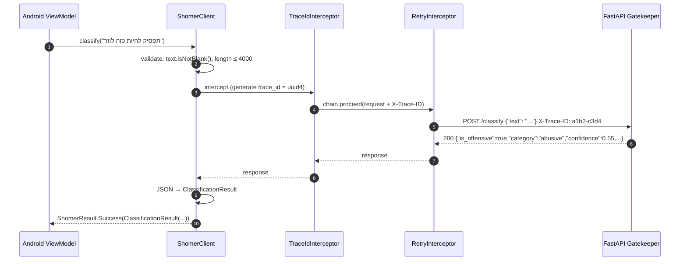
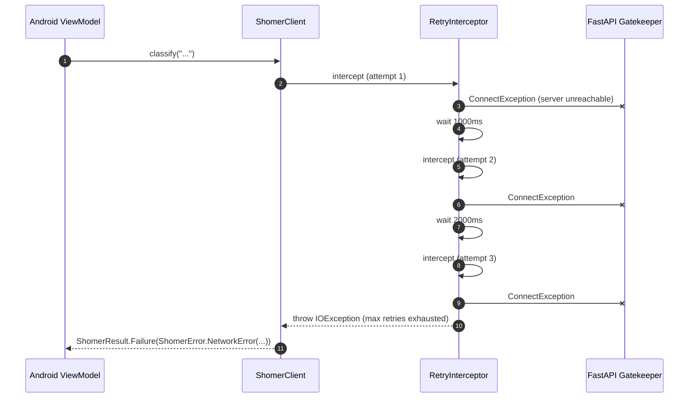

# Shomer.AI SDK — Low-Level Design

**Module ID:** sdk-kotlin
**Owner:** TBD
**Status:** Draft for Meeting 4
**PRD reference:** PRD §8.6 (Client SDK)
**Last updated:** 2026-05-31

---

## 1. Purpose & scope

The Shomer.AI SDK is the single hand-written Kotlin library that all clients (Android Child, Android Parent, future web or integration callers) import to communicate with the FastAPI server. It owns the HTTP wire format, retry logic (exponential backoff), timeout enforcement, request/response data classes, and the sealed error hierarchy. It does **not** own UI, ViewModel state, FCM handling, or any server-side logic.

The MVP delivers a Kotlin library at `server/sdk/kotlin/`. A TypeScript variant is a Phase 9 stretch goal and is out of scope for this design. The design is **hand-written** (not generated from OpenAPI) per PRD §8.6 and `plan-docs/decisions/prd-enrichment.decision.md` D1 — easier to read and explain academically; migration path to generated code is described in §10.

---

## 2. Public interface (API contract)

### 2.1 ShomerClient — primary entry point

```kotlin
// File: server/sdk/kotlin/src/main/kotlin/com/shomer/sdk/ShomerClient.kt

class ShomerClient(
    private val config: SdkConfig,
    private val httpClient: OkHttpClient = defaultHttpClient(config),
) {
    /** Classify a Hebrew text string. */
    suspend fun classify(text: String): ShomerResult<ClassificationResult>

    /** Classify an image (chat screenshot). bytes must be JPEG/PNG, max 10MB. */
    suspend fun classify(imageBytes: ByteArray, mimeType: String = "image/jpeg"): ShomerResult<ClassificationResult>

    /** Check server liveness and Ollama reachability. */
    suspend fun health(): ShomerResult<HealthResult>

    /** Retrieve model metadata (name, labels). */
    suspend fun modelInfo(): ShomerResult<ModelInfoResult>

    /** Release underlying OkHttp resources. Call from Application.onTerminate() or test teardown. */
    fun close()
}
```

### 2.2 Data classes (mirror server/app/schemas.py)

```kotlin
// File: server/sdk/kotlin/src/main/kotlin/com/shomer/sdk/models/Models.kt

/**
 * Unified result for both text and image classify calls.
 * contextUsed and reasoningTrace are null for non-borderline cases
 * and for the stand-in model (Phase 0–4).
 */
data class ClassificationResult(
    val isOffensive: Boolean,
    val category: String,          // "abusive"|"hate"|"violence"|"pornographic"|"non_offensive"
    val confidence: Float,         // [0.0, 1.0]
    val model: String,
    val latencyMs: Int,
    // Image-only fields (null for text classify):
    val extractedText: String? = null,
    val backend: String? = null,
    val strategy: String? = null,
    // Context Agent fields (null when context agent was not invoked):
    val contextUsed: Boolean? = null,
    val reasoningTrace: String? = null,
    // Review flag — true when LLM fallback was used (server graceful degradation):
    val reviewFlag: Boolean = false,
)

data class HealthResult(
    val status: String,            // "ok" | "degraded"
    val ollamaReachable: Boolean,
    val model: String,
)

data class ModelInfoResult(
    val model: String,
    val base: String?,
    val labels: List<String>,
)
```

### 2.3 Sealed ShomerResult and ShomerError

```kotlin
// File: server/sdk/kotlin/src/main/kotlin/com/shomer/sdk/ShomerResult.kt

sealed class ShomerResult<out T> {
    data class Success<T>(val value: T) : ShomerResult<T>()
    data class Failure(val error: ShomerError) : ShomerResult<Nothing>()

    val isSuccess get() = this is Success
    fun getOrNull(): T? = (this as? Success)?.value
    fun errorOrNull(): ShomerError? = (this as? Failure)?.error
}

sealed class ShomerError(open val message: String) {
    /** TCP-level failure: no route to host, connection refused, DNS failure. */
    data class NetworkError(override val message: String, val cause: Throwable) : ShomerError(message)

    /** HTTP 4xx (excluding 429) or 5xx from FastAPI. */
    data class ServerError(val httpStatus: Int, override val message: String) : ShomerError(message)

    /** HTTP 429 Too Many Requests — rate limit hit (Gatekeeper). */
    data class RateLimitError(val retryAfterSeconds: Int?) : ShomerError("Rate limit exceeded")

    /** HTTP 422 Unprocessable Entity — payload validation failed. */
    data class ValidationError(val detail: String) : ShomerError("Validation error: $detail")

    /** SDK-side timeout (OkHttp read timeout exceeded before HTTP response). */
    data class TimeoutError(val timeoutMs: Long) : ShomerError("Request timed out after ${timeoutMs}ms")

    /** Response was HTTP 200 but JSON could not be parsed into the expected shape. */
    data class ParseError(override val message: String, val cause: Throwable) : ShomerError(message)
}
```

### 2.4 SdkConfig

```kotlin
// File: server/sdk/kotlin/src/main/kotlin/com/shomer/sdk/SdkConfig.kt

data class SdkConfig(
    val baseUrl: String,                   // e.g. "http://10.0.2.2:8000/"
    val connectTimeoutMs: Long = 10_000L,
    val readTimeoutMs: Long = 60_000L,     // text classify
    val imageReadTimeoutMs: Long = 180_000L, // image classify (Tesseract is slow)
    val maxRetries: Int = 3,
    val initialBackoffMs: Long = 1_000L,   // 1s → 2s → 4s
    val sdkVersion: String = BuildConfig.SDK_VERSION, // semver injected by Gradle
)
```

---

## 2.5 Interface boundary & isolation guarantees

**The Port (Protocol):** `ShomerApi` — the ONLY symbol callers depend on. Production code instantiates `ShomerHttpClient` (the Retrofit/OkHttp-backed default), tests use `FakeShomerClient`. Both implement `ShomerApi`.

```kotlin
// server/sdk/kotlin/src/main/kotlin/com/shomer/sdk/ShomerApi.kt
interface ShomerApi {
    suspend fun classify(text: String): ShomerResult<ClassificationResult>
    suspend fun classify(imageBytes: ByteArray, mimeType: String = "image/jpeg"): ShomerResult<ClassificationResult>
    suspend fun health(): ShomerResult<HealthResult>
    suspend fun modelInfo(): ShomerResult<ModelInfoResult>
    fun close()
}
```

The existing `ShomerClient` class (§2.1) is renamed conceptually to `ShomerHttpClient` here — it is the default adapter; `ShomerClient` may also remain as a thin factory that returns the configured `ShomerApi` adapter for backward compatibility. The point: callers (Android client, future web client, future test code) depend on `ShomerApi`, never on `ShomerHttpClient`.

**Concrete adapters that satisfy this interface:**

| Adapter | When to use | Lines to change to enable |
|---|---|---|
| `ShomerHttpClient` | Default — hand-written OkHttp + Moshi (the design in §3) | (default — bound in `ShomerClient.create()` factory) |
| `OpenApiGeneratedClient` | Phase 9 stretch — auto-generated from FastAPI `/openapi.json`; identical `ShomerApi` surface (per §10) | one line in `ShomerClient.create()` + add `openapi-generator` to Gradle |
| `FakeShomerClient` | Unit tests of consumer ViewModels; pre-canned `ShomerResult` per call | injected via Hilt test module |
| `OfflineCachingClient` | Future offline-first mode — decorator that wraps any `ShomerApi` and caches `health()` / `modelInfo()` results | one line (decorator composition) |

The `OfflineCachingClient` example is important: it is a **decorator** (composition over inheritance) — it takes another `ShomerApi` in its constructor and forwards calls. This is how new behaviour is added without touching `ShomerHttpClient`.

**Isolation rules (what this module MAY and MUST NOT touch):**
- May import: stdlib, kotlinx coroutines, `okhttp3`, `moshi`, `slf4j-api`, `kotlin.uuid`.
- MUST NOT import: any Android-specific class (`android.*`, `androidx.*`) — the SDK must compile cleanly on plain JVM for headless tests and for the future web variant. Android-side wiring (the `SLF4JTree` Timber bridge, `MetricsCallback` Firebase adapter) lives in `android_client/`, not in the SDK.
- MUST NOT import: anything from `android_client/`. The SDK is a leaf library; only callers import from it.
- The internal `ShomerEndpoint<I, O>` Protocol (§3.4) is a private port for the four endpoint classes — it does not leak to consumers.

**Contract test:** `src/test/kotlin/com/shomer/sdk/ShomerApiContractTest.kt` (JVM, MockWebServer-based). Every adapter is parametrized through this suite. Fixtures: a successful 200 response, a 429 rate-limit response, a 500 server error, a network-disconnect simulation, and a malformed JSON response. The suite asserts: (a) `ShomerResult.Success` wraps the parsed data class on 200, (b) every documented HTTP error code maps to the correct `ShomerError` subclass (per §8 failure-modes table), (c) `close()` releases OkHttp resources, (d) retries fire 3× on 5xx but NOT on 4xx, (e) `X-Trace-ID` header is present on every outbound request.

**Swap demo — Hand-written → OpenAPI-generated (per Phase-9 stretch in §10):**

```kotlin
// Before — caller side (Android AppModule)
val api: ShomerApi = ShomerClient.create(config)   // returns ShomerHttpClient

// After (Phase 9, when openapi.yaml is published)
val api: ShomerApi = ShomerClient.create(config, generator = Generated())   // returns OpenApiGeneratedClient
```

Every ViewModel and Composable in the Android client keeps working unchanged — they depend on `ShomerApi`, not on `ShomerHttpClient`.

---

## 3. Internal design

### 3.1 Package/file layout

```
server/sdk/kotlin/
├── build.gradle.kts                          — library module (no applicationId)
├── src/main/kotlin/com/shomer/sdk/
│   ├── ShomerClient.kt                       — public entry point (see §2.1)
│   ├── ShomerResult.kt                       — ShomerResult + ShomerError sealed hierarchy
│   ├── SdkConfig.kt                          — typed config (see §2.4)
│   ├── models/
│   │   └── Models.kt                         — ClassificationResult, HealthResult, ModelInfoResult
│   ├── internal/
│   │   ├── HttpEngine.kt                     — OkHttp client factory; retry interceptor
│   │   ├── RetryInterceptor.kt               — exponential backoff (1s/2s/4s, max 3 attempts)
│   │   ├── TraceIdInterceptor.kt             — injects X-Trace-ID header on every request
│   │   ├── JsonAdapter.kt                    — Moshi adapters; maps JSON → data classes
│   │   ├── ClassifyEndpoint.kt               — POST /classify logic
│   │   ├── ClassifyImageEndpoint.kt          — POST /classify-image (multipart) logic
│   │   ├── HealthEndpoint.kt                 — GET /health logic
│   │   └── ModelInfoEndpoint.kt              — GET /model/info logic
│   └── logging/
│       └── SdkLogger.kt                      — SLF4J logger tagged "shomer.sdk"
├── src/test/kotlin/com/shomer/sdk/
│   ├── ShomerClientTest.kt                   — unit tests with MockWebServer
│   ├── RetryInterceptorTest.kt               — backoff timing, max retries
│   └── ShomerErrorMappingTest.kt             — HTTP status → ShomerError mapping
└── README.md                                 — EXISTING placeholder (to be expanded)
```

### 3.2 Key classes and responsibilities

| Class | Responsibility |
|---|---|
| `ShomerClient` | Public API; delegates to `*Endpoint` classes; exposes `ShomerResult<T>` |
| `HttpEngine` | Builds the `OkHttpClient` with `RetryInterceptor`, `TraceIdInterceptor`, and timeouts from `SdkConfig`; shared across all endpoint instances |
| `RetryInterceptor` | OkHttp `Interceptor`; retries on `NetworkError` or 5xx with exponential backoff (1s/2s/4s); does **not** retry 4xx |
| `TraceIdInterceptor` | Generates a UUID4 `trace_id` per request; adds `X-Trace-ID` header; stores it in `OkHttp.tag(String::class)` for logger access |
| `ClassifyEndpoint` | POST /classify; serializes `{"text": ...}` → deserializes `ClassifyResponse` |
| `ClassifyImageEndpoint` | POST /classify-image; builds `MultipartBody`; deserializes `ClassifyImageResponse` |
| `JsonAdapter` | Moshi `@JsonClass` adapters; mirrors `server/app/schemas.py`; fails fast on missing fields |
| `SdkLogger` | SLF4J logger `"shomer.sdk"`; Android callers provide a `SLF4JTree` Timber tree |

### 3.3 Retry logic detail

```
Attempt 1 → failure (NetworkError or 5xx) → wait 1s
Attempt 2 → failure                        → wait 2s
Attempt 3 → failure                        → return ShomerResult.Failure
```

- 4xx errors (including 429, 413, 408) are **not** retried — they are immediately mapped to the appropriate `ShomerError` subclass and returned.
- 429 responses are not auto-retried; callers should check `RateLimitError.retryAfterSeconds` and back off at the application layer if desired.

### 3.4 Internal Protocol seam

```kotlin
// internal/EndpointProtocol.kt
internal interface ShomerEndpoint<I, O> {
    suspend fun execute(input: I): ShomerResult<O>
}
```

Each `*Endpoint` class implements this. `ShomerClient` calls endpoints through this interface, making them independently mockable. For future extraction: replace `HttpEngine`-backed implementations with gRPC stubs without changing `ShomerClient`'s public API.

### 3.5 Terminal CLI runner (`:sdk-cli`)

A separate Gradle subproject `server/sdk/kotlin-cli/` ships a runnable fat-jar that **wraps the same `ShomerClient`** and exposes the server's surface from a terminal — for Meeting 4 architecture demos, post-deploy smoke tests, and Meeting 8 gold-set evaluations. It is intentionally NOT part of the published `:sdk` artifact; consumers who only want the library never pull the CLI bits.

**Package layout:**

```
server/sdk/
├── kotlin/                    ← the :sdk library (existing)
└── kotlin-cli/                ← NEW — :sdk-cli subproject
    ├── build.gradle.kts       ← implementation(project(":sdk"))
    └── src/main/kotlin/com/shomer/cli/
        ├── Main.kt            ← clikt entry point
        ├── commands/
        │   ├── ClassifyCommand.kt
        │   ├── ClassifyImageCommand.kt
        │   ├── HealthCommand.kt
        │   ├── InfoCommand.kt
        │   ├── DemoCommand.kt
        │   └── BatchCommand.kt
        └── resources/golden_inputs.jsonl  ← curated 8–10 row demo set
```

**Usage:**

```bash
# Build once
./gradlew :sdk-cli:fatJar

# Smoke test every endpoint
java -jar sdk-cli/build/libs/shomer-cli.jar classify "תפסיק להיות כזה לוזר"
java -jar shomer-cli.jar classify-image screenshot.png --verbose
java -jar shomer-cli.jar health
java -jar shomer-cli.jar info

# Live demo — runs the curated golden set
java -jar shomer-cli.jar demo --server http://localhost:8000

# Meeting 8 gold-set run (writes per-row results + summary)
java -jar shomer-cli.jar batch gold_set.jsonl --out results.jsonl --parallel 4
```

**Why this matters architecturally:**
- **Proves the port works without Android.** Any Protocol that can only be exercised through one client is not a real port. The `:sdk-cli` calling `ShomerClient` from a JVM main() is the cheapest possible proof that the `ShomerApi` boundary holds.
- **Decouples server testing from the mobile build.** Server developers can verify a change end-to-end in seconds without launching the emulator.
- **Same artifact, two surfaces.** The CLI demo (SDK-CLI-02) and the Python `scripts/dev_client.py` (server LLD §11) intentionally share the same `golden_inputs.jsonl` schema so parity tests can run both and assert identical outputs — a contract test for the wire protocol itself.

**Tasks:** `SDK-CLI-01` (subproject + entry point) → `SDK-CLI-02` (5 subcommands + golden set) → `SDK-CLI-03` (batch mode for Meeting 8). See `tasks.json`.

---

## 4. Sequence diagrams (Mermaid)

### 4.1 Text classify — happy path with trace-id propagation



### 4.2 Network failure with retry and exhaustion



---

## 5. Data model

### 5.1 JSON field mapping — server schemas.py → SDK Models.kt

| Server field (schemas.py) | SDK field (Models.kt) | Notes |
|---|---|---|
| `is_offensive` | `isOffensive: Boolean` | camelCase in Kotlin |
| `category` | `category: String` | String, not enum — server may emit `"stub"` in Phase 1 |
| `confidence` | `confidence: Float` | Double on server; Float sufficient on client |
| `model` | `model: String` | |
| `latency_ms` | `latencyMs: Int` | |
| `extracted_text` | `extractedText: String?` | null for text-only responses |
| `backend` | `backend: String?` | null for text-only responses |
| `strategy` | `strategy: String?` | null for text-only responses |

Future fields added by Context Agent (Phase 6–7):

| Anticipated server field | SDK field |
|---|---|
| `context_used` | `contextUsed: Boolean?` |
| `reasoning_trace` | `reasoningTrace: String?` |
| `review_flag` | `reviewFlag: Boolean` |

The SDK deserializes unknown fields leniently (Moshi `lenient = true`) so new server fields do not break existing SDK versions.

### 5.2 No persistence

The SDK is stateless; it persists nothing. All in-memory state lives in the active coroutine scope of the caller.

---

## 6. Observability — Logger, Config, Metrics

### 6.1 Logger

**Library:** SLF4J API (compile dependency) — Android callers bridge via a `SLF4JTree` Timber tree; unit tests use SLF4J Simple.

**Logger name:** `shomer.sdk`

**Fields on every structured log line:**
- `trace_id` — UUID4 generated by `TraceIdInterceptor` for the current request
- `module` — always `"shomer.sdk"`
- `event` — semantic event name
- `attempt` — retry attempt number (1–3)

**3 example log lines:**

```json
// Happy path
{"ts":"2026-06-01T10:22:33Z","trace_id":"a1b2-c3d4","module":"shomer.sdk","event":"request_success","endpoint":"/classify","attempt":1,"http_status":200,"latency_ms":245}

// Borderline — retried once, then succeeded
{"ts":"2026-06-01T10:23:00Z","trace_id":"e5f6-a7b8","module":"shomer.sdk","event":"request_retry","endpoint":"/classify","attempt":2,"error_type":"NetworkError","backoff_ms":1000}

// Exhausted retries
{"ts":"2026-06-01T10:23:07Z","trace_id":"c9d0-e1f2","module":"shomer.sdk","event":"request_failed","endpoint":"/classify","attempt":3,"error_type":"NetworkError","message":"Connection refused"}
```

### 6.2 Config

| Name | Type | Default | BuildConfig key | Description | Secret? |
|---|---|---|---|---|---|
| `baseUrl` | String | `"http://10.0.2.2:8000/"` | Provided by caller via `SdkConfig` | FastAPI server base URL | No |
| `connectTimeoutMs` | Long | `10000` | `SdkConfig.connectTimeoutMs` | OkHttp connect timeout | No |
| `readTimeoutMs` | Long | `60000` | `SdkConfig.readTimeoutMs` | Read timeout for text classify | No |
| `imageReadTimeoutMs` | Long | `180000` | `SdkConfig.imageReadTimeoutMs` | Read timeout for image classify | No |
| `maxRetries` | Int | `3` | `SdkConfig.maxRetries` | Total attempts (first + 2 retries) | No |
| `initialBackoffMs` | Long | `1000` | `SdkConfig.initialBackoffMs` | Base backoff: 1s/2s/4s | No |
| `SDK_VERSION` | String | injected by Gradle | `BuildConfig.SDK_VERSION` | Semver string; sent as `User-Agent` header | No |

### 6.3 Metrics

The SDK emits metrics via a pluggable `MetricsCallback` interface rather than having a hard dependency on a metrics library (keeping the SDK dependency-light for future TS port).

```kotlin
// internal/MetricsCallback.kt
interface MetricsCallback {
    fun onRequestCompleted(endpoint: String, attempt: Int, latencyMs: Long, httpStatus: Int?)
    fun onRequestFailed(endpoint: String, attempts: Int, errorType: String)
}
```

Android callers inject a `PrometheusMetricsCallback` (wraps `micrometer-android`) or a `FirebaseMetricsCallback`. Default (if not provided) is a no-op.

| Metric name | Type | Labels | What it answers | NFR served |
|---|---|---|---|---|
| `shomer_sdk_requests_total` | Counter | `endpoint`, `result` (success/failure) | Total SDK requests and outcomes | Availability ≥ 99% |
| `shomer_sdk_request_latency_ms` | Histogram | `endpoint`, `attempt` | Client-side p99 latency per endpoint | e2e latency p99 < 5s |
| `shomer_sdk_retry_total` | Counter | `endpoint`, `attempt` | How often retries fire | Reliability signal |
| `shomer_sdk_error_total` | Counter | `endpoint`, `error_type` | Error breakdown by class | Debugging / alerting |

---

## 7. NFR targets & test plan

| NFR (PRD §9) | SDK contribution | Test approach | Test file |
|---|---|---|---|
| e2e latency p99 < 5s | SDK adds < 10ms overhead (no serialization on hot path) | MockWebServer: measure classify() round-trip latency 100× | `test/ShomerClientLatencyTest.kt` |
| Cost/interaction < $0.005 | SDK ensures no duplicate requests (retry only on true failures) | Unit: RetryInterceptor does not retry 4xx | `test/RetryInterceptorTest.kt` |
| Availability ≥ 99% (frontline) | 3-retry backoff recovers transient failures | MockWebServer: fail twice then succeed → verify Success result | `test/RetryInterceptorTest.kt` |
| Privacy: no PII in LLM calls | SDK does not log text content at INFO level | Unit: capture log output, verify text is absent from INFO lines | `test/SdkLoggerPrivacyTest.kt` |
| Error handling completeness | All ShomerError variants are reachable via test | MockWebServer: return each HTTP error code → verify mapped error type | `test/ShomerErrorMappingTest.kt` |

---

## 8. Failure modes & fallbacks

| Failure | Detection | Fallback | User-visible effect |
|---|---|---|---|
| Server 429 (rate limit) | HTTP 429 response | Map to `ShomerError.RateLimitError(retryAfterSeconds)`; do not auto-retry | Caller shows "too many requests" message |
| Server 413 (payload too large) | HTTP 413 response | Map to `ShomerError.ServerError(413, ...)`; do not retry | Caller should compress image further or reject |
| Server 408 / 504 (timeout) | HTTP 408/504 response | Map to `ShomerError.TimeoutError`; do not retry (network may be congested) | Caller shows "server timed out" message |
| Server 500 / 502 | HTTP 5xx | Retry up to 3 attempts with backoff; if all fail → `ServerError` | Caller shows error message |
| OkHttp connect timeout | `SocketTimeoutException` on connect | Retry up to 3 attempts | Caller shows "cannot reach server" |
| JSON parse failure (schema drift) | Moshi `JsonDataException` | Map to `ShomerError.ParseError`; no retry | Caller shows "unexpected response from server"; developer must update SDK |
| SDK compile failure (dependency conflict) | Build error | Android client falls back to its existing `ApiService.kt` HTTP layer (Phase 1 interim); tracked in `server/sdk/README.md` | No user-visible effect; engineering fallback |

---

## 9. Deployment & config

**Ships as:** Android library module (`.aar`) consumed by both flavors of `android_client/`. Dependency in `android_client/app/build.gradle.kts`:

```kotlin
implementation(project(":sdk:kotlin"))
```

**Versioning (semver):**
- `1.0.0` — MVP (wraps `/classify`, `/classify-image`, `/health`, `/model/info`)
- `1.x.0` — backward-compatible additions (new optional response fields, new endpoints)
- `2.0.0` — breaking change (renamed fields, removed endpoints, new auth scheme)
- Every breaking change also increments `CHANGELOG.md` in `server/sdk/`

**Required runtime dependencies (Gradle):**
- `com.squareup.okhttp3:okhttp:4.12.0`
- `com.squareup.moshi:moshi-kotlin:1.15.1`
- `org.slf4j:slf4j-api:2.0.9` (compile only; runtime bridge provided by caller)

**No secrets required.** The SDK takes `baseUrl` from the caller; there are no API keys in the MVP (server is local-only).

**Startup order:** `ShomerClient` instance should be created after `SettingsRepository.serverUrl` is first read (typically in Hilt `AppModule` after DataStore warmup).

---

## 10. Future extraction seam

The SDK is already a separate library module (`server/sdk/kotlin/`), so it is not "inside" a monolith to extract — it is the extraction seam itself. The future migration path from hand-written to OpenAPI-generated is:

1. Export `openapi.yaml` from FastAPI: `python -m openapi_spec_validator docs/openapi.yaml` (or FastAPI's built-in `/openapi.json`).
2. Run `openapi-generator-cli generate -i openapi.yaml -g kotlin -o server/sdk/kotlin-generated/`.
3. The generated code adopts the same `ShomerClient` method signatures designed here (because the PRD contract was designed to match the server schemas exactly).
4. Run the existing test suite (`ShomerClientTest.kt`) against the generated client — if it passes, the migration is complete.
5. Callers import from `com.shomer.sdk` (same package); no calling code changes.

The `ShomerEndpoint` protocol (§3.4) is the seam that makes step 4 work: each generated endpoint class satisfies the same interface the hand-written class implements.

---

## 11. Open questions

1. **TypeScript SDK (Phase 9)**: same design principles apply; the `ShomerClient` API surface maps cleanly to TypeScript. Confirm when/if web dashboard is scoped. — Link: PRD §11 Out-of-Scope.
2. **Maven Central / JitPack publication**: for 3rd-party integrations (schools, platforms per business plan §5), the SDK needs a public artifact. Not needed for the thesis; deferred to post-Meeting-8. — Link: `plan-docs/decisions/prd-enrichment.decision.md` D1 Revisit.
3. **Authentication header**: currently the SDK sends no auth headers (server is LAN-only). When Phase 9 adds API key auth (Gatekeeper §8.7), the SDK needs an `Authorization: Bearer <key>` interceptor. The `SdkConfig.apiKey: String?` field is reserved in the schema but not wired up. — Link: `docs/design/gatekeeper/design.md` §11.
4. **Context Agent response fields (`contextUsed`, `reasoningTrace`)**: the server will add these in Phase 7. The SDK already has the fields as nullable in `ClassificationResult` and deserializes them leniently. No SDK version bump needed when server starts returning them. Confirm server field names match before Phase 7 lands.
5. **Moshi vs kotlinx.serialization**: Moshi was chosen because the existing `android_client/` uses it. If the project migrates to KMP (multiplatform) for the TS stretch goal, `kotlinx.serialization` is the better cross-platform choice. Revisit if TS SDK is scoped.
