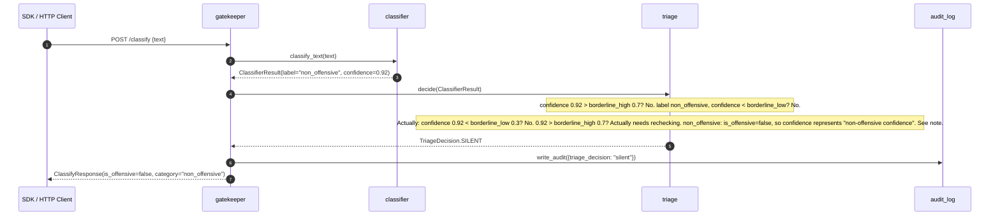

# Full Server — Integration Low-Level Design

**Module ID:** `server`
**Owner:** TBD
**Status:** Draft for Meeting 4
**PRD reference:** PRD §7 (architecture), §8 (all components), §9 (NFRs), §10 (KPIs)
**Last updated:** 2026-05-31

---

## 1. Purpose & Scope

This document is the **implementation-level integration view** of the Shomer.AI FastAPI server. It is NOT a C4 system diagram — for that see `docs/architecture_diagrams.md`. This document answers:

- What is every Python file in `server/app/` and what does it do?
- How are modules wired together at startup (dependency injection)?
- What is the exact sequence of a `/classify` request through every module?
- How do cross-cutting concerns (trace-id, structlog, Prometheus, SQLite) flow?
- How is the server built, deployed, and configured end-to-end?

**Companion LLDs:** Read these alongside this document:
- `docs/design/triage/design.md` — Triage Router module detail
- `docs/design/alerts/design.md` — Alerts / Notification Service detail
- Other module LLDs (gatekeeper, classifier, ocr, context_agent, audit_log) — to be written in subsequent sessions

---

## 2. Public Interface (API Contract / Protocol)

The server exposes four HTTP endpoints. All are documented in OpenAPI at `/docs` (Swagger UI, auto-generated by FastAPI).

| Method | Path | Module owner | Description |
|---|---|---|---|
| `POST` | `/classify` | `classifier`, `triage`, `context_agent`, `alerts`, `audit_log` | Classify Hebrew text; optionally trigger alert |
| `POST` | `/classify-image` | `ocr`, `classifier`, `triage`, `context_agent`, `alerts`, `audit_log` | Classify chat screenshot (OCR → text → classify) |
| `GET` | `/health` | `gatekeeper`, all modules | Liveness + readiness; aggregate status of all module sub-checks |
| `GET` | `/model/info` | `classifier` | Frontline model name + label schema |
| `GET` | `/metrics` | `gatekeeper` (Prometheus instrumentator) | Prometheus text format — scraped by Prometheus server |

---

## 2.5 Interface boundary & isolation guarantees

This is the **integration view** for the ports-and-adapters discipline that every other LLD describes individually. The rule is one sentence:

> **The server module imports ONLY Protocols from other modules; concrete classes are constructed in the `lifespan()` composition root and nowhere else.**

This is what makes the swap scenarios from `docs/design/README.md` §2.3 actually one-line changes. Route handlers, `ClassificationPipeline`, audit middleware, and `/health` aggregation all type their dependencies by Protocol — they never know whether the classifier is Ollama or HuggingFace, whether the OCR is Tesseract or EasyOCR, whether the Context Agent is LLM-driven or rule-based.

### Protocols this module imports (the only cross-module symbols allowed in route handlers / pipeline)

| Module | Protocol(s) imported | Where used in `server/` |
|---|---|---|
| `ocr` | `OcrBackend`, `OcrResult` | `ClassificationPipeline.handle_image()`, strategy router |
| `classifier` | `TextClassifier`, `ClassificationResult` | `ClassificationPipeline.classify_text()`, `/model/info` endpoint |
| `triage` | `TriageEngine`, `TriageDecision` | `ClassificationPipeline.route()`, audit field |
| `context_agent` | `ContextReasoner`, `LlmClient`, `TokenBudgetGuard`, `AgentInput`, `AgentResult` | `ClassificationPipeline.handle_borderline()` |
| `alerts` | `NotificationChannel`, `AlertRateLimiter`, `AlertRequest`, `AlertResult` | `ClassificationPipeline.emit_alert()`, `/alerts/history` |
| `gatekeeper` | `RateLimitStore`, `TraceIdGenerator`, `MetricsEmitter` | middleware registration in `register_gateway()` |

### Concrete classes — imported ONLY in `lifespan()`

The full composition root is documented in `docs/design/README.md` §4. The short version: `server/app/main.py` has an explicit comment block marking the only region where `from .<module>.<adapter> import <ConcreteClass>` is permitted. A `ruff` / `import-linter` rule enforces this — any other file importing a concrete adapter class fails CI.

### Composition root pseudocode (mirror of README §4 for reference)

```python
# server/app/main.py — lifespan()

@asynccontextmanager
async def lifespan(app: FastAPI):
    settings = ServerSettings()

    # ── Each concrete adapter is constructed HERE and only HERE.
    # ── Each line is a "single point of swap" for its Protocol.

    # gatekeeper ports
    rate_store: RateLimitStore = InMemoryRateLimitStore()
    trace_id_gen: TraceIdGenerator = Uuid4TraceIdGenerator()
    metrics: MetricsEmitter = PrometheusMetricsEmitter(settings.gatekeeper)

    # ocr port
    ocr: OcrBackend = TesseractOcrBackend(settings.ocr)
    # ocr: OcrBackend = EasyOcrBackend(settings.ocr)  # ← swap

    # classifier port
    classifier: TextClassifier = OllamaDictaBertClassifier(settings.classifier)
    # classifier: TextClassifier = HuggingFaceClassifier(settings.classifier)  # ← swap

    # triage port
    triage: TriageEngine = RuleBasedTriage(settings.triage)

    # context_agent ports (three of them)
    llm: LlmClient = GptMiniClient(settings.context_agent)
    # llm: LlmClient = HaikuClient(settings.context_agent)  # ← swap LLM
    budget: TokenBudgetGuard = SqliteTokenManager(settings.context_agent)
    context_agent: ContextReasoner = LlmContextAgent(llm, budget, tools, settings.context_agent)
    # context_agent: ContextReasoner = RuleBasedReasoner(...)  # ← swap whole agent

    # alerts ports (two of them)
    alert_limiter: AlertRateLimiter = InMemoryAlertRateLimiter(settings.alerts)
    notifier: NotificationChannel = FcmNotifier(settings.alerts, alert_limiter)
    # notifier: NotificationChannel = SmsNotifier(settings.alerts, alert_limiter)  # ← swap

    # Pipeline is composed of Protocol-typed dependencies — it has zero knowledge
    # of which concrete adapter is on the other end.
    app.state.pipeline = ClassificationPipeline(
        ocr=ocr, classifier=classifier, triage=triage,
        context_agent=context_agent, notifier=notifier,
        rate_store=rate_store, trace_id_gen=trace_id_gen, metrics=metrics,
    )

    yield
    await app.state.pipeline.aclose()
```

### Import graph (Protocols-only between modules; composition-root → adapters dashed)

```mermaid
graph TB
    subgraph CompositionRoot["main.py · lifespan() — composition root"]
        Lifespan[lifespan]
    end

    subgraph Ports["Cross-module Protocols (the only allowed inter-module symbols)"]
        P_OCR[OcrBackend]
        P_CLS[TextClassifier]
        P_TRI[TriageEngine]
        P_CTX[ContextReasoner]
        P_LLM[LlmClient]
        P_TBG[TokenBudgetGuard]
        P_NOT[NotificationChannel]
        P_ARL[AlertRateLimiter]
        P_RLS[RateLimitStore]
        P_TID[TraceIdGenerator]
        P_MET[MetricsEmitter]
    end

    subgraph ServerCore["server core (route handlers, pipeline, audit)"]
        Pipeline[ClassificationPipeline]
        Routes["/classify, /classify-image, /health, /model/info"]
    end

    subgraph Adapters["Concrete adapters (private to each module's package)"]
        A_TES[TesseractOcrBackend]
        A_EASY[EasyOcrBackend]
        A_OLL[OllamaDictaBertClassifier]
        A_HF[HuggingFaceClassifier]
        A_RBT[RuleBasedTriage]
        A_LCA[LlmContextAgent]
        A_RBR[RuleBasedReasoner]
        A_GPT[GptMiniClient]
        A_HAI[HaikuClient]
        A_STM[SqliteTokenManager]
        A_FCM[FcmNotifier]
        A_SMS[SmsNotifier]
        A_IRL[InMemoryAlertRateLimiter]
        A_IRS[InMemoryRateLimitStore]
        A_RRS[RedisRateLimitStore]
        A_UTG[Uuid4TraceIdGenerator]
        A_PME[PrometheusMetricsEmitter]
    end

    Pipeline -- "depends on (typed by)" --> P_OCR
    Pipeline --> P_CLS
    Pipeline --> P_TRI
    Pipeline --> P_CTX
    Pipeline --> P_NOT
    Routes --> Pipeline

    Lifespan -. "constructs" .-> A_TES
    Lifespan -. constructs .-> A_EASY
    Lifespan -. constructs .-> A_OLL
    Lifespan -. constructs .-> A_HF
    Lifespan -. constructs .-> A_RBT
    Lifespan -. constructs .-> A_LCA
    Lifespan -. constructs .-> A_RBR
    Lifespan -. constructs .-> A_GPT
    Lifespan -. constructs .-> A_HAI
    Lifespan -. constructs .-> A_STM
    Lifespan -. constructs .-> A_FCM
    Lifespan -. constructs .-> A_SMS
    Lifespan -. constructs .-> A_IRL
    Lifespan -. constructs .-> A_IRS
    Lifespan -. constructs .-> A_RRS
    Lifespan -. constructs .-> A_UTG
    Lifespan -. constructs .-> A_PME

    Lifespan -- "injects (as Protocol)" --> Pipeline

    A_TES -. implements .-> P_OCR
    A_EASY -. implements .-> P_OCR
    A_OLL -. implements .-> P_CLS
    A_HF -. implements .-> P_CLS
    A_RBT -. implements .-> P_TRI
    A_LCA -. implements .-> P_CTX
    A_RBR -. implements .-> P_CTX
    A_GPT -. implements .-> P_LLM
    A_HAI -. implements .-> P_LLM
    A_STM -. implements .-> P_TBG
    A_FCM -. implements .-> P_NOT
    A_SMS -. implements .-> P_NOT
    A_IRL -. implements .-> P_ARL
    A_IRS -. implements .-> P_RLS
    A_RRS -. implements .-> P_RLS
    A_UTG -. implements .-> P_TID
    A_PME -. implements .-> P_MET

    classDef port fill:#e1f5ff,stroke:#0277bd,color:#000
    classDef adapter fill:#fff3e0,stroke:#e65100,color:#000
    classDef core fill:#f3e5f5,stroke:#6a1b9a,color:#000
    classDef root fill:#c8e6c9,stroke:#1b5e20,color:#000

    class P_OCR,P_CLS,P_TRI,P_CTX,P_LLM,P_TBG,P_NOT,P_ARL,P_RLS,P_TID,P_MET port
    class A_TES,A_EASY,A_OLL,A_HF,A_RBT,A_LCA,A_RBR,A_GPT,A_HAI,A_STM,A_FCM,A_SMS,A_IRL,A_IRS,A_RRS,A_UTG,A_PME adapter
    class Pipeline,Routes core
    class Lifespan root
```



**Reading the graph:**
- **Solid edges** (Pipeline → Port): the server core depends *only* on Protocols.
- **Dashed edges from `lifespan`** (lifespan → adapter): the composition root is the ONLY place that touches concrete classes.
- **Dashed edges from adapter → Port** ("implements"): the Liskov-substitution contract that every adapter must honour, enforced by the parametrized contract tests in `tests/contracts/`.

### Why this matters operationally

- **The five swap scenarios from `docs/design/README.md` §2.3 are each ONE edited line** in `lifespan()`. The pipeline, the routes, the audit log, the metrics — none change.
- **Tests are trivially possible** because every Protocol has a `Stub*` adapter. End-to-end tests of the pipeline use stubs for every external dependency; integration tests use real adapters; contract tests prove the two are interchangeable.
- **New developers know exactly where to add things.** A new adapter (e.g., `WhisperOcrBackend`) is a new file under `server/app/ocr/`, registered in the contract test suite, and selected with one edited line in `lifespan()`. Nothing else changes.

---

## 3. Internal Design

### 3.1 Top-Level Package Layout

After all modules land (Meeting 5–7 build):

```
server/
├── app/
│   ├── __init__.py
│   ├── main.py                  # FastAPI app, lifespan, route handlers, middleware wiring
│   ├── schemas.py               # All Pydantic models: ClassifierResult, TriageDecision,
│   │                            #   AlertRequest, AlertResult, HealthResponse, ModelInfoResponse,
│   │                            #   ClassifyRequest, ClassifyResponse, ClassifyImageResponse,
│   │                            #   ContextDecision (added in Meeting 6)
│   ├── settings.py              # ServerSettings (root pydantic-settings, composes all sub-settings)
│   │
│   ├── gatekeeper/              # Middleware: rate-limit, trace-id, metrics
│   │   ├── __init__.py
│   │   ├── middleware.py        # GatekeeperMiddleware (replaces current middleware.py)
│   │   └── settings.py          # GatekeeperSettings
│   │
│   ├── classifier/              # Frontline DictaBERT-base text classifier
│   │   ├── __init__.py
│   │   ├── protocol.py          # TextClassifier Protocol
│   │   ├── dictabert.py         # DictaBERTClassifier (Meeting 5)
│   │   ├── ollama.py            # OllamaClassifier (current stand-in, kept as fallback)
│   │   └── settings.py          # ClassifierSettings
│   │
│   ├── ocr/                     # Tesseract OCR pipeline
│   │   ├── __init__.py
│   │   ├── protocol.py          # OcrProcessor Protocol
│   │   ├── tesseract.py         # TesseractOcr (wraps current image_backends.py OcrBackend)
│   │   └── settings.py          # OcrSettings
│   │
│   ├── triage/                  # Deterministic triage router (see triage/design.md)
│   │   ├── __init__.py
│   │   ├── protocol.py
│   │   ├── router.py
│   │   └── settings.py
│   │
│   ├── context_agent/           # GPT-4o-mini Context Agent (Meeting 6)
│   │   ├── __init__.py
│   │   ├── protocol.py          # ContextAgent Protocol
│   │   ├── agent.py             # GPT4oMiniContextAgent
│   │   ├── tools.py             # read_conversation_history, lookup_slang, check_age_appropriateness
│   │   └── settings.py          # ContextAgentSettings
│   │
│   ├── alerts/                  # FCM Notification Service (see alerts/design.md)
│   │   ├── __init__.py
│   │   ├── protocol.py
│   │   ├── service.py
│   │   ├── rate_limiter.py
│   │   ├── retry_queue.py
│   │   └── settings.py
│   │
│   ├── audit_log/               # SQLite audit + JSONL file sink
│   │   ├── __init__.py
│   │   ├── protocol.py          # AuditLog Protocol
│   │   ├── sqlite_log.py        # SQLiteAuditLog (writes to audit.db + audit-YYYY-MM-DD.jsonl)
│   │   └── settings.py          # AuditLogSettings
│   │
│   ├── slang_db/                # Local slang lexicon (SQLite, read-only at runtime)
│   │   ├── __init__.py
│   │   └── lexicon.py           # SlangLexicon.lookup(term) → SlangEntry | None
│   │
│   # --- legacy files, kept during transition ---
│   ├── audit.py                 # DEPRECATED — will be replaced by audit_log/sqlite_log.py
│   ├── classifier.py            # DEPRECATED — will be replaced by classifier/ollama.py
│   ├── image_backends.py        # DEPRECATED — will be replaced by ocr/tesseract.py
│   ├── middleware.py            # DEPRECATED — will be replaced by gatekeeper/middleware.py
│   ├── ollama_client.py         # Shared HTTP client — kept; used by classifier/ollama.py
│   └── prompt.py                # Shared prompt builder — kept; used by classifier/ollama.py
│
├── logs/                        # JSONL audit files, gitignored (daily rotation)
│   └── audit-YYYY-MM-DD.jsonl
├── audit.db                     # SQLite audit + alert_history, gitignored
├── requirements.txt
├── Dockerfile
└── .env.example
```

**Migration note:** Legacy files (`audit.py`, `classifier.py`, `image_backends.py`, `middleware.py`) remain importable during the transition from the current codebase to the module-per-package structure. Each is progressively replaced meeting by meeting. `main.py` switches imports from the legacy files to the new modules one at a time.

### 3.2 Module Boundary Table

| Module ID | Python package | Protocol it exposes | Depends on | Extraction priority |
|---|---|---|---|---|
| `gatekeeper` | `app.gatekeeper` | FastAPI middleware (no protocol — ASGI) | None (outermost layer) | Low — in-process middleware is fine |
| `classifier` | `app.classifier` | `TextClassifier` | `ollama_client` (stand-in) or HuggingFace transformers (Meeting 5) | Low — replaces in-process |
| `ocr` | `app.ocr` | `OcrProcessor` | `pytesseract`, `PIL` | Low — local binary |
| `triage` | `app.triage` | `TriageRouter` | `schemas` (ClassifierResult, TriageDecision) | Low — pure function |
| `context_agent` | `app.context_agent` | `ContextAgent` | `openai` SDK, `slang_db` | Medium — external API dependency |
| `alerts` | `app.alerts` | `NotificationService` | `firebase-admin`, `audit_log` | Medium — external API dependency |
| `audit_log` | `app.audit_log` | `AuditLog` | `SQLite` (local) | Low — local DB |
| `slang_db` | `app.slang_db` | `SlangLexicon` | `SQLite` (local, read-only) | Low — read-only local |

---

## 4. Sequence Diagrams

### 4.1 `/classify` Request Lifecycle — Full Path (Context Agent Engaged)

This diagram uses module slugs that match each module's LLD `Module ID`.

```mermaid
sequenceDiagram
    autonumber
    participant Client as SDK / HTTP Client
    participant GK as gatekeeper
    participant Classifier as classifier
    participant Triage as triage
    participant CA as context_agent
    participant Alerts as alerts
    participant AuditLog as audit_log

    Client->>GK: POST /classify {text}
    Note over GK: inject trace_id; rate-limit check; emit metrics
    GK->>Classifier: classify_text(text)
    Classifier-->>GK: ClassifierResult(label, confidence, latency_ms)
    GK->>Triage: decide(ClassifierResult, child_id)
    Note over Triage: confidence 0.55 ∈ [0.3, 0.7] + CA enabled
    Triage-->>GK: TriageDecision.ESCALATE_TO_CA
    GK->>CA: handle_borderline(text, conversation_id)
    CA->>CA: read_conversation_history(5 turns)
    CA->>CA: lookup_slang(tokens)
    CA->>CA: GPT-4o-mini reasoning call
    CA-->>GK: ContextDecision(is_real_threat=True, explanation, severity)
    GK->>Alerts: send_alert(AlertRequest)
    Alerts-->>GK: AlertResult(sent=True, latency_ms=340)
    GK->>AuditLog: write_audit(full trace record)
    GK-->>Client: ClassifyResponse(is_offensive, category, confidence, latency_ms)
```

### 4.2 `/classify` Fast Path (Confident Non-Offensive — Silent)



> Design note on confidence direction: For non-offensive results, `confidence` represents confidence in the "non_offensive" label, so high confidence = clearly non-offensive = SILENT. The Triage router treats confidence as "offensive confidence" for the borderline zone calculation. When `is_offensive=False` and `confidence >= borderline_high`, the result is treated as confident-non-offensive. This interpretation is made explicit in `TriageRouterImpl._decide_inner` — if `is_offensive=False`, the SILENT path is taken for `confidence >= borderline_high`, and ALERT_DIRECT is taken for `confidence <= borderline_low`. The triage/design.md LLD captures this in detail.

### 4.3 `/classify-image` Path

```mermaid
sequenceDiagram
    autonumber
    participant Client as SDK / HTTP Client
    participant GK as gatekeeper
    participant OCR as ocr
    participant Classifier as classifier
    participant Triage as triage
    participant AuditLog as audit_log

    Client->>GK: POST /classify-image (multipart image bytes)
    Note over GK: size check ≤ 10MB; inject trace_id
    GK->>OCR: extract_text(image_bytes, strategy)
    OCR-->>GK: extracted_text (heb+eng, or "" if unreadable)
    alt extracted_text is empty
        GK->>AuditLog: write_audit({image_unreadable: true})
        GK-->>Client: ClassifyImageResponse(image_unreadable=true)
    else text extracted
        GK->>Classifier: classify_text(extracted_text)
        Classifier-->>GK: ClassifierResult
        GK->>Triage: decide(ClassifierResult)
        Triage-->>GK: TriageDecision
        Note over GK: same downstream path as /classify
        GK->>AuditLog: write_audit(full trace record)
        GK-->>Client: ClassifyImageResponse(...)
    end
```

---

## 5. Data Model

### 5.1 SQLite `audit.db` Schema

The canonical persistent store. Lives at `server/audit.db` (gitignored). Written by `audit_log` module; read by `/health` and alert history endpoint.

```sql
-- Full request audit trail
CREATE TABLE IF NOT EXISTS requests (
    request_id          TEXT PRIMARY KEY,
    ts                  TEXT NOT NULL,          -- ISO 8601 UTC
    path                TEXT NOT NULL,          -- /classify | /classify-image
    method              TEXT NOT NULL,
    client_ip           TEXT,
    text_snippet        TEXT,                   -- first 100 chars, no full text stored
    image_filename      TEXT,
    classifier_label    TEXT,
    classifier_conf     REAL,
    triage_decision     TEXT,                   -- TriageDecision value
    context_agent_used  INTEGER,               -- BOOLEAN (0/1)
    ca_is_real_threat   INTEGER,
    ca_explanation      TEXT,
    alert_sent          INTEGER,
    alert_id            TEXT,
    latency_ms          INTEGER,
    status_code         INTEGER,
    context_agent_enabled INTEGER              -- A/B flag snapshot per request
);
CREATE INDEX IF NOT EXISTS idx_req_ts ON requests(ts DESC);
CREATE INDEX IF NOT EXISTS idx_req_label ON requests(classifier_label, triage_decision);

-- Alert history (for parent dashboard)
CREATE TABLE IF NOT EXISTS alert_history (
    alert_id        TEXT PRIMARY KEY,
    child_id        TEXT NOT NULL,
    message_id      TEXT NOT NULL,
    label           TEXT NOT NULL,
    severity        TEXT NOT NULL,
    explanation     TEXT NOT NULL,
    quote           TEXT NOT NULL,
    source          TEXT NOT NULL,
    sent            INTEGER NOT NULL,
    queued          INTEGER NOT NULL,
    rate_limited    INTEGER NOT NULL,
    fcm_message_id  TEXT,
    latency_ms      INTEGER,
    timestamp       TEXT NOT NULL,
    trace_id        TEXT NOT NULL
);
CREATE INDEX IF NOT EXISTS idx_alert_child_ts ON alert_history(child_id, timestamp DESC);

-- 7-day rolling window: delete rows older than 7 days
-- Run as a SQLite trigger or as a daily background task in lifespan()
```

**Retention:** A `lifespan()` startup task deletes rows older than 7 days from both tables. The JSONL files (`logs/audit-YYYY-MM-DD.jsonl`) are also pruned: files older than 7 days are deleted.

### 5.2 Shared Pydantic Models (`schemas.py`)

After all modules land, `schemas.py` contains:

| Model | Added by | Used by |
|---|---|---|
| `ClassifyRequest` | existing | gatekeeper → classifier |
| `ClassifyResponse` | existing | gatekeeper → client |
| `ClassifyImageResponse` | existing | gatekeeper → client |
| `HealthResponse` | existing | gatekeeper → client |
| `ModelInfoResponse` | existing | gatekeeper → client |
| `ClassifierResult` | Meeting 5 | classifier → triage |
| `TriageDecision` | Meeting 5 | triage → handler |
| `ContextDecision` | Meeting 6 | context_agent → handler |
| `AlertRequest` | Meeting 7 | handler → alerts |
| `AlertResult` | Meeting 7 | alerts → handler |

---

## 6. Observability

### 6.1 Shared structlog Configuration

Configured once in `app/main.py` at import time (before any module is imported):

```python
# server/app/main.py — top of file, before other imports
import structlog

structlog.configure(
    processors=[
        structlog.contextvars.merge_contextvars,     # binds trace_id from context var
        structlog.stdlib.add_log_level,
        structlog.stdlib.add_logger_name,
        structlog.processors.TimeStamper(fmt="iso"),
        structlog.processors.JSONRenderer(),
    ],
    wrapper_class=structlog.make_filtering_bound_logger(logging.INFO),
    context_class=dict,
    logger_factory=structlog.PrintLoggerFactory(),
)
```

**trace_id propagation:** Gatekeeper middleware binds `trace_id` into structlog's context var at the start of each request:

```python
# gatekeeper/middleware.py
import structlog
structlog.contextvars.bind_contextvars(trace_id=request_id)
```

All subsequent log calls from any module (triage, classifier, alerts, context_agent) automatically include `trace_id` because structlog's `merge_contextvars` processor pulls it from the context var. No explicit passing needed.

At the end of the request (middleware cleanup):
```python
structlog.contextvars.clear_contextvars()
```

### 6.2 Shared Prometheus Registry

A single `CollectorRegistry` is created in `app/metrics.py` and imported by every module:

```python
# server/app/metrics.py
from prometheus_client import CollectorRegistry, make_asgi_app

REGISTRY = CollectorRegistry()
metrics_app = make_asgi_app(registry=REGISTRY)
```

Every module creates its metrics with `registry=REGISTRY` explicitly:

```python
# Example in triage/router.py
from ..metrics import REGISTRY
_DECISION_COUNTER = Counter(
    "triage_decisions_total", "...", ["decision"],
    registry=REGISTRY,
)
```

The `/metrics` endpoint mounts `metrics_app` on the FastAPI app:

```python
# main.py
from .metrics import metrics_app
app.mount("/metrics", metrics_app)
```

This ensures all module metrics are in one registry and scraped by a single Prometheus job.

### 6.3 Per-Module Logger Config

Each module uses:
```python
log = structlog.get_logger("shomer.<module_id>")
```

Module IDs:
- `shomer.gatekeeper`
- `shomer.classifier`
- `shomer.ocr`
- `shomer.triage`
- `shomer.context_agent`
- `shomer.alerts`
- `shomer.audit_log`

All output is JSON lines to stdout. Uvicorn captures and forwards to the container log driver (docker-compose: journald or json-file).

---

## 6a. Module Wiring & DI

### Dependency Injection Approach

**Recommendation: FastAPI `app.state` + `Depends` for route-level injection.**

Rationale: The server is a modular monolith with 8 modules — a lightweight DI container is not worth the complexity overhead at this scale. `app.state` holds all singletons; `Depends` functions provide type-safe access to them in route handlers. This pattern matches what already exists in the codebase (`app.state.client`, `app.state.image_processors`).

Alternative considered: `dependency-injector` (Python DI container) — rejected because it adds ~200 lines of container config for a system that has one deployment target and one process. `app.state` achieves the same goal with zero additional dependencies.

### `lifespan()` Wiring Pseudocode

```python
# server/app/main.py

from .triage.settings import TriageSettings
from .triage.router import TriageRouterImpl
from .alerts.settings import AlertSettings
from .alerts.service import FCMNotificationService, init_firebase
from .alerts.rate_limiter import InMemoryRateLimiter
from .alerts.retry_queue import LocalRetryQueue
from .audit_log.sqlite_log import SQLiteAuditLog
from .audit_log.settings import AuditLogSettings
from .context_agent.agent import GPT4oMiniContextAgent
from .context_agent.settings import ContextAgentSettings
from .settings import ServerSettings

@asynccontextmanager
async def lifespan(app: FastAPI):
    # 1. Load root settings (validates all env vars at startup)
    server_settings = ServerSettings()
    app.state.settings = server_settings

    # 2. Audit Log — first, because other modules write to it
    audit_settings = AuditLogSettings()
    app.state.audit_log = SQLiteAuditLog(audit_settings)
    await app.state.audit_log.init()  # CREATE TABLE IF NOT EXISTS; prune 7-day window

    # 3. Slang Lexicon (read-only SQLite)
    app.state.slang_db = SlangLexicon(server_settings.slang_db_path)

    # 4. Frontline Classifier
    classifier_settings = ClassifierSettings()
    app.state.classifier = _build_classifier(classifier_settings)  # OllamaClassifier or DictaBERT

    # 5. OCR
    ocr_settings = OcrSettings()
    app.state.ocr = TesseractOcr(ocr_settings)

    # 6. Triage Router
    triage_settings = TriageSettings()
    app.state.triage_router = TriageRouterImpl(triage_settings)

    # 7. Context Agent (depends on slang_db)
    ca_settings = ContextAgentSettings()
    app.state.context_agent = GPT4oMiniContextAgent(
        settings=ca_settings,
        slang_db=app.state.slang_db,
        audit_log=app.state.audit_log,
    )

    # 8. Alerts (depends on audit_log)
    alert_settings = AlertSettings()
    init_firebase(alert_settings.fcm_service_account_path)
    rate_limiter = InMemoryRateLimiter(
        max_alerts=alert_settings.rate_limit_max_alerts,
        window_seconds=alert_settings.rate_limit_window_seconds,
    )
    retry_queue = LocalRetryQueue(max_size=alert_settings.queue_max_size)
    app.state.notification_service = FCMNotificationService(
        settings=alert_settings,
        rate_limiter=rate_limiter,
        retry_queue=retry_queue,
    )
    app.state.retry_queue = retry_queue

    yield  # server is running

    # Shutdown: close HTTP clients, flush buffers
    await app.state.classifier.aclose()
    await app.state.audit_log.close()
```

**Initialization order (strict):**
1. `AuditLog` — must be first; all other modules may log to it during init
2. `SlangLexicon` — read-only; no dependencies
3. `Classifier` + `OCR` — depend only on local models/binaries
4. `TriageRouter` — pure function; no dependencies
5. `ContextAgent` — depends on SlangLexicon and AuditLog
6. `NotificationService` — depends on AuditLog; Firebase init is side-effectful

**FastAPI Depends functions** for route handlers:

```python
# server/app/dependencies.py
from fastapi import Request
from .triage.protocol import TriageRouter
from .alerts.protocol import NotificationService
from .audit_log.protocol import AuditLog


def get_triage_router(request: Request) -> TriageRouter:
    return request.app.state.triage_router


def get_notification_service(request: Request) -> NotificationService:
    return request.app.state.notification_service


def get_audit_log(request: Request) -> AuditLog:
    return request.app.state.audit_log
```

Route handler signature example:

```python
@app.post("/classify", response_model=ClassifyResponse)
async def classify(
    req: ClassifyRequest,
    request: Request,
    triage: TriageRouter = Depends(get_triage_router),
    alerts: NotificationService = Depends(get_notification_service),
    audit: AuditLog = Depends(get_audit_log),
) -> ClassifyResponse:
    ...
```

---

## 6b. Cross-Cutting Concerns

### Middleware Order

FastAPI processes `add_middleware` in LIFO order (last-added = outermost on request). The order below is therefore written as the desired **outermost-first** processing order, which means they are added to the app in **reverse** (innermost first):

```
Request enters:
  1. TraceIDMiddleware      (outermost) — assigns UUID trace_id; binds to structlog context var
  2. StructlogContextMiddleware         — binds endpoint + method to log context
  3. RateLimitMiddleware                — enforces per-IP rate limits (slowapi)
  4. PrometheusMiddleware               — records request count + latency (prometheus-fastapi-instrumentator)
  5. CORSMiddleware                     — handles CORS headers
  6. Routes (FastAPI route handlers)    (innermost)

Response exits (reverse order):
  6. Routes → 5 → 4 → 3 → 2 → 1 → Client
```

**Why this exact order:**

- `TraceIDMiddleware` must be outermost so trace_id is available to all inner layers. Every log line and every metric label can carry it.
- `StructlogContextMiddleware` binds module/endpoint context after trace_id is set, so the context is complete before rate-limit decisions are logged.
- `RateLimitMiddleware` comes before metrics so rate-limited requests are counted in Prometheus (they represent load, even if rejected).
- `PrometheusMiddleware` wraps the actual route execution so it measures true end-to-end handler latency, not just the middleware overhead.
- `CORSMiddleware` is innermost so it can set `Access-Control-Allow-Origin` on any response, including 429s from the rate limiter.

**Adding in `main.py` (reverse of desired order):**

```python
app.add_middleware(CORSMiddleware, ...)       # 5th added = innermost
app.add_middleware(PrometheusMiddleware)      # 4th added
app.add_middleware(RateLimitMiddleware)       # 3rd added
app.add_middleware(StructlogContextMiddleware)# 2nd added
app.add_middleware(TraceIDMiddleware)         # 1st added = outermost
```

### trace_id Flow

```
HTTP request arrives
  └─ TraceIDMiddleware: request_id = str(uuid4())
       └─ structlog.contextvars.bind_contextvars(trace_id=request_id)
            └─ All structlog calls in any module automatically include trace_id
                 └─ AuditLoggingMiddleware: record["trace_id"] = request_id
                      └─ write_audit(record) → JSONL line has trace_id
                           └─ Response header: X-Request-ID: <trace_id>
```

The parent Android app echoes `X-Request-ID` back in bug reports. End-to-end: one trace_id ties the JSONL line, the SQLite row, every module's log event, and the FCM `data.trace_id` field.

### Shared HTTP Session Pool

All outbound HTTP calls (to Ollama, to OpenAI/Anthropic, to FCM indirectly via firebase-admin) use a single `httpx.AsyncClient` pool managed in `lifespan()`:

```python
# lifespan():
app.state.http_client = httpx.AsyncClient(
    limits=httpx.Limits(max_connections=20, max_keepalive_connections=10),
    timeout=httpx.Timeout(60.0),
)
# yield
# await app.state.http_client.aclose()
```

The `OllamaClient` and `GPT4oMiniContextAgent` receive this client as a constructor argument — they do not create their own. This prevents connection pool exhaustion under load.

---

## 6c. NFR Ownership Matrix

Each NFR row from PRD §9, mapped to the module that owns its enforcement, and the server-level test that verifies the full chain:

| NFR | Value | Owner module | Server-level test |
|---|---|---|---|
| Frontline latency p99 < 100ms | CPU inference | `classifier` | `tests/integration/test_classify_latency.py`: 1000 req, assert `histogram_quantile(0.99, classifier_latency) < 0.1` |
| Context Agent latency p99 < 3s | External API | `context_agent` | `tests/integration/test_ca_latency.py`: 100 borderline req with real GPT-4o-mini, assert p99 < 3s |
| End-to-end latency p99 < 5s | Full pipeline | `gatekeeper` (measures total) | `tests/integration/test_e2e_latency.py`: assert `X-Response-Time` header p99 < 5s |
| Notification latency p99 < 2s | FCM send | `alerts` | `tests/integration/test_alert_latency.py`: mock FCM fast; assert `alert_send_latency_seconds` p99 < 2s |
| Cost/interaction < $0.005 | LLM token usage | `context_agent` | Manual: measure token counts at Meeting 8; assert avg call cost < $0.003 |
| Accuracy macro-F1 ≥ 0.78 | DictaBERT quality | `classifier` | Offline: `scripts/eval_f1.py` against SinaLab test split (Meeting 5) |
| ΔFPR ≥ 15pp | Context Agent FP reduction | `context_agent` + `triage` | Offline: `scripts/eval_fpr_delta.py` with `CONTEXT_AGENT_ENABLED=true/false` (Meeting 8) |
| Privacy: no PII to external | Scrub before LLM call | `context_agent` | Code review: `context_agent/agent.py` sends only anonymized excerpt + 5 turns |
| Availability frontline ≥ 99% | Local model | `classifier` | Uptime monitor: run `scripts/smoke_test.sh` every 5 min; alert if fails |
| Availability CA ≥ 95% | External API + fallback | `context_agent` | Integration test: mock GPT-4o-mini down → assert fallback to Haiku → assert fallback to frontline-only with review flag |
| Gateway overhead < 5ms p99 | Middleware | `gatekeeper` | `tests/unit/gatekeeper/test_overhead.py`: benchmark middleware on empty handler; assert < 5ms |
| Audit log 100% | Every request logged | `audit_log` | `tests/integration/test_audit_completeness.py`: send N requests, assert N JSONL records written |

---

## 7. NFR Targets & Test Plan

See §6c above for the NFR ownership matrix. This section covers the server-level integration test suite structure:

```
tests/
├── unit/
│   ├── triage/          # see triage/design.md §7
│   ├── alerts/          # see alerts/design.md §7
│   ├── classifier/
│   ├── ocr/
│   ├── context_agent/
│   └── gatekeeper/
│
├── integration/
│   ├── test_classify_latency.py       # frontline p99 < 100ms
│   ├── test_ca_latency.py             # context agent p99 < 3s
│   ├── test_e2e_latency.py            # full pipeline p99 < 5s
│   ├── test_alert_latency.py          # notification p99 < 2s
│   ├── test_ab_switch.py              # CONTEXT_AGENT_ENABLED=false → no CA calls
│   ├── test_rate_limit.py             # >100 req/min → 429
│   ├── test_audit_completeness.py     # every request produces JSONL + SQLite row
│   ├── test_degraded_fcm.py           # FCM down → /health degraded; retry on next req
│   └── test_fallback_chain.py         # GPT-4o-mini down → Haiku → frontline-only
│
└── e2e/
    ├── test_text_flow.py              # full text classify → alert (Firebase emulator)
    └── test_image_flow.py             # screenshot → OCR → classify → alert
```

---

## 8. Failure Modes & Fallbacks

| Component | Failure | Behavior | Health status |
|---|---|---|---|
| `classifier` (Ollama / DictaBERT) | Model unreachable / crash | Return `ClassifierResult(error=True)` → Triage → `REVIEW_NEEDED` | `degraded` |
| `ocr` (Tesseract) | Binary not found | Return empty extracted_text + `image_unreadable=true` | `degraded` |
| `triage` | Exception in `decide()` | Return `REVIEW_NEEDED` (never raises) | No effect |
| `context_agent` (GPT-4o-mini) | API timeout / error | Retry with Haiku 4.5; if both fail → frontline-only + `review_flag=true` | `degraded` if CA failure rate > 5% |
| `alerts` (FCM) | FCM unreachable | Retry 3× with backoff; queue locally; retry on next request | `degraded` |
| `audit_log` (SQLite) | Disk full / corrupt | Log to stderr + continue (audit is non-blocking on request path) | `degraded` |
| `gatekeeper` (rate limiter) | In-memory store crash | Fail-open (allow request through) — rate limit is safety feature, not security | Warning log |

**Graceful degradation priority:** The server NEVER returns 500 to the client for internal module failures that have a fallback. The worst-case response to a `/classify` request is:
- `ClassifyResponse(is_offensive=True, category="review_needed", confidence=0.5)` with `X-Review-Flag: true`
- The parent receives a "please check manually" alert
- The request is fully audited

---

## 9. Deployment & Config

### 9.1 `ServerSettings` — Root Config

```python
# server/app/settings.py
from pydantic_settings import BaseSettings

class ServerSettings(BaseSettings):
    # FastAPI
    app_title: str = "Shomer.AI Classifier"
    app_version: str = "0.4.0"
    debug: bool = False

    # Paths
    audit_db_path: str = "server/audit.db"
    audit_log_dir: str = "server/logs"
    slang_db_path: str = "server/data/slang.db"

    # Ollama (stand-in classifier)
    ollama_url: str = "http://localhost:11434"
    model_name: str = "offensive-hebrew:v1"
    vision_model_name: str = "qwen2.5vl:7b"

    # Sub-settings are loaded by each module directly from env;
    # ServerSettings provides the global defaults and path config.

    model_config = {"env_file": ".env", "env_file_encoding": "utf-8"}
```

### 9.2 `.env.example`

```dotenv
# ── FastAPI ────────────────────────────────────────────────────────────────
APP_VERSION=0.4.0
DEBUG=false

# ── Ollama (stand-in, until DictaBERT lands in Meeting 5) ─────────────────
OLLAMA_URL=http://localhost:11434
MODEL_NAME=offensive-hebrew:v1
VISION_MODEL_NAME=qwen2.5vl:7b
REQUEST_TIMEOUT_S=60
VISION_TIMEOUT_S=180
IMAGE_STRATEGY=pipeline

# ── Classifier (DictaBERT, Meeting 5+) ────────────────────────────────────
CLASSIFIER_MODEL_PATH=dicta-il/dictabert
CLASSIFIER_DEVICE=cpu

# ── Tesseract OCR ─────────────────────────────────────────────────────────
TESSERACT_CMD=C:\Program Files\Tesseract-OCR\tesseract.exe
# Linux/Mac: leave unset (uses PATH)

# ── Triage Router ─────────────────────────────────────────────────────────
TRIAGE_BORDERLINE_LOW=0.3
TRIAGE_BORDERLINE_HIGH=0.7
TRIAGE_BASELINE_THRESHOLD=0.5
TRIAGE_ALWAYS_ESCALATE_LABELS=violence
TRIAGE_ALWAYS_ALERT_LABELS=pornographic

# ── A/B switch (set false for context-blind baseline) ─────────────────────
CONTEXT_AGENT_ENABLED=true

# ── Context Agent ─────────────────────────────────────────────────────────
OPENAI_API_KEY=sk-...                           # SECRET — never commit
ANTHROPIC_API_KEY=sk-ant-...                    # SECRET — never commit
CA_PRIMARY_MODEL=gpt-4o-mini
CA_FALLBACK_MODEL=claude-haiku-4-5
CA_MAX_HISTORY_TURNS=5
CA_TIMEOUT_SECONDS=5
CA_PRIVACY_MAX_CHARS=500

# ── Alerts / Firebase ─────────────────────────────────────────────────────
FCM_SERVICE_ACCOUNT_PATH=/run/secrets/firebase_service_account.json   # SECRET
FCM_CHANNEL_ID=shomer_alerts
ALERTS_MAX_RETRY_ATTEMPTS=3
ALERTS_RETRY_BASE_SECONDS=1.0
ALERTS_RATE_LIMIT_MAX=3
ALERTS_RATE_LIMIT_WINDOW_S=60
ALERTS_QUEUE_MAX_SIZE=100

# ── Gatekeeper ────────────────────────────────────────────────────────────
RATE_LIMIT_RPM=100
RATE_LIMIT_STORAGE=memory
REQUEST_MAX_SIZE_MB=10

# ── Audit Log ─────────────────────────────────────────────────────────────
AUDIT_LOG_DIR=server/logs
AUDIT_DB_PATH=server/audit.db
AUDIT_RETENTION_DAYS=7
```

### 9.3 Dockerfile

```dockerfile
FROM python:3.12-slim

# Tesseract OCR + Hebrew language pack
RUN apt-get update && apt-get install -y --no-install-recommends \
    tesseract-ocr \
    tesseract-ocr-heb \
    tesseract-ocr-eng \
    && rm -rf /var/lib/apt/lists/*

WORKDIR /app

COPY server/requirements.txt .
RUN pip install --no-cache-dir -r requirements.txt

COPY server/ .

EXPOSE 8000

CMD ["uvicorn", "app.main:app", "--host", "0.0.0.0", "--port", "8000", "--workers", "1"]
```

Single worker: the server relies on in-process state (`app.state.*`). Multi-worker requires extracting the retry queue and rate limiter to Redis — deferred to Phase 9.

### 9.4 docker-compose (Local Dev)

```yaml
# docker-compose.yml
version: "3.9"

services:
  server:
    build:
      context: .
      dockerfile: server/Dockerfile
    ports:
      - "8000:8000"
    volumes:
      - ./server/logs:/app/logs           # audit JSONL files
      - ./server/audit.db:/app/audit.db   # SQLite database
      - ./server/data:/app/data           # slang lexicon
    env_file:
      - .env
    depends_on:
      - ollama
    restart: unless-stopped

  ollama:
    image: ollama/ollama:latest
    ports:
      - "11434:11434"
    volumes:
      - ollama_models:/root/.ollama
    # GPU: uncomment when running in WSL2 with NVIDIA toolkit
    # deploy:
    #   resources:
    #     reservations:
    #       devices:
    #         - driver: nvidia
    #           count: 1
    #           capabilities: [gpu]

  prometheus:
    image: prom/prometheus:latest
    ports:
      - "9090:9090"
    volumes:
      - ./scripts/prometheus.yml:/etc/prometheus/prometheus.yml
    profiles:
      - monitoring        # start with: docker-compose --profile monitoring up

  grafana:
    image: grafana/grafana:latest
    ports:
      - "3000:3000"
    profiles:
      - monitoring

volumes:
  ollama_models:
```

**Volume mounts:**
- `server/logs/` → JSONL audit files; survives container restarts; gitignored
- `server/audit.db` → SQLite DB; survives container restarts; gitignored
- `server/data/` → slang lexicon (read-only); committed to git

**Secrets management:** Firebase service account JSON is NOT volume-mounted. For local dev, set `FCM_SERVICE_ACCOUNT_PATH` to the absolute path on the host and mount it:
```yaml
volumes:
  - /path/to/firebase_service_account.json:/run/secrets/firebase_service_account.json:ro
```

### 9.5 Startup & Shutdown Order

```
Startup:
  1. AuditLog.init()        — CREATE TABLE IF NOT EXISTS; prune 7-day window
  2. SlangLexicon.__init__() — open SQLite read-only connection
  3. Classifier init         — load DictaBERT weights or connect to Ollama
  4. OCR init                — verify Tesseract binary exists; log path
  5. TriageRouter init       — validate TriageSettings (borderline_low < borderline_high)
  6. ContextAgent init       — validate API keys present (warn if missing, don't fail)
  7. Firebase init           — firebase_admin.initialize_app() if creds present
  8. NotificationService     — build rate limiter + retry queue
  9. FastAPI app ready       — /health returns "ok" only after all above complete

Shutdown (yield → cleanup):
  1. NotificationService     — flush retry queue (last attempt to send queued alerts)
  2. ContextAgent            — close HTTP client
  3. Classifier              — close Ollama connection / unload model
  4. AuditLog                — flush and close SQLite connection
  5. SlangLexicon            — close read-only connection
```

**Health-check gating:** `/health` returns `{"status": "ok"}` only when the classifier is reachable AND the audit log is writable. It returns `{"status": "degraded"}` with per-module sub-status for any other condition. The Android client SDK checks `/health` on startup and displays a "connection issue" banner if degraded.

### 9.6 `/health` and `/model/info` Endpoints

```python
@app.get("/health", response_model=HealthResponse)
async def health(
    request: Request,
    classifier = Depends(get_classifier),
    audit: AuditLog = Depends(get_audit_log),
    alerts: NotificationService = Depends(get_notification_service),
) -> HealthResponse:
    classifier_ok = await classifier.is_alive()
    audit_ok = audit.is_writable()
    alerts_status = alerts.health_status()  # {"ok"|"degraded", "queued_alerts": N}

    overall = "ok" if (classifier_ok and audit_ok) else "degraded"
    return HealthResponse(
        status=overall,
        ollama_reachable=classifier_ok,
        model=request.app.state.settings.model_name,
        audit_log_writable=audit_ok,
        alerts=alerts_status,
        queued_alerts=request.app.state.retry_queue.size(),
    )
```

**Liveness vs Readiness distinction:**
- **Liveness** (`/health?probe=liveness`): Is the process running? Returns 200 always (if the process is up).
- **Readiness** (`/health` or `/health?probe=readiness`): Is the classifier reachable? Returns 200 only when `classifier_ok=True`. Used by the Android SDK to gate classification requests.

---

## 9a. Developer tools & debug interfaces

The server ships with three Python scripts under `scripts/` that exist specifically to debug, evaluate, and demonstrate the server **without depending on the Android client or the Kotlin SDK**. They are the server's counterpart to the SDK's terminal runner (`:sdk-cli` — see `docs/design/sdk/design.md` §3.5) and intentionally share the same `golden_inputs.jsonl` schema so parity tests can run both stacks and assert identical wire outputs.

| Script | Purpose | Audience | Reads |
|---|---|---|---|
| `scripts/dev_client.py` | httpx-based CLI hitting the FastAPI server directly. Subcommands: `classify`, `classify-image`, `health`, `info`, `demo`, `replay`. The `replay <trace_id>` subcommand pulls the original request from `audit.db` and re-issues it, diffing the new vs historical response — regression test in a one-liner. | Server developers iterating during Phase 1–7 | HTTP only (plus `audit.db` for `replay`) |
| `scripts/inspect_audit.py` | Read-only SQLite inspector for `server/audit.db`. Subcommands: `tail`, `find <trace_id>`, `agent-trace <trace_id>`, `stats`, `slice --child_id`, `export --format jsonl`. Opens DB with `mode=ro` URI — cannot mutate. | Evaluation prep (Meeting 8), debugging "what actually happened" | `audit.db` only |
| `scripts/load_test.py` | Drives the server with configurable concurrency + scenario mix, emits a Markdown report under `reports/` with p50/p95/p99 per endpoint and PASS/FAIL rows for the three latency NFRs in PRD §9. Cross-verifies client-observed p99 against `/metrics` p99. | NFR validation gate before Meeting 8 sign-off | HTTP + `/metrics` |

### Why three separate scripts (and why not one mega-tool)

Each script reads a different surface (HTTP, SQLite, Prometheus) and serves a different mode (interactive, forensic, batch). Fusing them would force one to grow flags the others don't need. The shared piece is the `golden_inputs.jsonl` schema — that's the contract.

### Why this is also the SDK port's contract test

`scripts/dev_client.py demo` and `java -jar shomer-cli.jar demo` must produce structurally identical output for the same golden set. A divergence means either (a) the wire protocol has drifted between Python and Kotlin views of it, or (b) one of the two clients has a parsing bug. This makes the demo subcommand a **cross-language contract test** of the API itself, complementing the Protocol contract tests inside each module.

### Privacy posture

All three scripts run on the server host and read local resources only. None exfiltrate audit data — `export` writes to a local path the operator chose. The PRD §9 privacy guarantee (no PII to external services) is honored.

**Tasks:** `SERVER-DEV-CLI-01` (dev_client.py) · `SERVER-DEV-INSPECT-01` (inspect_audit.py) · `SERVER-DEV-LOAD-01` (load_test.py). See `tasks.json`.

---

## 10. Future Extraction Seam

The modular monolith pattern means each module is a Protocol-bounded unit. The extraction roadmap if the product scales beyond the thesis MVP:

| Module | Extraction trigger | Extraction path |
|---|---|---|
| `context_agent` | External API latency > 3s p99 consistently, or cost scaling | Extract to sidecar process; communicate via async queue (Redis Streams or RabbitMQ) |
| `alerts` | Multi-device / multi-tenant FCM routing complexity | Extract to a notification microservice; expose `POST /notify` HTTP endpoint |
| `audit_log` | SQLite concurrency limits (multi-worker) | Swap SQLiteAuditLog for PostgresAuditLog (same Protocol); zero caller changes |
| `classifier` | DictaBERT needs GPU server separate from API server | Extract to a classification microservice; TextClassifier Protocol wraps HTTP call |
| `gatekeeper` | Need per-tenant API keys at Phase 9 scale | Replace FastAPI middleware with a standalone reverse proxy (Caddy / Traefik) with Lua plugins |

All five swaps require only: (a) implement a new class that satisfies the existing Protocol, and (b) change one line in `lifespan()`. No route handlers or business logic changes.

---

## 11. Open Questions

| # | Question | Target meeting |
|---|---|---|
| OQ-S1 | When DictaBERT lands (Meeting 5): does `ClassifierResult.confidence` scale the same way as Ollama's current output? If not, Triage thresholds need recalibration | Meeting 5 |
| OQ-S2 | SQLite concurrency: with `--workers 1` this is fine. If load testing reveals the single worker is a bottleneck before Phase 9, can we add a read-replica for the audit DB? | Meeting 8 |
| OQ-S3 | `prometheus.yml` scrape config for the docker-compose Prometheus service — needs to be written before Meeting 7 NFR tests | Before Meeting 7 |
| OQ-S4 | Conversation history storage: where are the N=5 prior turns stored? In-memory per session (simplest, lost on restart), in SQLite, or sent by the client on each request? PRD open_questions.md Q4 | Before Meeting 5 |
| OQ-S5 | The `CONTEXT_AGENT_ENABLED` env var must be the same value across the entire Meeting 8 evaluation run. Document the exact procedure for switching between A/B conditions | Before Meeting 8 |
