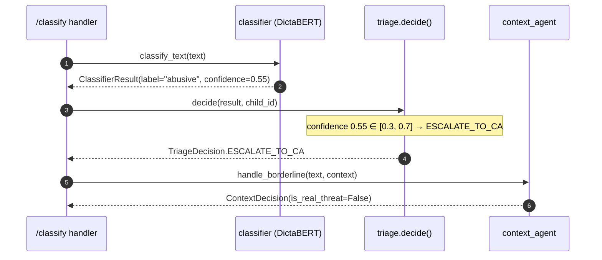
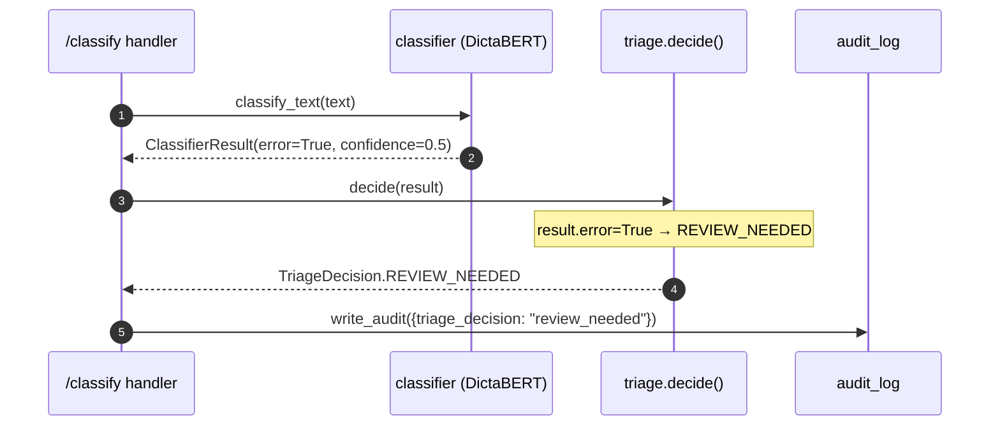

# Triage Router — Low-Level Design

**Module ID:** `triage`
**Owner:** TBD
**Status:** Draft for Meeting 4
**PRD reference:** PRD §7.1, §7.3, §8.1, §8.3
**Last updated:** 2026-05-31

---

## 1. Purpose & Scope

The Triage Router is the decision gate that sits between the Frontline Classifier (DictaBERT-base) and the Context Agent (GPT-4o-mini). It is a **pure deterministic Python function** — no LLM calls, no network I/O, no side effects. Its entire job is to look at a `ClassifierResult` and answer one question: "What should happen next?"

This module exists because PRD §7.1 locked Architecture B: "Triage and Alert can be replaced by deterministic code." Making Triage a first-class module (rather than inline logic in `main.py`) satisfies two needs:

1. **Clean measurement surface for RQ3.** The A/B switch (`CONTEXT_AGENT_ENABLED`) lives here. When disabled, every borderline case gets decided by the frontline alone — this produces the context-blind baseline. When enabled, borderline cases escalate. The flag makes the A/B split a one-env-var operation.
2. **Future configurability.** The sensitivity slider described in PRD §3 (per-child sensitivity for parents) maps directly to the threshold table in `TriageSettings`. When that UX is built, it wires into this module, not scattered across the request handler.

**Scope of this module:**
- Consume a `ClassifierResult`
- Apply threshold rules (global + label-specific overrides)
- Emit a `TriageDecision` enum value
- Write one audit field (`triage_decision`) to the request's audit dict
- Expose Prometheus metrics and structlog events

**Out of scope for this module:**
- Fetching conversation history (Context Agent's job)
- Sending push notifications (Alerts module's job)
- Any ML inference

---

## 2. Public Interface (API Contract / Protocol)

The module exposes a single synchronous Protocol so it can be swapped or mocked without touching the caller.

```python
# server/app/triage/protocol.py
from __future__ import annotations
from typing import Protocol, runtime_checkable
from ..schemas import ClassifierResult, TriageDecision


@runtime_checkable
class TriageRouter(Protocol):
    """Deterministic triage decision from a classifier result.

    Always returns a TriageDecision — never raises.
    Invalid / malformed input maps to TriageDecision.REVIEW_NEEDED.
    """

    def decide(
        self,
        result: ClassifierResult,
        child_id: str | None = None,
    ) -> TriageDecision:
        ...
```

**Input type — `ClassifierResult`** (new Pydantic model, added to `server/app/schemas.py`):

```python
class ClassifierResult(BaseModel):
    label: Category                     # from existing Category Literal
    confidence: float                   # 0.0–1.0
    is_offensive: bool
    latency_ms: int
    error: bool = False                 # True when the classifier itself failed
```

Note: `ClassifierResult` wraps the fields already returned by `classify_text()` in `classifier.py`. The endpoint handler constructs this model from `ClassifyResponse` before calling `triage.decide()`.

**Output type — `TriageDecision`** (new enum, added to `server/app/schemas.py`):

```python
from enum import Enum

class TriageDecision(str, Enum):
    SILENT              = "silent"               # confident non-offensive → do nothing
    ALERT_DIRECT        = "alert_direct"         # confident offensive → alert without CA
    ESCALATE_TO_CA      = "escalate_to_ca"       # borderline → send to Context Agent
    REVIEW_NEEDED       = "review_needed"        # classifier error / invalid input
```

**Decision contract (callers can rely on this):**
- `decide()` is synchronous, CPU-only, completes in < 0.5 ms.
- It never raises an exception. Any error path returns `REVIEW_NEEDED`.
- It is **idempotent**: same `ClassifierResult` → same `TriageDecision` for the same `TriageSettings`.

---

## 2.5 Interface boundary & isolation guarantees

**The Port (Protocol):** `TriageEngine` (renamed `TriageRouter` in this section to emphasise the port nature — both names refer to the same Protocol; the original §2 spelling is kept for source-of-record continuity). The `/classify` handler and the `ClassificationPipeline` depend on this Protocol, never on `RuleBasedTriage` or `MlTriage` directly.

```python
# server/app/triage/protocol.py
from typing import Protocol, runtime_checkable
from ..schemas import ClassifierResult, TriageDecision

@runtime_checkable
class TriageEngine(Protocol):
    """Deterministic-or-learned decision gate between classifier and Context Agent.

    Contract:
    - Synchronous, < 0.5 ms wall-clock
    - Never raises; failure → TriageDecision.REVIEW_NEEDED
    - Idempotent: same ClassifierResult + same settings → same decision
    """
    def decide(
        self,
        result: ClassifierResult,
        child_id: str | None = None,
    ) -> TriageDecision: ...
```

Note the crucial detail: `decide()` takes a `ClassifierResult` — the Protocol's output type from the `classifier` module — **not** a `TextClassifier` instance. This is the clean cut between modules: triage knows the **shape** of the classifier's result, not its implementation.

**Concrete adapters that satisfy this Protocol:**

| Adapter | When to use | Lines to change to enable |
|---|---|---|
| `RuleBasedTriage` | Default — the deterministic threshold logic in §3; the `TriageRouterImpl` of this LLD | (default — already wired) |
| `MlTriage` | Future — learnable thresholds (per-child sensitivity slider — PRD §3); a small classifier on `ClassifierResult` features + `child_id` → `TriageDecision` | one line in `main.py` `lifespan()`; new `models/triage.pkl` deployable; settings table extended with `triage_model_path` |
| `StubTriage` | Tests; fixture-driven decisions to make full pipeline tests deterministic | injected by test fixture |

**Isolation rules (what this module MAY and MUST NOT touch):**
- May import: stdlib, `structlog`, `prometheus_client`, this module's settings, and the `ClassifierResult` / `TriageDecision` / `Category` types from `server/app/schemas.py`.
- May import: the `classifier` module's **Protocol-only re-exports** for `ClassifierResult` type annotations — but NOT any concrete `OllamaDictaBertClassifier` or `HuggingFaceClassifier` class.
- MUST NOT import: any concrete adapter from any other module.
- MUST NOT import: the Context Agent, alerts module, OCR module, or `server.app.main`.
- MUST NOT make network calls, file I/O, or sleep — triage is pure CPU.

**Contract test:** `tests/contracts/test_triage_engine_contract.py` — every adapter is parametrized through this suite. Fixtures provide: a confident-non-offensive `ClassifierResult` (conf 0.92), a borderline result (conf 0.55), a confident-offensive result (conf 0.85), a label-override result (label="violence", conf 0.40), and an error result (error=True). The suite asserts: (a) decision is a valid `TriageDecision` enum value, (b) no exception is raised for any input, (c) decision wall-clock is < 0.5 ms (mean over 1000 calls), (d) idempotency: same input + same settings → same output across 100 invocations, (e) the A/B baseline path (`CONTEXT_AGENT_ENABLED=false`) maps the borderline zone to `ALERT_DIRECT` / `SILENT` by `baseline_threshold` rather than to `ESCALATE_TO_CA`.

**Swap demo — Rule-based → ML-learned triage:**

```python
# Before — server/app/main.py lifespan()
triage: TriageEngine = RuleBasedTriage(settings.triage)

# After (Phase 7+, when per-child sensitivity ships)
triage: TriageEngine = MlTriage(settings.triage, model_path="server/models/triage.pkl")
```

The `/classify` handler, the audit log, the Prometheus emitter, and the Context Agent escalation path all keep working unchanged.

---

## 3. Internal Design

### Package Layout

```
server/app/triage/
├── __init__.py          # exports: TriageRouterImpl, TriageDecision (re-export from schemas)
├── protocol.py          # TriageRouter Protocol (see §2)
├── router.py            # TriageRouterImpl — the concrete implementation
└── settings.py          # TriageSettings (pydantic-settings)
```

### Key Class: `TriageRouterImpl`

```python
# server/app/triage/router.py
from __future__ import annotations
import structlog
from prometheus_client import Counter, Histogram
from ..schemas import Category, ClassifierResult, TriageDecision
from .settings import TriageSettings

log = structlog.get_logger("shomer.triage")

_DECISION_COUNTER = Counter(
    "triage_decisions_total",
    "Triage decisions by outcome",
    ["decision"],
)
_CONFIDENCE_HISTOGRAM = Histogram(
    "triage_input_confidence",
    "Distribution of classifier confidence scores at triage",
    buckets=[0.1, 0.2, 0.3, 0.4, 0.5, 0.6, 0.7, 0.8, 0.9, 1.0],
)


class TriageRouterImpl:
    """Deterministic triage router.

    Thread-safe: all state is read-only after __init__.
    """

    def __init__(self, settings: TriageSettings) -> None:
        self._s = settings

    # ------------------------------------------------------------------
    # Core decision logic
    # ------------------------------------------------------------------

    def decide(
        self,
        result: ClassifierResult,
        child_id: str | None = None,
    ) -> TriageDecision:
        """Return a TriageDecision for the given ClassifierResult.

        Failure mode: any exception (bad types, None confidence, etc.)
        is caught here and returns REVIEW_NEEDED — never raises to caller.
        """
        try:
            return self._decide_inner(result, child_id)
        except Exception as exc:  # noqa: BLE001
            log.warning(
                "triage.decide.exception",
                error=str(exc),
                result=result.model_dump() if hasattr(result, "model_dump") else repr(result),
            )
            _DECISION_COUNTER.labels(decision=TriageDecision.REVIEW_NEEDED).inc()
            return TriageDecision.REVIEW_NEEDED

    def _decide_inner(
        self,
        result: ClassifierResult,
        child_id: str | None,
    ) -> TriageDecision:
        _CONFIDENCE_HISTOGRAM.observe(result.confidence)

        # 1. Classifier hard failure → always review
        if result.error:
            log.info("triage.classifier_error", child_id=child_id)
            return self._emit(TriageDecision.REVIEW_NEEDED)

        # 2. Label-specific overrides — checked BEFORE thresholds
        if result.label in self._s.always_escalate_labels:
            # e.g. violence always goes to CA regardless of confidence
            if not self._s.context_agent_enabled:
                # CA is off (A/B baseline): treat as ALERT_DIRECT
                return self._emit(TriageDecision.ALERT_DIRECT)
            log.debug(
                "triage.label_override_escalate",
                label=result.label,
                confidence=result.confidence,
                child_id=child_id,
            )
            return self._emit(TriageDecision.ESCALATE_TO_CA)

        if result.label in self._s.always_alert_labels:
            # e.g. pornographic: always alert parent directly
            return self._emit(TriageDecision.ALERT_DIRECT)

        # 3. Confidence-direction normalization (review.md G-03 fix).
        #    `result.confidence` is P(predicted_class), NOT P(offensive).
        #    For label="non_offensive", confidence=0.92 means "92% sure it's SAFE" → must route to SILENT.
        #    Thresholds are calibrated against P(offensive), so we convert here in one place.
        if result.is_offensive:
            prob_offensive = result.confidence              # predicted offensive → confidence = P(offensive)
        else:
            prob_offensive = 1.0 - result.confidence        # predicted safe → invert to get P(offensive)

        # 4. Threshold routing on P(offensive) — uniform direction, no surprises
        if prob_offensive <= self._s.borderline_low:
            # Confidently NOT offensive → silent
            return self._emit(TriageDecision.SILENT)

        if prob_offensive >= self._s.borderline_high:
            # Confidently offensive → direct alert
            return self._emit(TriageDecision.ALERT_DIRECT)

        # 5. Borderline zone [borderline_low, borderline_high] on P(offensive)
        if not self._s.context_agent_enabled:
            # A/B baseline path: CA disabled → decide by P(offensive) midpoint
            if prob_offensive >= self._s.baseline_threshold:
                return self._emit(TriageDecision.ALERT_DIRECT)
            return self._emit(TriageDecision.SILENT)

        log.debug(
            "triage.escalate_borderline",
            label=result.label,
            is_offensive=result.is_offensive,
            confidence=result.confidence,
            prob_offensive=prob_offensive,
            child_id=child_id,
        )
        return self._emit(TriageDecision.ESCALATE_TO_CA)

    @staticmethod
    def _emit(decision: TriageDecision) -> TriageDecision:
        _DECISION_COUNTER.labels(decision=decision).inc()
        return decision
```

### Decision Rules Summary

```
Step A — Normalize to P(offensive):
  prob_offensive = result.confidence            if result.is_offensive
                 = 1 - result.confidence        otherwise

Step B — Threshold routing on P(offensive):
  [0.0, borderline_low]              → SILENT            (confidently safe)
  [borderline_low, borderline_high]  → ESCALATE_TO_CA    (uncertain — needs context)
  [borderline_high, 1.0]             → ALERT_DIRECT      (confidently offensive)

Label overrides (checked first, before normalization):
  label ∈ always_escalate_labels  → ESCALATE_TO_CA  (e.g. "violence")
  label ∈ always_alert_labels     → ALERT_DIRECT    (e.g. "pornographic")

Error path:
  result.error = True  → REVIEW_NEEDED

A/B switch (context_agent_enabled = False):
  Borderline zone  → ALERT_DIRECT / SILENT by P(offensive) ≥ baseline_threshold (0.5)
  always_escalate  → ALERT_DIRECT (CA unavailable)
```

**Why the P(offensive) normalization (review.md G-03):** the classifier returns `confidence` as `P(predicted_class)`. For a `non_offensive` prediction with `confidence=0.92`, the raw confidence is high but the *offensive* probability is `1 - 0.92 = 0.08`, which is well below `borderline_low` → SILENT (correct). Without the normalization the same input would incorrectly route to `ALERT_DIRECT`. Normalizing in one place — Step A — keeps the rest of the decision logic uniform and the thresholds interpretable.

The A/B baseline threshold (`TRIAGE_BASELINE_THRESHOLD`, default 0.5) means context-blind decisions in the borderline zone use a simple midpoint cut on `prob_offensive` — this reproduces the naive baseline described in PRD §6 ("Baseline: context-blind, single message").

### Polarity Test Matrix (must pass before Meeting 5)

| `is_offensive` | `confidence` | `prob_offensive` | Expected decision |
|---|---|---|---|
| `True`  | 0.92 | 0.92 | `ALERT_DIRECT` |
| `True`  | 0.55 | 0.55 | `ESCALATE_TO_CA` |
| `True`  | 0.20 | 0.20 | `SILENT` |
| `False` | 0.92 | 0.08 | `SILENT` *(the G-03 fix — was wrong before)* |
| `False` | 0.55 | 0.45 | `ESCALATE_TO_CA` |
| `False` | 0.20 | 0.80 | `ALERT_DIRECT` *(low-confidence safe prediction → treat as offensive)* |

These six rows are mandatory parametrized cases in `tests/contracts/test_triage_engine_contract.py`.

### How Per-Child Sensitivity Wires In (Future)

When the parent sensitivity slider is built (PRD §3, deferred to a post-MVP UX session), the caller passes a `child_id`. `decide()` could look up a `ChildSensitivityProfile` from a lightweight SQLite table and widen or narrow `borderline_low`/`borderline_high` per child. The current design leaves `child_id` as an unused parameter precisely to make this extension zero-refactor — only `_decide_inner` changes.

### Extraction Seam

`TriageRouterImpl` speaks only the `TriageRouter` Protocol. The FastAPI app holds it via the Protocol reference, not the concrete class. This means the module can be extracted to its own process (gRPC or HTTP micro-service) by swapping the concrete class for a remote stub, with no changes to the caller.

---

## 4. Sequence Diagrams

### Happy Path — Borderline Case Escalation



### A/B Baseline Path (CONTEXT_AGENT_ENABLED=false)

```mermaid
sequenceDiagram
    autonumber
    participant Handler as /classify handler
    participant Classifier as classifier (DictaBERT)
    participant Triage as triage.decide()
    participant Alerts as alerts module

    Handler->>Classifier: classify_text(text)
    Classifier-->>Handler: ClassifierResult(confidence=0.55)
    Handler->>Triage: decide(result, child_id)
    Note over Triage: CA disabled; confidence 0.55 >= baseline_threshold 0.5
    Triage-->>Handler: TriageDecision.ALERT_DIRECT
    Handler->>Alerts: send_alert(alert_request)
```

### Error Path — Classifier Failure



---

## 5. Data Model

The module does not own a persistent data store. All its inputs and outputs are in-memory. The audit field it writes:

| Field | Type | Where written | Value |
|---|---|---|---|
| `triage_decision` | `str` (TriageDecision value) | `request.state.audit["triage_decision"]` | `"silent"` / `"alert_direct"` / `"escalate_to_ca"` / `"review_needed"` |
| `triage_label_override` | `bool` | `request.state.audit["triage_label_override"]` | `True` if a label override triggered |
| `context_agent_enabled` | `bool` | `request.state.audit["context_agent_enabled"]` | mirrors `CONTEXT_AGENT_ENABLED` for the A/B audit trail |

These fields flow through `AuditLoggingMiddleware` into `audit-YYYY-MM-DD.jsonl` — the primary data source for the RQ3 per-slice analysis at Meeting 8.

---

## 6. Observability (Logger / Config / Metrics)

### Logger

Module logger: `structlog.get_logger("shomer.triage")`

Standard fields on every call (bound at handler level, inherited by this module via structlog context var):
- `trace_id` — UUID injected by Gatekeeper middleware
- `module` — `"triage"`
- `event` — one of the event names below

**Three example log lines (structlog JSON format):**

```json
{"trace_id": "b3d2f1a0", "module": "triage", "event": "triage.decide", "label": "abusive", "confidence": 0.55, "decision": "escalate_to_ca", "context_agent_enabled": true, "label_override": false, "timestamp": "2026-05-31T10:14:22.334Z"}
```

```json
{"trace_id": "c9e4a7f2", "module": "triage", "event": "triage.label_override_escalate", "label": "violence", "confidence": 0.82, "timestamp": "2026-05-31T10:14:23.001Z"}
```

```json
{"trace_id": "d1b5e309", "module": "triage", "event": "triage.decide.exception", "error": "confidence is None", "result": "ClassifierResult(error=True, ...)", "timestamp": "2026-05-31T10:14:24.112Z"}
```

### Config

**`TriageSettings`** (pydantic-settings, loaded from env at startup):

| Name | Type | Default | Env Var | Description | Secret? |
|---|---|---|---|---|---|
| `borderline_low` | `float` | `0.3` | `TRIAGE_BORDERLINE_LOW` | Lower bound of borderline zone; below → SILENT | No |
| `borderline_high` | `float` | `0.7` | `TRIAGE_BORDERLINE_HIGH` | Upper bound of borderline zone; above → ALERT_DIRECT | No |
| `context_agent_enabled` | `bool` | `True` | `CONTEXT_AGENT_ENABLED` | A/B switch: False = context-blind baseline | No |
| `baseline_threshold` | `float` | `0.5` | `TRIAGE_BASELINE_THRESHOLD` | Midpoint cut when CA is disabled | No |
| `always_escalate_labels` | `set[str]` | `{"violence"}` | `TRIAGE_ALWAYS_ESCALATE_LABELS` | Labels that always go to CA (comma-separated) | No |
| `always_alert_labels` | `set[str]` | `{"pornographic"}` | `TRIAGE_ALWAYS_ALERT_LABELS` | Labels that always alert directly (comma-separated) | No |

```python
# server/app/triage/settings.py
from pydantic_settings import BaseSettings

class TriageSettings(BaseSettings):
    borderline_low: float = 0.3
    borderline_high: float = 0.7
    context_agent_enabled: bool = True
    baseline_threshold: float = 0.5
    always_escalate_labels: set[str] = {"violence"}
    always_alert_labels: set[str] = {"pornographic"}

    model_config = {"env_prefix": "TRIAGE_", "env_file": ".env"}
```

Note: `CONTEXT_AGENT_ENABLED` does not carry the `TRIAGE_` prefix because it is a cross-module setting (the Context Agent module also reads it). It is listed here for completeness; the canonical definition lives in `ServerSettings`.

### Metrics

All metrics registered in the **shared Prometheus registry** (see server `design.md` §6b):

| Metric name | Type | Labels | NFR it covers |
|---|---|---|---|
| `triage_decisions_total` | Counter | `decision` (`silent`/`alert_direct`/`escalate_to_ca`/`review_needed`) | Operational — monitors CA escalation rate; target ~15% |
| `triage_input_confidence` | Histogram | — | Research — confidence score distribution over time |
| `triage_label_overrides_total` | Counter | `label`, `override_type` (`always_escalate`/`always_alert`) | Operational — tracks how often label overrides fire |

---

## 7. NFR Targets & Test Plan

| NFR (from PRD §9) | Triage target | How verified |
|---|---|---|
| Frontline latency p99 < 100ms | Triage adds < 0.5ms (it's in-process CPU only) | Unit test timing assertion; integration test on the full `/classify` path |
| Cost/interaction < $0.005 | Triage costs $0 (no I/O) | Trivially satisfied |
| Privacy: no PII to external services | Triage never makes external calls | Code review; no network imports in `triage/` |
| A/B switch clean isolation | `CONTEXT_AGENT_ENABLED=false` → zero CA calls | Parametrized integration test with CA stubbed |

**Test plan:**

```
tests/unit/triage/
├── test_decision_rules.py      # parametrize across confidence × label × CA_enabled
├── test_label_overrides.py     # violence → escalate; pornographic → alert_direct
├── test_error_path.py          # error=True → review_needed; exception in decide → review_needed
├── test_ab_baseline.py         # CA disabled: borderline → ALERT_DIRECT/SILENT by threshold
└── test_settings.py            # env var parsing; invalid values handled
```

Key parametrize cases:
- `confidence=0.29, label=abusive, CA=on` → `SILENT`
- `confidence=0.55, label=abusive, CA=on` → `ESCALATE_TO_CA`
- `confidence=0.71, label=abusive, CA=on` → `ALERT_DIRECT`
- `confidence=0.55, label=violence, CA=on` → `ESCALATE_TO_CA` (label override)
- `confidence=0.55, label=violence, CA=off` → `ALERT_DIRECT` (override + CA disabled)
- `confidence=0.55, label=pornographic, CA=on` → `ALERT_DIRECT` (always_alert override)
- `error=True, any confidence` → `REVIEW_NEEDED`

---

## 8. Failure Modes & Fallbacks

| Failure | Behavior | Log event |
|---|---|---|
| `result.error = True` (classifier failed) | `REVIEW_NEEDED` | `triage.classifier_error` |
| `result.confidence` is `None` or not a float | Caught in `_decide_inner` → `REVIEW_NEEDED` | `triage.decide.exception` |
| `result.label` not in `Category` enum | `always_escalate`/`always_alert` checks fail silently → threshold routing as fallback | `triage.unknown_label` |
| Unexpected exception inside `decide()` | Outer try/except → `REVIEW_NEEDED` | `triage.decide.exception` |
| `TriageSettings` misconfigured (`borderline_low >= borderline_high`) | Startup validation raises `ValueError` — server fails fast | Startup log: `triage.settings_invalid` |

**Default-safe principle:** all failure modes produce `REVIEW_NEEDED` (never `SILENT`) — consistent with the PRD's architectural default: *"never silently lose an alert in a child-safety system"* (`architecture.decision.md`).

---

## 9. Deployment & Config

`TriageSettings` is constructed once in `lifespan()` in `main.py` and stored on `app.state.triage_settings`. The `TriageRouterImpl` instance is also created in `lifespan()` and stored on `app.state.triage_router`.

Relevant `.env` keys (all optional — defaults are production-safe):

```dotenv
TRIAGE_BORDERLINE_LOW=0.3
TRIAGE_BORDERLINE_HIGH=0.7
CONTEXT_AGENT_ENABLED=true
TRIAGE_BASELINE_THRESHOLD=0.5
TRIAGE_ALWAYS_ESCALATE_LABELS=violence
TRIAGE_ALWAYS_ALERT_LABELS=pornographic
```

For A/B baseline runs (Meeting 8 evaluation):

```dotenv
CONTEXT_AGENT_ENABLED=false
```

No database, no file I/O, no background tasks.

---

## 10. Future Extraction Seam

The `TriageRouter` Protocol is the extraction point. When (if) Triage needs to run as a separate service:

1. Create `server/app/triage/remote.py` — `RemoteTriageRouter` implementing `TriageRouter` via an HTTP call to a new microservice endpoint.
2. In `lifespan()`, swap `TriageRouterImpl(settings)` for `RemoteTriageRouter(url, timeout)`.
3. No other file changes needed — all callers use the Protocol type.

The per-child sensitivity extension (sensitivity slider from PRD §3) plugs into `_decide_inner` via the `child_id` parameter that already exists but is currently unused.

---

## 11. Open Questions

| # | Question | Target meeting |
|---|---|---|
| ✅ | ~~Confidence-direction footgun (review.md G-03)~~ — **RESOLVED 2026-05-31** by Step A normalization in `_decide_inner` (`prob_offensive = result.confidence if result.is_offensive else 1 - result.confidence`). Polarity matrix added to §3 as a mandatory contract test. | Done |
| OQ-T1 | Final empirical values for `borderline_low` / `borderline_high` — currently 0.3/0.7 (PRD default); to be set by gold-set FP/FN curve | Meeting 8 |
| OQ-T2 | Should `hate` be in `always_escalate_labels`? Hate speech vs bullying may warrant different sensitivity | Meeting 6 (first training results) |
| OQ-T3 | Per-child sensitivity: what is the granularity? (3 levels: low/medium/high)? Slider to 10 steps? | UX session before Meeting 7 |
| OQ-T4 | How does `REVIEW_NEEDED` surface to the parent? As a distinct push notification type or as a regular alert with a "please review" tag? | UX session before Meeting 7 (see PRD open_questions.md Q3) |
