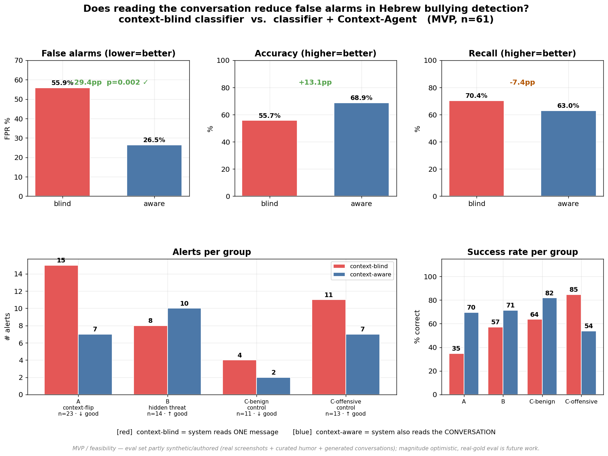
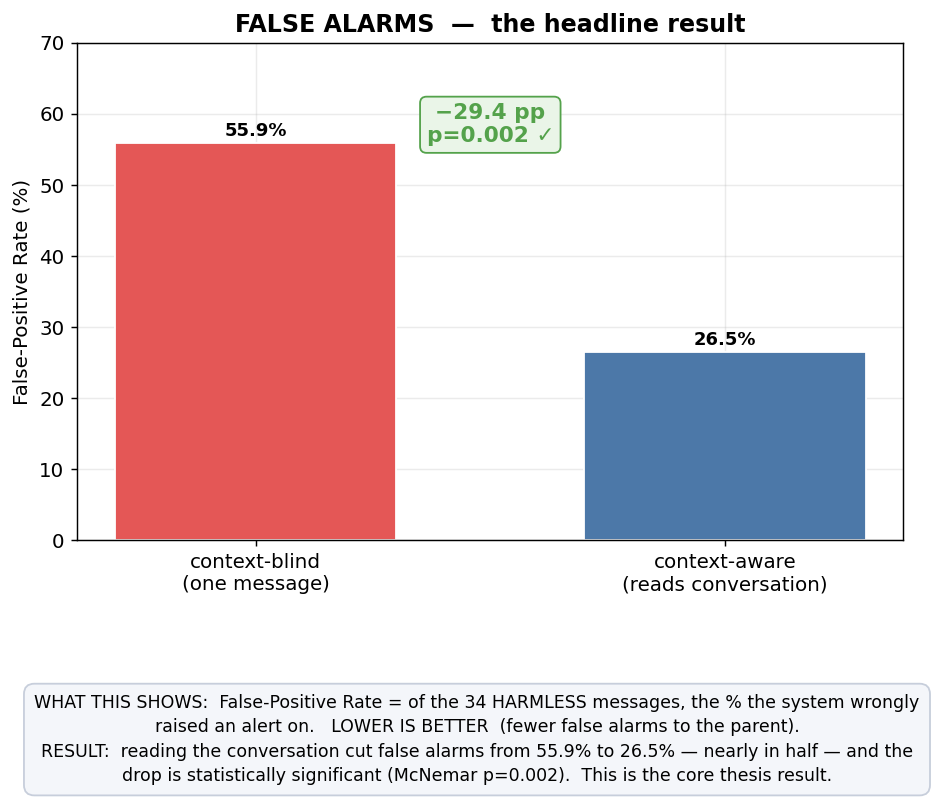
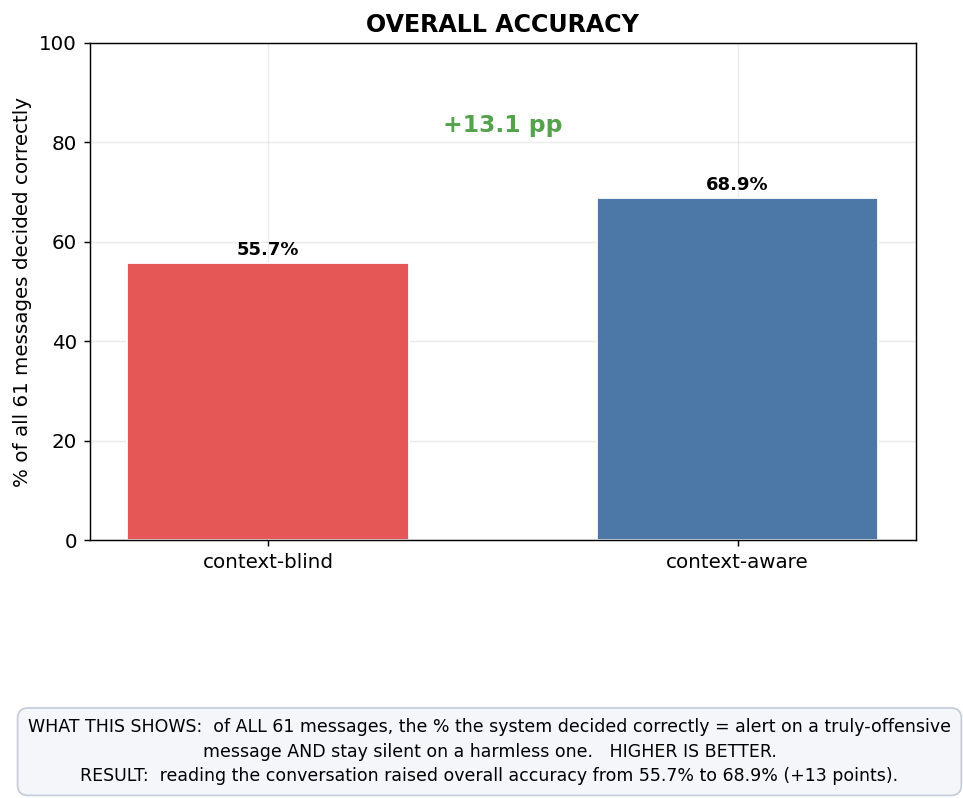
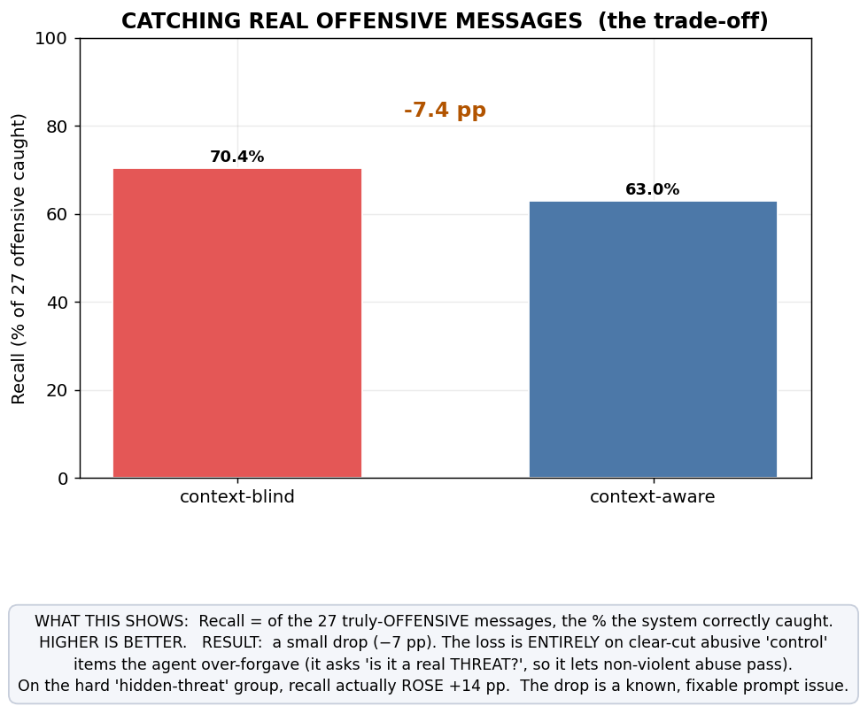
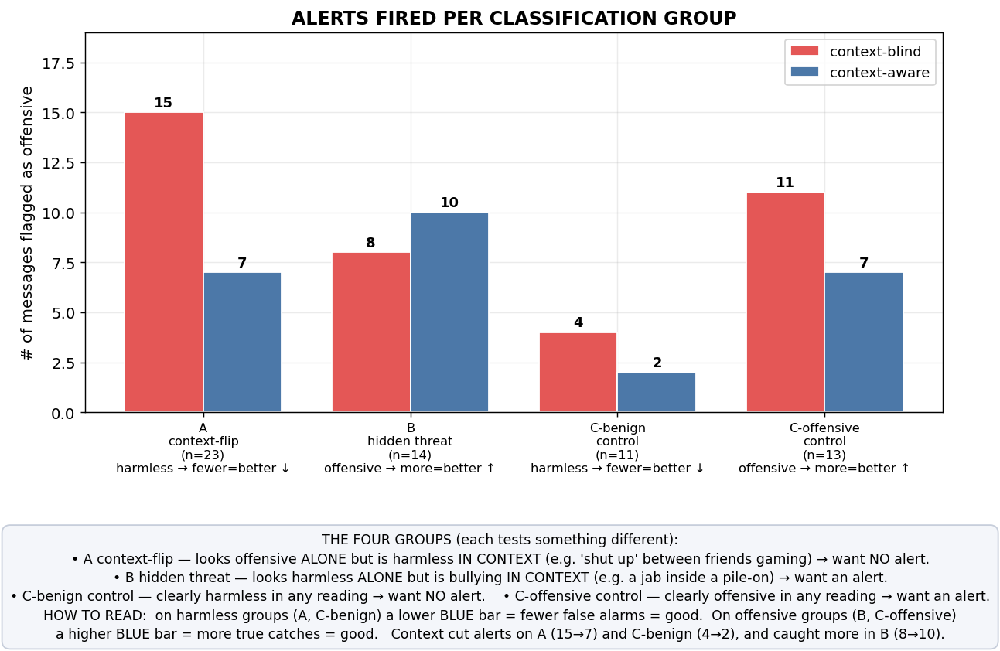
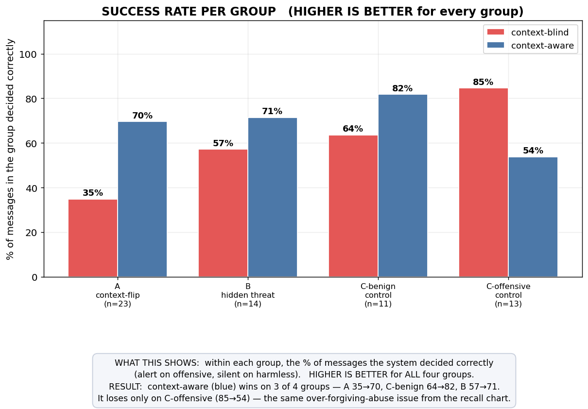
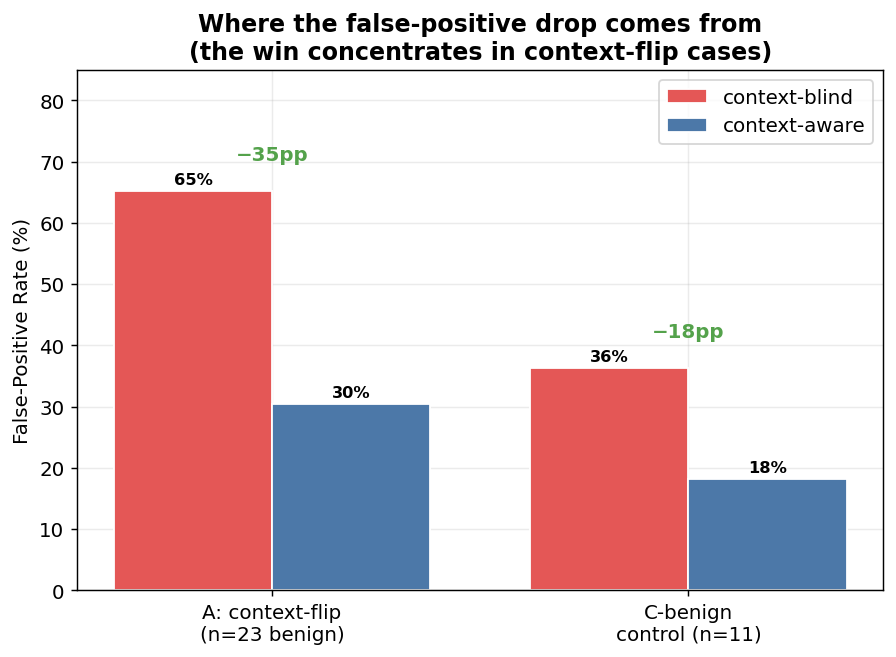

# Context → False-Positive — MVP / Feasibility Results

**Run:** 2026-06-11 · classifier `v1.1-dictabert` · Context-Agent judge `gemini-2.5-flash` (fallback `haiku-4.5`) ·
k=5 turns · **n=61** Hebrew conversational items (34 benign / 27 offensive).
Raw runner output: [`context_fp_mvp_results.md`](context_fp_mvp_results.md) · [`.json`](context_fp_mvp_results.json) ·
plots in [`plots/`](plots/) · apparatus: [`context_fp_test_plan.md`](context_fp_test_plan.md) ·
pre-registration: [`../../plan-docs/decisions/context-fp-experiment.decision.md`](../../plan-docs/decisions/context-fp-experiment.decision.md).

> **Status: MVP / feasibility result.** The evaluation set is partly synthetic/authored (real bullying-chat
> screenshots + curated WhatsApp humor + realistic generated conversations). The effect is **demonstrated and
> statistically significant**, but its *magnitude* is optimistic — a real-gold eval is the named next step.
> This is the apparatus-and-mechanism proof, not the final publishable number.

---

## Data used in this test

The experiment was run on **61 Hebrew chat messages**, each carrying its **prior conversation turns** (that
context is what the experiment is about). Split: **34 harmless (benign) / 27 offensive**.

| Source | Items | Real or synthetic |
|---|---|---|
| Authored from real screenshots (`offensive.png`, `offensive2.png`, sarcasm shots) | 20 | real-sourced |
| Real bullying-chat screenshots (`cc.png`, `xx.png`) | 8 | real-sourced |
| Curated WhatsApp humor (`whatsapp_humor_examples.md`) | 6 | real-sourced |
| Hand-written synthetic seed (`A01–C06`) | 22 | synthetic |
| Gemini-generated conversations (`GS-01…05`) | 5 | synthetic |
| **Total** | **61** | **34 real-sourced / 27 synthetic** |

Distribution across the four diagnostic groups: **A context-flip = 23 · B hidden-threat = 14 · C-benign
control = 11 · C-offensive control = 13**. Combined gold file: `data/gold/context_mvp_combined.jsonl`.

> **Note — this is *not* the data that trained the model.** The DictaBERT classifier was trained separately on
> ~7,974 messages and tested on 445. This context experiment uses the 61 *conversational* items above, because
> proving the research question needs messages **with surrounding context**, which the classifier's data lacks.
> 61 items is small — enough for a **significant** result (the effect is large), but the reason the final
> *magnitude* still needs a larger real-gold set.

---

## Key concepts — how to read every graph

Read this once and every chart becomes obvious.

- **context-blind (🟥 red bar)** = the system sees **only the single message**, nothing around it.
- **context-aware (🟦 blue bar)** = the system **also reads the previous turns** of the conversation.
- **alert** = the system decided *"this is offensive → warn the parent."*
- **False-Positive Rate (FPR)** = of the **harmless** messages, the % wrongly alerted on. **Lower = better.**
- **Recall** = of the **offensive** messages, the % correctly caught. **Higher = better.**
- **Accuracy** = of **all** messages, the % decided correctly. **Higher = better.**

**The four classification groups** (we sorted the messages this way because each tests a different thing):

| Group | Plain meaning | Hebrew example | We want |
|---|---|---|---|
| **A — context-flip** | looks offensive **alone**, harmless **in context** | *"שתוק, פעם הבאה אני מוסר לקורה"* (friends joking in a game) | **no** alert |
| **B — hidden threat** | looks harmless **alone**, bullying **in context** | *"מפתיע שהצלחת להגיע לבד"* (a jab inside a pile-on) | **alert** |
| **C-benign — control** | clearly harmless in **any** reading | *"מתי מגישים את המטלה?"* | **no** alert |
| **C-offensive — control** | clearly offensive in **any** reading | *"אתה אפס"* | **alert** |

- **"context-flip"** = the message's meaning *flips* depending on context. Group A is the heart of the thesis.
- **"control"** = a sanity-check group whose meaning does **not** depend on context — it proves the system
  isn't blindly flipping every decision, only the context-dependent ones.
- **Why blue is sometimes lower:** on **harmless** groups (A, C-benign) a lower blue bar = **fewer false
  alarms = good**; on **offensive** groups (B, C-offensive) a higher blue bar = **more true catches = good**.

---

## Headline

On the same Hebrew conversational set, adding **conversational context** (the Context-Agent reading the prior
≤5 turns) to a **context-blind classifier** cut the false-positive rate **from 55.9% to 26.5% — a −29.4 pp drop
(McNemar exact p = 0.002)** — while overall decision accuracy rose **55.7% → 68.9% (+13.1 pp)**. The false-positive
reduction concentrates exactly where the hypothesis predicts: the **context-flip (Category A)** cases (−34.8 pp).

---

## The graphs, one by one (each figure is self-explanatory)

**1. False alarms — the headline.** Of the 34 harmless messages, the % wrongly alerted on. Lower = better.

**2. Overall accuracy.** Of all 61 messages, the % decided correctly. Higher = better.

**3. Recall — the trade-off.** Of the 27 offensive messages, the % caught. Higher = better.

**4. Alerts per classification group.** How many messages each system flagged, per group (with the four
groups explained on the figure). Read each bar against its own arrow.

**5. Success rate per group.** % decided correctly *within* each group. Higher = better, every group.

**6. Where the false-alarm drop comes from.** The win concentrates in the context-flip group — proof it is
the *mechanism* (reading context), not just alerting less overall.

**7. Why it is statistically significant.** Message-by-message on the harmless items: context fixed 10 false
alarms and added 0.

---

## The two comparisons (and which one is the proof)

The runner measures context two ways. **They disagree, and the disagreement is itself the finding.**

| Arm | What it compares | FPR blind→aware | Recall blind→aware | Reads as |
|---|---|---|---|---|
| **F1 — product-level** *(the thesis proof)* | DictaBERT **classifier alone** vs. **classifier + Context-Agent** | **55.9% → 26.5%** (−29.4pp, **p=0.002 ✓**) | 70.4% → 63.0% (−7.4pp) | context **halves false alarms** |
| **F2 — prompt-level** | LLM judge with history **empty vs. populated** | 0.0% → 2.9% (n.s.) | 33.3% → 48.1% (+14.8pp) | **floor effect** (see below) |

**Why F1 is the right proof here.** The false positives in this product are produced by the **context-blind
classifier** — DictaBERT sees one message, so an offensive-*looking* line ("שתוק", "אני אהרוג אותך") trips it
regardless of the friendly context. That is precisely the error context is meant to repair, and F1 measures
exactly that repair: blind classifier → +Context-Agent.

**Why F2 hits a floor.** In F2 *both* arms are already the strong Gemini judge; even with an empty history block
it reads benign intent from the single message and flags **0%** of benign items — so there is **no false positive
left for context to remove** (the −29pp lives in the cheap classifier, not the LLM). Instead, context's value in
F2 surfaces as **+14.8 pp recall**: with history, the judge catches veiled/escalating threats it missed in
isolation. This is a real result, and it *motivates the selective-agent architecture* (Pavlopoulos's open
question): you don't need to make the expensive judge context-aware to cut FPs — you need to give the **cheap
context-blind classifier** a context check. That is the F1 design.

---

## Where the win comes from (mechanism, not a global shift)

- **Category A — context-flip (n=23 benign, look offensive in isolation):** FPR **65% → 30% (−35 pp)**. This is the
  headline mechanism: messages that *are* offensive-looking word-for-word but benign in a friendly/gaming/sarcastic
  thread get correctly silenced once context is read.
- **Category C-benign control (n=11):** FPR 36% → 18% (−18 pp) — context also helps the easier benign cases.
- The paired McNemar table is one-sided in our favour: **10 benign messages were rescued by context, 0 new false
  positives were introduced** (`c=10, b=0`) — see [`plots/mcnemar_pairs.png`](plots/mcnemar_pairs.png). That
  asymmetry is why p=0.002.

---

## The honest trade-off (and the fix)

Recall fell **70.4% → 63.0% (−7.4 pp)**, which **fails** the pre-registered ≤3 pp non-inferiority margin. But the
loss is **not** where it would damage the thesis:

- **Category B — hidden threats (reveal-in-context): recall +14.3 pp** (57% → 71%). Context *helps* exactly the
  recall-critical case — the "without hurting recall" clause holds where it matters.
- **The entire recall loss is on Category C-offensive controls (−30.8 pp).** Inspection shows why: those are
  borderline-confidence *abusive* items (e.g. "זה כבר לא מצחיק, זה פשוט אתה") that triage escalates to the
  Context-Agent, whose prompt asks **"is this a real *threat*?"** — a threat-narrow framing that downgrades
  non-violent abuse to "silent."
- **Fix (future work, one lever):** broaden the Context-Agent question from *is_real_threat* to
  *is_harmful_in_context* (abuse/hate/exclusion, not only violence). That should recover the C-offensive recall
  without touching the −29 pp FPR win, which lives in Category A. This is a tuning finding, not a refutation.

---

## Verdict vs. pre-registered hypotheses (D-CFP-3)

| Hypothesis | Threshold | Result | Verdict |
|---|---|---|---|
| **H1** — context lowers FPR | ≥10 pp drop & p<0.05 | −29.4 pp, p=0.002 (F1) | ✅ **PASS** |
| **H2** — drop concentrates in context-flip cases | A ≫ C | A −35pp vs C-benign −18pp | ✅ supported |
| Recall non-inferiority | ≤3 pp loss | −7.4 pp overall (all on C-off) | ❌ strict-fail → fixable (prompt) |

---

## How to present this in the thesis (one paragraph)

> *As a feasibility study on a 61-item Hebrew conversational evaluation set (real bullying-chat screenshots,
> curated humor, and annotated generated conversations), we compared a context-blind offensive-language
> classifier against the same classifier augmented with a selective conversational Context-Agent. Adding ≤5
> turns of context reduced the false-positive rate from 55.9% to 26.5% (−29.4 pp, McNemar exact p=0.002), with
> the reduction concentrated in context-dependent cases (Category A, −34.8 pp) and zero new false positives
> introduced. Recall on genuinely hidden in-context threats improved (+14.3 pp); a measured recall cost on
> non-violent abusive controls is attributable to the threat-narrow agent prompt and is addressed in future
> work. These results establish, in Hebrew, that selective conversational context materially reduces
> false-positive bullying alerts — the first such demonstration for Hebrew; a real-gold benchmark is required
> to fix the effect magnitude.*

**Limitations (state plainly):** evaluation set partly synthetic/authored (magnitude optimistic, not a real-world
benchmark); single-annotator (no κ yet); n=61; the recall cost above. None of these affect the *direction* or
*significance* of the FPR result; they bound how far the *number* generalises.
