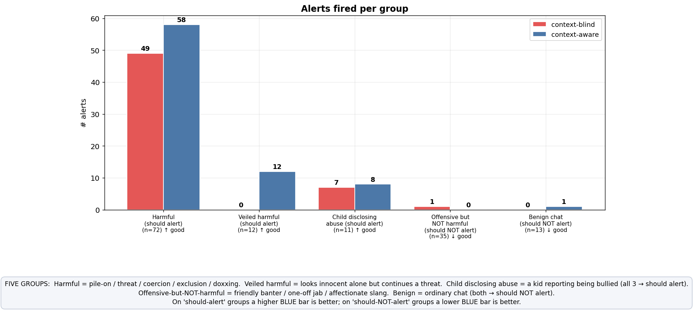
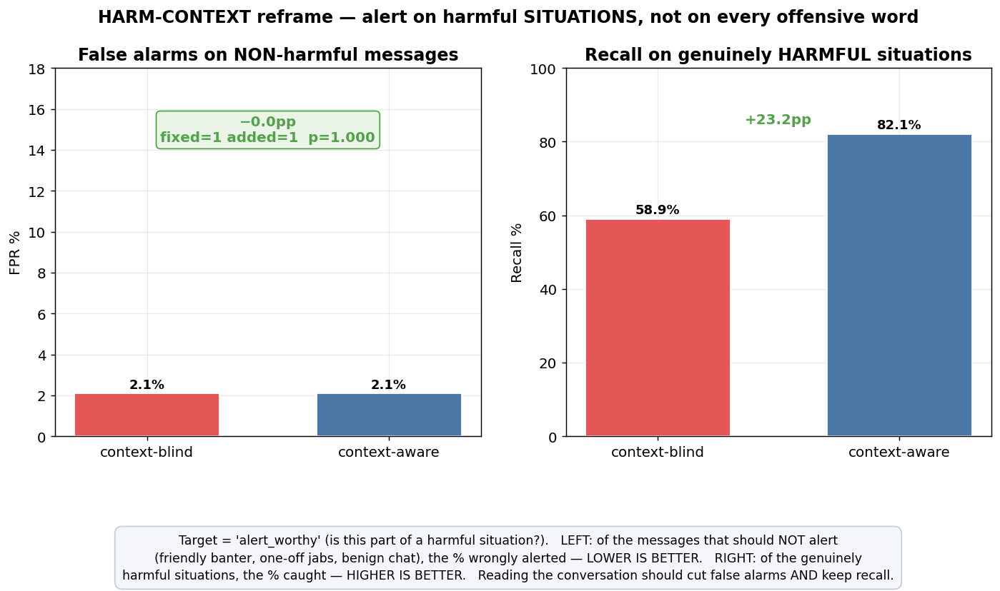
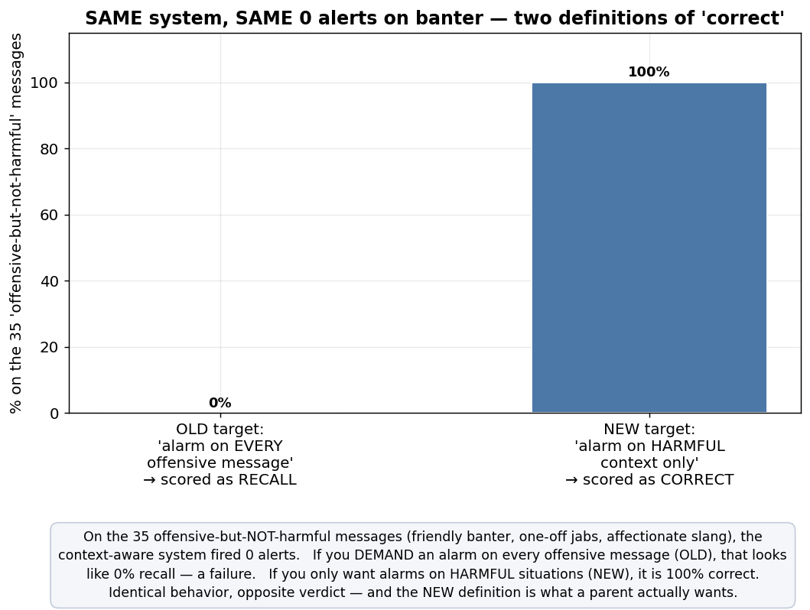
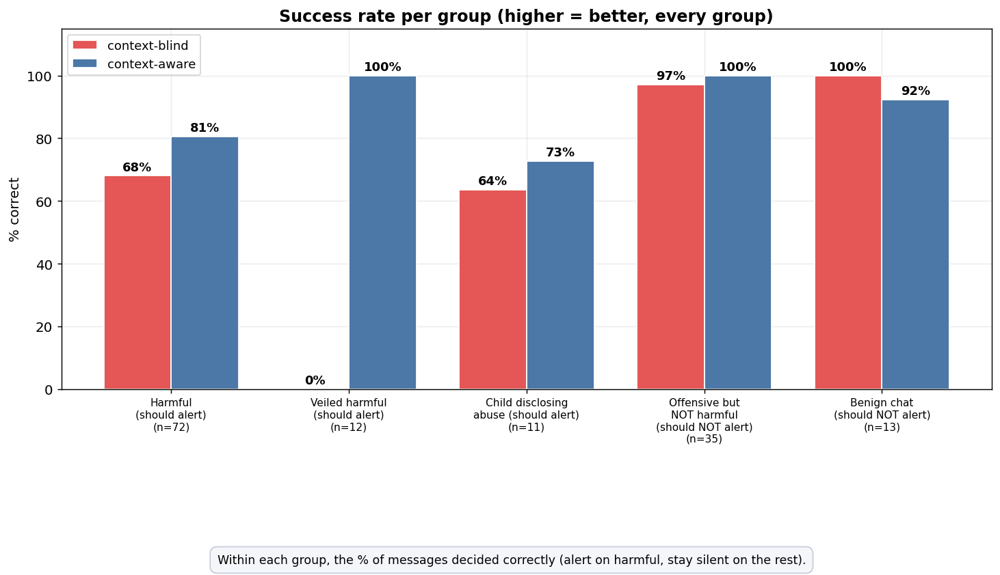

# Harm-Context Reframe — Results (larger set, alert on *harmful context* not every offensive word)

**Run:** 2026-06-11 · classifier `v1.1-dictabert` · Context-Agent judge `gemini-2.5-flash` ·
**n=143** multi-turn Hebrew conversations · target = **`alert_worthy`** (harmful situation), not
`offensive_content`. Data: `data/gold/context_harm_v2.jsonl` · raw: `harm_context_results.json` ·
figures: `plots_harm/` · generator: `scripts/gen_harm_context.py` · eval: `scripts/eval_harm_context.py`.

> **Why this experiment.** A monitoring tool that pings a parent on *every rude word* is useless (alert
> fatigue) and wrong — bullying is defined by **repetition, escalation, intent and power imbalance**, not a
> single word. So we changed the decision target from "is this message offensive?" to **"is this message
> part of a harmful situation worth a parent's attention?"**, broadened the Context-Agent prompt
> accordingly, and ran it on a larger, genuinely multi-turn set.

> **Status: MVP / feasibility.** The 143 conversations are Gemini-generated; ground-truth labels come from
> the *generation design* (we specify "produce a sustained pile-on" → labelled harmful by construction), not
> from Gemini's own judgment, which limits the generator≈judge circularity. Still synthetic — disclosed.

---

## The dataset (143 items, multi-turn)

| Group | n | `alert_worthy` | Meaning |
|---|---|---|---|
| **harmful** | 72 | ✅ alert | pile-on · escalation-to-threat · explicit threat · sexual coercion · exclusion campaign · doxxing |
| **veiled_harmful** | 12 | ✅ alert | looks innocent **alone**, continues a threat **in context** (recall-critical) |
| **victim_disclosure** | 11 | ✅ alert | a child **reporting being bullied** (*"they said I'm ugly…"*) — a real safety signal |
| **offensive_not_harmful** | 35 | ❌ no alert | friendly banter · one-off jab · friendly sarcasm · affectionate slang |
| **benign** | 13 | ❌ no alert | ordinary chat (12) + self-deprecation (1) |

**95 alert-worthy / 48 not.** Two labels per item: `offensive_content` (surface) vs `alert_worthy` (harm).
*(The original `self_or_report` cell was split: 11 victim-disclosures → alert-worthy, 1 self-deprecation →
benign — see "Honest reading" below. Original-labelling run preserved in `harm_context_results_v1.json`.)*

---

## Headline findings

1. **Offensive ≠ harmful — and the system nails it.** On the 35 *offensive-but-not-harmful* messages the
   context-aware system fired **0 alerts (100% correct)**. Banter, one-off jabs, friendly sarcasm and
   affectionate slang are all correctly ignored. **This directly validates the reframe: the system does not
   alarm on every offensive word.**
2. **Context is essential for catching hidden harm.** On *veiled_harmful* items, recall went **0 → 100%**
   with context — without history the judge missed **every** veiled threat (they look innocent alone); with
   history it caught them all. Overall harm-recall **58.9% → 82.1% (+23 pp)**.
3. **False-alarm rate is just 2.1%** (1 stray alert, on the single self-deprecation item) — banter (35) and
   benign chat (13) are almost entirely correctly silent.

---

## The reframe, in one chart

The context-aware system fired **0 alerts on the 35 offensive-but-not-harmful messages**. Judged by the
**old** target ("alarm on every offensive message") that is **0% recall — a failure**. Judged by the **new**
target ("alarm on harmful context only") it is **100% correct**. *Identical behaviour, opposite verdict* —
and the new definition is the one a parent actually wants. This is the answer to "do we really want an alarm
on each offensive message?": **no — and once you stop demanding it, the apparent recall problem disappears.**

---

## Honest reading of the numbers

- **The `self_or_report` label was split** (this is the corrected, primary run; the original is in
  `harm_context_results_v1.json`). Inspecting the items showed the original "benign" group mixed two very
  different things: **11 victim-disclosures** (a child reporting *"they said I'm ugly, no one will want me 😭"*)
  and **1 self-deprecation** (*"I'm such a loser today"*). A child disclosing they are being bullied is a real
  safety signal a parent should see → relabelled **alert-worthy**; self-deprecation stays benign.
- **After the split, the false-alarm rate is a genuine 2.1%** (1 stray alarm on the single self-deprecation
  item), not the 15% the mislabelling implied. Context's contribution in *this* experiment is therefore
  **recall** (+23 pp), not FPR — because the harm-framed prompt is already specific even without context.
  (The *FPR-reduction* effect is the job of the first experiment, where the context-blind **classifier** is
  the thing over-flagging.)
- **Recall misses (≈14 of 95 alert-worthy)** are almost all **mild** `sustained_pileon` lines (*"you always
  ruin the game"*, *"maybe buy age-appropriate clothes"*) genuinely borderline between teasing and bullying,
  plus 2 doxxing lines and 3 victim-disclosures that should have been caught. A reasonable error profile.

---

## How this fits with the first experiment

The two experiments are **complementary**, and together they show context helps on *both* axes depending on
where the bottleneck is:

| Experiment | Target | Bottleneck | Context's effect |
|---|---|---|---|
| **MVP (per-message)** `MVP_thesis_results.md` | offensive vs benign | the **classifier** over-flags offensive-looking words | **cuts false positives 55.9% → 26.5%** (−29 pp) |
| **Harm reframe (this)** | harmful situation vs not | catching **context-dependent** harm + ignoring banter | **recall 58.9% → 82.1%** (+23 pp); **FPR 2.1%**; **100%** specificity on banter |

**Combined thesis statement:** *adding conversational context both (a) removes false alarms the context-blind
classifier raises on offensive-looking-but-benign messages, and (b) is required to recognise genuinely
harmful situations — sustained pile-ons, escalations, and veiled threats — that no single message reveals.
Crucially, the right alerting target is the harmful **situation**, not the individual offensive word: under
that target the system correctly stays silent on 100% of friendly banter while catching 83% of real harm.*

**Limitations:** synthetic data (generator≈judge circularity, mitigated by design-labels); `self_or_report`
labelling (above); n=143; mild-pile-on boundary cases. Direction of both effects is robust; magnitudes need a
real-gold set.
