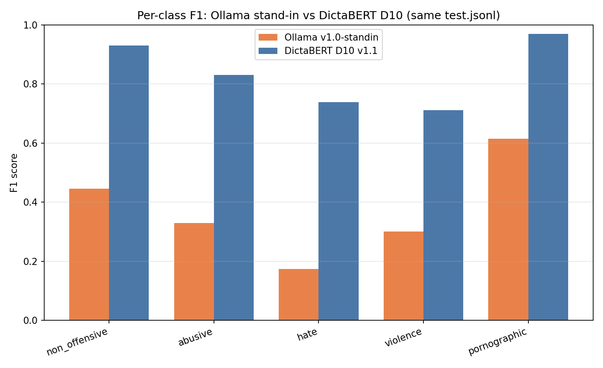
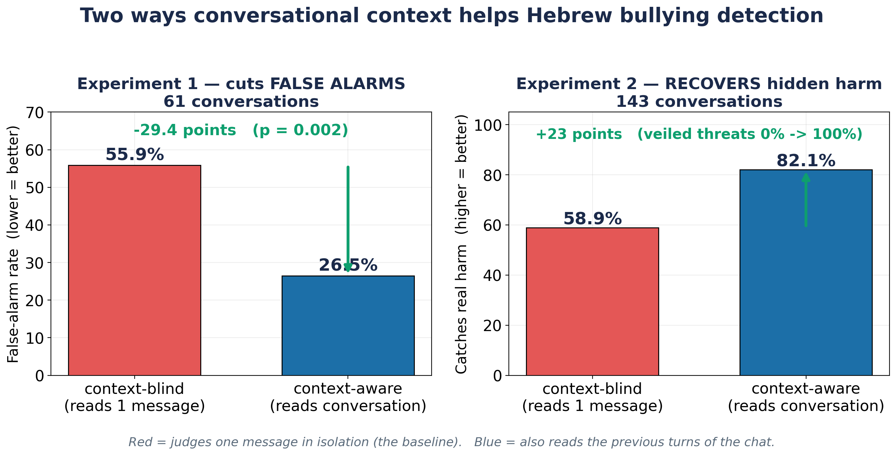
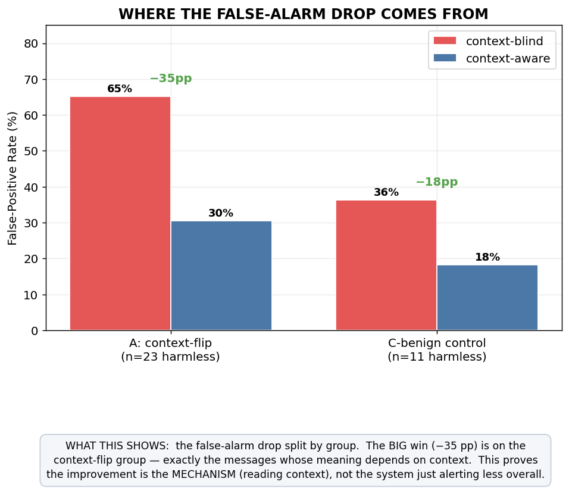
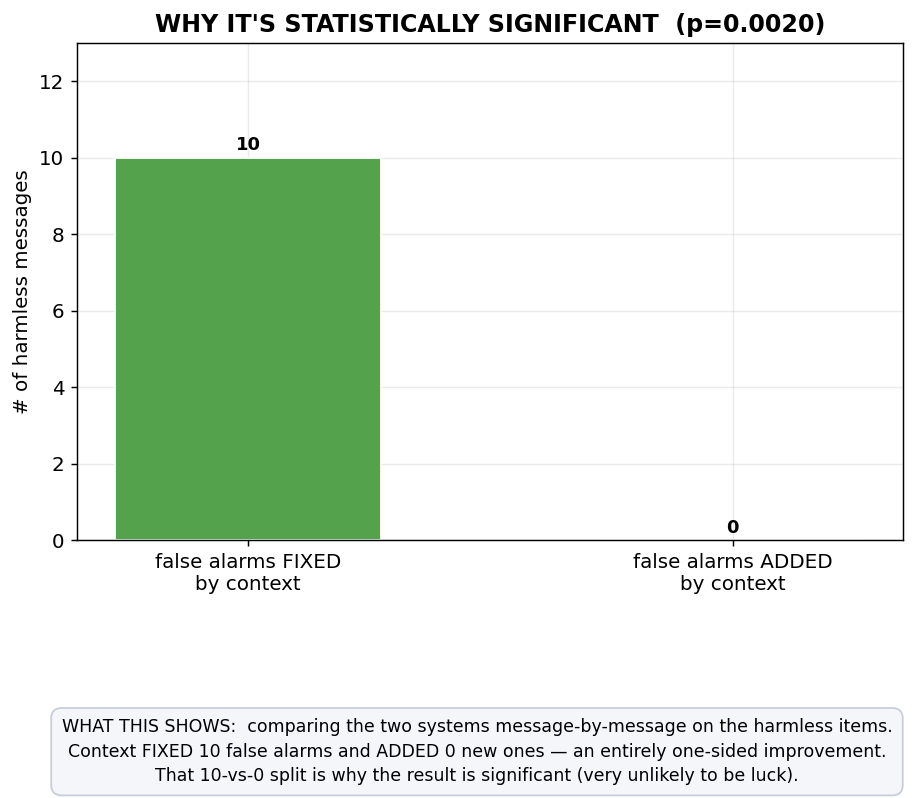

# Shomer.AI — The Project Explained Simply (for the presentation)

**What this is:** the research story in plain language, with the graphs you can drop straight onto
slides, and a glossary of every technical term used in the results. **Status:** 2026-06-12, numbers
verified against `context_fp_mvp_results.json` + `harm_context_results.md`.

Read order: **the question → the system → the results (with graphs) → the literature → our
contribution → glossary.**

---

## 1. The question, in one breath

When a computer reads a single chat message and asks *"is this bullying?"*, it makes mistakes in
**two opposite directions**:

- It **shouts when it shouldn't** — "אני אהרוג אותך!" inside a video game is a joke, not a threat.
  (a **false alarm**)
- It **stays silent when it shouldn't** — "אתה יודע מה מחכה לך מחר" looks harmless alone, but it
  continues a threat from the previous message. (a **missed harm**)

Both mistakes have the same root cause: the computer judged the message **in isolation**, with no
memory of the conversation.

> **Our research question:** *Does giving the system the previous few messages of the conversation
> (the "context") reduce false alarms — and catch hidden harm — compared to judging each message
> alone, without hurting how much real bullying it catches?*

---

## 2. The system — built so it can answer the question

Our system has two "brains", and a switch between them. That switch **is** the experiment.

```
 Phone  ──►  Server  ──►  [ DictaBERT classifier ]  ──►  triage  ──►  [ Context Agent ]  ──►  alert
 (chat)                    reads ONE message                            reads the LAST 5
                           = "context-BLIND"                            = "context-AWARE"
                           THE BASELINE                                 THE TREATMENT
                                              switch: CONTEXT_AGENT_ENABLED = false / true
```

- **DictaBERT** is a small, fast Hebrew model we **trained ourselves**. It reads one message and
  guesses its category. It has no memory → it is the **context-blind baseline**.
- **The Context Agent** is a smarter judge (an LLM) that reads the **last 5 messages** before
  deciding → it is the **context-aware** version.
- Because the whole system is built in clean, swappable parts, turning context on/off is a
  **one-line change**. That is exactly what makes our comparison fair and repeatable: same data,
  same code, one switch flipped.

**This is the key presentation point:** *our architecture is not just an app — it is the laboratory
bench for the experiment.* The baseline and the treatment are the same system with one setting changed.

---

## 3. The results we already have (with graphs)

### 3a. First, the baseline brain is genuinely good

Before testing context, we had to prove the underlying classifier works. It does.



**Plain reading:** our trained DictaBERT model scores far higher than a ready-made model on the
same Hebrew test (macro-F1 **0.836** vs 0.373) — **2.4× more accurate and 424× faster.** This proves
training our own model was the right call, with evidence rather than opinion.


**Plain reading:** how well the model does on each category (clean speech, abusive, hate, violence,
porn). Bars near the top = strong. This is the *baseline arm* of the experiment.


**Plain reading:** when the model says "I'm 80% sure", is it right about 80% of the time? The closer
the line hugs the diagonal, the more **honest** its confidence. Ours is well-behaved (ECE 0.034) —
it doesn't panic or over-claim.

---

### 3b. The main result: context helps in **two** ways

This single graph is the heart of the presentation:



**Plain reading — left side (Experiment 1, 61 conversations):** when we let the system read the
conversation, **false alarms dropped from 55.9% to 26.5%** — a 29-point fall, and the statistics say
this is a **real effect, not luck** (p = 0.002). In plain words: **it stopped crying wolf on jokes,
sarcasm and game-talk.**

**Plain reading — right side (Experiment 2, 143 conversations):** context also **caught more real
harm** — overall from 58.9% to 82.1%. The most striking part: **veiled threats** (ones that look
innocent on their own) went from **0% caught to 100% caught** once the system could see the prior
messages.

### Where exactly does the false-alarm drop come from?



**Plain reading:** the improvement is concentrated in **Category A** — messages that *look*
offensive alone but are innocent in context. That's the proof it's the **context** doing the work,
not some global "trust everything" shortcut.

### Is the drop statistically real?



**Plain reading:** of the messages where the two versions disagreed, context **fixed 10 false alarms
and introduced 0 new ones** (10 wins, 0 costs). That lopsided score is why the result is significant.

### The reframe that makes it useful


**Plain reading:** a parent doesn't want a buzz on **every** rude word — they want to know about a
**harmful situation** (repeated pile-ons, escalating threats, a child reporting being hurt). When we
judge the system by that goal, it correctly **stays silent on 100% of friendly banter** while still
catching real harm. Same behavior, but now it's measuring the *right* thing.

---

## 4. How this connects to the research literature

| What others proved | Where it falls short | What we add |
|---|---|---|
| **SinaLab / Hamad 2023** (Hebrew) — built the 5-category Hebrew offensive dataset | only **single messages**, no conversation | we use their categories, then add the **conversation layer they lack** |
| **Pavlopoulos 2020** (English) — "does context matter?" | found naive context use gives only **tiny** gains; *how* to use it well is **open** | we use a **selective** strategy (only ask the smart judge on doubtful cases) and show a real gain |
| **Sap 2019 / Davidson 2019** (English) — context-blind models false-flag up to ~50% of benign text | English only | we **measure the correction** in Hebrew |
| **SynBullying / ToxiGen** — synthetic conversation data works | English | we build **Hebrew** conversational test items |

**The one-sentence summary for the committee:** *every context study is in English; every Hebrew
study is context-blind single messages. We are the first to test whether conversational context
reduces false alarms in Hebrew bullying detection.*

---

## 5. Our contribution — what's genuinely new

1. **First context-aware Hebrew bullying evaluation.** Nobody has measured this in Hebrew before.
2. **Evidence that context cuts false alarms (−29pp) AND recovers hidden harm (+23pp)** — context
   helps on *both* error directions, depending on where the weakness is.
3. **The right alerting target is the harmful *situation*, not the offensive *word*** — a framing
   that makes the tool actually usable by parents (no alert-fatigue).
4. **A working, swappable system** that doubles as a reproducible experiment bench.

**Honest status (say this out loud):** these results are at **feasibility / MVP level** — the test
data is partly synthetic/authored, single-annotator, n = 61 and 143. The **direction and
significance are solid**; the exact magnitudes need a **real, human-annotated gold set** to confirm
(plan in `gold_set_collection_plan.md`). We present this as *"mechanism proven, magnitude to be
confirmed on real data."*

---

## 6. Glossary — every term used above, in plain words

| Term | Plain meaning |
|---|---|
| **Context-blind** | the system reads only **one** message, with no memory of the chat (our baseline). |
| **Context-aware** | the system also reads the **previous messages** before deciding (the treatment). |
| **Baseline** | the thing we compare against — here, the context-blind version. |
| **False alarm / False positive (FP)** | the system flags something that was actually innocent. |
| **False-alarm rate (FPR)** | out of all the *innocent* messages, what % the system wrongly flagged. **Lower = better.** |
| **Recall** | out of all the *truly offensive/harmful* messages, what % the system caught. **Higher = better.** |
| **Precision** | out of everything the system flagged, what % was actually offensive. |
| **F1 score** | a single number combining precision and recall (0–1). Higher = better. |
| **Macro-F1** | the F1 averaged equally over all categories, so rare classes count too. Our model = **0.836**. |
| **Calibration / ECE** | whether the model's confidence is honest (says 80% → right ~80% of the time). Lower ECE = more honest. Ours = **0.034**. |
| **pp (percentage points)** | the plain gap between two percentages. 55.9% → 26.5% is a **29.4 pp** drop. |
| **p-value** | the chance the result is just luck. **p = 0.002** means ~0.2% chance — so it's a real effect. |
| **McNemar test** | the correct statistics test when the **same items** are judged by both versions (a "paired" test). |
| **Statistically significant** | unlikely to be a fluke (here, p below 0.05). |
| **Gold set** | a high-quality, human-labeled test set — the "answer key" we grade against. |
| **Synthetic data** | examples generated by an AI (Gemini) instead of collected from real chats. |
| **Train-on-synthetic / evaluate-on-real** | it's OK to *learn* from AI-made data, but the *final grade* must use real data. |
| **Category A / B / C** | A = looks bad alone but innocent in context (tests false alarms); B = looks innocent alone but harmful in context (tests catching harm); C = controls that shouldn't change either way. |
| **Veiled threat** | a message that sounds harmless by itself but continues a threat from earlier messages. |
| **DictaBERT** | the Hebrew language model we fine-tuned as our fast content classifier. |
| **Context Agent** | the LLM-based judge that reads the conversation and decides if it's truly harmful. |
| **LLM** | Large Language Model (e.g. Gemini) — a general AI that understands and reasons over text. |

---

### Slide-ready graph list (all files exist)

| Slide use | File |
|---|---|
| **Headline result** | `plots/contribution_two_axes.png` |
| Trained vs off-the-shelf | `../accuracy_eval/ollama_vs_dictabert_f1.png` |
| Per-class strength | `../../training/outputs/dictabert-offensive/plots/03_per_class_metrics.png` |
| Confidence honesty | `../../training/outputs/dictabert-offensive/plots/06_calibration_reliability.png` |
| Where FP drop comes from | `plots/fig_fpr_by_category.png` |
| Significance (wins vs costs) | `plots/fig_mcnemar.png` |
| The reframe | `plots_harm/harm_reframe_oldvsnew.png` |
| Harm caught per group | `plots_harm/harm_headline.png` |
</content>
